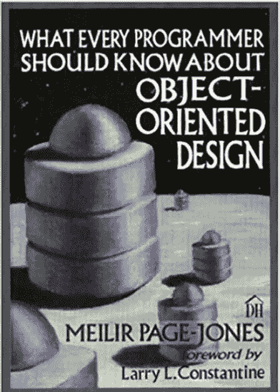
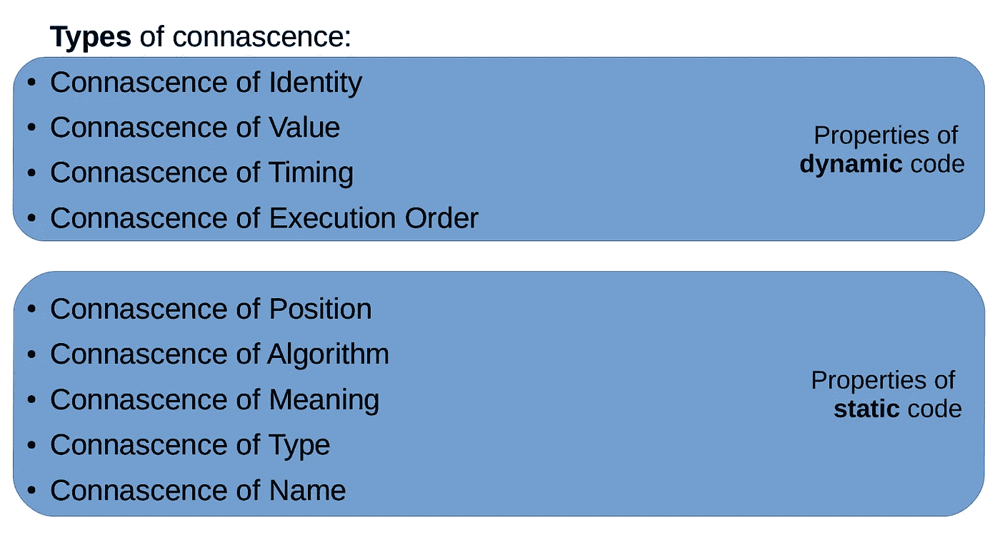
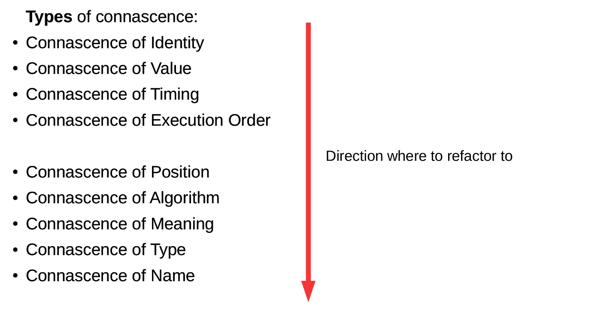
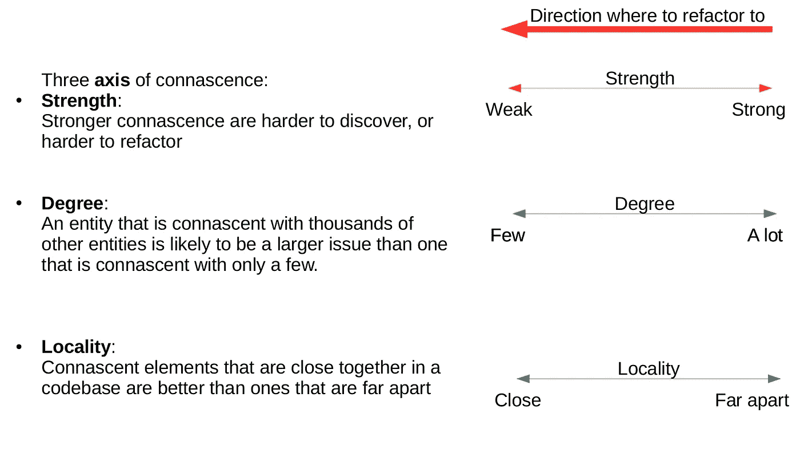
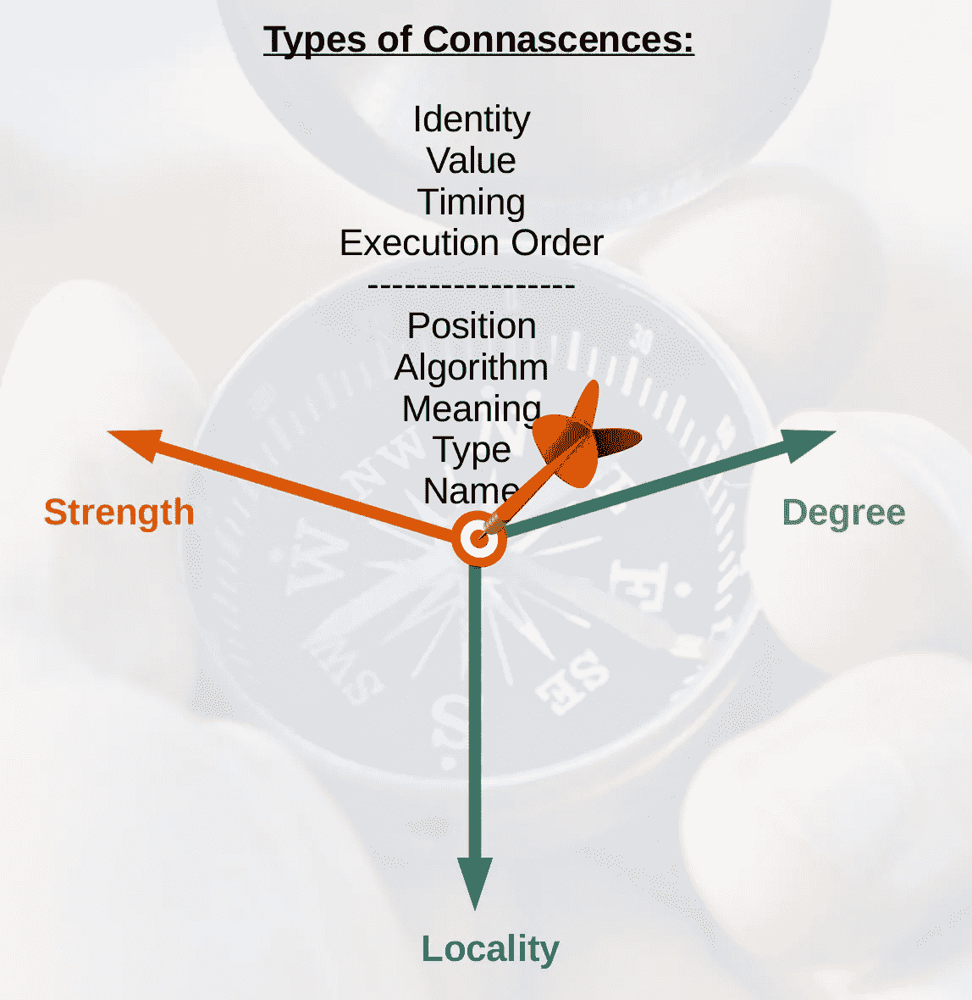

# 共生—第一部分:检测代码味道的系统方法

> 原文：<https://levelup.gitconnected.com/connascence-a-methodical-way-to-detect-code-smell-part-i-5450c104fea5>

颂歌的味道有时很难察觉——尤其是如果你刚刚开始你的开发生涯。但是，即使对于在这个行业工作时间较长的人来说，这也是一个挑战。有些人凭直觉，有些人凭经验。在这个故事中，我将通过解释相关性的概念，向您展示如何以一种更有条理的方式来检测代码气味。

我把这个故事分成三个部分 s:
I)在这个故事中，我会给你一个关于归属
的**定义**II)然后通过解释不同的[归属**类型**](/connascence-part-ii-types-of-connascence-35ce49f7c1b0?source=post_stats_page-------------------------------------)
III)在第三部分我会给你看一些归属 [**的例子和用法**](https://pandaquests.medium.com/connascence-part-iii-connascence-applied-c1cc85ba6a5a)

# 一开始

来源(已修改):[http://fly language . com/WP-content/uploads/2014/12/lost-direction . jpg](http://flylanguage.com/wp-content/uploads/2014/12/lost-direction.jpg)

但首先要做的是。让我自我介绍一下，并告诉你一点我的故事。在网上，我被称为 p 和 q。我目前是一家大公司的全栈开发人员。我大约 5 年前开始了我的职业生涯。虽然我是一名开发人员，但我从未学习过软件工程或计算机科学。我自学了所有的东西。不用说，编写好的、干净的、可维护的代码对我来说是一个挑战。因为在一开始，我被各种不同的概念和原则所淹没，例如，设计模式、DRY、BEM、KISS、模块化、单一事实来源、SOLID 等等。一句话:*我迷失在这个概念的海洋中。*

两年后，我也会在初级开发人员中观察到类似的行为:在代码评审期间，他们会提出一些对代码质量没有太大帮助的建议。或者有时他们甚至会提出对整个系统有害的建议。

# 解决方案…？

来源(已修改):[http://assets . blog . bible/uploads/blog/556/4-当你感到失去生命时赞美诗-神-方向-指引-流浪-计划未来-目的-美国-圣经-社会-blog.jpg](http://assets.blog.bible/uploads/blog/556/4-psalms-for-when-you-feel-lost-in-life-gods-direction-guidance-wandering-plan-for-the-future-purpose-american-bible-society-blog.jpg)

所缺少的——至少对我来说——是某种指南针或向导，可以帮助我在所有这些不同的概念中找到方向。或者一个心智框架或者一个*统一的软件开发理论*，可以帮助我理解所有这些不同的——有时甚至是冲突的——概念。

我认为*可能是因果关系*。*在它的核心，一致性是两件事:*它是不同类型耦合的*分类*和它的软件质量*度量。*

分类法意味着它给某些概念一个名字，并把它们放入一个层次结构中。正如我将向你们展示的，我之前提到的所有概念，都可以用一种或另一种方式，用关联来表达。

度量意味着它测量你的代码并告诉你你的代码是好是坏。

# 定义

来源:[https://images-na . SSL-images-Amazon . com/images/I/512 c 104 y22l . jpg](https://images-na.ssl-images-amazon.com/images/I/512C104Y22L.jpg)

但是，合生从何而来呢？Connascence 是由 Meilir Page-Jones 在他 1995 年出版的《每个程序员都应该知道的面向对象设计》一书中首次在软件开发的上下文中提到的。

他说“如果*一个组件的改变需要另一个组件被修改*以便*保持系统的整体正确性*，那么两个组件是一致的”。因此，*耦合基本上就是你的代码有多耦合。*

Page-Jones 进一步将共生分为不同的类型和属性:

这些类型按照从上到下的特定层次结构进行排序。底层类型是更理想的联想类型，即名称的联想因此是最理想的类型。动态代码的属性意味着您只能在运行时观察效果。静态代码的属性意味着您可以通过查看代码来观察连接的效果。

您要做的是将您的代码从高阶的共生重构为低阶的共生:

此外，相关性具有三个轴:强度、程度和位置:

你要做的是把你的代码往左边方向重构，也就是弱强度，少度数，接近局部性。

下面的图片是我之前所说的的一个*总结。如果你理解了下面这张图，你就基本理解了整篇文章:*

从上到下的从属或有序的类型。此外，你有三个轴:强度，程度和位置。您要做的是将您的系统移动到最需要的状态，即最低类型的相关性、最弱的强度、最少的程度和最近的位置。如果你能让你的系统达到那个状态，那么它就是耦合度最小的系统。

我刚刚向你展示了(第一部分)像 connasce 这样的概念的动机，我给了你一个定义和如何使用 connasce 的粗略概述。

在接下来的部分，我会更详细地解释不同的[类型的归属(在第二部分)](/connascence-part-ii-types-of-connascence-35ce49f7c1b0?source=post_stats_page-------------------------------------)。在最后一部分[(第三部分)我会给你展示例子以及什么时候使用](https://pandaquests.medium.com/connascence-part-iii-connascence-applied-c1cc85ba6a5a)伴随。