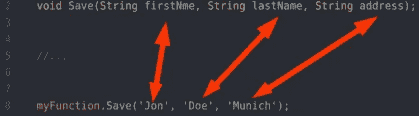

# 关联—第三部分:应用的关联

> 原文：<https://levelup.gitconnected.com/connascence-part-iii-connascence-applied-c1cc85ba6a5a>

在前两部分，我先[定义了同生的概念(第一部分)](/connascence-a-methodical-way-to-detect-code-smell-part-i-5450c104fea5)。然后我详细阐述了不同类型的归属(第二部分)。在第二部分，我举了一些例子。在这一部分中，我将重构我在第二部分中提到的所有示例，并将其从较高的从属关系移到较低的从属关系，从而改进代码。

在我们开始之前，让我们看一下不同伴随类型的表格:

上图显示了从上到下排序的所有从属关系。最差的在上面，好的在下面。箭头显示了我们应该重构的方向。在接下来的内容中，我将向您展示我在第二部分中已经讨论过的代码片段，并首先确定它是哪种从属关系。然后我将重构到一个较低的从属关系，并解释为什么它更好。我们开始吧。

这段代码片段属于含义的类型*，因为这里有问题的部分是它背后的含义:`123.45`代表什么？我们知道是钱。但是钱不等于钱。是美元吗？是欧元吗？是袁吗？我们不知道。*

解决这个问题的方法很简单。通过创建类型`Money`,我们传入值和货币。这样，我们就把一个意义的关联变成了一个类型为的*关联:*

现在这个意思应该没有任何问题了。看着它，与之前的代码相比，您会注意到它更具声明性。如果我们查看我们的从属类型列表，您会看到我们将代码类型从有意义的从属移动到了类型的*从属——我们降低了从属类型，从而使它在客观上更好。这只是一个简单的例子，说明了 connascence 如何指导我们写出更好的代码。*

你可能还记得上面的代码:一个有多个参数的函数。如果被调用，参数必须按照与参数列表相同的顺序传递。我们将其确定为位置的*伴随。*

位置的伴随关系的问题是，参数的顺序对于代码正确运行很重要。一旦切换了传入的参数，该函数将返回不正确的结果。这些类型的*耦合*可以通过创建一个新的对象类型并将该对象类型作为参数传递给函数来解决:

我们现在的好处是，参数中传递的顺序，即`firstName`、`lastName`、`address`，现在已经不重要了。现在，您可以更改顺序，函数仍然会返回正确的结果。通过创建一个新的对象类型，我们对代码进行了解耦，从而使代码变得更好。

这是从高伴随类型，即位置伴随开始，并移动到低伴随类型，即类型伴随的另一个例子。我们降低了从属类型，从而改进了代码。

让我们看看上一篇文章中的 HTML/CSS 代码。我们将这种从属类型确定为位置的*从属。在这里停下来，问问自己如何改进这段代码，最后会得到什么样的结果？*

这里的问题很明显，如果你改变 HTML 代码的结构，比如在`section`中添加另一个元素作为第一个孩子，那么`section`中第一个孩子的文本颜色也会改变。

有不同的方法来减轻这一点。一种是用边界元法。你基本上对元素应用一个类，这里是`header`，你想要样式，这里对文本应用颜色`red`:

现在 HTML 结构更加健壮了，因为改变 HTML 结构不会影响`header`的文本颜色样式。我们将位置关联代码更改为*名称关联*

让我们来看下一个例子。这是一个测试，包括两节课。两个类都使用值`50`。测试依赖于类`Checkout`，分别是它的实例，返回数字`50`。正如你可能已经猜到的，这是*价值的一致性*。

如何改进这段代码的第一步是减少局部性:我们改变函数`scan`以便它接受值作为第二个参数:

你会注意到我们仍然有价值的一致性。但是代码仍然比以前更好，因为*位置*已经从本地远变为本地近，也就是说，值现在不是分布到两个不同的类，而是仅位于一个类中。

但是我们还没有到那一步。我们仍然有价值的一致性，我们可以创建一个新的变量`priceOfA`并给它分配一个随机数。现在它独立于值，因此我们将代码更改为名称的从属关系，这是所有从属关系中最好的一个:

## 结论

好吧，酷。现在我们知道什么是共生了。怎么回事？

对我来说，connascence 是一个很酷的新工具:

*   Connascence 给了我一种评估和区分代码评审优先级的方法。现在，我不做最容易但风险最大的修复，即与最高类型的相关性。
*   它给了我一个与同事交流的新词汇。代码评审不是基于个人喜好，而是基于客观的度量标准。
*   Connascence 为初级开发人员提供了一个框架、指南针或指南来编写良好、干净和可维护的代码。
*   这也有助于知道什么时候重构就够了。因为一旦我碰到了名的联结，我知道我碰到了最低的，因而也是最好的联结。这意味着进一步重构它没有意义，因为它已经处于最佳状态。
*   一致性不限于某种技术、编程语言或前端或后端，而是可以应用于整个堆栈。

你以前听说过 connascence 吗？你已经试过了吗？你的经历是什么？在这里分享一下你的经验。我渴望知道这件事。