# 将 ArgoCD 连接到您的私有 GitHub 存储库

> 原文：<https://levelup.gitconnected.com/connect-argocd-to-your-private-github-repository-493b1483c01e>

一步一步的指南，让您在 Kubernetes 上的 ArgoCD 设置能够连接到您的私有 GitHub 存储库。


让我们把东西部署好

## 先决条件

如果您想一步一步地学习本教程，您必须有一个启动并运行的 Kubernetes 集群，并安装一个工作 ArgoCD。

如果您还没有，请随意阅读我的另一篇文章，在这篇文章中，我指导您一步一步地完成正确的设置过程，并帮助您连接到您的公共 GitHub 资源库。

[](/getting-started-with-argocd-on-your-kubernetes-cluster-552ca5d8cf41) [## Kubernetes 集群上的 ArgoCD 入门

### 在 Kubernetes 集群上设置 ArgoCD 并与 GitHub 同步资源的分步指南…

levelup.gitconnected.com](/getting-started-with-argocd-on-your-kubernetes-cluster-552ca5d8cf41) 

此外，我在前一篇教程的基础上构建了本教程，所以我不会再重复原来的设置，所以请确保您查看了前一篇文章。

除此之外，我还在下面的 [GitHub 资源库](https://github.com/Abszissex/medium-argocd-private-repo)中准备了本教程所需的所有资源:

[](https://github.com/Abszissex/medium-argocd-private-repo) [## GitHub-abszisex/medium-argocd-private-repo

### 此时您不能执行该操作。您已使用另一个标签页或窗口登录。您已在另一个选项卡中注销，或者…

github.com](https://github.com/Abszissex/medium-argocd-private-repo) 

该存储库包含:

*   一个可以快速开始使用现成的 Kubernetes 集群的漫游文件
*   舵图 ArgoCD 应部署到集群
*   清单来设置我们的 ArgoCD 应用程序、服务和机密配置

记住，由于显而易见的原因，这个存储库是公共的，所以如果您想学习本教程，您可以自由地将它转到一个私有存储库，并在那里调整存储库的 URL。

## 您将在本教程中学到什么

在上一个教程中，我们已经学习了如何连接到一个公共的 GitHub 库。但是，当然，您不希望将您的所有代码公开，主要是如果它包含您的业务的生产代码。

ArgoCD 使用基于拉的同步方法来保持集群和存储库同步。不幸的是，这导致 ArgoCD 需要向您的 GitHub 存储库认证以获取最新的更改，这使它变得稍微复杂了一点。但是不要担心，这并没有听起来那么复杂。

因此，在本教程中，我们将学习如何启用 ArgoCD 设置，使用 SSH 密钥从私有存储库中提取变更。

## 生成新的 SSH 密钥对

ArgoCD 与 GitHub 通信检查更改有两种可能。一种是通过 HTTPS 使用用户名和密码。另一种推荐的方法是使用私有-公共密钥对来使用 SSH。

在本教程中，我们将检查 SSH 之一。

所以，首先，我们需要一个 SSH 密钥来使用。我们可以使用以下命令轻松地创建一个新的 SSH 密钥对。

```
ssh-keygen -t ed25519 -C "some comment"
```

您不必添加密码短语。按几次回车键，使用默认值。终端中的输出应该如下所示:

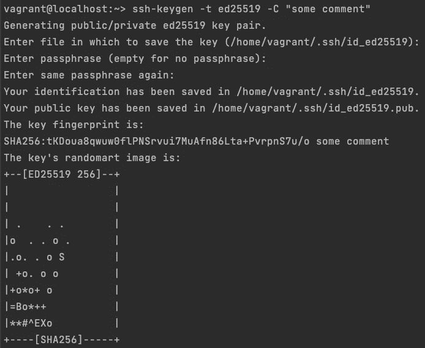

ssh-keygen

要验证一切正常，您可以使用以下命令:

```
# Show content of public key
cat /home/vagrant/.ssh/id_ed25519.pub# Show content of private key
cat /home/vagrant/.ssh/id_ed25519
```

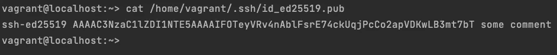

显示公钥的内容

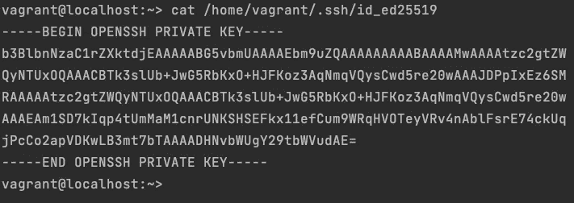

显示私钥的内容

请记住，如果您不使用我在上一篇教程中提供的漫游设置，您的机器上的路径可能会不同。但是,`ssh-keygen`命令会向您显示它保存密钥的位置。

## 在 GitHub 存储库上添加新的部署密钥

既然我们已经生成了想要使用的新的 SSH 密钥对，我们必须将公钥告诉 GitHub。然后，GitHub 可以验证稍后将获取存储库内容的连接是我们经过身份验证的 ArgoCD 服务。

在 GitHub 中，这很简单。在下面的例子中，我使用了我的“private-demo”GitHub 存储库，顾名思义，这是我为这个演示创建的私有存储库。在存储库设置中，您可以导航到“部署密钥”,然后“添加部署密钥”来添加一个新密钥，GitHub 可以使用它来验证 ArgoCD 服务与存储库的连接。

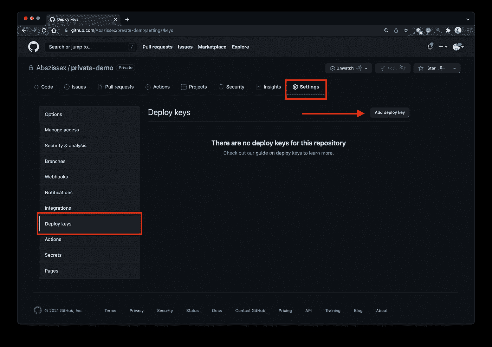

GitHub |部署密钥

现在，我们可以添加在上一步中生成的公钥。对于“标题”，你可以选择任何你想要的。

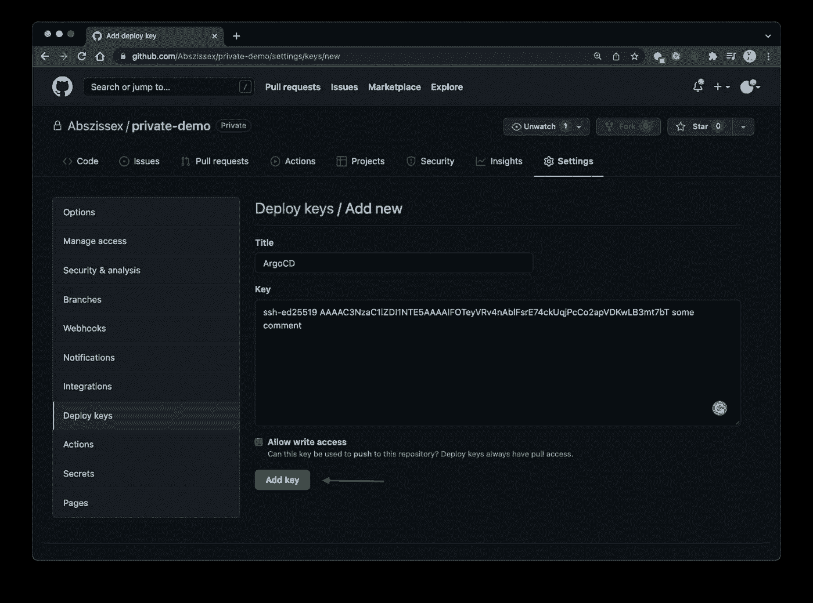

GitHub |添加部署密钥

如果一切顺利，这里没有太多可能出错的地方，您应该会看到一个新条目，用于您的私有 GitHub 存储库的部署密钥。

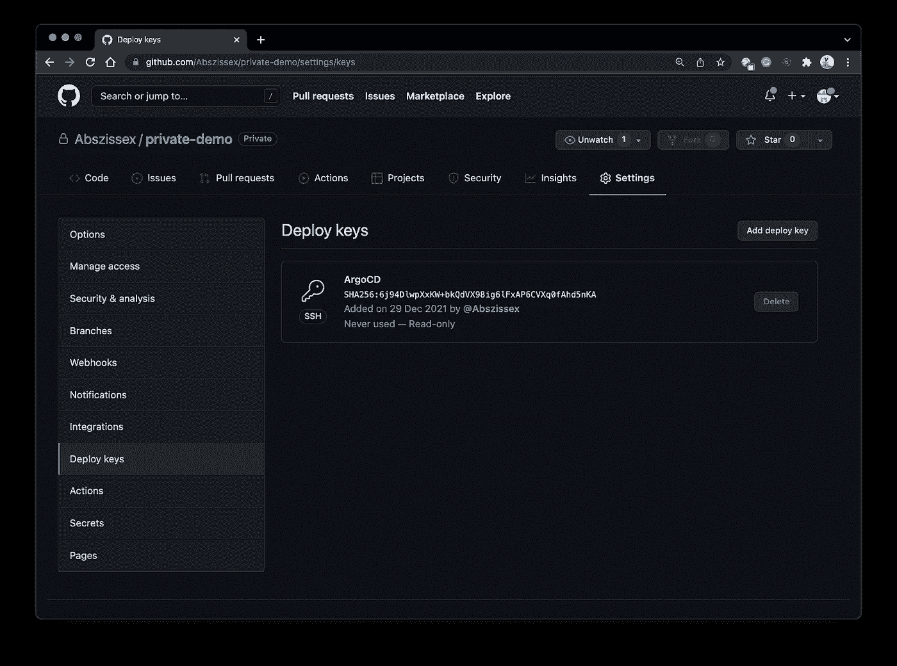

GitHub |部署密钥概述

## 为 ArgoCD 设置 SSH 验证

我们必须使 ArgoCD 能够使用我们生成的私钥向 GitHub 认证自己，以便从存储库中提取最近的更改。

你应该有我在[之前的 ArgoCD 文章](/getting-started-with-argocd-on-your-kubernetes-cluster-552ca5d8cf41)中提供的相同的设置来遵循接下来的步骤，因为我们现在需要在它的基础上构建。目前，唯一的区别应该是将 ArgoCD 应用程序的`repoURL`更改为私有存储库。

如果您的 ArgoCD 应用程序指向您的私有存储库，您应该会看到 ArgoCD 应用程序上有一个错误:

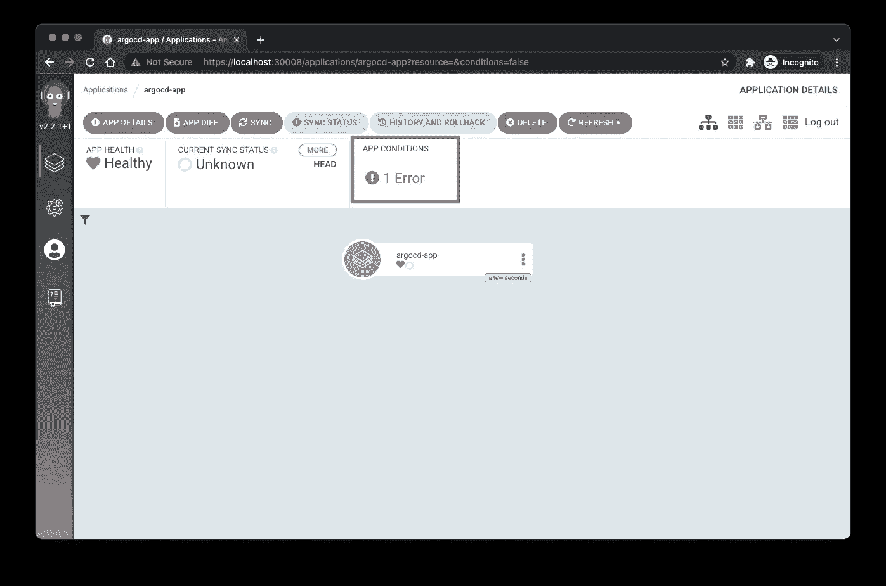

ArgoCD UI |应用程序详细信息中的错误

如果你点击错误，你会看到更多的细节。我们预计会出现一个“需要认证”的错误，这是有意义的，因为 ArgoCD 还不知道如何对这个存储库进行认证。

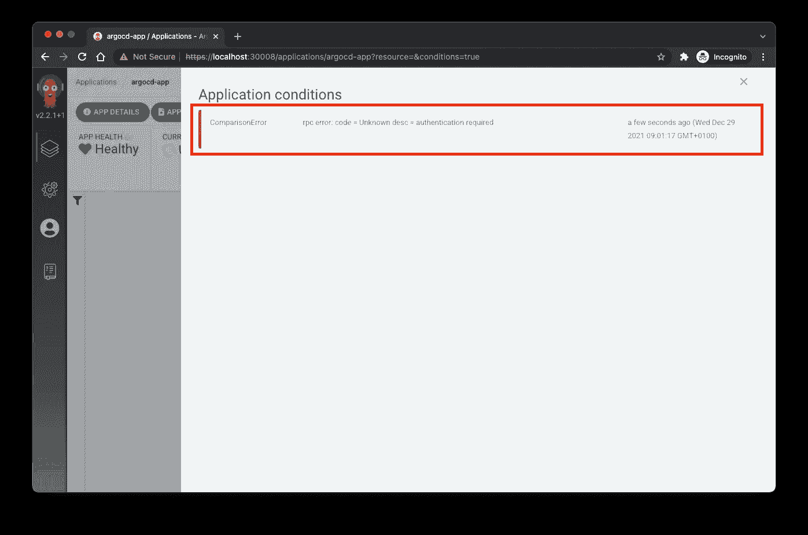

ArgoCD UI |详细错误

现在有两种可能来创建有效的连接。要么使用 ArgoCD UI 创建一个新的存储库连接，要么通过 Kubernetes 清单文件使用声明性方法。我检查了两者，两者都可以工作，但是出于可再现性的原因和尽可能多的代码，我更喜欢并且将展示声明性方法。

对于声明性方法，我们使用 Kubernetes 配置图和秘密资源。ArgoCD 已经在设置中创建了一个带有空`data`条目的配置映射。我们将在后面的步骤中覆盖此配置映射，以指向我们的机密数据进行身份验证。

如果您以前已经使用过 Kubernetes Secret 资源，您会知道它需要 base64 编码的数据条目值。因此，让我们对我们的私钥进行 base64 编码，以将其提供给我们的声明。

使用 CLI 通过 base64 编码也非常简单:

```
cat /home/vagrant/.ssh/id_ed25519 | base64
```

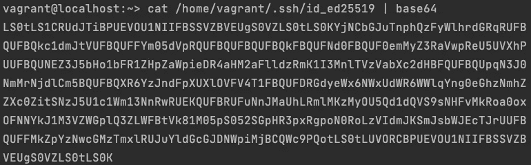

base64 编码私钥

## **秘密**

我们必须把秘密藏在某个地方。为此，我们使用了 Kubernetes 的秘密资源。

**危险:**我们不加密我们在此提供的数据，因此这不是 100%的最佳做法。但是加密，例如通过 sop 或类似的方法，对于本文来说就太多了。不过不用担心，我稍后会就这个话题奉献一整篇文章。敬请关注！

[](/encrypting-your-yaml-files-using-mozilla-sops-and-gcp-kms-b1fcd22cf40f) [## 加密您的 YAML 文件使用 Mozilla SOPS 和 GCP KMS

### 使用 Mozilla SOPS 和谷歌云 KMS 加密 YAML 文件的分步指南。

levelup.gitconnected.com](/encrypting-your-yaml-files-using-mozilla-sops-and-gcp-kms-b1fcd22cf40f) [](/securing-your-secrets-in-git-the-safe-way-using-gcp-kms-ada49e8386af) [## 保护你的秘密在 git，安全的方式使用 GCP KMS

### 将秘密和凭证提交到 git 中，而不会产生安全问题。

levelup.gitconnected.com](/securing-your-secrets-in-git-the-safe-way-using-gcp-kms-ada49e8386af) 

在下面的片段中，您可以看到我们新的秘密资源。出于可读性的原因，我只是缩短了`privateKey`的值。在这里，您必须插入 base64 编码的私钥。请注意，它应该在一行中，没有您的终端可能显示的换行符。你可以自由选择`name`，但是`namespace`应该和我们其他 ArgoCD 资源一样是`argocd`。

## **配置图**

在定义了我们的秘密之后，我们需要告诉 ArgoCD 它应该为哪个存储库使用这个秘密来建立连接。

您可以在下面的代码片段中看到我们将应用于集群的配置图。你不应该在这里搞乱`metadata`，但是唯一重要的部分是`data.repositories`属性。在这个属性中，我们可以定义多个存储库。在我的例子中，我通过`url: git@github.com:Abszissex/private-demo`定义我的私有存储库，并通过定义`sshPrivateKeySecret`对象告诉 ArgoCD 我想通过 SSH 进行认证。

在下图中，您可以看到 ConfigMap 秘密映射是如何发生的。ArgoCD 将 ConfigMap 中的`name`映射到现有机密的`name`。而`key`属性定义了 ArgoCD 应该从 Secret 的`data`对象中读取的键的名称。

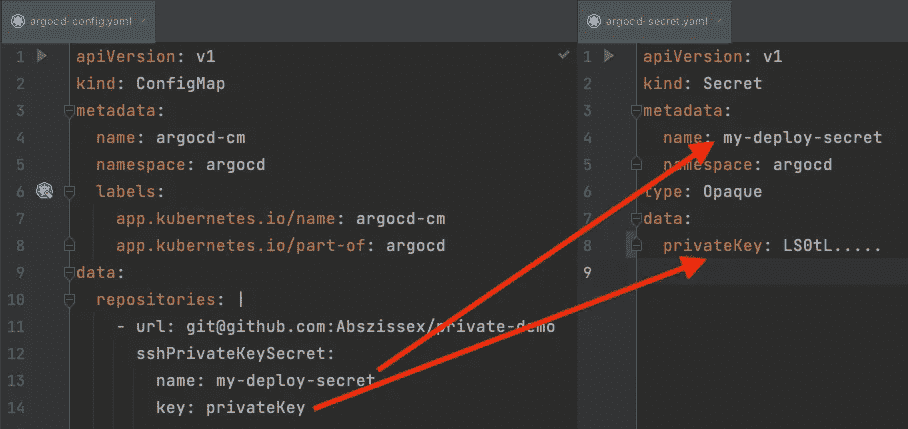

配置映射秘密映射

## **ArgoCD 应用**

最后但同样重要的是，在我们的声明性方法中，我们还必须将您现有的 ArgoCD 应用程序的`repoURL`从 HTTPS 更改为 SSH，如果还没有这样做的话，因为我们现在将尝试使用之前定义的 ConfigMap 和 Secret 通过 SSH 进行身份验证。

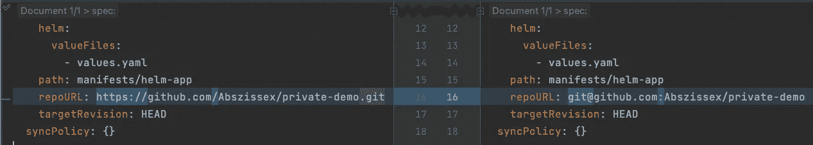

ArgoCD 应用程序|报告 Git 中的更改

在创建/更新配置映射、秘密和应用程序之后，是时候通过`kubectl apply -f ...`应用清单，并检查 ArgoCD UI 中是否一切如预期工作。

## **验证 GitHub 连接**

首先，我们应该在 ArgoCD UI 的“Repositories”部分检查我们有一个包含我们的存储库的新条目，并且“Connection status”标记为“Successful”:

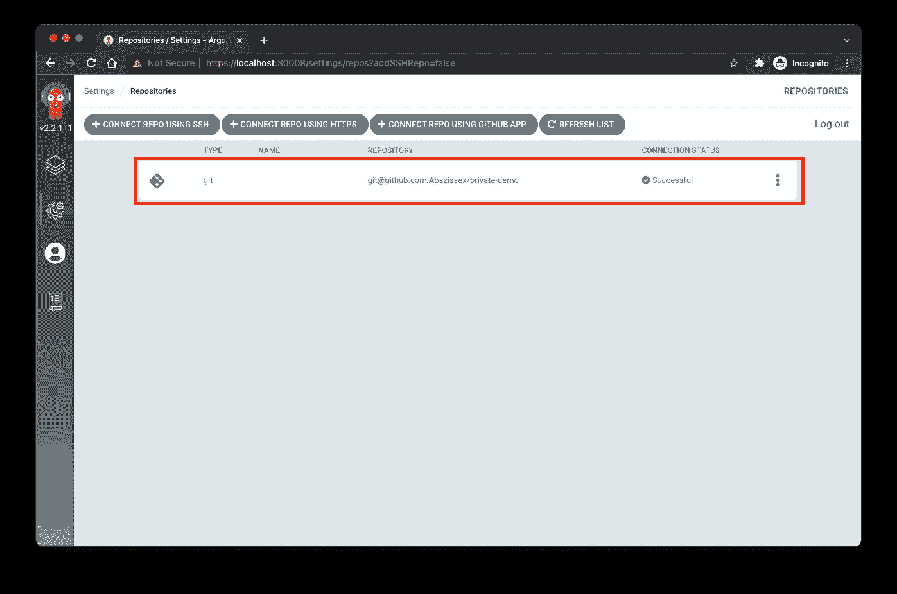

ArgoCD UI |存储库

接下来，我们可以检查我们的应用程序，并注意到我们看到所有的资源都丢失了，而不是抛出错误，并且我们的应用程序不同步。我们已经可以点击“同步”按钮，并确保 ArgoCD 应用最新的更改。

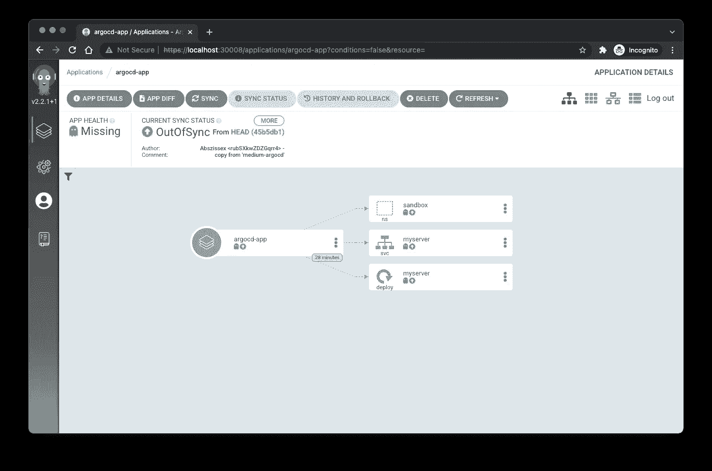

ArgoCD UI |应用程序

最后，作为最后一步，我们可以查看 GitHub 存储库中的“部署密钥”部分。在这里，我们将看到我们创建的密钥，ArgoCD 刚刚使用它。

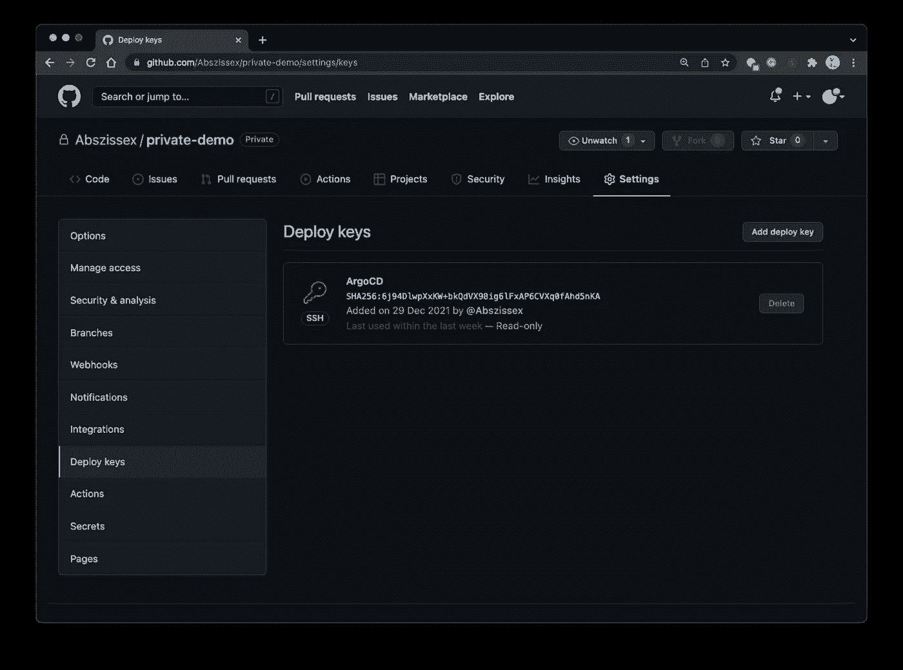

GitHub |部署密钥

# 摘要

本教程向我们介绍了连接 ArgoCD 和我们的私有 GitHub 库的几个步骤。如果你是新手，可能会有点不知所措，但是你应该会很快上手，通过这篇教程，你应该会很快上手并且跑得很快😊。

## 你想联系吗？

如果你想联系我，请通过 [LinkedIn](https://www.linkedin.com/in/pascal-zwikirsch-3a95a1177/) 联系我。

另外，请随意查看我的书籍推荐📚。

[](https://mr-pascal.medium.com/my-book-recommendations-4b9f73bf961b) [## 我的书籍推荐

### 在接下来的章节中，你可以找到我对所有日常生活话题的书籍推荐，它们对我帮助很大。

mr-pascal.medium.com](https://mr-pascal.medium.com/my-book-recommendations-4b9f73bf961b) [](https://mr-pascal.medium.com/membership) [## 通过我的推荐链接加入 Medium—Pascal Zwikirsch

### 作为一个媒体会员，你的会员费的一部分会给你阅读的作家，你可以完全接触到每一个故事…

mr-pascal.medium.com](https://mr-pascal.medium.com/membership)