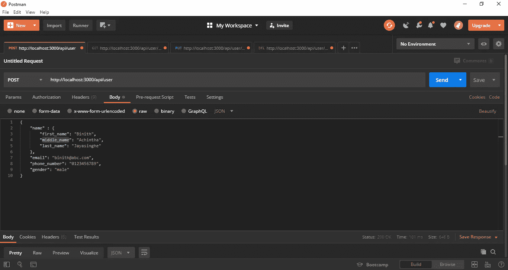
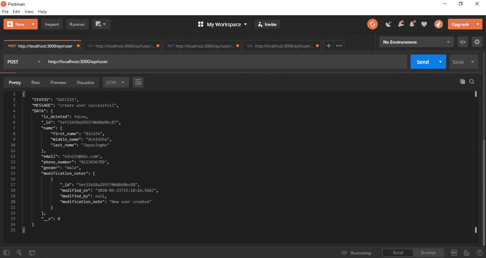
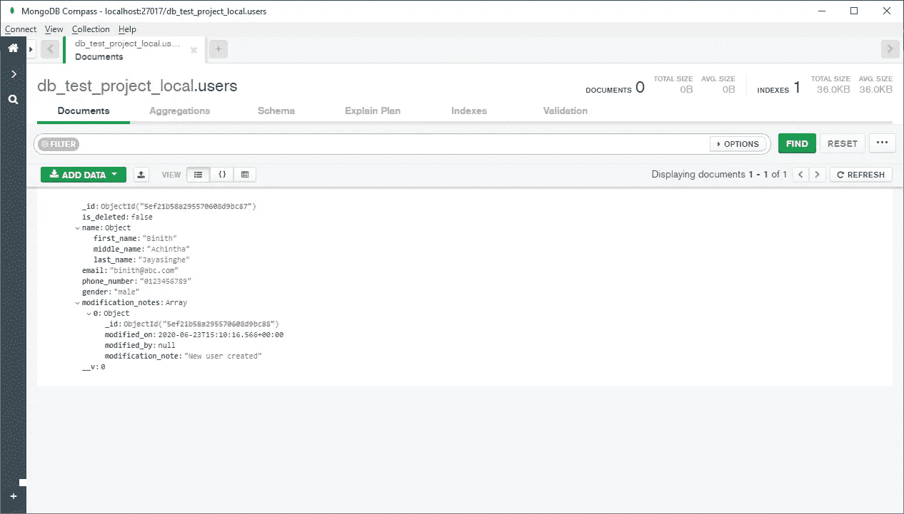
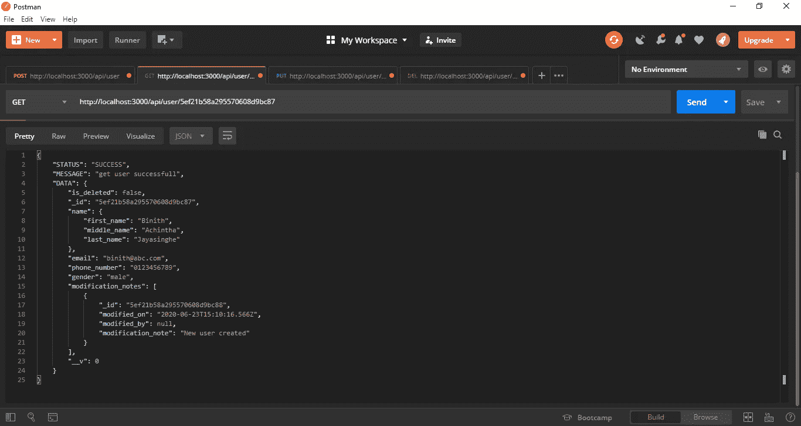
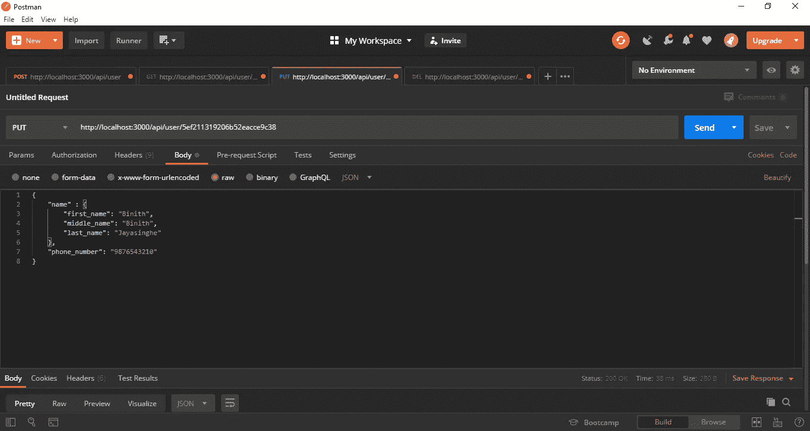
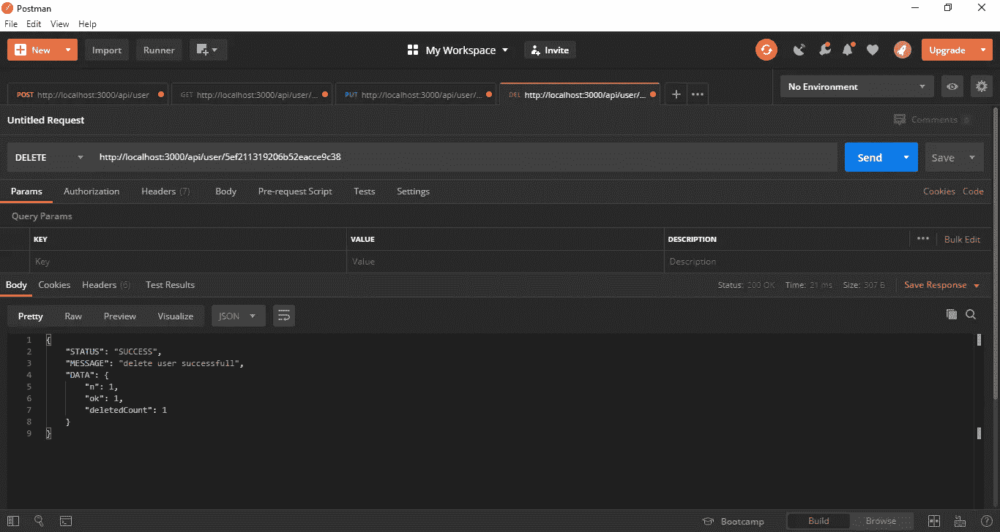

# 使用类型脚本将 Express REST API 与 MongoDB 和 CRUD 操作连接起来

> 原文：<https://levelup.gitconnected.com/connect-express-rest-api-with-mongodb-and-crud-operations-using-typescript-58d9afcc06d>

第 1 部分:[设置 REST API](https://medium.com/@jpbinith/setup-restful-api-with-node-js-express-mongodb-using-typescript-261959ef0998)

第二部分:[REST API 中的项目结构和建设路线](https://medium.com/@jpbinith/project-structure-and-building-routes-of-restful-api-with-node-js-f3a8b53d94e7)

第 3 部分:[连接到 MongoDB 和 CRUD 操作](https://medium.com/@jpbinith/connect-express-rest-api-with-mongodb-and-crud-operations-using-typescript-58d9afcc06d)

REST API 需要一个数据库来保存我们的数据，就像任何应用程序一样。数据库可以是文本文件、SQL 数据库(如 MySQL 或 Post SQL)或 NoSQL 数据库(如 MongoDB 或 Redis)。在本文中，您将学习如何将 REST API 与 MongoDB 连接起来。请参考我的[上一篇文章](https://itnext.io/building-restful-web-apis-with-node-js-express-mongodb-and-typescript-part-4-954c8c059cd4)给你的机器安装 MongoDB。您可以在下面的文章中找到关于如何构建 REST API 的完整指南。

1.  [用 Node.js Express 设置 REST API](https://medium.com/@jpbinith/setup-restful-api-with-node-js-express-mongodb-using-typescript-261959ef0998)
2.  [带有 Node.js Express 的 REST API 的项目结构和构建路线](https://medium.com/@jpbinith/project-structure-and-building-routes-of-restful-api-with-node-js-f3a8b53d94e7)

构建 API 的最终目的是托管在服务器上，并将其用于移动或 web 应用程序。所以我们在一个环境中构建，在另一个环境中托管。因此，如果您在单独的文件中管理这些环境，这是一个很好的做法。然后，您可以轻松地为每个环境管理不同的端口号和数据库名称。在 **lib** 文件夹中创建一个名为 **environment.ts** 的文件。

在[上一篇文章](https://medium.com/@jpbinith/setup-restful-api-with-node-js-express-mongodb-using-typescript-261959ef0998)中，我们在 **server.ts** 文件中初始化了一个端口号。现在我们可以用 environment 类中的 getPort()方法替换它。

那好吧。让我们开始和**猫鼬**一起工作。希望您已经在机器上安装了 MongoDB。如果没有，请跟随[这篇文章](https://medium.com/@jpbinith/setup-restful-api-with-node-js-express-mongodb-using-typescript-261959ef0998)继续关注我们。如果是，现在您已经准备好将 REST API 连接到您的本地 MongoDB 了。但是如果您愿意，也可以连接任何其他数据库服务。

首先你需要导入**mongose 包**并在 **app.ts** 文件中为你的 MongoDB 声明 **mongoUrl** 。不要忘记导入 environment.ts 文件并通过它获取 DB 名称。现在您可以创建一个名为 **mongoSetup()** 的函数，并在构造函数中调用它。因此，每当服务器重启时，它都会通过构造函数调用，并调用 **mongo.connect()** 命令来连接到 MongoDB 实例和该实例上的指定数据库。而现在的 **app.ts** 文件会是这样的。

在此之后，您的应用程序就可以进行 MongoDB CRUD (create。读取、更新、删除)操作。让我们通过创建一个名为“users”的集合来看看控制器和模型在这个过程中的作用。

Mongoose 中的一切都是从一个模式开始的。每个模式映射到一个 MongoDB 集合(表),并定义该集合中文档的形状。因此，为了访问数据库中的每个集合(表),我们必须创建一个模式。

*   Schema 是一个 JSON 对象，它允许您定义集合中文档和嵌入文档的形状和内容
*   服务文件包含所有数据库操作服务
*   模型文件具有用户界面(界面能够描述 JavaScript 对象可以采用的各种形状)

首先在 **lib** 文件夹中创建一个名为 **modules** 的文件夹。可能有一些我们在整个程序中都需要的公共接口或服务。我们可以创建一个名为**的公共文件夹**，为常用的接口和服务创建文件。在其中创建两个名为 **model.ts** 和 **service.ts** 的文件。

然后在该文件夹中创建另一个名为 **users 的文件夹。总是以你收藏的名字创建这个文件夹。在其中，我们可以创建实体模式、服务和模型。**

问号('？'))在接口中使用(**IUser**)members(**_ id**， **is_deleted** )是指在给定的接口类型上创建 JSON 对象时，该成员不需要初始化。

现在我们已经完成了模块的实现，现在我们可以继续讨论控制器了。

> 为什么我们需要控制器？

控制器处理系统的逻辑部分。让我们看看如何编写控制器函数来创建、读取、更新和删除。

现在在 **lib** 文件夹中创建一个名为**控制器**的文件夹。在其中创建一个名为 **userController.ts** 的文件。

现在，在 **lib** 文件夹中创建一个名为 **routes** 的文件夹。在其中，创建一个名为 **user_routes.ts** 的文件。

现在您可以运行 API 并检查结果。

# 创造用户

请求

反应

mongoDB

# 获取用户

# 更新用户

在这里我们可以更新任何字段，我希望你看代码就能明白其中的逻辑。

# 删除用户

删除数据时，通常我们不会从数据库中完全删除数据。当从数据库中检索数据时，我们更新一个标志来指示特定数据已被删除并远离它。但在本教程中，我完全删除了数据，因为我想告诉你如何做。还有更多 mongoDB 查询，你可以在这里找到纪录片。

这是这篇文章的结尾，我希望你明白了一切。在下一篇文章中，我将向您展示如何创建带有用户验证和管理用户角色的登录。

请访问我的 [Github 资源库](https://github.com/jpbinith/test-project)获取完整代码。如果您感兴趣，可以从以下文章中了解更多关于 Node Express REST APIs 的内容。

1.  [设置 REST API](https://medium.com/@jpbinith/setup-restful-api-with-node-js-express-mongodb-using-typescript-261959ef0998)
2.  [REST API 中的项目结构和建设路线](https://medium.com/@jpbinith/project-structure-and-building-routes-of-restful-api-with-node-js-f3a8b53d94e7)
3.  [连接到 MongoDB 和 CRUD 操作](https://medium.com/@jpbinith/connect-express-rest-api-with-mongodb-and-crud-operations-using-typescript-58d9afcc06d)