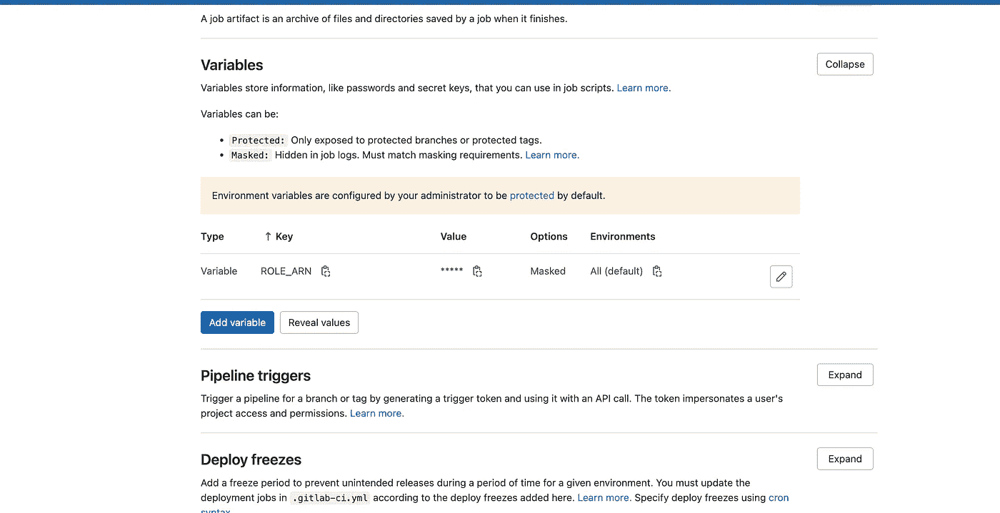

# 使用 OpenID Connect 将 GitLab 连接到 AWS

> 原文：<https://levelup.gitconnected.com/connect-gitlab-to-aws-using-openid-connect-f2d7495c6a9d>

图片来源- [GitLab](https://about.gitlab.com/images/press/logo/png/old-logo-no-bkgrd.png)

在这篇短文中，我们将探索使用 OpenID 连接器从 GitLab CI 连接 AWS 服务的可能性。传统上，从 CLI 连接 AWS 服务的方法是使用 IAM 用户访问 ID 和密钥，这需要适当的密钥轮换，从而增加了维护工作。从安全的角度来看，硬编码凭据并不是一种受欢迎的方法，应该尽可能避免使用。为了解决这个反复出现的问题，GitLab 开始支持 OpenID Connect。

根据 openid.net—“*OpenID 允许客户端根据授权服务器执行的身份验证来验证最终用户的身份，并以可互操作和类似 REST 的方式获取最终用户的基本配置文件信息。”*

就 GitLab 而言，它通过提供短期的 JWT 令牌使运行者能够通过 AWS 进行身份验证，这些令牌可以在内部承担对所需服务具有权限的角色。现在让我们看看它是怎么做的。

## 先决条件

*   AWS 帐户
*   GitLab 帐户

## 配置

1.  第一步是在 AWS IAM 中创建一个外部身份提供者，在我们的例子中是 GitLab。

提供者网址—【https://gitlab.com
T4 受众—[https://gitlab.com](https://gitlab.com)

也获取指纹

2.为需要承担的角色创建 IAM 策略

3.将信任关系附加到角色

4.将新创建的角色 ARN 作为变量添加到 Gitlab CI/CD 中

现在创建一个示例管道来测试 GitLab OpenID Connect 提供程序是否可以连接 AWS 并承担角色。示例管道如下所示

管道内部的脚本将使用 AWS CLI 提取 STS 令牌数据，并将这些值提取/导出到环境会话。我正在使用一个样本 terraform 项目来测试管道，我们可以在最后看到，TF 能够与 AWS 进行认证，并获得资源供应。很高兴看到您通过了 AWS 认证，而没有硬编码任何凭证:)

就这些了，谢谢你的阅读。

## 参考

*   [GitLab OpenID 连接](https://docs.gitlab.com/ee/ci/cloud_services/aws/)
*   [地形改造项目](https://gitlab.com/renjithvr11/gitlab-aws-openidconnect)

如有任何疑问，请通过以下链接联系我

*   [领英](https://www.linkedin.com/in/rvr88/)
*   [推特](https://twitter.com/mysticrenji)
*   [中等](https://renjithvr11.medium.com/)