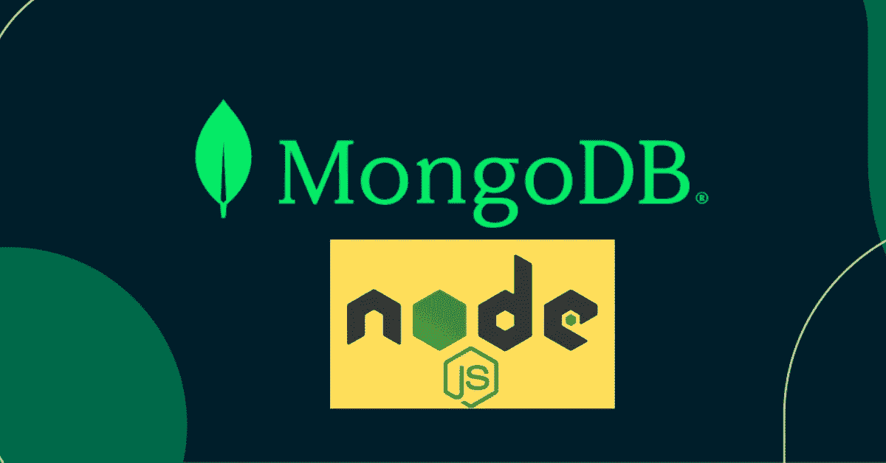
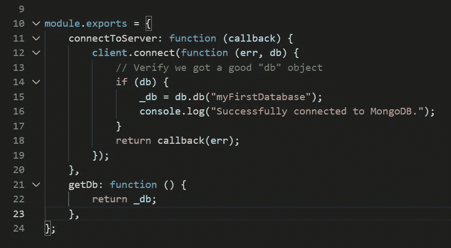
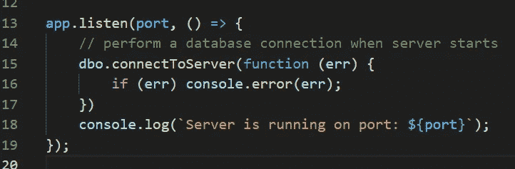

# 使用 Node.js 连接 MongoDB 云

> 原文：<https://levelup.gitconnected.com/connect-mongodb-cloud-using-node-js-daf470c584c8>

## 一个初学者友好的代码解释视频



本教程是关于连接一个 express 应用程序和 MongoDB 云的。要完成本教程，您需要有一个启用了公共访问的 MongoDB 云实例。你可以从 https://cloud.mongodb.com/[免费创建一个 mongo DB 云](https://cloud.mongodb.com/)

> 如果你愿意支持我成为一名作家，考虑注册[成为媒体成员](https://freelancingcult.medium.com/membership)。这样我就可以花更多的时间来分享知识。每月只需 5 美元，你就可以无限制地使用 Medium。

该项目的完整代码解释可以在这里找到。如果你想详细了解代码是如何工作的，请仔细阅读

## 先决条件

1.  安装节点
    要安装节点，请到[https://nodejs.org/en/](https://nodejs.org/en/)下载 LTS 版本或当前版本。
2.  MongoDB 云连接字符串可以通过下面的视频获得

按照这个一步一步的视频来创建一个免费的 MongoDB 云数据库，生成一个连接链接，并启用公共访问

首先，创建一个文件夹，并在文件夹中打开一个 git bash 或命令提示符

使用下面的代码初始化 package.json

```
npm init -y
```

然后使用 npm install 命令安装所有相关的软件包

```
npm install mongodb express cors dotenv --save
```

上面的命令将安装所有相关的包

**MongoDB**—node.js 的官方 MongoDB 驱动
**Express —** 创建并运行 node . js 服务器
**Cors —** 解决跨站点错误
**dotenv** —安全存储数据库连接字符串

创建一个名为 db 的文件夹和一个名为`connection.js`的文件，并添加下面的代码

## connection.js 代码解释

我们已经使用 MongoDB 包导入了`MongoClient`类。使用导入的 MongoClient 类，我们创建了一个名为 Client 的新实例，传递数据库连接字符串和其他可选参数

连接字符串取自`config.env`文件。



我们已经导出了两个方法，分别是`connectToServer` 和`getDb`。`connectToServer`获取一个函数作为参数。在`connectToServer`函数内部，我们使用创建的`MongoClient`类实例的`connect`方法。

如果连接不成功，`client.connect`返回`db`名称或一个`error`。如果有一个错误，我们通过将它附加到传入的[回调函数](https://javascript.plainenglish.io/beginners-guide-to-javascript-callbacks-d8195be73dc5)来传递该错误。

[](https://javascript.plainenglish.io/beginners-guide-to-javascript-callbacks-d8195be73dc5) [## JavaScript 回调初学者指南

### 通过真实的项目代码样本学习回调的 A-Z。

javascript.plainenglish.io](https://javascript.plainenglish.io/beginners-guide-to-javascript-callbacks-d8195be73dc5) 

在根级别创建一个文件`server.js`，并添加下面的代码

## server.js 代码解释

js 文件主要用于导入所需的包，并作为应用程序的入口点

首先，我们导入了 express 包并创建了一个名为`app`
的 express 应用程序，还导入了`cors`包以避免跨站点问题。

我们还导入了`connection.js`文件，这样我们就可以访问导出的函数。

```
const dbo = require("./db/connection");
```

下面是我们如何导入和使用`dotenv`包来配置`.env`文件

```
require("dotenv").config({ path: "./config.env" });
```

然后，我已经配置了连接服务器的端口。

```
const port = process.env.PORT || 5000;
```



上述函数使用 express 应用程序的`listen`方法来监听活动的数据库连接。我们传递端口号和一个函数来启动 db 连接作为参数。

您可以记住`connectToServer`函数需要一个函数作为参数，如果有一个 err，它将返回一个 err。如果有一个`err`或者没有错误记录连接成功消息，我们已经分析了响应并记录了`err`。

创建一个名为`config.env`的文件，并添加如下所示的 MongoDB 连接字符串

```
ATLAS_URI = Connection_string
```

添加代码后，您可以安装 Nodemon 包，以便轻松构建 node.js 应用程序

```
npm install -g nodemon
```

安装 Nodemon 后，使用

```
nodemon server.js
```

每次有代码更改并保存时，服务器将再次自动运行，因此您无需每次更改时都运行`node server.js`命令

详细的代码解释可以在这里找到

> 我希望你喜欢读这篇文章。如果你愿意支持我作为一个作家和我花在分享知识上的时间，考虑注册[成为一个媒体成员](https://freelancingcult.medium.com/membership)。每月只需 5 美元，你就可以无限制地使用 Medium。