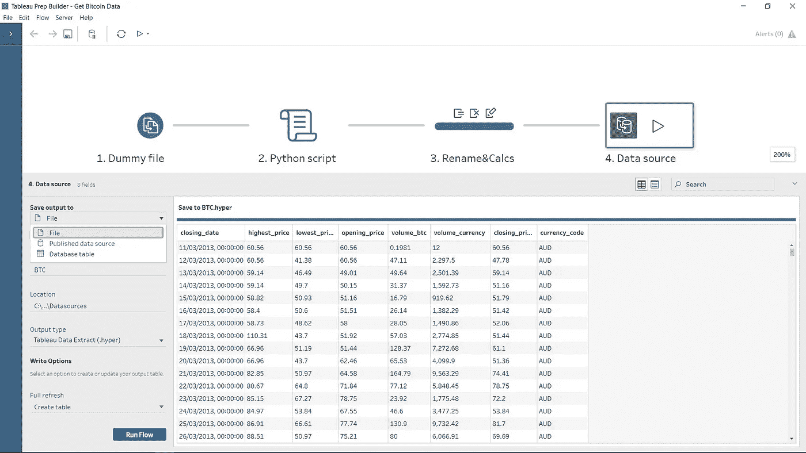

# 将 Tableau 连接到比特币数据

> 原文：<https://levelup.gitconnected.com/connect-tableau-to-bitcoin-data-a9ff1a03a4f4>


截至 2021 年 1 月的比特币历史美元价格(使用 Tableau 查看)

鉴于我在过去一年对比特币(以及整体加密货币)越来越感兴趣，我寻找解决方案，将比特币数据输入 Tableau，并开始跟踪世界头号加密货币的高点/低点和其他关键指标。

Tableau [Web 数据连接器(WDC)](https://tableau.github.io/webdataconnector/) 和 [Hyper API](https://help.tableau.com/current/api/hyper_api/en-us/index.html) 是通过 Web 将 Tableau 连接到任何数据的两种最常见的方式。然而，还有一种方法——我相信仍然不是很流行，但是我最喜欢的——包括在一个 [Tableau Prep](https://www.tableau.com/en-gb/products/prep) 流中添加一个 Python 或 R 脚本，它发送一个 API 请求并将数据以表格的形式返回给流。关于如何在 Tableau 准备流程中使用 R 和 Python 脚本的更多细节，请参见[这里的](https://help.tableau.com/current/prep/en-us/prep_scripts.htm)。

在这篇文章中，我将分享我创建的 Tableau WDC 和 Prep 流，以从免费的 [CryptoCompare](https://min-api.cryptocompare.com/) API 中检索比特币历史数据。获得的数据字段如下:

*   *截止日期*
*   *最高 _ 价格*
*   *最低价*
*   *开盘 _ 价格*
*   *收盘 _ 价格*
*   *volume_btc* (特定法定货币的比特币交易数量)
*   *volume_currency* (用于比特币交易的特定法定货币的数量)
*   *currency_code* (该字段仅在准备流程中可用)。

# Tableau Web 数据连接器

让我们从 **Tableau WDC** 开始(你可以[fork](https://github.com/ferrap/tableau-wdc-bitcoin.git)this in my GitHub repository)。关于如何创建 WDC，我不会说太多细节，因为已经有很多可用的资源，而且 [Tableau 文档](https://tableau.github.io/webdataconnector/docs/)也非常详尽。简而言之，WDC 由一个 HTML 页面和一段 JavaScript 代码组成，这段代码连接到 web 数据，将数据转换为 JSON 格式，并最终将数据传递给 Tableau。

要使用此 WDC，请打开 Tableau Desktop，在*到*服务器的连接窗格中，搜索并选择 *Web 数据连接器*，并输入以下 Web 数据连接器 URL:

```
[https://paoloferraiuoli.me/tableau-wdc-bitcoin/crypto.html](https://paoloferraiuoli.me/tableau-wdc-bitcoin/crypto.html)
```

这是我的 GitHub 页面上的 web 数据连接器的 URL。您将看到一个页面提示您**获取加密数据**！点击它，你应该可以在 Tableau 中看到你的数据！


您可能已经注意到， *closing_date* 字段是一个数字，因为 API 以 [Unix 时间](https://en.wikipedia.org/wiki/Unix_time)返回日期，所以您可能希望在 Tableau 中将它转换为 *dd-mm-yyyy* 日期格式，从而创建以下计算字段 *DATEADD('秒'，[closing_date]，# 1970–01–01 #)。我相信你可以直接在 JavaScript 代码中完成这种转换，但是 Tableau 易用性允许你只用一个简单的公式就可以完成。*

# Tableau 准备中的 Python 脚本

现在我们来谈谈在**准备流程**中使用的 **python 脚本**。简而言之，Tableau Prep Builder 可用于在 Tableau 中进行可视化分析之前准备、清理和调整数据。可以添加 Python 或 R 脚本来执行更复杂的清理操作，或者将预测建模数据整合到您的流程中。要了解更多信息，请点击查看[。](https://help.tableau.com/current/prep/en-us/prep_scripts.htm)

让我们看看 Prep 流程中从 API 获取数据并在 Tableau 中创建数据源的步骤。准备流程也可以从[这里](https://github.com/ferrap/tableau-prep-bitcoin)下载。


1.  第一步是连接到先前创建的虚拟文本文件。这只是一个 CSV 文件，只有一个列标题，将由 python 脚本返回的数据填充
2.  第二步，在[将](https://help.tableau.com/current/prep/en-gb/prep_scripts_TabPy.htm#connect-to-your-tableau-python-tabpy-server)连接到您的 TabPy 服务器之后(我之前写过一篇关于如何在 Heroku 中部署 [TabPy 以使其在云中始终可用的文章)](https://ferrap.medium.com/tabpy-heroku-tableau-online-1c0d7881db07)[向您的流](https://help.tableau.com/current/prep/en-us/prep_scripts_TabPy.htm#add-a-script-to-your-flow)添加一个脚本，并浏览以下脚本文件([下载它](https://gist.githubusercontent.com/ferrap/722556180c8757815e419073a5dca237/raw/eb40ea9e84e6f63752354ee0fcc2d7a4c99812cb/Crypto_API.py)，然后输入 *get_crypto_data* 作为*函数名*


如您所见，在 python 脚本中，有一个名为 *get_output_schema* 的[附加函数](https://help.tableau.com/current/prep/en-us/prep_scripts_TabPy.htm#create-your-python-script)，它定义了 Prep 中返回的字段和数据类型

3.在第三步中，我添加了一个清理步骤，在这个步骤中，我对返回的字段名称做了一些更改，并使用下面的计算将时间数据转换为日期格式 *DATEADD('秒'，[时间]，# 1970–01–01 #)*。您可以注意到，这里有一个额外的从 python 脚本返回的列(WDC 中没有)，它是 *currency_code* 。有了这个，你可以分析 python 脚本中定义的多种法定货币的比特币。


4.最后也是第四步是向流中添加一个输出，允许[本地保存、发布到 Tableau Server/Online 或写入到您的数据库](https://help.tableau.com/current/prep/en-us/prep_conductor_publish_flow.htm#publish-a-flow-from-tableau-prep-builder)比特币数据。



在 Tableau 中享受您的比特币分析！