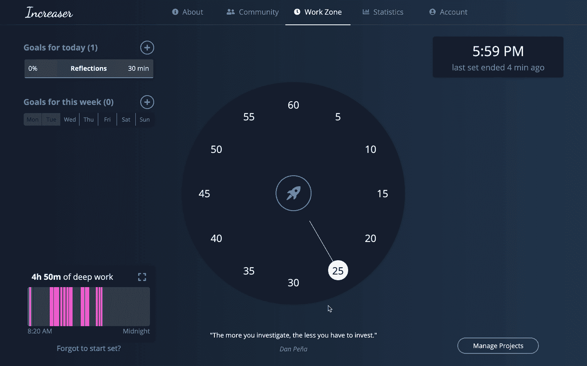

# 通过自动化从 LinkedIn 上的电子邮件列表联系客户

> 原文：<https://levelup.gitconnected.com/connect-with-customers-from-email-list-on-linkedin-with-automation-dc3c2e86e5d3>


在我的个人博客[](https://geekrodion.com/blog/linkedin)****上可以找到这个故事更吸引人、可读性更强的最新版本。****

# **与顾客交谈的问题**

**当你在开发一个产品时，与客户交谈是至关重要的——了解他们的问题，他们在找到你的应用程序之前使用了什么，以及它如何帮助他们。为了问这些问题，我有一个服务，在注册几天后给一个人发一封电子邮件。它会根据用户使用该应用的活跃程度提出一个个性化的问题。问题是人们很少回复这类邮件。几个月前，我开始思考——我能做些什么来和那些尝试增加收入的人进行更多的交谈。我不会向注册用户询问任何信息，所以我只留下了他们的姓名、国家和电子邮件。在一个有更高概率得到回应的平台上，有没有一种方法可以与他们建立联系？**

# ****电子邮件->Outlook->LinkedIn****

**即使你知道一个人的名字、电子邮件和国家，也很难找到他的社交媒体资料。此外，连接到同名的错误的人的几率相当高。**

**在做了一点研究后，我发现当你在 Outlook 中添加联系人时，它会向你显示一个与给定电子邮件关联的 LinkedIn 个人资料(如果有的话)。**

****

**Outlook -> LinkedIn**

# ****初始手动过程****

**为了知道一个新人何时在应用程序中注册，我在后端添加了一个小功能，发送一条电报消息，其中包含 LinkedIn 笔记的基本信息和选项。**

****

**电报信息**

**我会每隔一天检查一次频道，并对每条信息重复这些步骤。**

**1.获取电子邮件并在 Outlook 中创建联系人。**

**2.如果 LinkedIn 档案存在，请转到该档案。**

**3.进入数据库，检查某人是否对[增加器](https://increaser.org/)做过任何工作。**

**4.为注释复制适当的文本。**

**5.连接并添加注释。**

**6.将 LinkedIn 句柄保存到数据库。**

**自动化整个过程是可能的，但我不确定是否值得。两个月后，我厌倦了每隔一天做同样的事情，决定写一个程序。**

# ****带节点和操纵器的自动化****

**让我们来看看一个为我们做一切事情的小程序。**

****

**代码结构**

**当你安装库的时候，我们可以运行与木偶师配套的无头铬。在这种情况下，我们每次需要运行程序时都需要登录 Outlook 和 LinkedIn，这工作量太大了。相反，我们可以推出一个普通的 Chrome 浏览器，我们已经登录了这两个网站。要做到这一点，我们需要关闭现有的 Chrome 应用程序，并在浏览器中打开一个调试端口。**

```
/Applications/Google\ Chrome.app/Contents/MacOS/Google\ Chrome --remote-debugging-port=9222
```

**此命令将输出浏览器 web 套接字端点。**

****

**推出 Chrome**

**让我们复制端点，打开一个新的终端，并将参数传递给 NodeJS 程序。**

```
npm start ws://127.0.0.1:9222/devtools/browser/3ab28dde-bf55-4add-94a6-f96f254a7f6c
```

**我们不会详细讨论实现，因为一切都很简单。**

**首先，我们创建一个 browser 类的实例，它包含我们需要的所有方法。构造函数接收我们作为参数传递给程序的浏览器 WebSocket 端点。您可以在这里检查库[中的类的实现。](https://github.com/RodionChachura/linkedin-connector/blob/master/src/browser.js)**

**[数据库模块](https://github.com/RodionChachura/linkedin-connector/blob/master/src/database.js)导出两个方法:一个获取所有新用户，另一个保存用户的 LinkedIn 档案。您需要为您的用例重新编写这个模块。为了了解哪些用户是新用户，我们在本地保存了最后一个处理过的用户的注册日期。**

**另一个需要定制实现的模块是[业务](https://github.com/RodionChachura/linkedin-connector/blob/master/src/business.js)。它导出了一个根据注册日期对用户进行排序的函数，以及另一个生成个性化注释的函数。**

**仅此而已。试试这个程序，让我知道它是否对你有帮助！**

**借助[increaser.org](http://increaser.org/)，专注度和工作效率更上一层楼。**

****

**[扩大器](https://increaser.org)**