# 将您的微服务(Spring Boot 应用程序)连接到 AWS DynamoDB

> 原文：<https://levelup.gitconnected.com/connect-your-micro-service-spring-boot-application-to-aws-dynamodb-e86a430d418e>

根据不同的用例，Spring Boot + DynmoDB 是一个很好的组合，一个是 Java 的实际框架，另一个是 AWS 世界中的下一代 NoSQL 数据库。

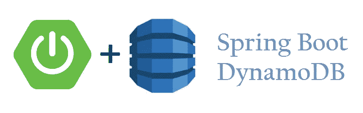

在这篇文章中，我将谈论:

1.  解决先决条件—在终端上设置您的 AWS 帐户、CLI。
2.  在 AWS 控制台上创建一个 DynamoDB 表，并添加一个示例值。
3.  使用 Spring Initializr 在本地安装 Java Spring Boot 微服务。
4.  使用 AWS SDK 将 DynamoDB 代码集成到您的 Java 应用程序中，并成功读取样本值。

> **1。解决先决条件—在终端上设置您的 AWS 帐户、CLI。**

> 让我们首先解决先决条件

1.  从 AWS 帐户获取访问密钥 ID 和秘密访问密钥
2.  在本地计算机上安装 AWS CLI
3.  在您的计算机上为 AWS 帐户配置 AWS 凭据

> *从 AWS 账户获取访问密钥 ID 和秘密访问密钥*

转到[https://aws.amazon.com/console](https://aws.amazon.com/console/)/并登录 AWS 控制台。导航到 IAM 部分- >仪表板- >管理安全凭证→访问密钥选项卡，提取您的访问密钥 ID 和秘密访问密钥。

如果你还没有，那就继续创造吧。

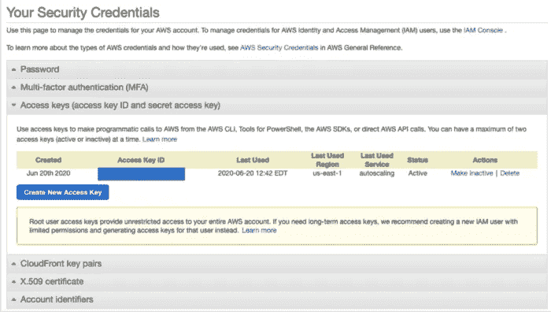

> *在您的本地机器上安装 AWS CLI*

记下密钥后，让我们在您的系统上安装 AWS CLI v2。如果您已经进行了配置，请继续执行步骤 3，在此我们将创建 AWS 基础架构。

按照 AWS 文档中提到的命令安装 AWS CLI。

 [## 在 macOS 上安装 AWS CLI 版本 2

### 本主题介绍如何在 macOS 上安装、更新和删除 AWS CLI 版本 2。AWS CLI 版本 1 和 2 使用…

docs.aws.amazon.com](https://docs.aws.amazon.com/cli/latest/userguide/install-cliv2-mac.html) 

安装 AWS CLI 后，在你的 mac 终端输入`aws`,应该会列出类似下图的内容。这将确认并验证 AWS CLI 已成功配置。

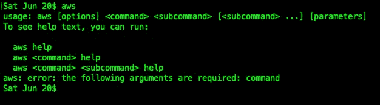

> *在您的机器上为 AWS 帐户配置 AWS 凭证*

现在，是时候在本地机器上映射您的 AWS 凭证了。我们需要在您的机器上配置访问密钥 ID 和秘密访问密钥，以便您可以从您的机器连接到您的 AWS 帐户，并使用 AWS CLI 创建和中断 Infra。

`aws configure`应该做的把戏，并要求凭据，地区和输出格式。您可能希望将其配置为下图所示。

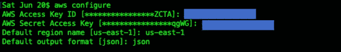

我们可以去你的`~/.aws/credentials`验证这一点

这个文件验证我们刚刚在终端中添加的凭证，并显示密钥。完成这一步后，我们现在可以通过 AWS CLI 从我们的机器访问 AWS 帐户。太好了，我们完成了设置…！！！

> 2.在 AWS 控制台上创建一个 DynamoDB 表，并添加一个示例值。

进入 AWS 控制台，输入 DynamoDB，进入 DynamoDB 页面，点击“创建表格”

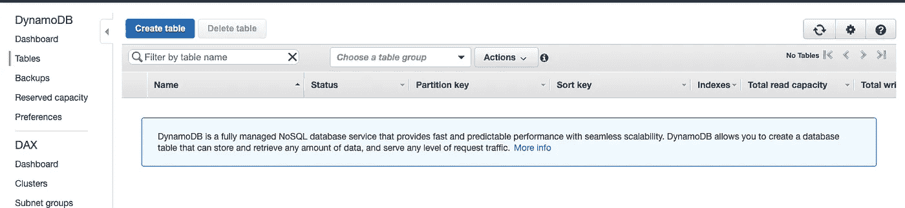

创建一个名为“stocks”的新表，并添加“stock_id”作为主键，然后继续创建新表。创建一个可能需要一些时间。在本文中，我们不会深入研究二级索引和排序键，因为我们只是介绍了连接的基础知识。

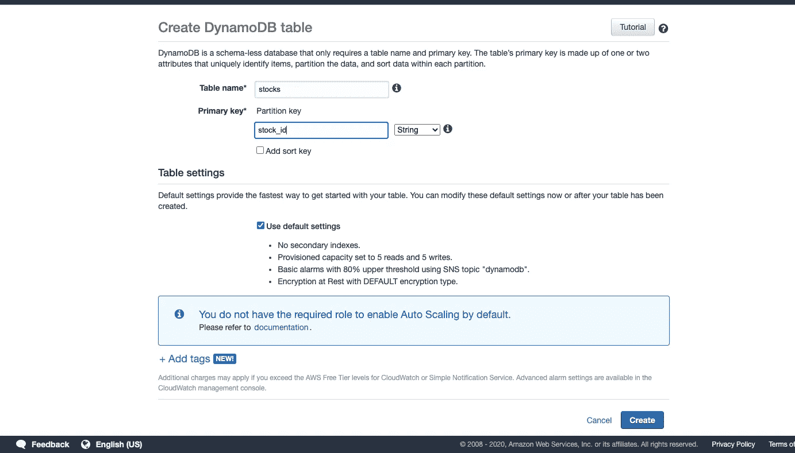

创建表后，向表中添加一个示例值。对于本文，我将股票 id 添加为“MU ”,股票值添加为“65”。由于 DynamoDB 是一个 NoSQL 数据库，除了主键之外，我们还可以向现有的表中添加任意数量的值。

请注意，主键是必须添加的。

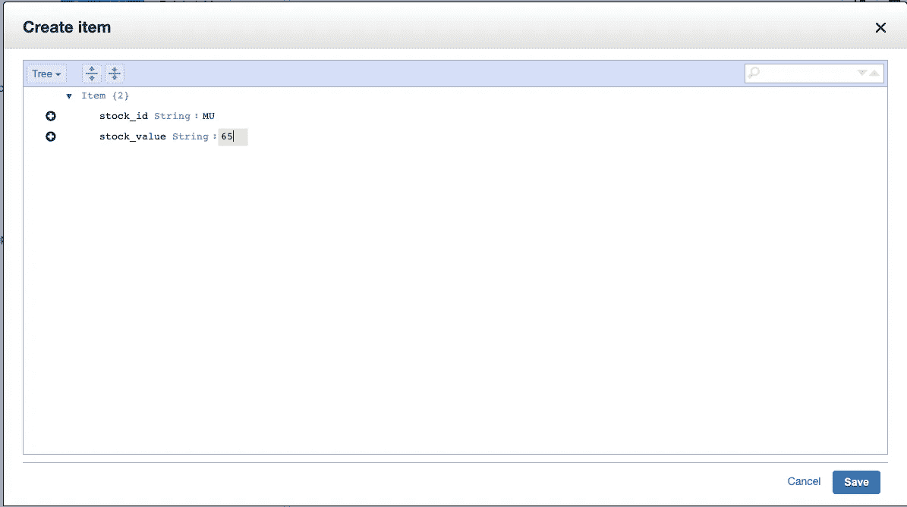

如果您看到您的表格与下图相似，那么恭喜您..！！！您已经创建了一个样本值，并将其添加到您的第一个 DynamoDB 表中。行..！！

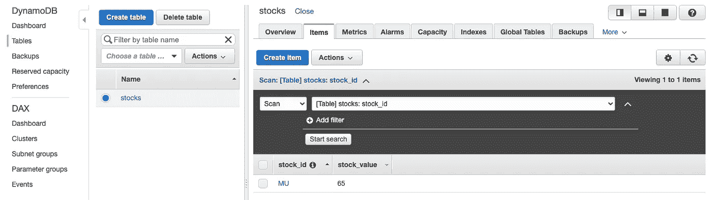

> 3.使用 Spring Initializr 在本地安装 Java Spring Boot 微服务。

让我们知道如何设置 Java 项目，在其中创建微服务，并将这个微服务连接到您刚刚创建的 DynamoDB 表。

转到 Spring Initializr URL，在这里可以创建基本的 Spring Boot 项目，位于:

 [## 弹簧初始化 r

### Initializr 生成的 spring boot 项目正好是你快速启动所需要的！

start.spring.io](https://start.spring.io/) 

只需给出适当的 GroupId 和工件 Id，并添加一些基本的依赖项，就可以启动您的 Apring 引导应用程序。

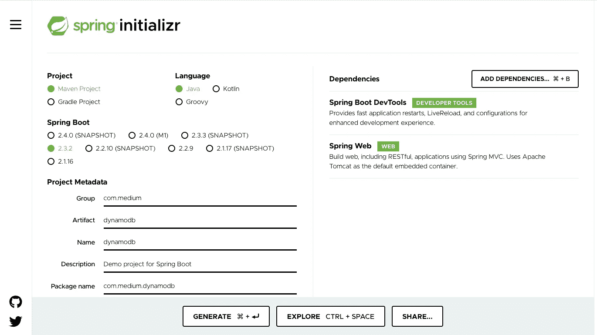

下载完项目后，只需修改 application.properties 文件，在本地端口和上下文路径上运行该项目

> server . servlet . context-path =/dynamo db-learning
> 
> server.port = 6060

您的应用程序现在运行在端口 6060 上。我使用端口 6060 来保持它的唯一性并避免端口冲突。你可以随意使用任何港口。

> 4.使用 AWS SDK 将 DynamoDB 代码集成到您的 Java 应用程序中，并成功读取样本值。

这是应用程序的重要部分，在这里您可以编写代码来连接到 AWS 上的 DynamoDB 表。

1.  向 pom.xml 文件添加适当的必需依赖项。
2.  创建一个配置类，并使用适当的配置创建 DynamoDB Java Bean。
3.  创建一个模型包来创建映射到 DynamoDB 表的类。
4.  创建一个 Repository 类来读取 DynamoDB 类的值。
5.  创建一个控制器来公开一个 GET HTTP 端点。

> 将适当的必需依赖项添加到 pom.xml 文件中

将“aws-java-sdk-core”和“aws-java-sdk-dynamodb”依赖项添加到 pom.xml 中，并在项目上执行“mvn 全新安装”以下载适当的依赖项。

一旦下载了依赖项，

> 创建一个配置类，并使用适当的配置创建 DynamoDB Java Bean。

创建一个名为 config 的包，并创建一个名为“DynamodbConfiguration”的类，如下所示:

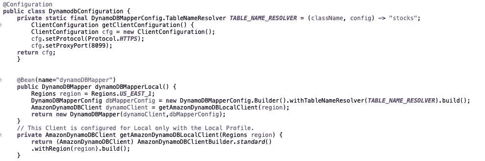

在上面的代码中，我们创建了一个名为“dynamoDBMapper”的 bean，它连接到标准客户端生成器上“us-east-1”区域中名为“stocks”的表。这就是 DynamoDB 客户端的创建方式，它读取。/aws/credentials 文件并连接到适当的帐户。它进一步查找提到的表，然后将自己连接到帐户中相应的表。

以上步骤用于连接本地的 DynamoDB。如果你有个人资料在你的。/aws/credentials，那么您可能希望使用“AWSStaticCredentialsProvider ”,这将连接到 sp specific 配置文件。

我将在另一篇文章中介绍如何将它部署到 EC2 实例中，并通过 IAM 角色进行连接。

> 3.创建一个模型包来创建映射到 DynamoDB 表的类。

创建一个 POJO，将 DynamoDB 表中的数据序列化和反序列化到代码中。

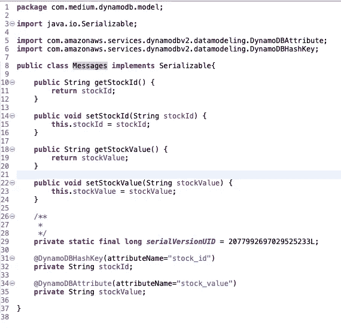

添加适当的 getters 和 setters，或者使用“lombok”依赖项，并在类的顶部使用注释“@Data”来删除代码中的第 10 到 24 行。我在这里明确地使用 Getters 和 Setters。

提及 HashKey 和适用的属性值。

> 4.创建一个 Repository 类来读取 DynamoDB 类的值。

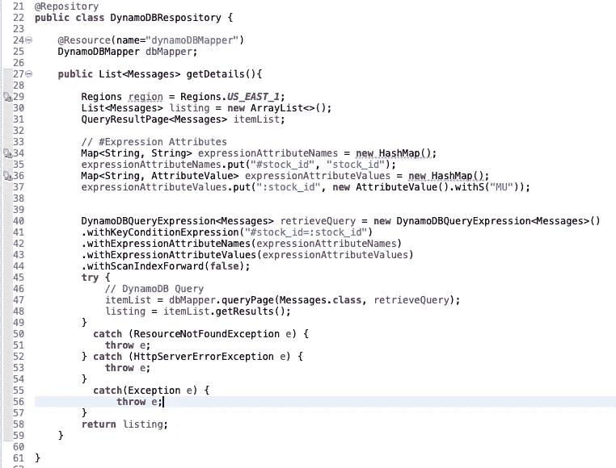

第 24 行:将步骤 2 中创建的 Bean 导入到 Repository 类中。Bean 非常重要，因为它只在服务启动期间创建一次，并将其自身解析为表连接，并在以后的多个连接中重用。

第 34 行:表达式属性正在构建。这里查找的关键字是:“stock_id”

第 36 行:正在构建表达式属性值。这里要查找的值是“MU”，这是我们在创建表时给定的值。

第 40 行:正在构建 DynamoDBQueryExpression，上面构建的所有参数都用于构建查询。

第 41 行:根据第 42 和 43 行提供的参数，分解表中的查找条件，相当于“stock_id == MU”。

第 47 行:这就是奇迹发生的地方。我们使用我们的查找条件和反序列化器类“Messages”查询页面，该类将 JSON 解析为 POJO。

> 5.创建一个控制器来公开一个 GET HTTP 端点。

我们现在从 DyamoDB 获取数据，并需要将这些数据返回给调用者。

让我们构建一个控制器类，并公开一个 HTTP 端点，供我们通过 Curl 或 Postman 调用和获取数据。

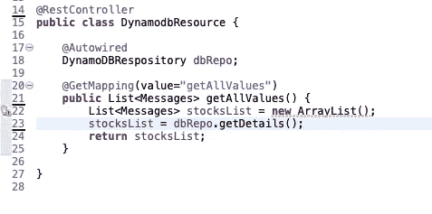

用一个示例 GET 端点构建一个“Rest 控制器”。自动连接存储库类并调用 getDetails 方法，然后将数据返回给调用者。

我保持这个 GET 端点非常简单，因为我已经硬编码了要查找的值。您可以随意传递一个路径参数或将其转换为 POST。本文的主要焦点是讨论在 Java 中使用 AWS SDK 的 D 配置和示例查找。

运行服务器。您的应用程序应该在本地主机的 6060 端口上运行。

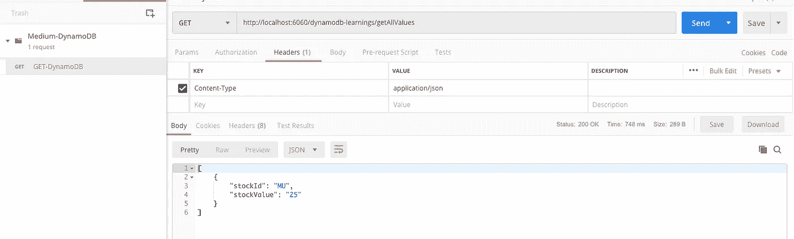

进行示例 Postman 调用应该会返回我们在 AWS 控制台中添加的适当值。

如果你看到这个回复，那么 violaa…！！！您已经成功地将您的微服务连接到一个真实的 DynamoDB 表，并且能够检索这些值。

你可以通过下面的链接在 github 上找到这个项目。请随意克隆和增强它。

 [## teja 24 NEX/dynamo db-学习

### 在 GitHub 上创建一个帐户，为 teja 24 NEX/dynamo db-learning 的发展做出贡献。

github.com](https://github.com/teja24nex/dynamodb-learnings) 

太棒了…！！这是朝着 DynamoDB 迈出的辉煌的第一步。现在，您可以探索更多选项来读取更多动态值，并添加查询来添加新值，sky 是操作的极限。请随意探索更多。

我希望我的这篇文章对如何从 Java 微服务应用程序连接到 DynamoDB 并读取值有所启发。快乐编码…！！

如果你喜欢你所读的，请在下面尽可能多地拍手，因为这鼓励我写更多。