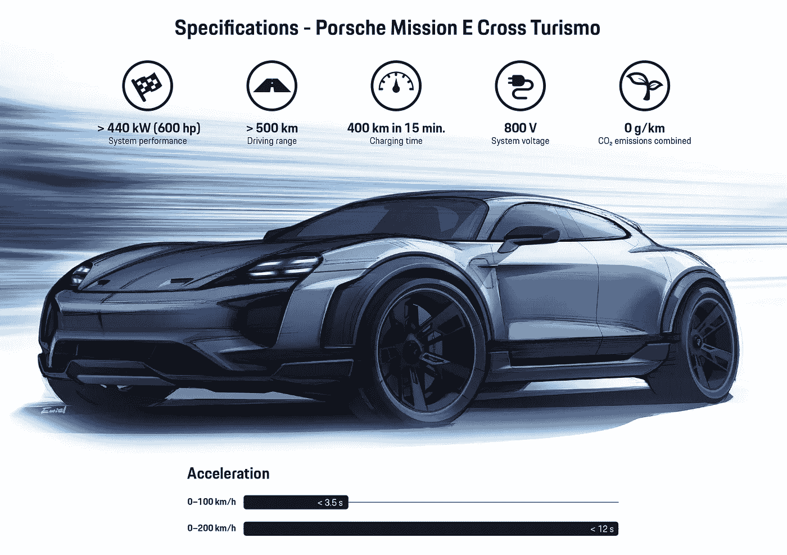

# 联网汽车🏎—它们是什么以及如何开始开发联网汽车应用

> 原文：<https://levelup.gitconnected.com/connected-cars-what-are-they-and-how-to-get-started-developing-connected-car-apps-5c6fbbf1f157>

新一代汽车非常方便——从用手机启动引擎，当你在附近时打开车门，到当你累得无法安全驾驶时给你发出通知。

联网汽车到底是什么？根据维基百科:

> 一辆**联网汽车**是一辆[汽车](https://en.wikipedia.org/wiki/Car)，它配有[互联网](https://en.wikipedia.org/wiki/Internet)接入，通常还配有[无线局域网](https://en.wikipedia.org/wiki/Wireless_local_area_network)。[【1】](https://en.wikipedia.org/wiki/Connected_car#cite_note-1)[【2】](https://en.wikipedia.org/wiki/Connected_car#cite_note-2)这允许汽车与车内外的其他设备共享互联网接入

如今，毫无疑问，汽车的未来将是互联和电动的——特斯拉和保时捷等顶级汽车品牌提供了优秀的互联电动汽车，如特斯拉 Model S 和保时捷 Mission E。

我们真的生活在未来——这多酷啊？

保时捷 ME 的内饰

特斯拉 S 充电

特斯拉的内饰

我对汽车了解不多，但联网汽车可以拯救生命，创造更环保、更环保的环境，让交通更加安全。

有了联网汽车，我们终于可以在手机上浏览我们最喜欢的子街道，而不会给任何人带来风险。

# 开始开发互联应用

**更新:本次比赛不再运行**。为保时捷工作空间提供动力的团队推出了他们自己的汽车品牌工作空间。点击 查看他们的平台、SDK 和标准化 API [**。**](https://high-mobility.com)

我们将使用 [Porsche workspace](http://www.porsche-next-oi-competition.com/) ，因为它是我所知道的最先进的软件开发套件*(SDK)*——请在下面随意评论您最喜欢的联网汽车软件开发套件。🙂

注册保时捷工作空间

为什么说是最先进的？让保时捷 SDK 如此令人敬畏的是，他们将标准化所有联网汽车之间的 API。

现在每个平台都有单方面的 API，这意味着你必须分别学习每个平台和 API——新标准下没有那么多！

点击注册后，你会看到一个快捷的表格，如果你想按照我们的例子，请填写它。

成功创建用户并登录后，您应该会看到以下内容

让我们创建一个项目。我们需要的如下:

*   一个项目(我们将应用程序链接到项目)
*   一个应用程序(一个项目可以有多个应用程序)
*   车辆(我们将车辆与应用程序联系起来)

简而言之，我们创建一个项目，应用程序和工具。我们将应用程序链接到项目，然后将车辆链接到应用程序。逻辑如下:

*项目***⟵***app***⟵***车辆*

创建 Mario cart 项目

成功创建项目后，我们应该会看到我们的仪表板。

接下来，让我们创建一个车辆。

我不得不说，用户界面看起来非常光滑和直观。我们现在有了项目，有了交通工具，剩下要做的就是创建一个应用程序。

现在让我们为项目创建一个应用程序。

我们可以使用 API 来构建 Android、iOS 或 web 应用程序。我们将坚持传统的好网络。

创建应用程序并将其链接到车辆

*不要忘记将车辆链接到应用程序。*

好吧，让我们最后启动模拟器。

模拟器的 Web 用户界面

那是一个奇特的网络模拟器。我们终于穿过脚手架到了肉和骨头。我们可以通过 API 与仿真器对话。

# 开始与模拟器 API 交互

让我们把这个[范例库](https://github.com/highmobility/hm-node-scaffold)作为样板文件，用我们最喜欢的文本编辑器打开。确保您安装了 Node +8.4。

让我们打开`src/app.js` —我们应该看到一个有用的评论。我们需要提供凭证。

我们已经做了所有这些。我们只需要凭证。在开发→项目→客户证书下。

客户证书

最后，我们需要访问令牌。很多脚手架，但请记住这是*“alpha”*阶段。将来你可能只会运行一个类似于`yarn run unpack connectedcar-kit`的命令

访问令牌

好的，让我们通过运行`yarn run start`来启动我们的引擎

通过 API 打开模拟器引擎

这就对了。活着是多么美好的时光啊！如果你有兴趣了解更多信息，这里有一些文档

# 从这里去哪里？

如果这个话题引起了你的兴趣，从这里有很多路可以走，但我建议你尝试一下，用模拟器创建几个应用程序。这里有一些应用程序的想法——谁知道呢，你甚至可能在比赛中为其中的一个赢得 10 万英镑的奖金！

*   显示禁止停车和付费停车点的应用程序。仪表盘上的禁停点应显示为红色，付费停车点应显示为橙色。
*   帮助寻找最近的充电器的应用程序。
*   该应用程序可让驾驶员快速访问谷歌地图、消息应用程序、音乐应用程序和其他实用程序。

感谢你阅读并坚持到最后——你太棒了！❤

 [## 成为顶级开发人员的秘诀是构建东西！这里有一个有趣的应用程序列表！

### 只有付出努力，你才能成为伟大的开发者。想象一下——你不可能身体健康…

medium.freecodecamp.org](https://medium.freecodecamp.org/the-secret-to-being-a-top-developer-is-building-things-heres-a-list-of-fun-apps-to-build-aac61ac0736c)  [## Indrek Lasn (@lasnindrek) |推特

### Indrek Lasn 的最新推文(@lasnindrek)。商业提议和情书:lasnindrek@gmail.com。苏黎世…

twitter.com](https://twitter.com/lasnindrek)  [## ✨用这些 Visual Studio 代码扩展极大地升级了你的开发环境

### 先说代码——Visual Studio 代码。

medium.freecodecamp.org](https://medium.freecodecamp.org/immensely-upgrade-your-development-environment-with-these-visual-studio-code-extensions-9cd790478530)  [## 如何用 Nodejs、GraphQL、MongoDB、哈比神和 Swagger 建立一个强大的 API

### 将前端和后端分开有很多好处:

medium.freecodecamp.org](https://medium.freecodecamp.org/how-to-setup-a-powerful-api-with-nodejs-graphql-mongodb-hapi-and-swagger-e251ac189649)