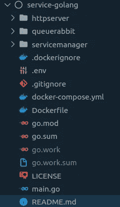

# 将 Golang 中的服务连接到 RabbitMQ 服务器

> 原文：<https://levelup.gitconnected.com/connecting-a-service-in-golang-to-a-rabbitmq-server-835294d8c914>

在上一篇文章中，我们在 Go 中构建了一个服务，这样它就可以启动和完成内部流程。现在我们有了一个工作的服务，让我们创建一个 RabbitMQ 客户端来处理其中的所有 RabbitMQ 进程。我们将使用 [rabbitmq/amqp091-go](https://github.com/rabbitmq/amqp091-go) 库来连接、消费和发布消息。跟我一起踏上这段旅程吧！

首先，熟悉一些基本的 RabbitMQ 概念很重要，比如队列、交换、通道等等。如果您对此一无所知，我建议您在继续之前阅读此[文档](https://www.rabbitmq.com/getstarted.html)。

# 在哪里设置 RabbitMQ 客户端？

我通常说 Go 是面向包的，所以组织服务的一个好方法是将特性和职责分割成包，这样我们就可以将所有 RabbitMQ 相关的代码放在一个包中，并且有一个明确的名字，比如`queuerabbit`。

包装结构示例

假设有一个错误导致消息从未到达您的服务。如果你有上面的结构，你会从哪里开始寻找 bug？当然是通过包`queuerabbit`，它结合了`queue`和`rabbit` 两个词，引用了 RabbitMQ。

> 确定这个包的职责非常简单，因为它建立并保持与 RabbitMQ 的连接，还处理消息。

# 连接到 RabbitMQ

首先要做的是建立联系。快速浏览文档，您会发现函数`conn, err = amqp.Dial(uri)`。所以你创建了通道，它准备好了，你的连接就完成了，对吗？对吗？

如果网络有问题，连接关闭了会怎么样？为最坏的情况做准备是一个好习惯。

函数`Start(ctx context.Context)`创建一个 goroutine，它将总是尝试连接到服务器，如果它由于任何原因断开连接，当问题解决时，服务将在没有人工干预的情况下恢复在线。

> 传递给`Start`的上下文必须有 CancelFunc，这一点很重要，这样，当服务关闭时，上下文可以被取消，负责保持连接的 goroutine 可以停止运行。

创建服务时的一个主要关注点是资源的使用。我们没有无限的 CPU 和内存，所以参数`prefetchCount`非常重要，它告诉我们从队列中读取了多少条消息。如果该值为 0，则有可能一次从队列中读取所有消息，这可能会突破服务内存限制。

# 消费邮件

rabbitmq/amqp091-go 库的结构非常好。当您调用函数`channel.Consume()`时，它会返回一个通道，消息将通过这个通道到达，这对于 goroutine 无限期地读取消息来说是完美的。

面临的挑战是在避免数据丢失的同时，使消息读取与服务关闭同步。这个难题的一个关键部分是函数`channel.Cancel`，它停止接收新消息。它允许在关闭与服务器的连接之前处理最后收到的消息。

对于每个消费者和每条消息，我们从`sync.WaitGroup`调用函数`wg.Add(1)`和`wg.Done()`，这允许我们在服务关闭时关闭连接之前调用`wg.Wait()`，因此我们可以成功地读取和处理来自所有活动消费者的所有消息。

消费消息的 goroutine 也通过停止读取新消息并允许处理最后的消息来对取消的上下文信号做出反应。

# 发布消息

发布很简单。让我们使用与消费者相同的`sync.WaitGroup`，这样当服务停止时，它将等待消息被发送。

唯一可能发生的问题是循环引用。换句话说，从队列包中，您可以调用另一个包中的函数，反过来，从队列包内部调用发布函数。为了避免这个问题，您可以创建一个发布者接口和一个实现该接口的结构。

# 关闭连接

现在服务正在运行并处理消息，是时候终止它了。我们从调用在服务初始化时创建的函数`cancel()`开始，因此保持连接打开的 goroutine 可以结束，所有正在使用消息的 go routine 停止处理新消息，处理剩余的消息，并顺利完成。完成所有工作后，我们可以关闭通道并关闭与服务器的连接。

在`Close(ctx context.Context)`中创建的第一个 goroutine 的目的是等待所有的消息被相应地处理。第二个等待来自第一个或上下文超时的信号，然后关闭通道和连接。该函数返回一个通道来通知一切都已完成。这样，主线程可以完成其他进程，并等待一切都成功完成的信号。

# 简化服务的结构

即使有了所有这些解释和代码，仍然很难将所有内容整合到一个包中。这就是为什么我创建了一个连接、消费、发布和关闭连接的库，使得创建新包变得非常简单。[点击这里](https://github.com/gbeletti/rabbitmq)，github 上什么都能找到。

我还使用这个库创建了一个示例服务，[它也在 github](https://github.com/gbeletti/service-golang) 上。

# 结论

RabbitMQ 是一个非常强大的工具，用于微服务之间的异步通信，构建一个与之交互的包是非常具有挑战性的。重要的是要记住，你必须知道如何完成你开始的每一件事，以避免丢失信息。这给系统带来了一致性和健壮性。

希望这篇教程有用。在下面的部分留下评论。