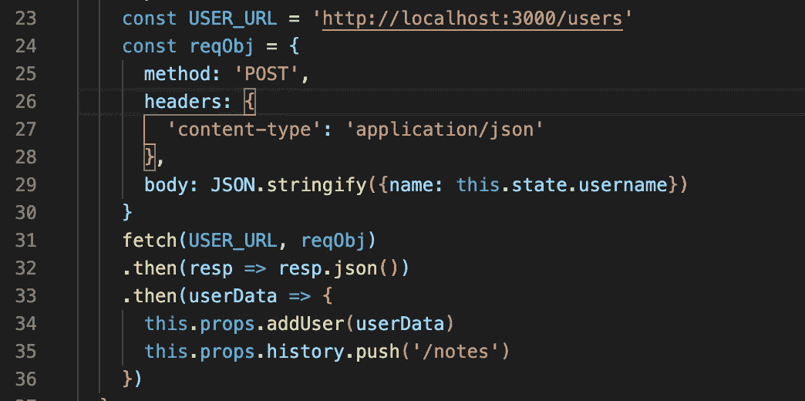
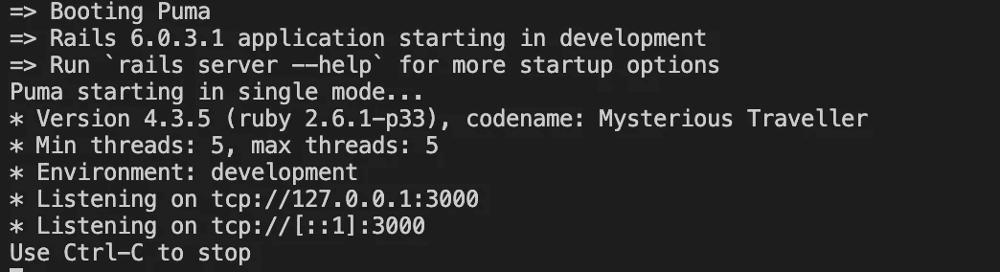
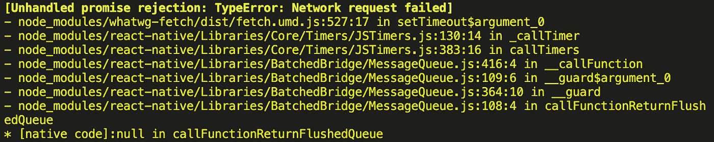
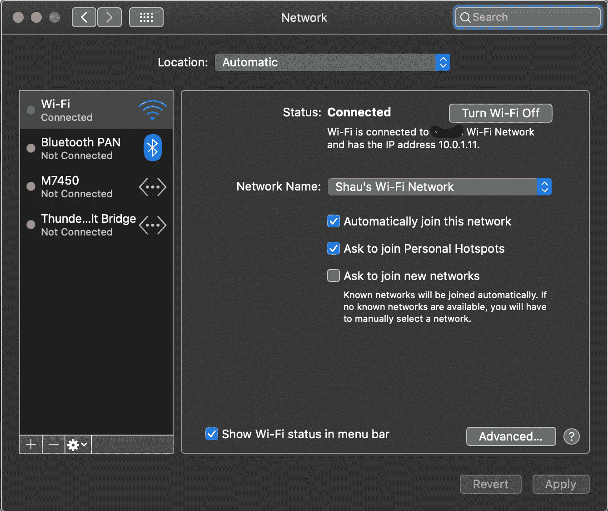
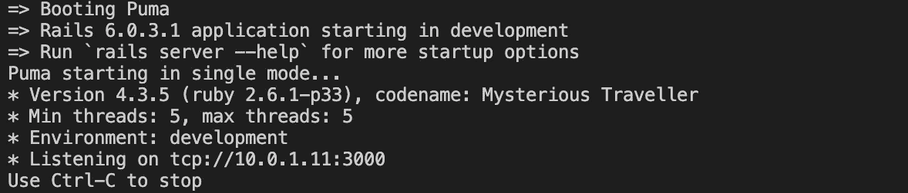
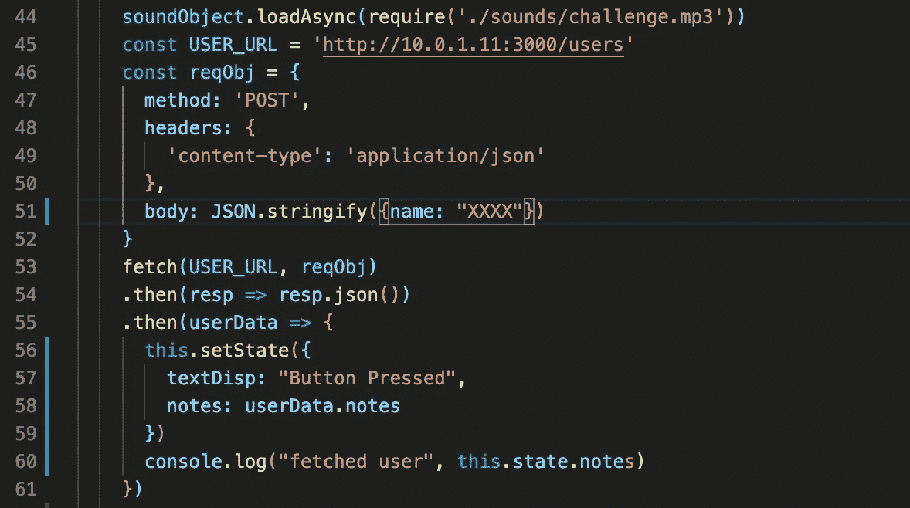

# 将 React 本机应用程序从 iPhone 连接到 Mac

> 原文：<https://levelup.gitconnected.com/connecting-react-native-app-from-iphone-to-mac-d422f8b91f2f>

对于我们这些一直从事 React 应用的人来说，当我们在后端启动 Rails 服务器时，localhost:3000 是我们永远的伴侣。当我们需要来自后端的数据时，简单地从本地主机 URL 获取数据通常就足够了。

然而，当我开始深入 React Native(使用 Expo)时，事情变得有点不确定。我想如果你在你的终端命令行上做了足够多的“rails s”的话，大家应该都很熟悉下面这些。

IP 地址 127.0.0.1，localhost，正在侦听端口 3000，所以当我的 JavaScript 获取指向那个主机名和端口号时，我从我的 Rails 后端应用程序取回我的 JSON 数据。然而，通过 Expo 在 iPhone 上运行的 React 本机应用程序不识别 localhost。据我所知，我们需要使用实际的 IP 地址。由于我的 iPhone 与运行后端 Rails 应用程序的 Macbook Pro 连接到同一个 WiFi 网络，我应该可以将我的 URL 从“http://localhost:3000”更改为“http://127.0.0.1:3000”，对吗？

不完全是。这是我得到的:

网络请求失败！！！显然，我在 iPhone 上运行的 Expo 应用程序无法到达该 IP 地址和端口。经过大量的研究和尝试不同的东西，结果发现我忽略了一件重要的事情——我的 Mac 的网络设置(系统偏好/网络)！

我的 Mac 实际上的 IP 地址是 10.0.1.11，而不是 Rails 默认的 IP 地址 127.0.0.1！如何解决这个问题？结果是我必须通过“rails s -b 10.0.1.11”将我的 Rails 服务器绑定到那个 IP 和端口。

现在，我的后端应用程序在 10.0.1.11:3000 监听，我可以从中获取数据。

我花了几个小时四处寻找，才意识到 Rails 应用程序的默认 IP 地址和我自己的服务器(我的 Macbook Pro)地址不匹配。如果你遇到类似的问题，希望这能节省你一点时间。