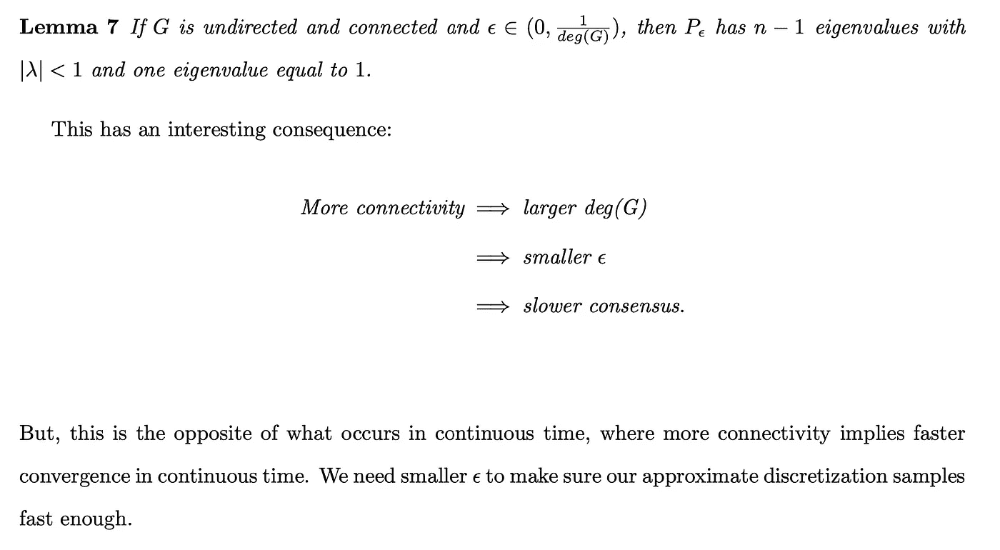

# 离散时间中的一致性

> 原文：<https://levelup.gitconnected.com/consensus-in-discrete-time-18ffb3801bf3>

既然我们对连续时间中的一致有了坚实的理解，我们可以开始理解这在离散时间中是如何运作的。任何可实现的算法必须具有离散的时间形式。就个体代理人而言，我们必须问:

其中 k 表示离散时间，在网络级，我们必须问:

# 结论:

从上面我们得到了离散时间一致性控制法则的形式，每个个体代理必须运行该法则，以便最终与其余代理达成一致性。此外，增益或步长必须在上面定义的区间内，从 0 到但不等于或超过图 g 度数上的 1。如果这两个步骤被正确实施，那么运行离散时间一致性控制器，代理将收敛到某个α值，在 fat 的跨度上！

*首先关注本博客，从今天开始了解 RL、Python 和其他高价值主题；如果你想留在圈子里，永远不会错过我的故事，然后订阅我的电子邮件列表。* ***考虑成为媒介会员，以获得无限制访问我的作品和其他作者的作品:***

 [## 加入我的介绍链接媒体-迦勒鲍耶

### 阅读凯莱布·m·鲍耶(以及媒体上成千上万的其他作家)的每一个故事。您的会员费直接支持…

medium.com](https://medium.com/@CalebMBowyer/membership) 

*下次见，*

*迦勒。*