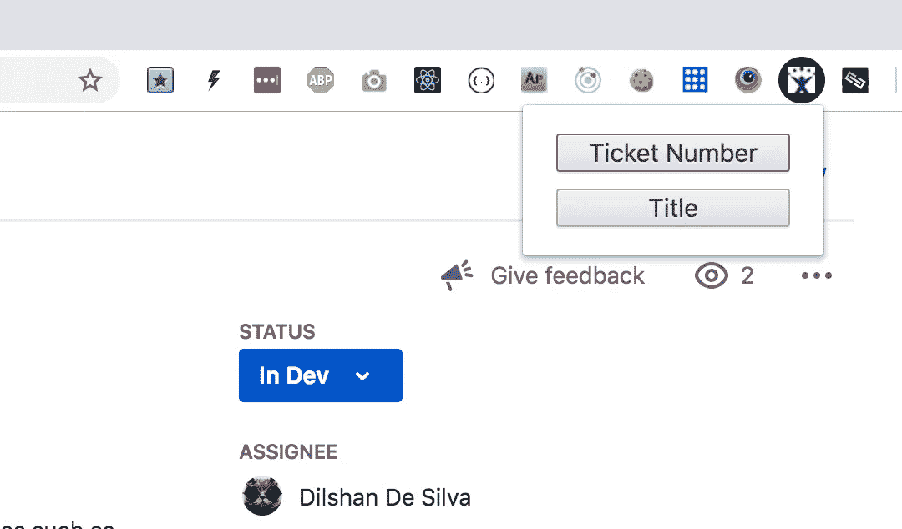
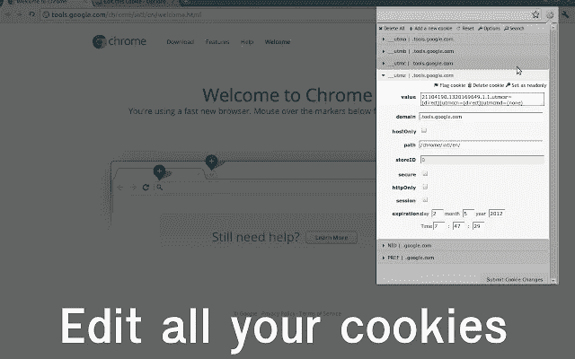

# Web 开发中的能量守恒

> 原文：<https://levelup.gitconnected.com/conservation-of-energy-in-web-development-500bec2e88d2>


***第一部分——还原沉闷***

在过去的几年里，我对改善我的开发者体验产生了浓厚的兴趣。特别是——减少通常与角色相关的背景噪音、单调乏味、击键和中断。

以下是一些提示、技巧和工具，让我的一天变得稍微轻松一点，并帮助我专注于实际的创造力和解决问题。

我在 Mac 上使用 Node / React，因此其中一些可能会偏向于该堆栈。

# 像老板一样的终端

> “如果你凝视深渊，深渊也会凝视你”——热情的德国人

## 明智地选择一个

我个人的选择:iTerm 2(分割窗格和标签，伟大的搜索，颜色)


## Git 颜色+自动完成

这不会直接影响生产率，但是会使 Git 更容易使用。


将以下内容添加到您的/Users/ <yourusername>/中。bash_profile</yourusername>

```
# git autocompletion
if [ -f ~/.git-completion.bash ]; then
  . ~/.git-completion.bash
fi# some nice colors for git
parse_git_branch() {
     git branch 2> /dev/null | sed -e '/^[^*]/d' -e 's/* \(.*\)/ (\1)/'
}
export PATH=/usr/local/bin:/usr/local/sbin:$PATH
export PS1="\u@\h \[\033[32m\]\w\[\033[33m\]\$(parse_git_branch)\[\033[00m\] $ "
export CLICOLOR=1
export LSCOLORS=ExFxBxDxCxegedabagacad
```

## Bash 别名

> "把你的房子整理好！"—妈妈/乔丹·彼得森

这些是终端中预定义命令的简写。您可以使用$*、$0、$1…作为变量。

将以下内容添加到您的/Users/ <yourusername>/中。bash_profile</yourusername>

```
# console
alias ls='ls -GFh'
alias nr='npm run $*'
alias ga='git add .'
alias gss='git status'
alias gc='git commit -m $*'
alias gp='git push'
alias gpo='git push origin'
alias goops='git reset --soft HEAD~1'
alias gcb='git checkout -b $*'
alias gpm='git pull origin master'
alias ll='ls -la'
alias tw='npm run test:unit:watch'# apps
alias chrome="/Applications/Google\ Chrome.app/Contents/MacOS/Google\ Chrome"
alias wstorm='/Applications/WebStorm.app\ $*'
alias wlink='wml add $1 $2src/node_modules/@ow/$1'# docker
function drun () { docker-compose run --rm $1 /bin/bash; }
function dexec () { docker-compose exec $1 /bin/bash; }# wml
function wlink () { wml add $1 $2src/node_modules/@ow/$1; }
```

所以不要输入这个:

```
$ npm run test
$ git add .
$ git commit -m "some-commit-message"
$ git push --set-upstream origin
```

我可以这样做:

```
$ nr test  
$ ga 
$ gc "some-commit-message"
$ gpu
```

***注意:*** *您需要重新启动终端，这些才可用。*

## 控制台历史快捷方式

“哪一个会导致更少的工作？”这个问题消耗了太多的精力...按下向上箭头键，直到找到最近使用过的命令或重新键入它"？只有我这样吗？无论如何，这里有一个很酷的技巧:

```
$ ctrl + r
```


按下`ctrl + r`将终端置于搜索历史模式..开始输入你想要的命令，很快…你历史上的任何匹配都会出现..再次按下`ctrl + r`以循环播放比赛。

# 启动您的 IDE

总的来说，我的建议是花一点额外的时间来加速那些打断你心流的重复性或侵入性的任务。

> “真正的程序员使用 VI”——一群野蛮人

我个人使用 Jetbrains Webstorm，因为我发现这个搜索比 VSCode 好得多，而且开箱即用，它有更多我使用的功能。我确实与 VSCode 保持联系，看看它在哪里，现在市场上有足够多的扩展来拥有与 WebStorm 相同的功能集。

## 代码片段

任何我一天输入两次以上的代码都会变成代码片段。


**网络风暴片段:**

[https://github . com/Drapegnik/env/tree/master/jetbrains/templates](https://github.com/Drapegnik/env/tree/master/jetbrains/templates)

**VS 代码片段:**

[https://marketplace.visualstudio.com/items?itemName=xabikos。JavaScriptSnippets](https://marketplace.visualstudio.com/items?itemName=xabikos.JavaScriptSnippets)

[https://marketplace.visualstudio.com/items?itemName=xabikos。反应钳](https://marketplace.visualstudio.com/items?itemName=xabikos.ReactSnippets)

【https://marketplace.visualstudio.com/items? itemName = spoon scen . es6-mocha-snippets

## 较美丽

更漂亮的代码格式。就在你的编辑器里。

> “自动缩进现在非常热门”——从来没有人


变漂亮:【https://github.com/prettier/prettier】T4

## 重新命名

我改名字的次数多得惊人。也许我只是不小心？但是如果你像我一样…


获取这个 VSCode 扩展:[https://marketplace.visualstudio.com/items?itemName = formula Hendry . auto-rename-tag](https://marketplace.visualstudio.com/items?itemName=formulahendry.auto-rename-tag)

Webstorm 天生就能做到这一点。

## 沙袋鼠

Wallaby 直接在您的 IDE 中运行您的 JavaScript 测试，并在您的代码旁边为您提供覆盖率+执行信息。它还将评估控制台日志，并允许您检查 IDE 中的值。它有点贵，但我发现它真的减少了开发周期时间。


[wallabyjs.com](https://wallabyjs.com/)


# 开发工具检查器元素选择

Chrome dev tools 无疑是开发人员所能要求的最佳助手。涵盖它的一小部分功能将是另一篇文章，我强烈建议花时间提高这方面的技能。以下是我今年学到的几件事，也许连资深用户都可能忽略了。

> “向你的领主投降！”—谷歌

便捷助手 JS 路径和$0，$1 等..


# 浏览器插件

## 八叉树:

描述:向任何 git repo 添加一个类似 IDE 的代码树。

[](https://github.com/ovity/octotree) [## 产卵/八叉树

### 类固醇上的 GitHub 代码树。在 GitHub 上创建一个帐户，为 ovity/octotree 开发做出贡献。

github.com](https://github.com/ovity/octotree) 

## 吉拉捷径

描述:允许您将吉拉机票和/或吉拉机票的标题复制到剪贴板。是的，我就是那么懒。

[](https://chrome.google.com/webstore/detail/jira-shortcut/kjofpimpbjninggehnclcgkgniacejha) [## JIRA 捷径

### 作为“CMD-999:说明”复制到 jira 发行的剪切板

chrome.google.com](https://chrome.google.com/webstore/detail/jira-shortcut/kjofpimpbjninggehnclcgkgniacejha) 

## 编辑此 cookie

描述:编辑您的 cookies。这比进入应用程序面板要快。

[](https://chrome.google.com/webstore/detail/editthiscookie/fngmhnnpilhplaeedifhccceomclgfbg?hl=en) [## 编辑 ThisCookie

### EditThisCookie 是一个 Cookie 管理器。您可以添加、删除、编辑、搜索、保护和阻止 cookies！

chrome.google.com](https://chrome.google.com/webstore/detail/editthiscookie/fngmhnnpilhplaeedifhccceomclgfbg?hl=en) 

**最后一道工序**

描述:管理网站认证信息和预填表格。消除手动测试时重新键入表单数据的痛苦。

[](https://chrome.google.com/webstore/detail/lastpass-free-password-ma/hdokiejnpimakedhajhdlcegeplioahd) [## LastPass:免费密码管理器

### LastPass，一个屡获殊荣的密码管理器，保存您的密码，让您安全地从每台计算机和…

chrome.google.com](https://chrome.google.com/webstore/detail/lastpass-free-password-ma/hdokiejnpimakedhajhdlcegeplioahd) 

*就这样..一定要在评论里留下自己的小技巧！编码快乐！*

本系列第二部分:[https://medium . com/@ dilshandesilva 80/web-development-part-2-C5 FB 4c c8 ce 92](https://medium.com/@dilshandesilva80/conservation-of-energy-in-web-development-part-2-c5fb4cc8ce92)

[](https://gitconnected.com/learn) [## 了解如何编码-查找编码教程| gitconnected

### 使用我们完整的编码资源列表学习任何编程语言或框架。我们分享、汇总和排名…

gitconnected.com](https://gitconnected.com/learn)