# 考虑 Javascript 和 A11y:手风琴组件

> 原文：<https://levelup.gitconnected.com/considering-javascript-and-a11y-the-accordion-component-2ab8c752cac6>

最近，一位同事给了我一个挑战，让我依靠 HTML、CSS 和普通的 Javascript 编写一个手风琴组件。我决定把这个任务变成一个研究项目，因为我不仅想了解如何为视觉用户创建一个手风琴，还想了解如何为依赖屏幕阅读器等辅助技术的用户创建一个手风琴。

基本上，我想在构建这个组件时考虑可访问性或“A11y”。

我是这样分解我的研究方法的:

1.  **CRAFT A DEFINITION:**accordion 组件对于用户和开发者的目的和作用是什么？手风琴是如何为依赖辅助技术的用户制造痛点的？开发人员在编写 accordion 组件时忽略了哪些易访问性问题？
2.  **构建语义 HTML 结构:**良好的可访问性要求尽可能依赖语义 HTML。那会是什么样子？
3.  **合并 WAI-ARIA:** 我想我需要合并 WAI-ARIA 属性来使我的手风琴能被屏幕阅读器访问，但是我不确定我需要添加什么。知道 WAI-ARIA 的基本规则是*而不是*如果你没有必要就使用它，我想以一种非常简洁的方式制作一个依赖它的手风琴。
4.  **应用 JAVASCRIPT:** 到目前为止，我接触过的 Accordions 都使用 JAVASCRIPT 来神奇地显示和隐藏 DOM 中的内容。我假设我会使用 Javascript，但不确定这是否是实现可访问性的最佳方法？由于一些残疾用户在浏览器中关闭了 Javascript，所以只有 CSS 的手风琴会更好吗？
5.  **用 VOICEOVER 测试:**我想确保我测试了我用 Voiceover 构建的任何示例，voice over 是我的首选屏幕阅读器，因为它是免费的，已经安装在我的 Mac 上了。

# 什么是手风琴部件？

accordion 组件以垂直方式组织内容的多个部分。每个部分都有一个折叠标题，它是一个标题或问题，引用相应折叠面板中嵌入的内容。accordion 让用户可以自由决定想要显示或隐藏内容的哪些部分。

从 UX 的角度来看，accordion 的功能特别有用，因为它通过允许在小区域中嵌入更多内容来解决屏幕空间有限的问题。例如，折叠经常被选为 FAQ 部分的设计模式。想象一下，移动用户不得不无休止地滚动，或者屏幕阅读器用户不得不无休止地浏览一长串问题和答案，以便找到页面上的其他内容，这是多么令人沮丧？

手风琴为视觉用户提供了一个干净简洁的界面，手风琴式的标题作为隐藏内容的交互轮廓。隐藏内容对屏幕阅读器用户也有好处，因为它是不可聚焦的，并且不会迫使用户为了到达网页的其他区域而切换内容。

# 如何构建手风琴的语义结构？

> 语义 HTML 是真正可访问网络的基础。
> 
> *Sara Soueidan，*开发人员和教师

在一篇名为[“一年的学习和教学可访问性教会了我什么”的精彩博文中，](https://www.24a11y.com/2019/what-a-year-of-learning-and-teaching-accessibility-taught-me/)开发者 Sara Soueidan 强调了依赖语义 HTML 的基础重要性。语义 HTML 为什么重要？HTML 元素描述了它们所呈现的内容，并且“通过使用正确的元素，你的文档内容将具有可传达的结构和意义。”

当使用本地 HTML 元素时，DOM 能够将这些元素的结构转换成可访问性树，从而为辅助技术提供信息。屏幕阅读器将宣布元素的角色、名称、状态和值，因为本地元素已经内置了可访问性信息，所以尽可能依赖它们的语义是很重要的。[来源](https://developers.google.com/web/fundamentals/accessibility/semantics-builtin/the-accessibility-tree)

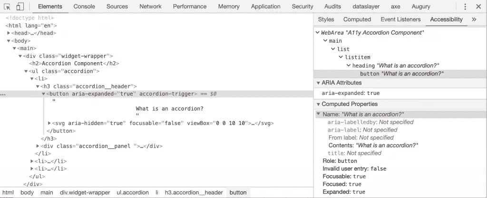

请注意可访问性树(在右边)中的所有可用信息:可访问性树结构、aria 属性和计算属性。

我知道我需要一个容器来包装折叠标题的各个部分和相应的折叠面板内容。我还认为我需要一个容器来包装内容，为将来可能出现的复杂内容需求做准备。

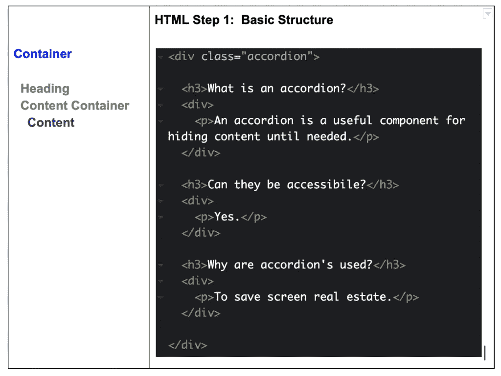

基本折叠式 HTML 结构

上面代码的问题是标题没有被设计成交互式的。最初，它们对我很有意义，因为我知道屏幕阅读器可以帮助用户根据标题浏览网页。[来源](https://usability.yale.edu/web-accessibility/articles/headings)

在调查了关于 accordion 最佳实践的多种资源之后，建议将 

开发人员还应该避免使用带有 role="button "属性的

标记，因为这种方法会从本地 HTML 按钮提供的可访问性树中删除信息。可以使标签可访问，但是需要额外的自定义代码。为什么不使用已经可用并经过测试的产品呢？[来源](https://www.hassellinclusion.com/blog/accessible-accordion-pattern/)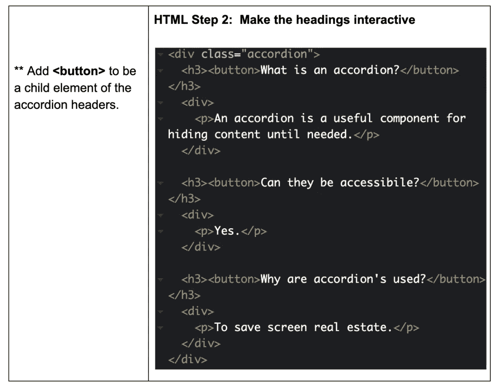

使折叠标题具有交互性。

这个

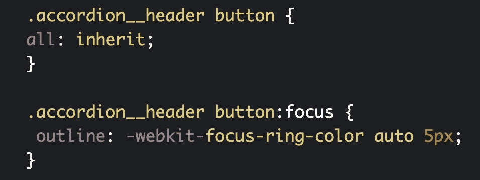

把对焦环放回去！

# 如何指示状态的变化？

因为 accordion 组件可以展开和折叠内容，所以有必要以可视化和编程的方式演示状态的变化。当内容在可用和隐藏之间切换时，必须通知用户。隐藏内容对任何用户都不可用，除非它处于展开状态。

为了使用视觉提示演示这种切换，当单击 accordion 标题时，accordion 将显示和隐藏一部分内容。通常，这由指示内容是打开还是关闭的图标动画来表示。

虽然只有 CSS 的手风琴可以传达内容的展开和折叠，但它们不能向屏幕阅读器用户传达状态的变化。这就是 Javascript 成为使 accordion 组件可访问的有用工具的原因，因为它可以切换向屏幕阅读器指示内容是展开还是折叠的属性。

## WAI-ARIA

为了向屏幕阅读器用户传达状态的变化，可以使用 WAI-ARIA 属性的组合。aria 代表可访问的富互联网应用程序，ARIA 属性的范围有助于使 web 内容和 web 应用程序更易于访问。

按钮上的 aria-expanded 属性告诉我们内容是展开还是折叠。 [SOURCE](https://www.a11ywithlindsey.com/blog/javascript-accessibility-accordions) 需要注意的是，开发人员经常会犯将 aria-expanded 属性放在内容本身的错误，然而*状态的改变应该总是放在控件上。* [来源](http://provide.smashingmagazine.com/eBooks/inclusive-components-free-chapter.pdf?_ga=2.134554546.2102480741.1577471058-1521707248.1577363110)

W3C 的 ARIA 资源详细介绍了 aria-expanded 属性的重要信息。本质上，aria-expanded 状态“指示该元素或它控制的另一个分组元素当前是展开的还是折叠的。”

因此，如果 aria 展开状态为 **false** ，则该元素或它控制的另一个分组元素将被折叠。如果 aria-expanded 状态为 **true** ，那么这个元素或者它控制的另一个分组元素将被展开如果 aria 展开的状态是**未定义的**，那么这个元素，或者它控制的另一个分组元素，既不可展开也不可折叠；显示其所有子元素，或者没有子元素。[来源](https://www.w3.org/TR/wai-aria-1.1/#aria-expanded)

## 隐藏属性

aria-hidden 属性通常用于定义折叠内容的状态。但是，当设置为 false 时，该属性在浏览器中会有一些问题，建议不要在生产应用程序中依赖该属性。[来源](https://www.w3.org/TR/wai-aria-1.1/#aria-hidden)

幸运的是，一个本地的替代方法，隐藏的全局 HTML 属性，现在可以在所有浏览器上成功实现。这个属性是一个布尔值，它决定了一个元素是否与网页相关。如果一个元素具有 hidden 属性，浏览器将不会呈现该元素，内容将对所有用户隐藏。[来源](https://developer.mozilla.org/en-US/docs/Web/HTML/Global_attributes/hidden)

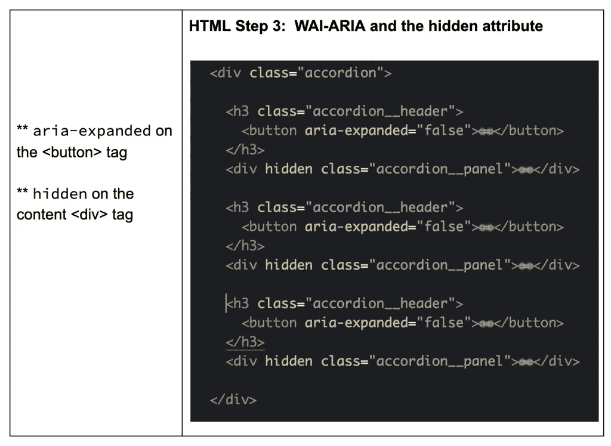

为可访问性添加 WAI-ARIA 和 HTML 全局属性。

## 视觉用户的 SVG 图标

内容的打开和关闭通常通过加号和减号图标的切换来说明。对于视觉用户，加号图标表示有一些可以打开的附加内容。减号图标表示内容的相关部分可以隐藏。

对于我的例子，我依赖 Heydon Pickering 建议的 svg 图标。这是他的图标:

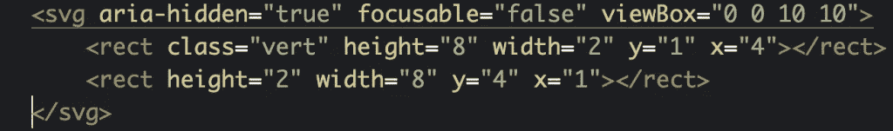

Heydon Pickering 加减 svg 图标

他非常深入地研究了这个图标的可访问实现。例如，Pickering 添加了属性 focusable="false ",因为我们不需要图标是交互式的。我们只希望父按钮具有这种焦点交互。

我非常欣赏的其他技巧包括如何设计按钮的样式。使用下面的代码，svg icon 元素将自动继承其父元素的所有样式，在本例中是标题。

> 我们可以确保元素尊重高对比度主题。通过对元素应用 currentColor 填充，当受主题更改影响时，它们会随着周围的文本改变颜色。
> 
> *海登·皮克林，* [包容成分](https://www.smashingmagazine.com/2019/11/inclusive-components-prerelease/)

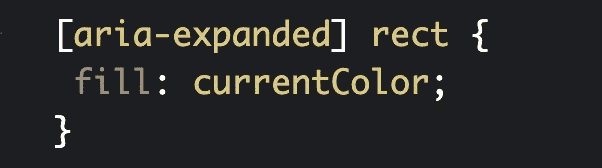

有关其他样式选择和深入解释，请参考 Pickering 关于可折叠内容的章节。

# 如何为我的手风琴组件选择 Javascript？

我想说明的是，为了创建一个可访问的组件，我消化了很多资源。接下来的文章非常透彻，帮助我掌握了重要的概念，并演示了如何编写一个可访问的手风琴。我读了林赛的博客 *A11y 中的[“Javascript 和可访问性:手风琴”](https://www.a11ywithlindsey.com/blog/javascript-accessibility-accordions)，格雷厄姆·阿姆菲尔德的[“我最喜欢的可访问手风琴模式”](https://www.hassellinclusion.com/blog/accessible-accordion-pattern/)，以及匹兹堡卡耐基博物馆创新工作室的[“网络可访问性指南:手风琴”](http://web-accessibility.carnegiemuseums.org/code/accordions/)。*

然而，我登陆的地方主要受 Heydon Pickering 最近出版的书[中关于可折叠部分的章节的影响。然而，所有的作者都做了出色的工作，为易访问开发提出了非常相似的论点和方法。我强烈推荐阅读所有的资源来形成你自己关于发展选择的观点。](https://www.smashingmagazine.com/2019/11/inclusive-components-prerelease/)

以下是我更喜欢用于我的无障碍手风琴:

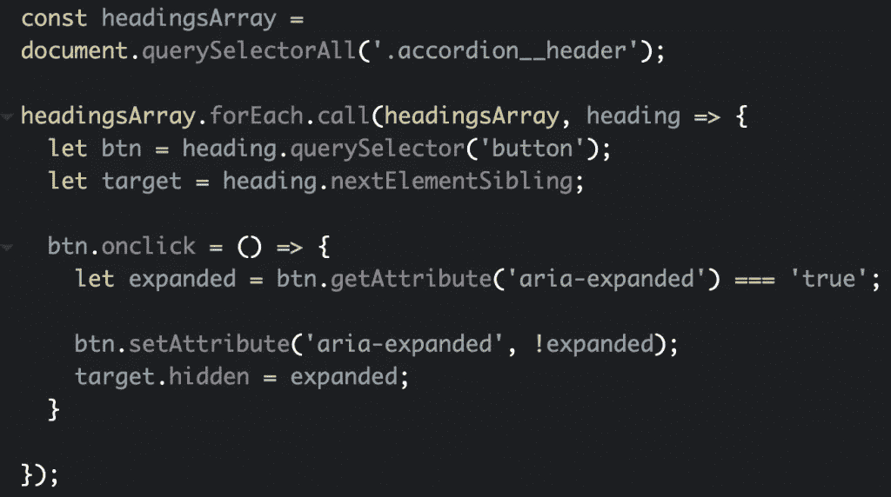

添加 Javascript 功能。

我喜欢这种方法的什么？我喜欢 ES6 在非常枯燥的演示中的使用效果。基本上，我们用。accordion__header 类，然后切换 aria 扩展的属性和内容面板。call 方法让我们显式地指定当遍历数组中的所有内容时， ***this*** 等于的值。

# 在 Voiceover 上测试它

是时候在画外音上测试我的手风琴了。首先，作为一个比较点，我想看看在没有任何考虑的情况下，一个基本的手风琴是什么样子的。以下是 W3 学校手风琴示例的短片:

W3 学校示例

这里最大的问题是没有内容状态的指示。您无法判断按钮触发的是面板内容的展开状态还是折叠状态。

现在，让我们看看我在这篇文章中整理的手风琴:

我的无障碍手风琴的例子。

当使用 Voiceover 时，很明显关注手风琴的状态对屏幕阅读器用户有什么影响。虽然这个手风琴在视觉上与 W3 Schools 手风琴相同，但它更易于使用，因为它可以显示内容的折叠和展开状态。

听完这个手风琴我要改变的一件事就是我的 html 设置。让我感到困扰的是，用户不知道手风琴里有多少面板。如果有 30 个呢？这是我一开始就想知道的信息。所以我将把我的手风琴包装在一个

标签中。我将把手风琴头和面板放到一个*   标签中。这种方法是由格雷厄姆·阿姆菲尔德和莎拉·苏伊丹提出的。

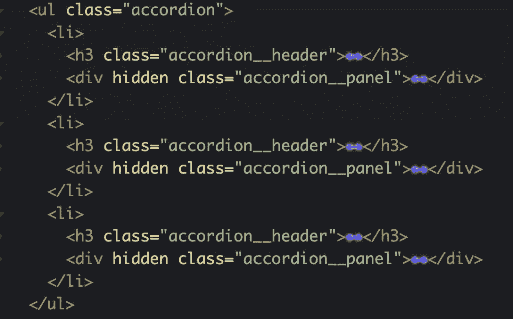

在无序列表中包装手风琴。

找到了。现在，当屏幕阅读器访问组件时，它会读出列表中的项目数。听下面:

无序列表中的可访问组件。

# 如何通过事件委托解决性能问题？

当我向我团队的 FED(前端)领导展示这篇文章的初稿时，他建议我应该通过考虑事件委托来解决性能问题。为什么事件委托有助于性能？事件委托允许我们设置一个事件处理程序，而不是多个。因为我们只有一个事件，而不是多个事件，所以对内存的压力较小，这导致了更好的性能。

本质上，上面的代码在每个元素上附加了一个事件侦听器。accordion__header 类。我们实际上可以重构这个 accordion，这样在父元素上只有一个事件监听器，即

## 事件冒泡

事件冒泡是一个过程，它说明了在父子关系中触发事件的顺序。

> 当一个事件在一个元素上被触发时，例如鼠标点击一个按钮，同样的事件也会在该元素的所有祖先上被触发。这个过程被称为事件冒泡；事件从原始元素冒泡到 DOM 树的顶端。[*来源*](https://www.sitepoint.com/javascript-event-delegation-is-easier-than-you-think/)
> 
> 安德鲁·泰特劳

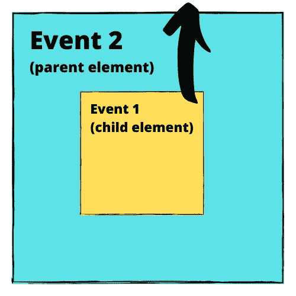

## 目标元素

事件委托的另一个方面涉及 Javascript 的目标元素特性。什么是目标元素？目标元素是启动事件的原始元素。对于我们的手风琴来说，重要的是要认识到目标元素也可以是 javascript 事件的祖先，在我们的例子中是包装手风琴头部和面板的

## 事件委托

使用事件冒泡和目标元素，我们现在可以为 accordion 组件集成一种利用事件委托的 javascript 方法。基本上，当 

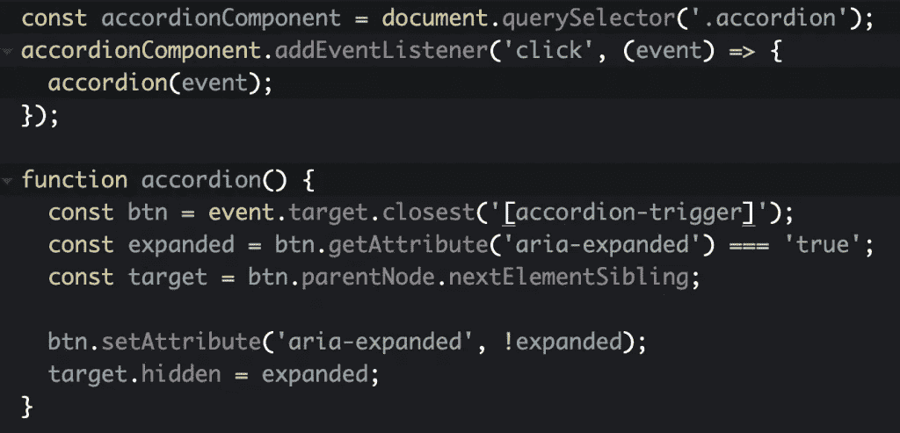

重构的 accordion javascript 实现事件委托。

上面的代码在 accordion

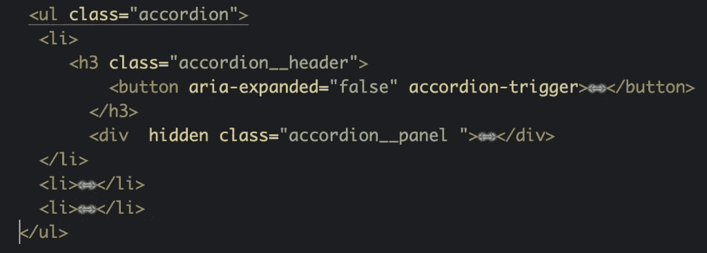

向

当处理多个事件侦听器的用例时，正如 accordion 组件所要求的，一个好的经验法则是使用事件委托，即在父元素上附加一个事件侦听器。这将防止出现耗尽内存从而导致性能下降的情况。

此外，为我们的 accordion 组件选择事件委托还解决了有关数据驱动方法的动态方面的问题。为什么？因为我们的事件侦听器只检查我们的。click 事件触发时的 accordion__header 选择器。以前没有。这允许我们动态地将 accordion 内容添加到 DOM 中，而不用担心我们的事件监听器无法捕捉到它们，因为页面已经加载了。[来源](https://gomakethings.com/why-is-javascript-event-delegation-better-than-attaching-events-to-each-element/)

这里有一个链接指向[我的代码笔](https://codepen.io/lclark070607/pen/mdyXBBL)和这个最终迭代(今天)。

# 最后的想法

我发现这个研究和写作练习对于将手风琴组件的可访问结构和功能映射到我的大脑中是非常宝贵的。我总是渴望同时学习和教学。这不仅对我自己来说是一个很好的学习过程，而且可能会帮助其他人综合丰富的信息。

我在这里完成的这个手风琴还没有逐步增强。如果某人的浏览器关闭了 Javascript，隐藏的内容将保持隐藏。这是我会继续研究的问题。Heydon Pickering 和来自 A11y with Lindsey 的作者都采用了不同的方法来使内容在这个场景中可用。我的一个同事建议使用<datails>和</datails>

元素，并从那里向后工作。我会调查此事，稍后会更新这篇文章。

# 资源

这篇博客综合了这些了不起的开发者的大量信息。为了你自己的利益，我建议你也读一读他们的作品。

*   [A11yWithLindsey，“Javascript 和可访问性:手风琴”](https://www.a11ywithlindsey.com/blog/javascript-accessibility-accordions)
*   [Chris Ferdinandi，“为什么 JavaScript 事件委托比将事件附加到每个元素要好？”](https://gomakethings.com/why-is-javascript-event-delegation-better-than-attaching-events-to-each-element/)
*   [Graham Armfield，“我最喜欢的无障碍手风琴模式”](https://www.hassellinclusion.com/blog/accessible-accordion-pattern/)
*   [海登·皮克林，“咏叹调控制是便便”](https://www.heydonworks.com/article/aria-controls-is-poop)
*   [Heydon Pickering，*中的“可折叠内容”包含组件*](http://provide.smashingmagazine.com/eBooks/inclusive-components-free-chapter.pdf?_ga=2.134554546.2102480741.1577471058-1521707248.1577363110)
*   [创新工作室，《网页无障碍指南:手风琴》](http://web-accessibility.carnegiemuseums.org/code/accordions/)
*   [关于 aria-expand 属性的 W3C 官方文档](https://www.w3.org/TR/wai-aria-1.1/#aria-expanded)
*   莎拉·苏伊丹，“你怎么给手风琴做标记？”
*   [Sara Soueidan，“一年的教学和学习可及性教会了我什么”](https://www.24a11y.com/2019/what-a-year-of-learning-and-teaching-accessibility-taught-me/)
*   [Andrew Tetlaw，“事件委派比你想象的容易”](https://www.sitepoint.com/javascript-event-delegation-is-easier-than-you-think/)
*   [David Walsh，“Javascript 事件委托如何工作”](https://davidwalsh.name/event-delegate)

*原载于 2020 年 1 月 5 日*[*https://Louise Clark . tech*](https://louiseclark.tech/postings/a11y-accordion-component)*。*