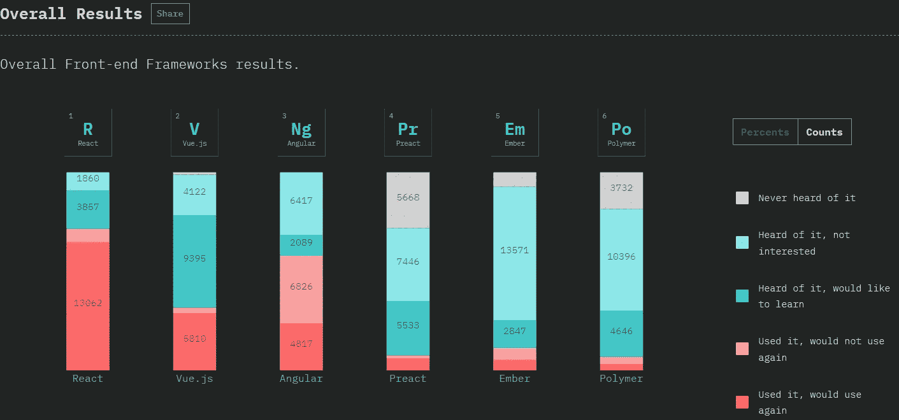
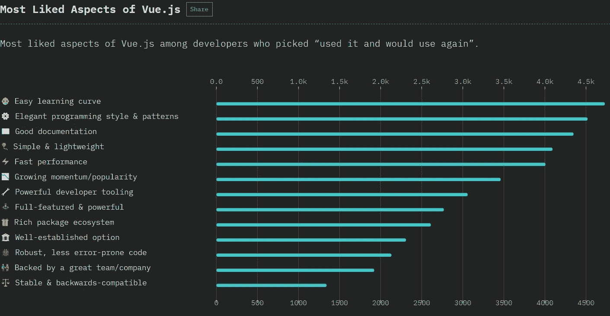

# 考虑 Vue？

> 原文：<https://levelup.gitconnected.com/considering-vue-35391cb270e4>

## 这篇文章讨论了你为什么要考虑使用 Vue 作为你下一个项目的前端框架

亚历山德拉·阿韦拉在 [Unsplash](https://unsplash.com?utm_source=medium&utm_medium=referral) 上的照片

目前，基于组件的 JavaScript 框架主导着前端开发。

截至目前，这个领域有三个主要参与者:Angular、React 和 Vue。

Vue 绝对是 Angular 和 React 这两家巨头的大卫——这两家公司得到了谷歌和脸书的支持——但是，就像古老的寓言一样，我怀疑 Vue 会战胜困难，在开发人员受欢迎程度和思想份额方面独占鳌头。

本文着眼于你可能考虑使用 Vue 作为下一个项目前端框架的一些原因。

# 进入门槛低

毫无疑问，这是你应该关注 Vue 的首要原因。Vue 是一个非常容易接近的框架。

开发人员不需要学习任何新的东西来开始使用它，组件被分解到他们自己的文件中易于理解的部分。

Vue 组件的示例

每个部分都是用 web 开发人员已经理解的语言编写的；模板是用 HTML 编写的，带有一些 Vue 特有的属性，组件逻辑是用 bog 标准的 JavaScript 编写的，样式是用 CSS 或任何你喜欢使用的预处理语言实现的，无论是 scss、less 还是 stylus 等等。

与其他框架不同，没有像 JSX 那样奇怪的语法需要学习，并且由于逻辑布局，定位组件的特定部分很容易。

组件的结构是公开的，不需要费力地通过大量的 JavaScript 渲染函数来找到您想要的内容。

有些人可能会认为“低门槛”意味着 Vue 不如 React 或 Angular 强大或有表现力，好像复杂性或令人兴奋的语言(如 JSX 或 TypeScript)的使用以某种方式增加了框架的有用性。但是他们错了。

首先，Vue 不局限于 Javascript 和 HTML，它也可以充分利用 TypeScript 或 JSX，只是它不是默认设置。

其次，React 和 Angular 的核心设计原则——电抗组件、单向数据流、状态管理等——也是 Vue 的核心。只是 Vue 有一个极其简单的 API 和一个奇妙的编译器，为使用它的开发者提供了一个简单易懂的界面。

Vue 开发很少“炫耀”,它直截了当、简单干净，正是这一点让它使用起来如此愉快。

# 增量采用

如果你已经完成了使遗留代码现代化的不值得羡慕的任务，你会喜欢这一点的！

JavaScript 已经出现了几次，它改变风格的次数比大卫·鲍依还多。

不用说，存在大量遗留代码，这些代码通常就像一团被小猫攻击过的线，用 jQuery 粘在一起。尽管把所有东西都打包并从头开始很有诱惑力，但这很少是个好主意。

Vue 是一个灵活的框架。它并不试图成为城堡之王，它相当乐于与其他代码混在一起，用不同的风格和不同的框架编写。

虽然你会失去一点代码清洁 Vue 可以像任何其他库一样使用。它不需要 Babel 或 Webpack 或任何类似的东西，它可以直接包含在 CDN 中，并局限于网站的一小部分，而不会干扰其他代码。

当然，从长远来看，这可能不是你想要的解决方案，但它是简化遗留代码现代化过程的垫脚石。

你不必一步到位地解决所有问题。你可以一点一点地引入 Vue，直到你的整个项目被转换，并且你正在使用现代 JavaScript 框架的所有功能。

# 简单反应性模型

反应式编程是 Vue js 的核心。

如果你之前没有接触过**反应式编程**，那么我强烈建议你去看看 rxjs——或者任何你喜欢的 rx 库。

但是，最简单地说，反应式编程关注的是创建数据位之间的依赖关系。

依赖关系可以很简单——只有一条链长——也可以很复杂，有许多相互链接的链。重要的是，当一个数据位发生变化时，依赖它的所有下游数据都会自动重新计算。

Vue 中的反应数据示例

上面的代码示例显示了 Vue 中一个非常简单的依赖树。计算值`sin`取决于属性`x`。每当`x`改变时——在这种情况下是响应按钮点击——自动重新计算`sin`值。注意，以这种方式编写的组件是完全声明性的；我们已经定义了**什么是** sin，而不是**如何**计算和更新它。

Vue 通过依赖关系树自动传播变更，通过监视树中的变更来判断何时需要重新计算一部分数据。

当 Vue 通过依赖关系树传播更改时，以编程方式触发的事件或当用户与界面中的小部件交互时触发的事件会导致一系列的效果。

最简单的形式是，在组件中定义的变量可以绑定到 UI 中的数据，建立双向绑定，编程更改反映在 UI 中，反之亦然。

但是反应会变得更有趣，特别是当您通过插槽、作用域插槽和 VueX 存储引入组件间通信时。

就我个人而言，我发现这种编程模式非常容易理解。很符合我的心智模式。其他人可能会发现另一种方法更令人满意，但我认为这绝对是 Vue 的优势之一。

# 状态管理

Vue 提供的用于管理组件状态和允许组件相互通信的现成工具对于大多数项目来说已经足够了。但是当一个项目变大，组件通信开始变得难以跟踪时，你可能需要更多的东西。

在 React 中，这就是像 Redux 这样的状态管理库发挥作用的地方。Vue 中的对应词是 VueX。

VueX 的设计和 Redux 很像。状态存储在 JavaScript 对象中，一旦向 Vue 注册，就与每个组件共享。状态对象是只读的，禁止直接突变。相反，被称为**动作**和**突变**的特殊对象被分派到 VueX，触发一个用户定义的函数来更新存储。

对于第一次接触 Vue 的人来说，动作和突变之间的区别常常是混淆的来源。但是区别并没有那么复杂。

动作就像异步突变——如果你以前遇到过 Redux-Thunk 插件，就想想它。它们不会自己改变状态，但可以进行任意数量的突变，这些突变将代表它们进行更新。基本上，它们是启动 Ajax 请求和通过基于承诺结果的突变来更新存储的好地方。

状态存储在单个位置的事实为您的应用程序提供了单一的真实来源——这在开发大型应用程序时非常有用。但是 VueX 的真正强大之处在于状态变化可以被跟踪，因为改变存储中状态的唯一方法是调度一个动作或变化对象。

就像 Redux 一样，这成为了一个真正强大的调试工具，因为您可以使用一种称为时间旅行的功能来倒回状态突变并跳转到以前的状态。

# 不断改进

Vue 是一个非常活跃的开源项目。它可能没有一个拥有小国资源的大型国际公司的支持——我实际上认为这是一件好事——但它肯定有一个庞大、坚定和非常活跃的社区推动它向前发展。

Vue 的最新版本(Vue 3)就在眼前，有一些非常令人兴奋的改进！

其中最大的——也是我个人最感兴趣的——是复合 API。这是一个**完全可选的**特性，为开发者抽象和组织组件特性增加了另一个工具。

根据我的经验，前端开发中最大的问题是从组件中抽象出通用的功能，这样它就可以在很多不同的地方重用。

就像其他大框架一样，Vue 已经有了几种方法来实现这一点，最著名的是 mixins 和 scoped slots，但是它们有一些限制，有时需要创造性的思维！

与 Vue 的其他部分保持一致，composition API 是这个问题的一个非常简单和干净的解决方案。解释它是如何工作的超出了本文的范围——我可以也可能应该用另一篇文章来介绍它——但是长话短说，组件增加了一个名为`setup`的新部分，它允许开发人员注册复合函数——遵循特定模式的普通旧 JavaScript 函数——它包含给定特性的所有反应变量和函数。

这很难公正地处理组合 API，所以如果你想了解更多，VueMastery 的人已经创建了一个非常有用的解释器视频。你可以在这里查看[。](https://www.youtube.com/watch?v=6HUjDKVn0e0)

# 招聘和培训

现在 Vue 背后有很大的动力，而且没有减速的迹象。

但是在组建团队方面，Vue 与其他两个框架相比如何呢？招募新开发人员和培训现有开发人员有多容易。

首先，让我们看看每个框架在开发人员社区中有多受欢迎。以下数据来自[Javascript 的状态— 2018](https://2018.stateofjs.com) 。

上图中有几件事非常突出:

1.  React 和 Angular 是开发人员社区使用最多的，被调查的开发人员中有 14，417 人(71.5%)使用过 React，有 11，643 人(57.7%)使用过 Angular，相比之下，Vue 只有 6，350 人(31.6%)使用过。考虑到 Vue 没有大公司的支持，并且是三个框架中最年轻的，这是意料之中的。
2.  与 Angular 相比，React 和 Vue 非常受欢迎。这个图表让 React 看起来比其他两个更受欢迎，因为使用和喜欢这个框架的开发人员区域——红色区域——要大得多。但这可能是对数据的误读。React 已经被更多的被调查开发者使用，所以粉色和红色区域的总和——代表使用该框架的开发者数量的区域——将总是大得多。衡量受欢迎程度的正确方法是通过比较想要继续使用框架的开发人员和不想使用框架的开发人员的比例。当我们计算时，我们发现 Vue 以 91.5%*(5810/6350)*的评分最受欢迎，React 以 90.6%*(13062/14417)*的评分紧随其后，Angular 以 41.4%*(4817/11643)的评分远远落后。*
3.  Vue 现在势头很猛。图中的两个蓝色区域表示听说过该框架但尚未使用它的人数。正如你所看到的，Vue 的蓝色区域比其他两个大得多。有趣的是，与那些对它不感兴趣的人相比，有多少开发者愿意使用它。同样，Vue 以 69.5% *(9，395/13，517)* 的兴趣评级高居榜首，React 以 67.5% *(3857/5，717)* 的兴趣评级紧随其后，而 Angular lags 以 24.6% *(2，089/8，506)* 的兴趣评级远远落后

这个数据表明，Vue 和 React 都是开发人员中非常受欢迎的框架，但目前使用 React 的开发人员远远多于 Vue。

这实际上是由热门招聘网站 Indeed 和 Monster 上的招聘数据证明的:

实际上很难获得就业市场的准确数据，我的 10 分钟研究也不是最科学的，但我认为结果仍然很有趣。

在这两个网站上，我使用了“Vue 开发人员”、“React 开发人员”和“Angular 开发人员”这三个术语，并计算了列出的工作数量。

**确实**Vue:1004
反应:4117
角度:3091

怪物
Vue: 88
反应:929
角度:720

数字很清楚。当谈到使用这些框架的公司数量和对它们的需求时，Vue 还没有出现，它是一个重要但小的参与者。

因此，如果开发人员喜欢使用 Vue，但目前使用它的开发人员相对较少，那么如何培训现有的开发人员呢？

这才是 Vue 真正闪光的地方！本文的第一部分谈到了开发人员使用 Vue 的容易程度。开发人员可以非常快速地使用 Vue。

这实际上也得到了 Javascript 数据状态的支持。

Vue 最受欢迎的四个方面是简单的学习曲线、优雅的编程风格、良好的文档和简单/轻量级。开发人员确实同意快速学习和精通很容易！

# 那么，你应该在你的下一个项目中使用 Vue 吗？

我想是的。

Vue 很容易上手，也很容易和其他框架一起使用。

采用 Vue 并不是一个巨大的风险，但有可能提高您的生产力，并为字体端开发实施经过测试的设计模式。

目前它可能没有最大的开发者心智份额，但它增长非常快，没有放缓的迹象。

# 关于作者

Oliver Winks 在 2015 年建立了[纸飞机软件](http://paperplane.software)，为他的客户制作丰富的网络和移动应用。

纸飞机软件专业从事 Scala 和 Vue.js 的全栈开发和软件培训。