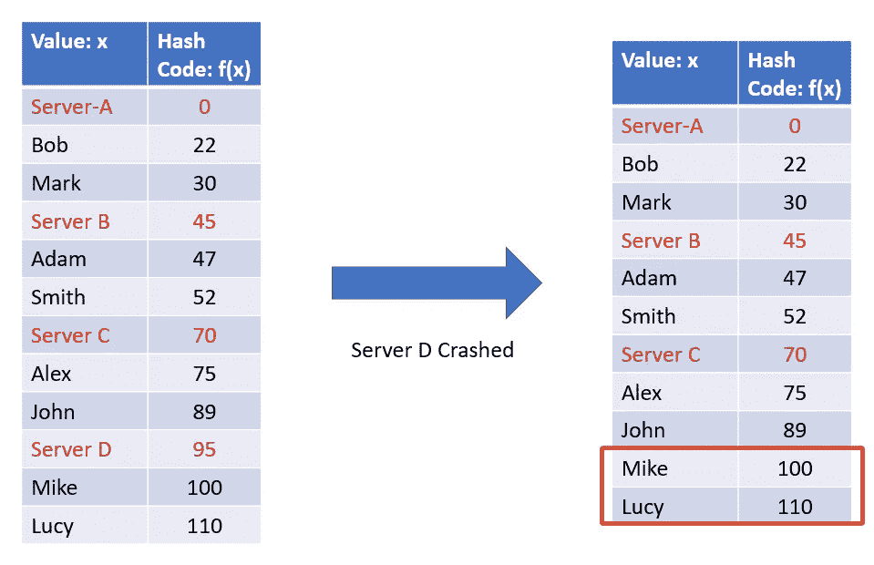
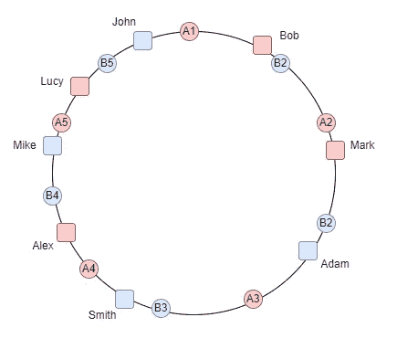

# 行动中的一致散列

> 原文：<https://levelup.gitconnected.com/consistent-hashing-in-action-e9637114f0d1>

在分布式系统中使用一致散列来保持散列表独立于可用服务器的数量，以在规模发生变化时最小化键的重新定位。

本文解释了一致散列，它是什么，以及为什么它是可伸缩分布式系统中的一个重要工具。

# 哈希是什么？

哈希是将一段数据(任意大小的对象)映射到另一段固定大小的数据(整数)的过程，称为*哈希代码*或简称为*哈希*。用于将对象映射到哈希代码的函数被称为*哈希函数*。

散列的例子

# 分布式系统中的散列

在各种程序、计算机或用户从多个服务器节点请求资源的场景中，我们需要一种机制来将请求均匀地映射到可用的服务器节点，从而确保负载平衡以获得一致的性能。

假设三台服务器分别是 A、B 和 C，每台服务器都有相同数量的密钥。如果我们需要存储一个新的密钥，我们可以做同样的事情，根据 ***server = f(x)% 3*** 的输出，将它存储在其中一个服务器中。

将对象分发到 3 个可用的服务器

# 重散列

集群的规模不断扩大和缩小是很常见的，而且在分布式系统中总是会出现意想不到的故障。我们不能保证服务器节点的数量保持不变。如果其中一个失败了呢？使用简单的散列方法，我们需要重新散列每个键，因为新的映射依赖于节点和内存位置的数量。

重新散列以匹配可用的服务器会影响所有的键。

具有简单再散列的分布式系统中的问题是状态存储在每个节点上。

> ***簇大小的微小变化可能导致簇中所有数据的重新排列*** 。随着集群大小的增长，这变得不可持续，因为每次散列变化所需的工作量随着集群大小线性增长。

这就是 ***一致散列*** 概念的由来。

# 什么是一致性哈希？

一致散列是一种分布式散列方案，通过在抽象圆或 ***散列环*** 上给它们分配一个位置，独立于分布式散列表中的服务器或对象的数量进行操作。这允许服务器和对象在不影响整个系统的情况下进行扩展。

假设我们将哈希代码范围映射到一个圆的边缘。这意味着最小可能的散列码将对应于零度角，最大可能的散列码将对应于 2𝝅弧度角(或 360 度)，并且所有其他散列值将线性地适合于两者之间的某个位置。所以，我们可以用一个键，计算它的散列，找出它在圆边上的位置。

例如，我们可以在 3 台服务器之间映射上述数据，如下所示:

# 添加或删除服务器时会发生什么？

一致散列的主要好处是可以动态地添加或删除任何服务器，并且只需要移动最小的对象集。

平均来说，它只需要移动 ***k/n*** 个对象，其中 *k* 是键的总数， *n* 是节点的总数。

> 这个属性被称为 ***单调性*** :当增加一个服务器时，对象只从旧服务器移动到新服务器；旧服务器之间没有不必要的移动*。*

*   **扩展过程:**当一个新的服务器被添加到集群中时，服务器散列被计算并被放置在散列环上。键被重新分配以重新分配负载，但是正如我们所看到的，只有最小数量的键被重新分配:

Mike 和 Lucy 现在从服务器 C 移动到新的服务器 D

下面的 gif 描述了在集群扩大的情况下密钥移动的过程:

当集群向上扩展时，一些密钥被重新分配给新的服务器。

*   **规模缩小或节点故障:**当服务器/节点发生故障时，只有属于该节点的密钥将被重新分配到哈希环上最近的可用服务器，而不会影响其他密钥/对象:

由于服务器 D 被移除，Mike 和 Lucy 现在被重新分配到服务器 c。

下面的 gif 描述了在集群缩小的情况下键移动的过程:

当一个节点关闭时，密钥被重新分配给最近的可用服务器。

# **在服务器间平均分配密钥**

在理想情况下，当有 ***k*** 个密钥和 **n** 个服务器时，每个服务器必须有接近 ***k/n*** 个密钥。因此，添加或删除一个节点最多可以影响系统中的 ***k/n*** 个键。为了确保接近理想分布，我们在系统中引入了 ***虚拟节点*** 。每个物理节点在哈希环上都有多个虚拟节点。

每个服务器有多个虚拟节点，以便在可用的服务器之间平均分配密钥。

# 结论

一致散列有几个广泛的应用。它用于分片、负载平衡等。它支持横向可伸缩性。它最大限度地减少了动态环境中的中断。

它在 Amazon 的 Dynamo DB 中用作分区组件。此外，Apache Cassandra 和 Voldermort 等开源应用程序使用它进行数据分区。

# 参考

*   [一致散列和随机树白皮书](https://github.com/papers-we-love/papers-we-love/blob/master/distributed_systems/consistent-hashing-and-random-trees.pdf)
*   [一致性哈希指南](https://www.toptal.com/big-data/consistent-hashing)
*   [一致的哈希解释](https://ably.com/blog/implementing-efficient-consistent-hashing)