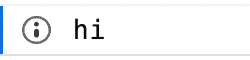
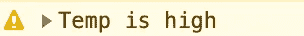
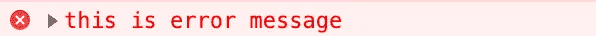
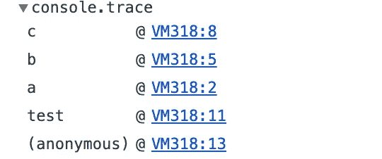
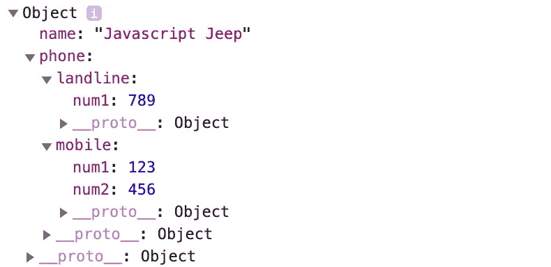
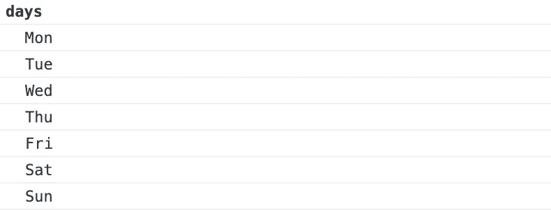
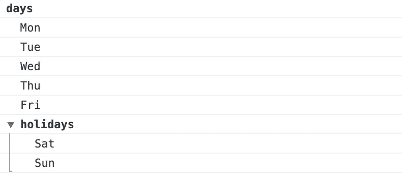
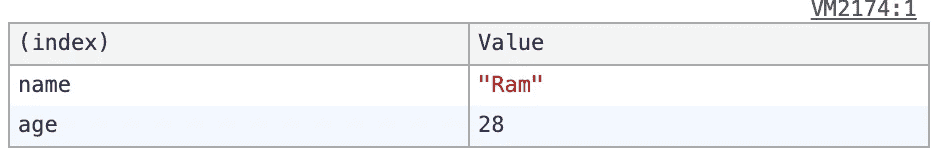
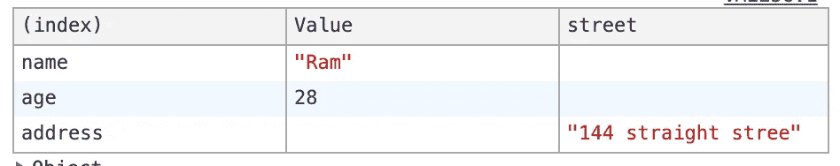

# JavaScript 开发人员的控制台备忘单

> 原文：<https://levelup.gitconnected.com/console-cheat-sheet-for-javascript-developers-21f0c49604d4>

## 了解如何有效地使用浏览器控制台进行调试


**图像由** [**伊利亚·巴甫洛夫**](https://unsplash.com/@ilyapavlov?utm_source=unsplash&utm_medium=referral&utm_content=creditCopyText) **从 Unsplash**

您可以使用以下命令打开控制台:

```
Chrome → Ctrl Shift J (on Windows) or Cmd Option J (on Mac)Safari → **Option-Cmd-C**
```

`**console**`对象提供对浏览器调试控制台的访问。全局范围内的控制台对象。

# **console.log(消息)**

将消息(变量)输出到 web 控制台。

```
**console.log("hello");**
hello**var a =10;
console.log(a);
10**var b = 20;
**console.log(a, b);**
10, 20// we can also evaluate expression 
console.log(**a+b**);
**30**console.log(`${a} + ${b} = ${a+b}`);
**10 + 20 = 30**var obj = {name : "Javascript Jeep"};
console.log(a, b, obj)
**10 20 {name: "Javascript Jeep"}**
```

# **console.clear()**

这将删除所有控制台消息和打印`Console was cleared`。

```
console.clear();
```

# console.assert(条件，失败消息)

`console.assert`方法是运行简单断言测试的一种简单方式。

```
var a = 10; console.assert(a === 10, "This will not be printed");console.assert(a != 10, "this will be printed", `a = ${a}`);
// **Assertion failed: this will be printed a = 10**
```

# console.count()

记录调用`count()`的次数。

```
function test() {
  console.count();
}test(); // default : 1 
test(); // default : 2
test(); // default : 3Example 2 :We can also use label to itfunction test(label) {
  console.count(label);
}test("Times"); // Times: 1
test("Num"); // Num: 1test("Times"); // Times: 2
test("Num"); // Num: 2test("Times"); // Times: 3
test("Num"); // Num: 3
```

# console.countReset()

重置计数器。这个函数有一个可选参数`label`。

```
console.count(); **default: 1** console.count(); **default: 2** console.count(); **default: 3****console.countReset()**console.count(); **default: 1**console.count("time"); time**: 1** console.count("time"); time**: 2** console.count("time"); time**: 3****console.countReset()**console.count("time"); time**: 1**
```

# console.log 的同级

# console.info()

将消息打印到控制台。

```
**console.info("this is a info");**
```

只有在 Firefox 中，控制台日志中的这些项目旁边会显示一个小的`**“i”**`图标。



除此之外，类似于`**console.log**` 的方法。

# console.warn()

向控制台输出警告消息。

```
console.warn("this is a warning ⚠️ ");**Example**let temp = 90;if(temp > 90) {

    console.warn("Temp is high");}
```

警告信息将以黄色背景打印。



# console.error()

向控制台输出错误消息。

```
console.error("this is error message");
```



# console.trace()

将当前函数的堆栈跟踪输出到控制台。

```
function a() {
   b();
}function b() {
   c() 
}function c() {
  console.trace()
}function test() {
  a();
}test()
```



# console.dir()

以一种很好的格式化方式打印出对象

```
var obj = {
   "phone" : { mobile : {
            num1 : 123,
            num2 : 456,
        },
    landline : {
            num1 : 789
        }
    },
    "name" : "Javascript Jeep"
}console.dir(obj);
```



# console.dirxml()

它打印出一个 DOM 元素的标记。

```
console.dirxml(document.body);// this will display body of the html element
```

# console.time(标签)和 console.timeEnd(标签)

我们可以用`console.time`启动一个定时器，然后用`console.endTime`结束它。通过使用这个，我们可以找到执行一个函数所花费的时间。

```
function a () { for(let i = 0 ;i < 10000; i ++) {
       // operation;
  }}console.time();
a();
console.timeEnd();  // **default: 0.18896484375ms**console.time("test");
a();
console.timeEnd("test"); // **test: 0.35302734375ms**
```

# 将控制台消息分组

```
console.group("days")
  console.log("Mon");
  console.log("Tue");
  console.log("Wed");
  console.log("Thu");
  console.log("Fri");
  console.log("Sat");
  console.log("Sun");
console.groupEnd("days")
```



我们可以分组

```
console.group("days")
   console.log("Mon");
   console.log("Tue");
   console.log("Wed");
   console.log("Thu");
   console.log("Fri");
   **console.group("holidays");
      console.log("Sat");
      console.log("Sun");
   console.groupEnd("holidays");**
console.groupEnd("days")
```



# 控制台.表(对象)

这会以表格格式打印对象

```
var user = { name : "Ram", age : 28

}
console.table(user);
```



```
var user2 = {
    name : "Ram",
    age : 28,
    address : {
      street : "144 straight stree"
    }
}
```



谢谢😊 🙏为了阅读📖。

关注我 [JavaScript Jeep🚙💨](https://medium.com/u/f9ffc26e7e69?source=post_page-----98efbae5e8aa----------------------)。

请在这里捐款。你捐款的 80%捐给了需要食物的人🥘。提前感谢。