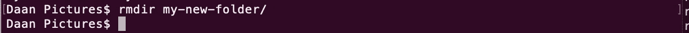

# 您应该知道如何使用的控制台命令

> 原文：<https://levelup.gitconnected.com/console-commands-that-you-should-know-how-to-use-f2b24a455394>


凯文·霍尔瓦特在 [Unsplash](https://unsplash.com?utm_source=medium&utm_medium=referral) 上拍摄的照片

## 通过了解航站楼周围的道路，提高工作效率

每一个现代的开发人员都试图不断改进和提高生产力。了解航站楼周围的路是更快完成工作的一种方式。您可以在终端中完成完全相同的工作，而不是使用鼠标在 GUI 中点击——但是速度更快。但是，这要求您对可以使用的控制台命令有所了解。

如果您正试图成为一名命令行忍者，但是还没有太多使用命令行的经验，那么这篇文章非常适合您。或者您只是想加深对终端中可用的各种命令的了解和理解。

让我们直接进入控制台命令列表，这些命令有望使您作为开发人员的生活更加轻松，并提高您的工作效率。

# 1.显示当前工作目录

`pwd`命令使你能够得到一些关于当前工作目录的上下文。`pwd`是*打印工作目录*的简称。该命令的输出将是当前目录的完整系统路径。

虽然`pwd`命令没有大多数命令那么多选项(因为它非常简单)，但它有忽略符号链接的选项。为此，您可以通过`-P`选项。


这是列表中最常用的命令之一，其次是下面两个命令。

# 2.激光唱片

您会发现自己经常使用的另一个命令是`cd`命令。`cd` 是*变更目录*的简称。顾名思义，这个命令允许你改变当前的工作目录。


也可以一次浏览多个目录级别。为了做到这一点，你必须指定完整的目录路径，你想去。

在下面的例子中，我们移动到位于`Downloads`文件夹内的`project`文件夹。


要转到父文件夹，您必须使用`..`。在下面的例子中，我们移动到位于`Downloads`文件夹中的`project`文件夹。当执行`cd ..`时，你会看到当前工作目录变成了`Downloads`文件夹。


在前面的例子中，你已经看到我用了很多次`~`。这是主目录。有趣的是，使用我们到目前为止已经学过的两个命令，您实际上可以看到到`~`文件夹的物理路径。


# 3.限位开关（Limit Switch）

下面的命令是`ls`，是*列表*的简称。该命令列出了目录中的所有文件。您可以指定要列出文件的目录。如果没有指定目录，则使用当前工作目录。


请注意，有一些非常有用的选项，您可以利用它们来提取更有价值的信息。例如`-a`选项。此选项允许您列出隐藏文件，即以点开头的文件。`-l`选项给你一个很长的列表，包括文件大小和权限等。

您也可以组合这些选项:

```
ls -al
```

# 4.cp & mv

`cp`命令是*复制*的简称。该命令允许您复制文件和目录。第一个文件或目录是源，第二个是目标。在下面的例子中，我们将图像移动到`Downloads`文件夹。


当复制一个目录时，你可以使用`-R`选项进行递归复制。请注意，这也包括隐藏文件。

有相当多的选择，当谈到复制文件和目录。例如，也可以将所有具有特定扩展名的文件复制到一个目录中。以下示例将所有扩展名为 jpg 的文件复制到`Downloads`文件夹。


除了`cp`命令，我们还有代表*移动*的`mv`命令。该命令用于移动文件和目录。其工作原理与`cp`命令相同。然而，它有一些不同的选项。例如，`mv`命令没有带-R。

要浏览所有可用于`mv`命令的选项，只需输入:

```
man mv
```

# 5.市场导向和触摸

为了创建目录，我们可以使用代表*的`mkdir`命令创建目录*。这个命令需要一个参数:新目录的名称。要验证命令是否成功执行，您可以使用`ls`命令。


创建文件就像创建目录一样简单。你需要使用`touch`命令而不是`mkdir`来创建一个新文件。


知道创建的文件是空的是件好事。同样，如果您想验证命令是否成功执行，请使用`ls`命令。

# 6.rmdir & rm

就像创建文件和目录有不同的命令一样，删除文件和目录也有两个不同的命令。

要删除一个目录，您可以使用`rmdir`命令，这是*删除目录*的缩写。但是，此命令只能删除空目录。



更强大的是`rm`命令。你可能已经猜到它是*去掉*的简称。`rm`命令删除指定的每个文件。虽然可以用这个命令删除目录，但默认情况下不会这样做。


当用`-r`选项执行`rm`时，它递归地删除匹配的目录、它们的子目录以及它们包含的所有文件。

为了忽略不存在的文件并且在删除前不被提示，您可以使用`-f`选项。


# 7.猫，尾巴和头

当谈到读取文件的内容时，你有几种选择。第一个选项是`cat`命令，是*连接*的缩写。尽管这个命令可以用于多种用途，但是它可以用来显示文件的内容。


注意，`cat`命令输出整个文件。还有一些用例，您只需要文件的第一个或最后一个 X 规则。为此，您可以使用`tail` en `head`命令。`tail`命令输出文件的最后 10 行，而`head`输出文件的前 10 行。


您可以使用`-n`选项指定想要输出多少行。这与`head`命令完全相同。


# 8.可做文件内的字符串查找

`grep`命令是*全局正则表达式打印*的简称，用于搜索文本。它将扫描文件中您想要检索的信息，并以您喜欢的格式显示结果。

让我们从一个非常基本的例子开始。我们有一个包含所有国家名称的文件。我们想检查单词`Netherlands`是否在国家列表中。注意，默认情况下，`grep`是区分大小写的。

我们传递的第一个参数是我们要查找的单词，第二个参数是我们要搜索的文件。


要进行不区分大小写的搜索，您可以使用`-i`选项。这样，无论你是在寻找“贝尔”、“贝尔”还是“贝尔”，都没有关系。


注意，在上面的例子中，我们看到`grep`将整个匹配行输出到终端。使用`-c`选项可以打印匹配行的数量。


# 9.发现

列表中的最后一个命令是`find`命令，它可以让您快速查找文件或目录。假设我们查找当前目录中的所有 CSS 文件。我们可以使用`find`命令来完成这个任务。


注意，`find`命令也搜索所有子目录。

# 包装东西

现在我们已经浏览了整个列表，我希望您在使用终端时加深了自己的知识。你可能学到了一两件事，或者你甚至学到了一个你从未见过的命令。

如果你认为这个列表中缺少了一个命令，或者你只是在这个列表中添加了一个很棒的命令，请告诉我。

感谢阅读！