# JavaScript 中的控制台对象方法

> 原文：<https://levelup.gitconnected.com/console-object-methods-in-javascript-2ceae5913970>

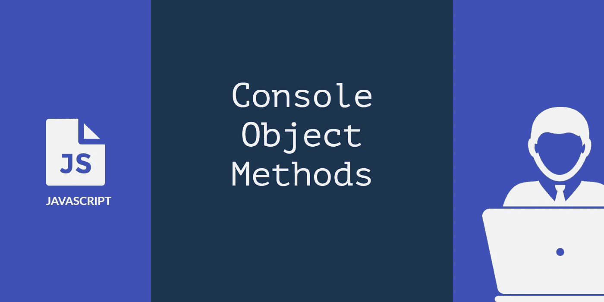

JavaScript 中的 console 对象提供了对浏览器调试控制台的访问。它用于调试和记录结果或错误。它是一个全局对象，可以用`window.console`或仅用`console`来访问。本页末尾有一个演示。

**如何打开 Web 控制台？**

按`CTRL + SHIFT + J`打开控制台，或者在 mac 上按`CMD + OPTION + J`

**控制台对象方法**

1.  `**console.log()**`

这是最常用的向控制台输出消息的控制台方法。

示例:

```
console.log('Hello there!')
```

输出:

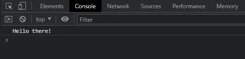

2.`**console.info()**`

此方法将信息性消息输出到控制台。

示例:

```
console.info('This is great.');
```

输出:

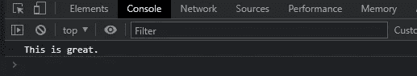

3.`**console.error()**`

此方法向控制台输出错误信息。错误信息将以*红色*突出显示。

示例:

```
 console.error('Oops! Something went wrong.');
```

输出:

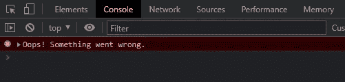

4.`**console.warn()**`

此方法向控制台输出警告消息。警告信息将以黄色突出显示。

示例:

```
 console.warn('This is just a warning.');
```

输出:

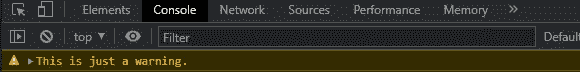

5.`**console.assert()**`

如果断言为`false`，该方法将向控制台写入一条错误消息。如果是`true`，则控制台中不会显示任何内容。

示例:

```
console.assert(false, "Statement is false");
console.assert(1 > 2, "1 > 2");
console.assert(1 === 1, "1 === 1"); //nothing is consoled when true
```

输出:

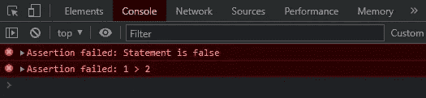

6.`**console.group()**`

此方法在一个单独的块中输出消息，该块将被缩进。您可以使用`console.groupEnd()`退出当前组。

示例:

```
console.group("Fruits");
  console.info("Apple");
  console.info("Banana");
  console.error("Cat");
console.groupEnd("Fruits")
```

输出:

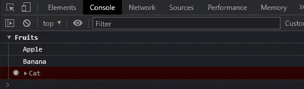

7.`**console.table()**`

此方法将数据输出为表格。输入必须是以表格形式显示的数组或对象。

示例:

```
 console.table({ 'a': 1, 'b': 2 });
```

输出:

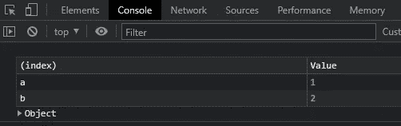

8.`**console.dir()**`

这个方法输出一个指定对象的所有属性的交互列表。

示例:

```
console.dir({ 'a': { a1: 1 }, 'b': 2 });
console.dir(document.location)
```

输出:

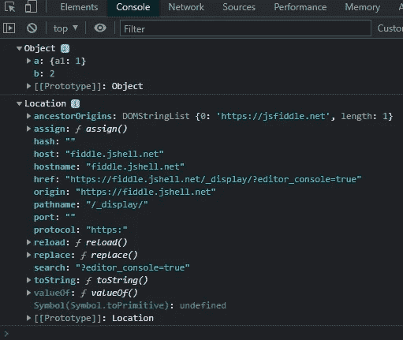

9.`**console.clear()**`

此方法清除控制台。

示例:

```
console.clear()
```

输出:

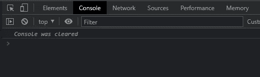

10.`**console.count()**`

此方法输出使用给定标签调用此方法的次数。

示例:

```
for (let i = 0; i < 5; i++) {
    console.count("count i");
  }
```

输出:

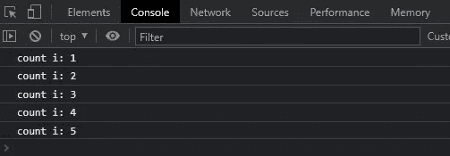

11.`**console.countReset()**`

此方法使用给定标签重置计数器的值。

示例:

```
for (let i = 0; i < 10; i++) {
  console.count("count i");
  if (i === 5) {
    console.log("Reseting count")
    console.countReset("count i")
  }
}
```

输出:

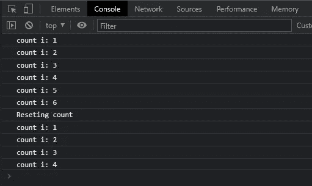

12.`**console.time()**`

这个方法以名称作为输入参数启动一个计时器。

示例:

```
console.time('loop');
  for (let i = 0; i < 500; i++) { }
console.timeEnd('loop');
```

输出:

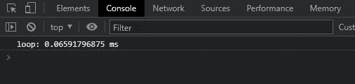

13.`**console.timeEnd()**`

此方法停止指定的计时器，并输出它启动后经过的时间(以毫秒为单位)。

14.`**console.trace()**`

此方法输出堆栈跟踪。

示例:

```
function first() {
  function second() {
    console.trace();
  }
  second();
}

first();
```

输出:

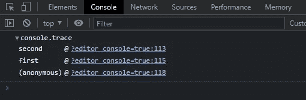

15.`**console.debug()**`

此方法输出带有日志级调试的消息。

示例:

```
let obj = { 'a': 1, 'b': 2 }
  console.debug(obj)
```

输出:

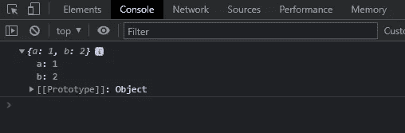

16.**定制风格**

我们通常使用控制台来记录文本或其他数据。您可以使用`%c`指令将 CSS 样式应用于控制台输出。

示例:

```
const spacing = '5px';
const styles = 
        `padding: ${spacing}; background-color: rgb(100,21,255); color: white; 
         font-size: 16px;`;
console.log('%cMake sure you click the clap button and follow me! 😁', styles);
```

输出:

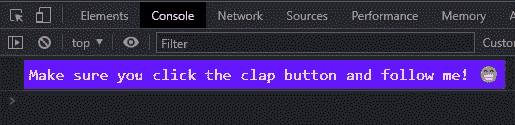

## **演示**

编码快乐！

我们感谢您阅读这篇文章。如果你喜欢我的文章，但不是 Medium 的会员，你可以注册一个 [Medium 会员](https://sagar-shrestha.medium.com/membership)来无限制地访问所有内容并支持我们作为作家。

[](https://sagar-shrestha.medium.com/membership) [## 加入我的推荐链接-萨加尔 Shrestha 媒体

### 阅读 Sagar Shrestha(以及媒体上成千上万的其他作家)的每一个故事。您的会员费直接支持…

sagar-shrestha.medium.com](https://sagar-shrestha.medium.com/membership)