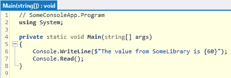

# 幕后的 Const

> 原文：<https://levelup.gitconnected.com/const-behind-the-scenes-53ea6c1c1964>

## 看看常量在。NET 框架

由[费利克斯](https://unsplash.com/@grisu48)在 [Unsplash](https://unsplash.com/photos/Au8KMj4JBDo) 上拍摄的照片

# const 是什么？

当变量被标记为`const`时，其值不能改变。

例如`const int BoilingTempCelcius = 100;`

一个常量在编译时必须是可确定的，这意味着只有原始类型(`bool`、`int`、`long`、`string`等)才能被标记为常量。

但是，如果将值设置为 null，C#允许您将非基元类型声明为`const`:

`const SomeComplexType x = null;`

# 从库中引用一个常量

让我们来看看当从类库中引用`const`时可能发生的一些奇怪的事情。

## 这些项目

创建新的。NET Framework 控制台应用程序项目，名为 SomeConsoleApp，并将类库添加到名为 SomeLibrary 的解决方案中:

控制台应用程序和类库使用。净 4.7.2

您的控制台应用程序的 Program.cs 类应包含以下代码:

在 SomeLibrary 项目中创建一个名为 SomeClass 的类，并粘贴以下代码:

## 运行应用程序

构建解决方案，然后运行 SomeConsoleApp.exe，这可以在`<your project root folder>\SomeConsoleApp\SomeConsoleApp\bin\Debug`中找到。

正如你所料，我们可以看到 60 的价值通过。

## 更新和构建

现在将 SomeClass.cs 中的值从 60 更新为 70，保存该文件并在解决方案资源管理器中右键单击 SomeLibrary，然后单击 Build。

## 重新运行应用程序

如果您再次运行 SomeConsoleApp.exe，您会注意到值没有改变:

这似乎不太直观，因为我们已经在控制台应用程序中引用了`SomeClass.SomeConst`，并且我们已经重新构建了发生变化的项目，这是一个库。

## 删除引用

让我们看看如果删除项目引用会发生什么。

转到`<your project root folder>\SomeConsoleApp\SomeConsoleApp\bin\Debug`并删除 SomeLibrary.dll:

## 重新运行应用程序

如果您再次运行 SomeConsoleApp.exe，您会注意到该值仍然显示！

## 这是怎么回事？

在编译期间，`SomeClass.SomeConst`的值直接嵌入 CIL 码中:

第 13 行显示了硬编码的值 60(来自 ILSpy 的截图)

在第 13 行，您可以看到`SomeClass.SomeConst`参考值已经被实际值 60 取代。

下面是基于 CIL 生成的 C#代码:

显示硬编码 60 的 C#代码(来自 ILSpy 的截图)

编译器基本上是找到代码中引用`const`的地方，直接用值替换它。

如果希望该值更新为 70，则需要重新编译 SomeConsoleApp。

# 有趣的事实

`const`值的这种直接嵌入导致了一些有趣的事实:

*   您不能在带有`const`声明的行上放置断点(因为该行在执行过程中实际上并不存在)。
*   常量不需要在运行时为它们分配任何内存。
*   你不能得到一个常数的地址。
*   不能通过引用传递常数。

# 关于。NET 5.0？

如果您使用。NET 5.0，并运行 SomeConsoleApp.exe，您会得到这个错误(要查看这个错误，您需要打开。exe 通过 cmd):

这是因为。NET 5.0 会在`\SomeLibrary\SomeConsoleApp\bin\Debug\net5.0`文件夹中生成一个名为 SomeConsoleApp.deps.json 的文件:

显示 SomeConsoleApp.deps.json

该文件如下所示:

对某库的引用

如您所见，该文件包含对某个库的引用。

为了运行 SomeConsoleApp.deps.json，您需要删除或重命名 someconseleapp . deps . JSON

# 摘要

由于常数的工作方式，以及可能出现的跨程序集版本问题，所以只对永远不会改变的值使用它们是很重要的。

# 资源

 [## CLR via C#，第四版

### 深入挖掘并掌握公共语言运行库、C#和。网络开发。由编程专家领导…

www.oreilly.com](https://www.oreilly.com/library/view/clr-via-c/9780735668737/)