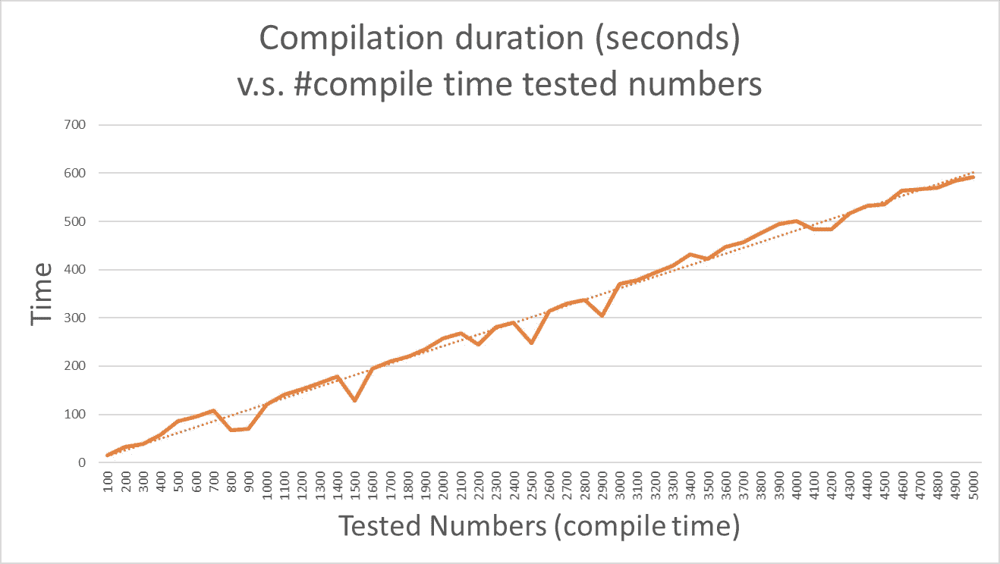

# constexpr 所有的东西！(但要温柔)

> 原文：<https://levelup.gitconnected.com/constexpr-all-the-things-but-gently-f567a8b93603>

## 将金属变成黄金的技术是众所周知的。但是在 C++运行时转化中隐藏着什么秘密呢？⁰

凯文·Ku 在 [Unsplash](https://unsplash.com?utm_source=medium&utm_medium=referral) 上的照片

# 介绍

C++11 把 C++带到了现代。那是非常混乱的时期。“右值”可以被定义为变量，decltype 和 auto 看起来是一样的，编译时执行看起来像是一个神奇的特性。

***constexpr*** 是一个修饰符，允许将函数和变量标记为编译时执行的可能候选者。类似于内联，这只是一个提示。

规则很简单:编写一个 *constexpr* 友好的函数，任何使用[常量表达式](https://en.cppreference.com/w/cpp/language/constant_expression#:~:text=%5Bedit%5D%20Core%20constant%20expressions&text=an%20expression%20whose%20evaluation%20leads,outside%20array%20bounds%2C%20etc).)的 *constexpr* 函数调用将在编译时被替换为二进制的计算结果。
否则，它将像任何其他正常函数一样被调用——在运行时。

## 好的…那真的是新的吗？

这个概念并不是全新的。即使在 C 语言中，编译器为了函数优化、消除函数调用或冗余代码而进行某种类型的[常量传播](https://en.wikipedia.org/wiki/Constant_folding)也是很常见的。但是有一些微妙的区别:

*   *constexpr* 声明是开发者显式的，优化不是。检测某些代码是否经过优化可能不是一件容易的事情。
*   常量传播仅在设置了编译器优化时发生，但是 *constexpr* 将“优化”代码，即使没有指定任何优化。
*   *constexpr* 执行计算代码，常量传播不计算。
*   即使函数的所有调用都被优化，非 *constexpr* 函数仍将保留在程序集中，并增加二进制文件的大小。

(注意:不用说，常量传播只是编译器代码优化集的一小部分)

## 但是模板元编程呢？

除了常量传播，模板元编程(TMP)也是一种将运行时计算转移到编译时的方法。TMP 有其良好的实践，但是对于普通的 C++开发人员来说，TMP 不是一个直观的工具。这很容易被滥用，而且在任何情况下——编写相同的代码在编译期**和运行期**运行是不可能的。

与 TMP 不同，一旦函数被声明为 *constexpr* ，求值时间就取决于调用方的位置。而且更容易调试:只需移除 *constexpr* 修饰符并重新编译。

到目前为止，这听起来相当惊人。

不会出错的，对吧？(图片来自 [makememe](https://makeameme.org/meme/just-perfect-5ae9cd) )

# **测试用例场景**

我对 constexpr 的实验是在做了一个名为[“快乐数字”](https://leetcode.com/problems/happy-number/)的练习后开始的。在这个练习中，开发人员必须确定输入的数字是否令人满意。他们需要取一个数，把它分解成几个数字，然后对它们的平方求和。例如，123 将变成 1 +2 +3 =14。对结果重复这个过程，直到它要么收敛到 1(快乐)，要么发散成一个无限循环(不快乐)。

该算法测试从 1 到 4 字节无符号整数的平方数字之和的最大结果的所有数字的幸福度。一旦考虑到这一点，任何输入数字的快乐都可以在 O(1)中返回。

再读一遍最后一段:很明显，预处理可以得到 O(1)解。

# **编译和运行时间世界…联合起来！**

此时，任何真正的开发人员都会将初始化的缓存(isHappyArray)用作..一个贮藏处..接下来的电话。我跳过了这一部分。亲爱的读者们，我向你们保证，我是一个真正的开发者，但是我想让它成为一个 constexpr，并且在运行时不再担心它。
为什么不？我的代码是用我的测试模块编译的，充满了常量表达式。因此，一旦编译完成，程序实际上就通过了验证。

唉，这不编译

但是这段代码有个问题: *set < int >* 不能用在 *constexpr* 上下文中。容器集没有 *constexpr* 构造函数/析构函数来支持编译时的内存分配/释放。

让我们从好消息开始:与常量传播不同，编译器会通知您代码是否能够在编译时运行。

坏消息是:标准库中很少元素支持 *constexpr* 上下文。(更多坏消息:分配的编译时内存不会传播到运行时)

在这个尝试中，我们注意到“编写一次，在任何地方执行”的原则远非完美。即使在今天，运行使用智能数据结构的复杂代码也是不可能的。这在某种程度上是固定的:在标准中支持在 *constexpr* 上下文(即 GCC 10)中的 *new* 操作符的支持下分配可变大小的 C 数组。然而，大多数可变大小的集装箱仍然没有出现。

## 让我们妥协吧

但是在我们的例子中，我们可以牺牲一些可读性和效率来获得 constexpr 的好处。*集合<int>可以用一个大小为 15 的 *std::array* 代替。找出 15 是一个简单的二分搜索法试错法。
然而，事实上我必须找出每个快乐数字候选的最大迭代次数，这是没有可变大小容器的缺点。*

修改后的代码如下所示(注意第 13 行的注释):

这种算法现在效率较低:查找以前处理过的号码的复杂性增加了。现在不只是查询一个集合，而是需要遍历一个小数组。幸运的是，这个数组最多有 15 次迭代。
但是在运行时它仍然相对较快，并且仍然可以在编译时进行评估！

不幸的是，这正是我们新关注的地方:编译时间。

作者图片

# **没有留下任何不确定的机会**

在我们理解编译时的问题之前，我们需要解决一个公开的问题。

我们仍然需要理解 C++在编译期间是如何执行代码的。在编译的任何阶段，编译过程都不会派生出子进程，而且这也不是一个选项，首先:你考虑过交叉编译会发生什么吗？

结论是我们的编译器不评估 *constexpr* 调用:那是一个不同的模块，叫做**常量评估器**。

任何在编译时评估的代码必须保证与运行时相同的结果。我不知道是否有可能根据编译器实现的 C++规范的子集来调整两个模块的预期行为。即使规范可能没有涵盖 UBs 的行为(未定义的行为)。根据定义，编译器实现者可以在那些情况下做他们认为合适的事情。同一个编译器在不同的编译环境(flags，platform)中甚至可能在 UB 中表现不同。对我来说，将常量评估器与 UB 对齐似乎太棘手了，难以实现。

这至少是我能给出的理由，为什么标准规定任何 *constexpr* 都不应该包含 UBs:

> (5.7)-具有未定义行为的运算…[注:例如，包括有符号整数溢出(7.2)、特定指针运算(7.6.6)、除以零(7.6.5)或特定移位运算(7.6.7) ]

有了这个希望，在常量求值器中运行的下一个结论是不可避免的:编译时求值比运行时执行慢(就像语言解释器比编译器慢得多一样)。

但是 degree⁴凭什么呢？

# **时间和时空权衡定理**

回到我们的例子，我喜欢一个可以在同一步骤中编译和测试的程序。来实际拥有一个**编译过的**程序== **验证过的**程序。

程序接受一个整数，并返回它是否快乐。为了测试我们的代码，我们需要根据实际结果测试尽可能多的数字。

这只是一个数量的问题。我们可以将多少测试委托给编译时？

为了回答这个问题，程序的构建时间(以秒为单位)被测量为编译时处理的数字数量的函数。

考虑那些运行时执行 5000 个数的构建时间(+写入标准输出结果):**低于 500ms。**

编译时间评估非常耗时。从这里唯一可以得出的结论是，将代码推迟到编译的决定应该基于:

1.  该代码中浪费的 CPU 周期数。
2.  这段代码被调用的频率。
3.  整个程序的生命周期。就像内存泄漏一样，在短命的程序中有效是不值得的。

请注意，较长的编译时间并不是无价的。它们有益于运行时——但是可能会在其他方面加重您的组织的负担:资源、更长的测试周期、整体糟糕的开发人员体验

以及办公室厨房咖啡消耗率的提高(credits [**xkcd**](https://xkcd.com/303/) )

既然 *constexpr* 的弊端已经很清楚了，那么我们就可以客观地陈述一下 *constexpr* 有哪些好的做法了(在笔者看来)。

# **那么，它对什么有好处呢？**

1.  应用“智能”常数传播，不使用代码优化，并消除运行时繁重的常数计算(无新意)
2.  受益于 [**记忆**](https://www.geeksforgeeks.org/memoization-1d-2d-and-3d/) 的优化代码
3.  作为一个基本的质量关口:您可能无法将所有的模块测试迁移到编译时，但是如果额外的成本可以忽略不计，您应该考虑包括非常基本的健全性测试

# 还有什么可以更好的？

## **允许 Constexpr 复杂初始化**

回想一下在“HappyNumber”场景中，每次为每个输入数字重新创建“缓存的”结果数组。这样做是为了展示编译时和运行时的计算速度差异。不幸的是，没有简单的方法在编译时跨调用使用这个缓存。

您可能希望这样的代码看起来像这样:

这个代码块与我们之前的代码块相同，只是将`isHappyArr` 作为静态代码，并将`isHappyArray[MAX_HAPPY_RESULT]`单元用作简单的初始化标志。
但是这段代码不能编译: *constexpr* 上下文不允许使用静态变量。此外， *constexpr* 实际上是一个“const ”,在声明之后——不能被修改。
唯一可能的初始化是预先计算缓存并将其硬编码到一个变量中。不是一个非常友好的解决方案。

## 开发人员控制从编译时到运行时的内存传播

即使在编译时可以重用缓存(如(1)中所建议的)，运行时仍然需要运行一次来创建自己的缓存。运行时只能使用编译时的原语。允许开发人员明确在编译时应该在数据段中存储什么可能是一个非常方便的工具(但可能会导致编译单元臃肿)。

照片由[蒂莫西·梅恩伯格](https://unsplash.com/@timothymeinberg?utm_source=unsplash&utm_medium=referral&utm_content=creditCopyText)在 [Unsplash](https://unsplash.com/s/photos/cat?utm_source=unsplash&utm_medium=referral&utm_content=creditCopyText) 上拍摄

非常感谢您的阅读。欢迎留下你的评论，分享 constexpr 的经验！

## **资源/脚注**

[0]标题基于 CppCon 2017 中著名的[本·迪恩&杰森·特鲁纳谈话](https://www.youtube.com/watch?v=PJwd4JLYJJY)。另一个古怪的旁注和剧透:FMA 等价交换定律在运行时不适用于编译转化，正如本文将要展示的。

[1]老实说，这更像是一个工具问题。

[2]这里的折衷可能不是性能而是可读性。正如有人正确指出的，缓存局部性(支持矢量化？)操作可能比查询集合产生更好的性能。

[3]借用《C++中 constexpr 的设计与演化》中的术语
[[https://pvs-studio.com/en/blog/posts/cpp/0909/](https://pvs-studio.com/en/blog/posts/cpp/0909/)]。
进一步阅读的推荐材料。

[4]这可能不是真的——当执行受益于****的问题时，解释器可以相对高效。**在给定的 HappyNumber 示例中，这样的优化是不可能的。不管怎样，一个写得好的使用记忆化的运行时代码会快几倍。**

**[5]我所从事的产品，其最终应用程序是通过将数百个静态库链接在一起而实现的。在这些情况下，测试一个特性所需的全部工作，一些非常简单的事情，可能需要几个小时而不是几秒钟。如果静态库足够小，编译时测试甚至可以取代大多数单元测试。
其次，考虑添加非常简单的功能(例如，防止溢出或强制最大/最小值)的情况，该功能只能在几乎无法再现的边缘情况下进行测试。您可以只用几行代码编写函数依赖关系，而不是强制运行时在某种程度上复制行为。**