# Spring Boot 微服务中的约束验证

> 原文：<https://levelup.gitconnected.com/constraint-validation-in-spring-boot-microservices-b89805e9c540>

[马克斯·魏斯贝克尔在 Unsplash 上拍摄的照片](https://unsplash.com/@maxweisbecker)

## 通过 Java 注释验证请求的轻量级介绍

在微服务架构中，服务可能接受几个(如果不是很多)相同的输入。这种模式很容易导致服务之间的代码重复和冗余。为了减少这些缺点并保持服务代码集中，我们可以设计一个健壮的解决方案，包括 Spring 和 Java 提供的几个 API。

> *下面的教程将假设一些 Java 和 Spring Boot 的工作知识，但是将迎合一系列的技能水平。不管怎样，看看其他开发人员的代码也无妨！*

# 背景

我们的解决方案将涉及到结合 Java 和 Spring Boot API，分别是`ConstraintValidator`和`ResponseEntityExceptionHandler`。

作为 [JSR 380](https://jcp.org/en/jsr/detail?id=380) 的一部分得到增强的 [Hibernate Validator](http://hibernate.org/validator/) ，是标准 [Bean 验证](https://beanvalidation.org/)的 Java API 规范。在 Spring Boot 应用程序的上下文中，您可能会不假思索地使用它。例子包括:

*   `@NotNull`
*   `@Min`
*   `@Max`
*   `@Pattern`
*   `@Past`
*   `@Email`
*   `@PositiveOrZero`

在本教程中，我们将研究如何使用`ConstraintValidator`接口定义我们自己的约束集来超越这些基本验证。

虽然 Spring 生态系统中存在其他形式的异常处理，但是`ResponseEntityExceptionHandler`在服务中提供了全局(和集中)的异常处理。这种全球化对于我们的定制约束注释的有效性至关重要，因为它允许我们验证多个 Beans(或其中的字段)。也就是说，我们将研究如何利用这个类来优雅地处理违反约束的情况。

# 履行

让我们开始吧。为了避免用样板代码膨胀教程，您将在下面的部分中只找到必要的代码块。本文附有一个关于 [GitHub](https://github.com/Verley93/annotation-validation) 的工作示例。

注意:我将在整个教程中引用这个示例项目。

# 属国

这份清单简短而甜蜜:

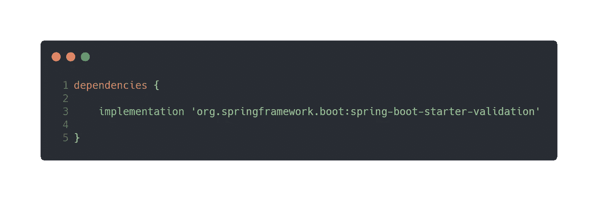

# 创建注释

我们从简单的开始。假设我们已经实现了一个*冰箱*和*餐具室服务*，它允许我们:

*   管理冰箱和食品储藏室
*   接受带有 JSON 有效负载的 POST 和/或 PUT 请求

我们希望验证两个服务的请求模型之间的公共字段。我们的请求模型可能如下所示:

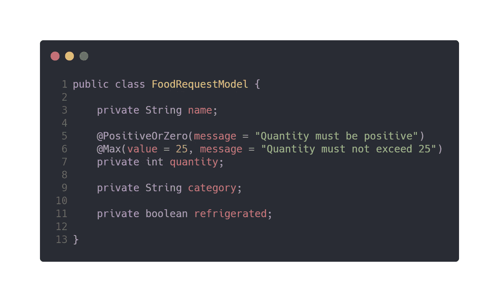

我们可以构建的一个最简单的约束包括组合现有的约束，比如上面例子中的`@PositiveOrZero`和`@Max`。这使得我们可以给常见的约束贴上一个明确的标签，称之为“业务逻辑”。下面，我们定义`@FoodQuantity`:

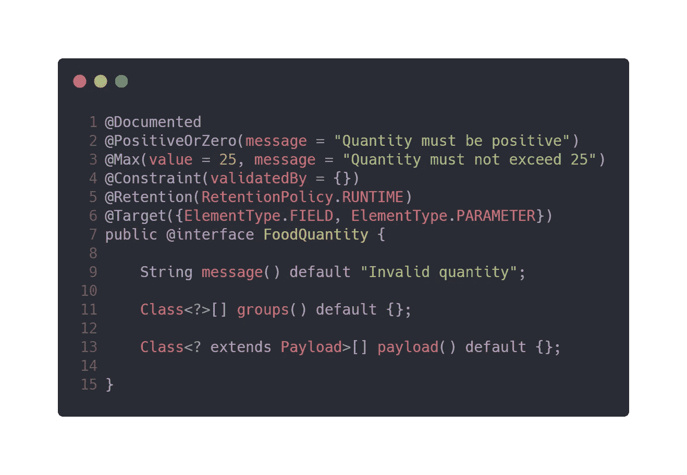

这里发生了很多事情，让我们来分解一下:

*   `@Constraint`将注释标记为 Bean 验证约束，并允许我们指定`ConstraintValidator`实现；这里欢迎零个、一个或多个实现
*   `@Retention`被设置为在运行时保留我们的注释
*   `@Target`的设置使得我们可以验证不同类型的服务输入
*   `message`、`groups`和`payload`是`@Constraint`所必需的，但不是必须设置的——它们提供了超出我们今天讨论范围的特性

这绝不是一种简化。抛开冗长的内容，注释打开了几扇门，使得处理复杂性变得轻而易举，我们将在下一个例子中看到。

让我们为*类别*字段定义一个约束，如下所示:

*   必须传递类别，并且类别不能为空
*   只允许通过某些类别
*   *冰箱*和*茶水间*服务的类别可能不同

为了实现这个注释，我们将在第一个注释的前提上进行扩展，添加一个自定义参数并提供一个`ConstraintValidator`接口的实现。结果看起来像这样:

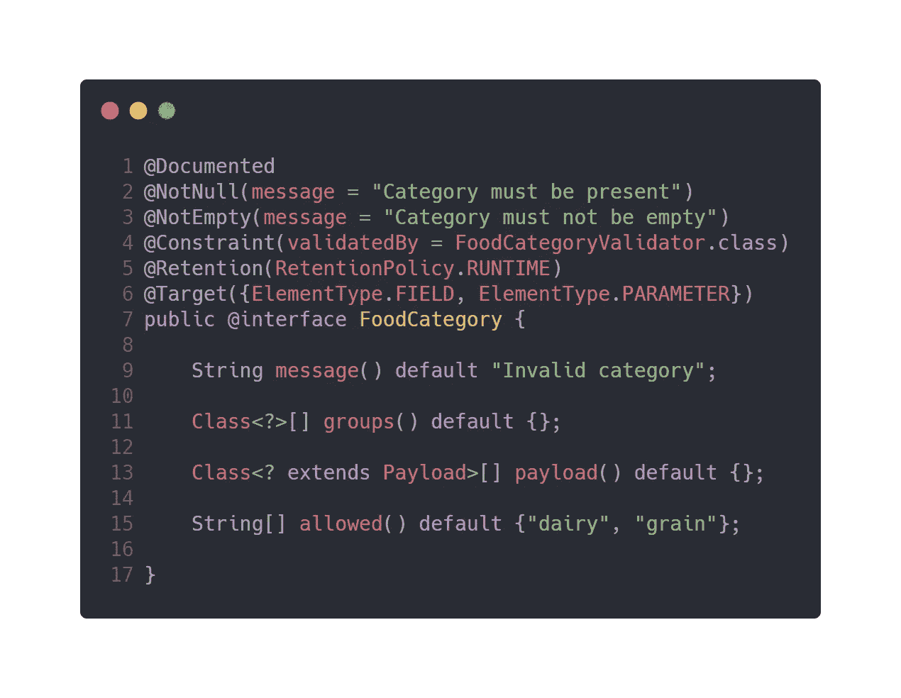

与`@FoodQuantity`相比，这个注释中发生了更多的事情。我们已经指定了一个新的参数`allowed`，来限制传递给`category`的内容。注意默认值——只有当值没有传入`@FoodCategory`时，这个数组才会被引用。为了处理这个约束，我们实现了`FoodCategoryValidator`:

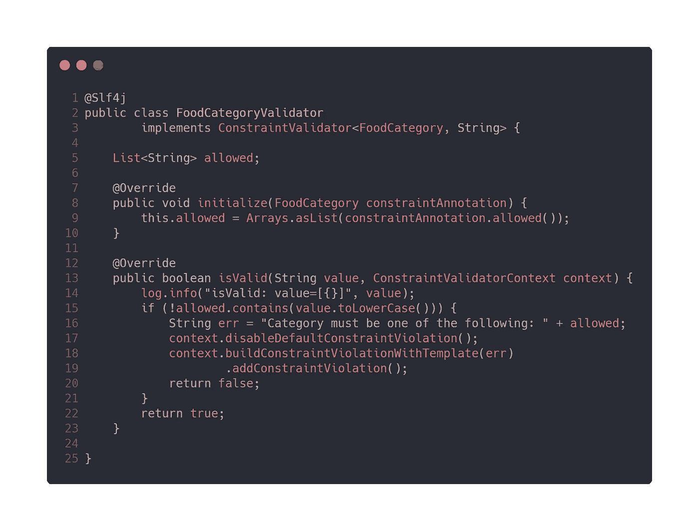

让我们分解一下新的验证器类:

*   `ConstraintValidator`被注释类和被验证的类型参数化—一个包含 ***类别*** 的值的`String`
*   一个全局字段`allowed`，在被覆盖的`initialize`方法中设置；正是在这个方法中，我们获得了在整个验证器类中使用的`@FoodCategory`的参数
*   `isValid`是我们约束验证的核心
*   对于无效的场景，我们禁用默认的约束违反，构建适当的错误消息，并返回 false——这最终会抛出一个我们稍后会感兴趣的异常

最后，为了充分利用我们的注释，我们将 category 字段传播到与每个服务相关的两个子类中。

经过我们所有的努力，我们已经达到了一个干净的请求模型集，准备好接受无效值的轰炸:

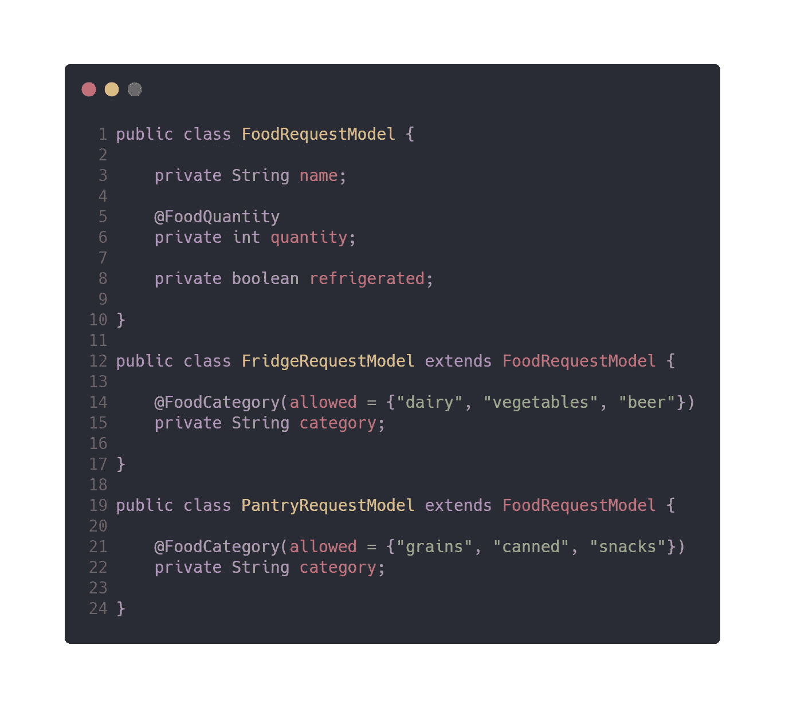

# 处理验证错误

到目前为止，我们只定义了我们(和我们的消费者)必须遵守的约束。让我们打开一个端点，允许将食物添加到冰箱中，并测试我们的约束:

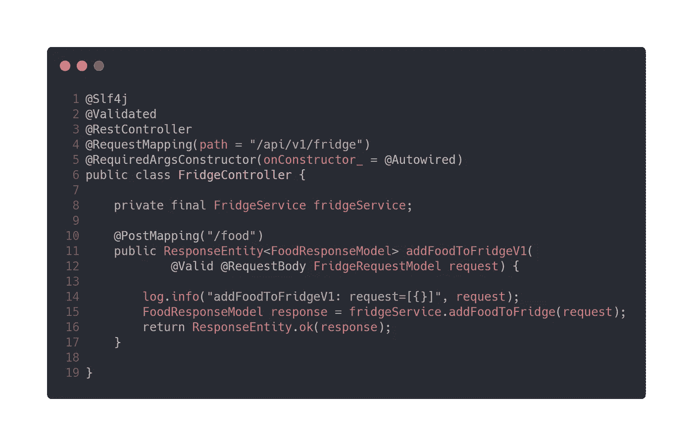

要使我们的注释正常工作，有几个关键方面需要注意:

*   `@Validated`必须在*类*或*方法*级别使用，以指示需要进行验证的位置
*   `@Valid`用于标记一个*属性*用于验证级联，这触发了我们的约束

让我们发送一个有效载荷:

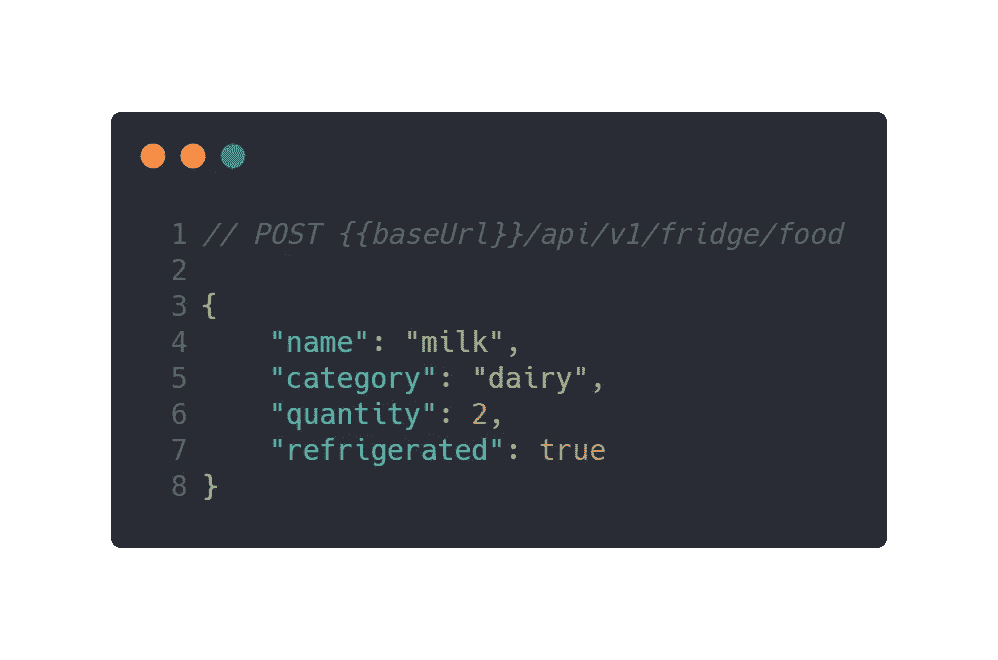

成功！但是，让我们看看当我们发送另一个已知会导致错误的有效载荷时会发生什么:

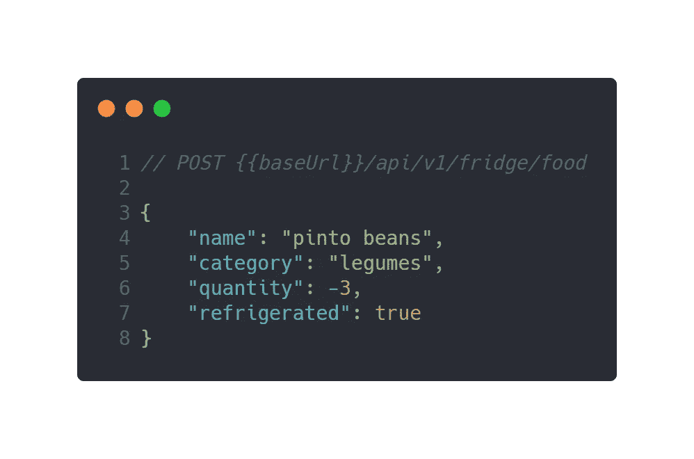

请注意，我们违反了此请求模型的多个约束。您应该会看到一个包含遇到的错误和抛出的异常的详细信息的详细响应。这种冗长对于我们(或我们的消费者)来说并不理想，所以让我们通过简单地覆盖`ResponseEntityExceptionHandler`来过滤掉重要的细节。

进一步研究 Spring 提供的错误响应，您可能会注意到抛出的异常:`MethodArgumentNotValidException`。这是我们在异常处理程序中处理约束违反时感兴趣的异常。

首先，我们需要一个模型来捕捉相关信息。我们能够从原始的 Spring 响应中提取以下内容:

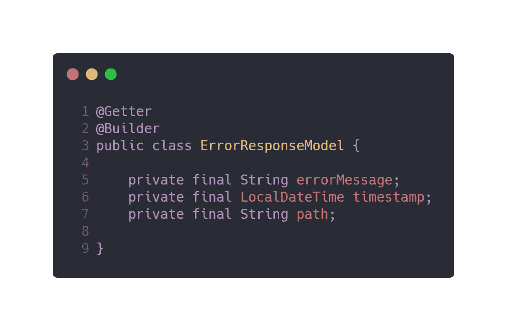

接下来，我们将构建全局异常处理程序和一个方法来处理我们的约束:

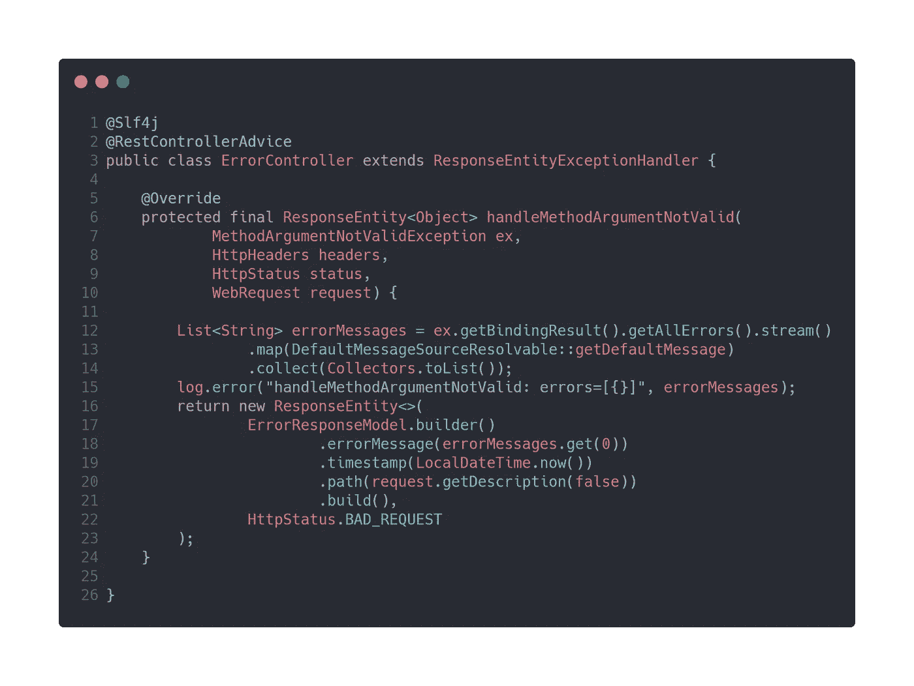

让我们在这里注意一些事情:

*   `@RestControllerAdvice`就是这样——声明在多个控制器类之间共享的`@ExceptionHandler`方法的类的专用组件
*   我们覆盖了`@ResponseEntityExceptionHandler`的`handleMethodArgumentNotValid`方法，这样我们可以:
*   记录重要信息；构建一个小的、集中的错误响应；并根据违反的约束返回我们选择的 HTTP 状态代码

在发送一个违反我们定义的约束的有效负载时，您应该会看到一个简洁的响应，指出我们哪里出错了:

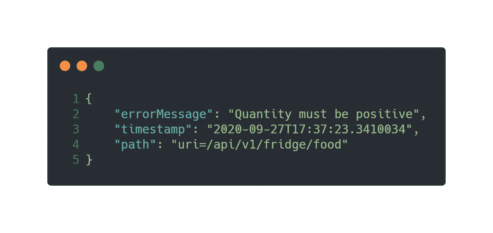

# 挑战

本教程提供了一些基于 Spring/Java 的 REST 服务中约束验证的基本形式。如果你想更进一步，可以从以下几个地方开始:

*   探索违反`@PathVariable`或`@RequestParam`约束的不同之处
*   在复杂的请求模型中实现嵌套约束
*   增加返回给消费者的 HTTP 状态代码的灵活性
*   扩展示例项目以处理复合服务的细微差别——例如一个*野餐服务*
*   进一步探索`@Constraint`API——什么是`payload`和`groups`的用途？

# 关闭

关于使用注释实现定制约束验证器的教程到此结束！如果我错过了什么，不要害怕让我知道。我当然欢迎(也欣赏)批评、问题等等。

作为进一步的参考，这里是 GitHub 库以及本文中给出的全部工作代码和示例。

*最初发布于*[*https://verley . dev*](https://verley.dev/blog/constraint-validation-in-spring-boot-microservices/)*。*