# 使用 Terraform Cloud CI/CD 构建两层架构

> 原文：<https://levelup.gitconnected.com/construct-a-two-tier-architecture-with-terraform-cloud-ci-cd-c64b49c94440>

在这个项目中，我使用 **Terraform Cloud** 在 **AWS** 中部署一个两层架构。然后我用 Github>terra form Cloud>AWS 制作了一个 **CI/CD 管道**。自动化对代码进行更新并将更改应用到基础结构的过程。

## 先决条件

*   Terraform 云帐户
*   GitHub 帐户
*   AWS 帐户、管理权限和密钥对

我们将在 AWS 中构建的架构:

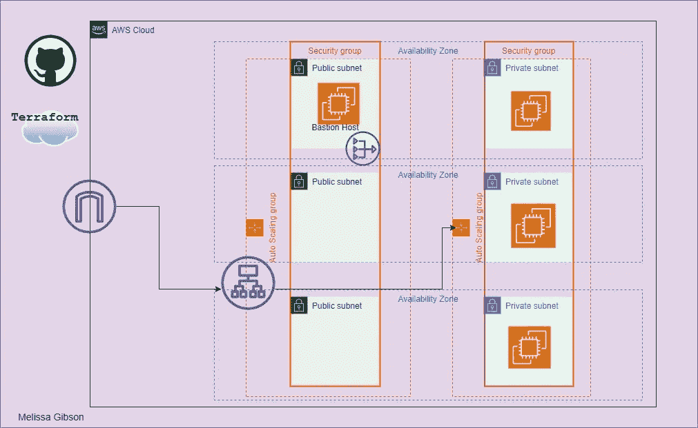

要开始，你需要从 GitHub [**到这里**](https://github.com/melisgibson/terraform_project.git) 。它包含以下文件结构。

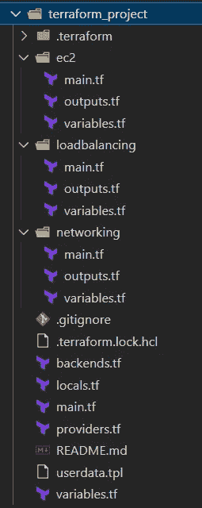

文件结构

我将在下面向您展示根目录 *main.tf* ，让您了解我们正在创建的内容。请随意探索代码的其余部分，并根据您的需要进行修改。

注意您需要将 *key_name* 更改为您自己的密钥对。

从根 main.tf 可以看到它引用了 3 个独立的模块；*联网*、*负载均衡*和 *ec2* 。

*   *组网*:构建一个有 3 个私有子网和 3 个公有子网的 VPC。它创建了互联网网关、NAT 网关和弹性 IP。生成路由表和路由表关联，将 internet 流量定向到公共子网，然后通过 NAT 网关定向到私有子网。该模块还为公共子网实例、私有子网实例和负载平衡器创建安全组。
*   *负载均衡*:该模块设计面向互联网的应用负载均衡器，以及目标组和监听器。ALB 位于公共子网中，会将流量导向私有子网。目标组是在 *EC2* 模块中创建的私有 EC2 实例的自动缩放组。
*   *EC2* :为公共子网中的单个实例构建启动模板和自动缩放组。这个实例是我们的堡垒主机，如果出现故障，它将向外扩展。与堡垒主机相关联的安全组只允许 SSH 流量。EC2 模块还为 web 服务器或专用子网创建 ASG，所需容量为 3。每个可用性区域中有一个实例。web 服务器实例的安全组只允许来自在*负载平衡*模块中创建的 ALB 的流量。

所有的模块都包含变量和输出以相互引用。它们共同协作来构建两层体系结构。我这样写代码是为了增加可重用性。

现在我们已经设置好了所有代码，我们可以开始使用 Terraform Cloud 了。在您的 Terraform Cloud 帐户中，您需要设置一个新组织。命名你的组织并点击*创建组织*。然后会提示你创建一个工作区，选择*版本控制工作流*。

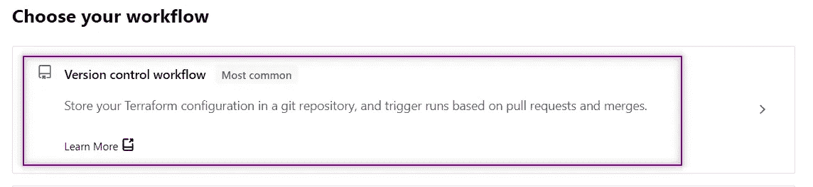

接下来，您将选择一个版本控制提供程序。你会选择*GitHub>GitHub.com*。

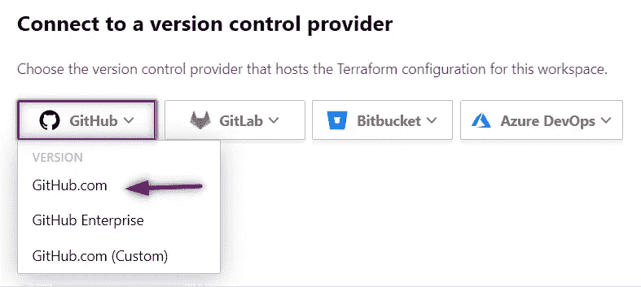

然后，您需要允许 Terraform 访问您的 GitHub 帐户。您可能需要暂时禁用弹出窗口阻止程序。接下来，您可以选择想要使用的存储库。

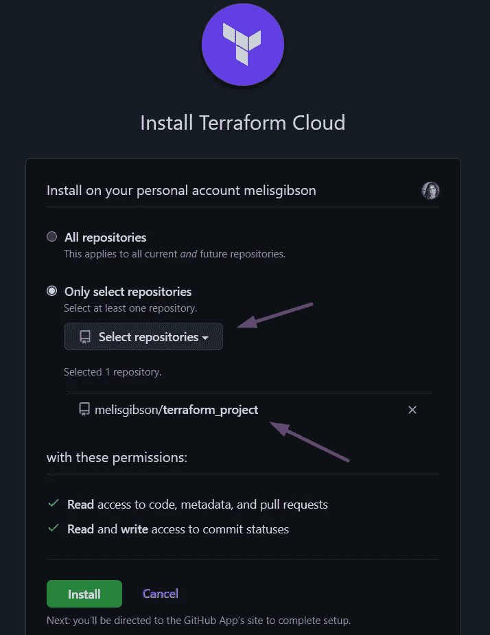

点击 *Install* ，您选择的 repo 将被填充。现在你可以点击*创建工作空间*。然后可以添加环境变量: *AWS_ACCESS_KEY_ID，AWS_SECRET_ACCESS_KEY，AWS_DEFAULT_REGION。*地形变量: *access_ip = 0.0.0.0/0。*

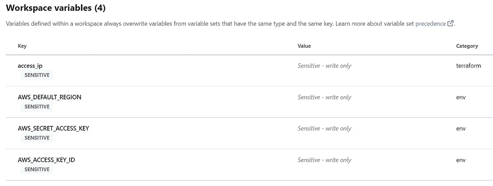

标记为敏感

现在变量已经设置好，您可以导航到屏幕的右上角并选择*动作>开始新的运行*。

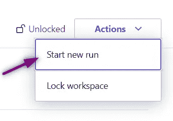

选择*计划并应用*运行类型，然后点击*开始运行*。

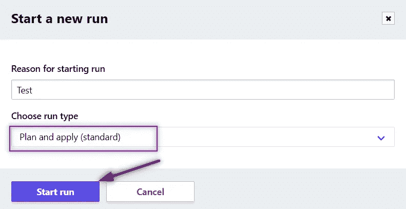

该计划将自动启动。成功后，您的屏幕将如下图所示。

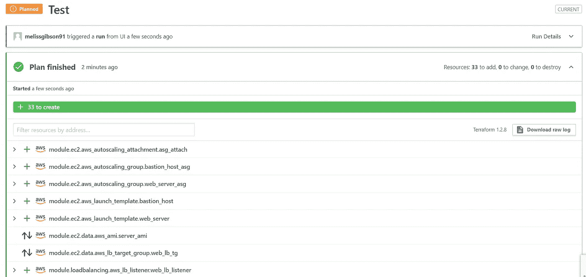

正在创建 33 个资源。

这实际上是`terraform plan`命令。如果它看起来不错，那么我们可以继续申请。单击“应用”后，将开始创建资源。你可以看着它被完成！

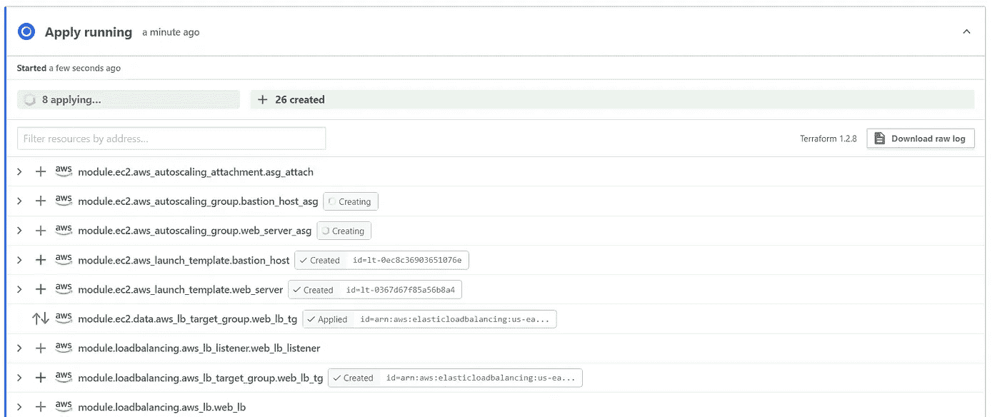

当它完成时。

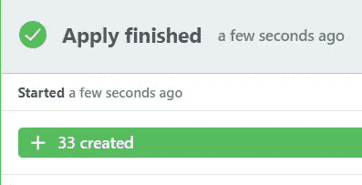

要查看我们的资源，请前往 AWS 控制台。

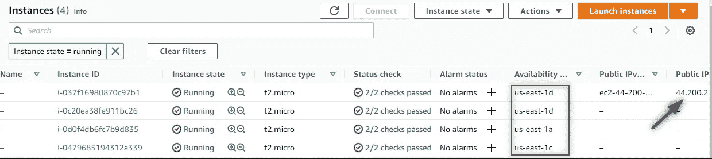

实例运行在 3 个 az 中，3 个私有，1 个公共(bastion)。

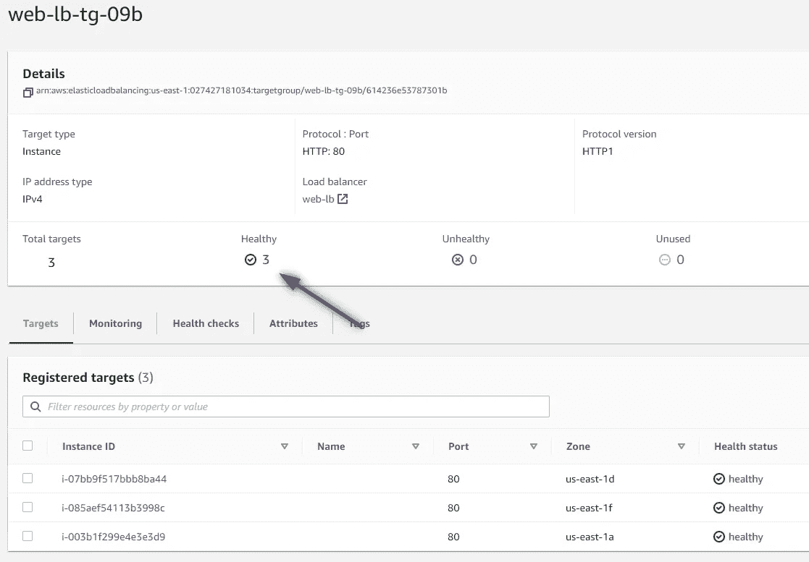

具有 3 个健康实例的 ALB 的目标组。

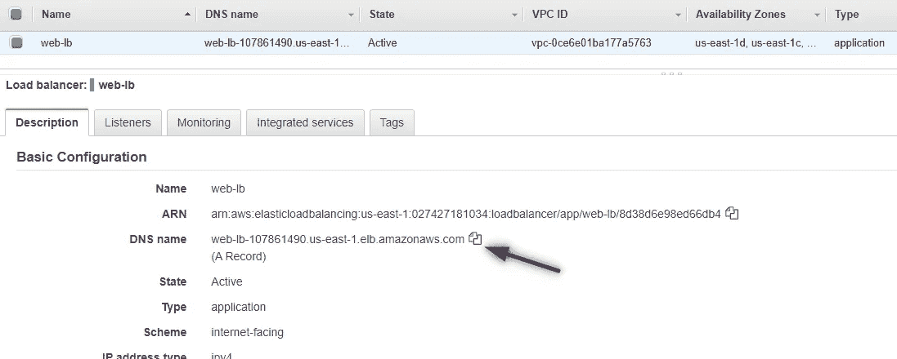

ALB，复制 DNS

要检查我们的负载平衡器是否正常工作，请将 DNS 粘贴到浏览器中。应该会出现以下页面。

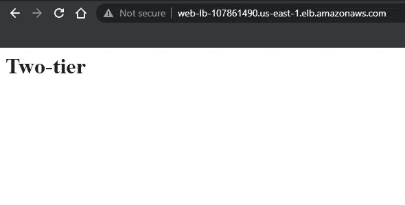

现在，为了确认我们可以通过 SSH 访问我们的 Bastion 主机实例。bastion 主机实例充当私有子网中实例的跳转主机。我将使用`ssh -A`来传递我的访问密钥。

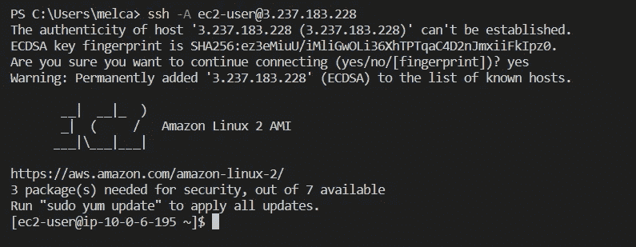

我们现在在 Bastion 主机实例中。要访问私有实例，从 Bastion 实例复制私有 IP 地址和 SSH。

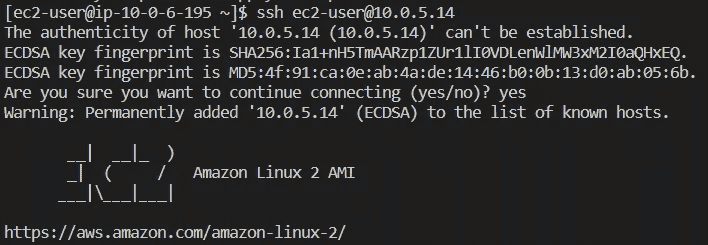

我们现在已经成功地访问了私有实例。

将来，如果您或您的团队想要对基础架构进行更改，您可以自动化这一过程。要做到这一点，我们需要让 Terraform Cloud 在代码发生变化时自动对我们的基础设施进行更改。导航至 Terraform cloud 工作空间中的*设置*。向下滚动并将*应用方法*更改为*自动应用*。

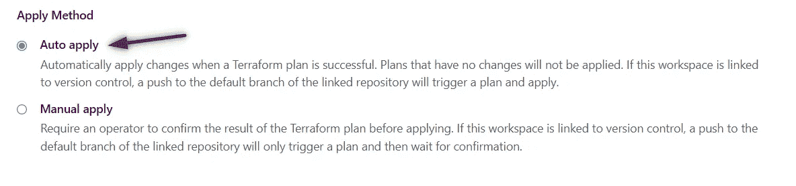

然后点击*保存设置*。现在，为了测试这是否可行，我将在 GitHub 中编辑代码。我将更改用户数据文件并提交更改。

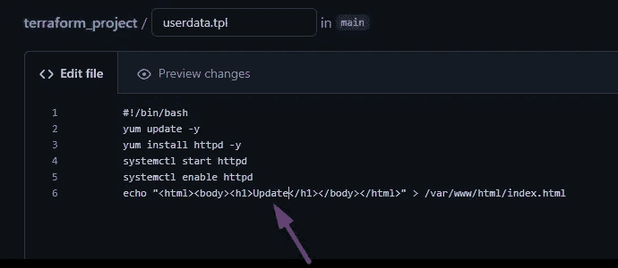

回到 Terraform cloud，你可以看到 GitHub 自动做出和应用的更改！

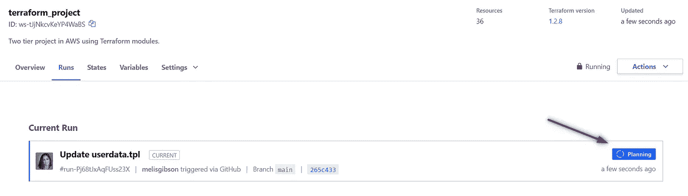

规划

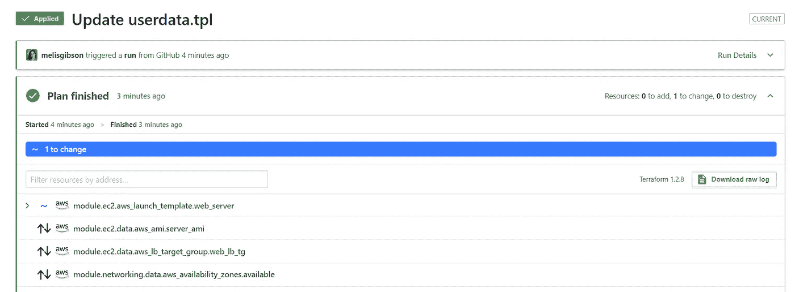

应用的更改

让我们回到 AWS 控制台。首先让我们看看我的自动缩放组是否通过终止一个实例来工作。

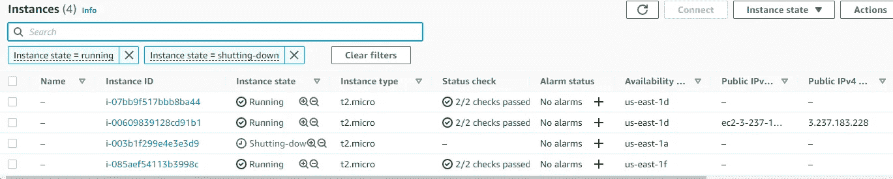

终止的实例

应该会填充一个新实例。

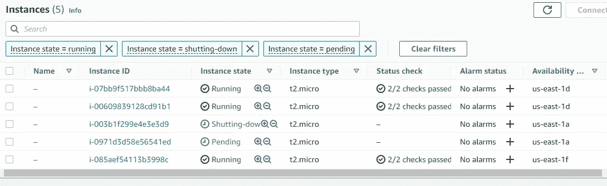

向外扩展，创建新实例

这个新实例将拥有更新的用户数据。因此，如果我们在浏览器中刷新几次 DNS，应该会出现“更新”页面。

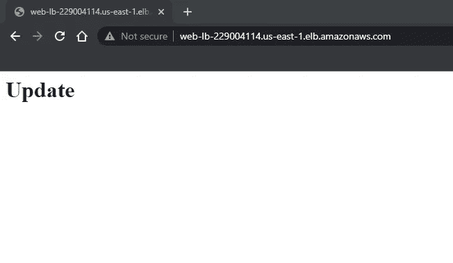

自动更新成功！

现在，要销毁我们的基础架构，请选择*设置>销毁和删除>队列销毁计划。*

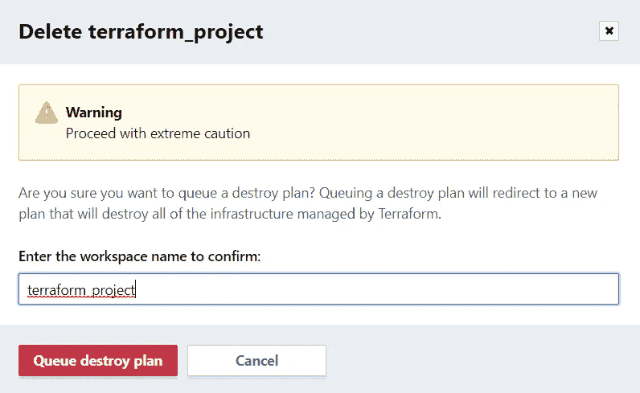

这将计划销毁，然后您需要确认并应用销毁。

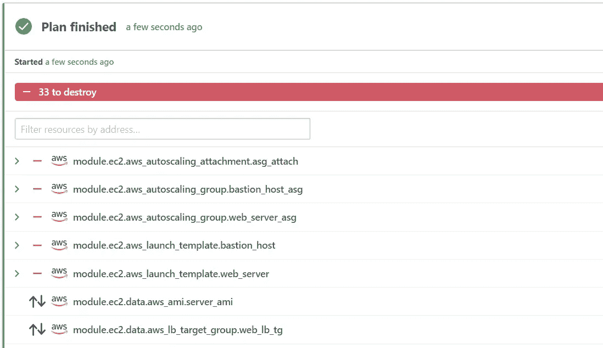

销毁已完成。

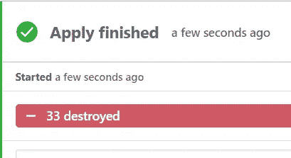

总之，我们使用 GitHub、Terraform cloud 和 AWS 创建了一个 CI/CD 管道。我们在 AWS 中构建了一个两层架构，对它进行了一些测试以确保它能够工作，然后拆除了它。感谢跟随。

# 分级编码

感谢您成为我们社区的一员！在你离开之前:

*   👏为故事鼓掌，跟着作者走👉
*   📰更多内容请查看[升级编码刊物](https://levelup.gitconnected.com/?utm_source=pub&utm_medium=post)
*   🔔关注我们:[推特](https://twitter.com/gitconnected) | [LinkedIn](https://www.linkedin.com/company/gitconnected) | [时事通讯](https://newsletter.levelup.dev)

🚀👉 [**加入升级人才集体，找到一份神奇的工作**](https://jobs.levelup.dev/talent/welcome?referral=true)