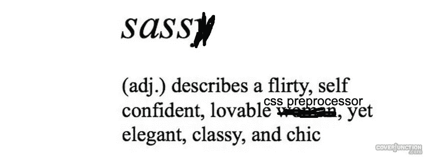

# 用 Sass 构建灵活的模式

> 原文：<https://levelup.gitconnected.com/constructing-flexible-patterns-with-sass-cf9cb0b1b32f>



在一个团队中工作可能很棒，尽管我经常发现自己和那些对造型不感兴趣的人一起工作。这不是一件坏事——这只是意味着作为一名开发人员，我必须有一种更柔和的方法来应对潜在的挫折，并且更加明确地告诉*什么是*、*如何*以及*为什么*。你知道那是什么感觉——当有人打开一份公关时，你的心落地了，然后— *喘息—* 他们修改了你的风格。不是一般的风格，而是非常有意图的风格。你深思熟虑地组合在一起的款式，同时提前 10 步考虑它在整个图案方案中的位置。我们如何抑制这种情况，我们能抑制它吗？我们怎样才能创造一个灵活的模式呢？

这是房间里的一只普通大象:

*“我们的模式库是否足够灵活来服务它的消费者？”*

如果你正在开发一个企业库，答案通常是*“不”*。即使有了品牌指南，设计师也总是会推出稍有变化的新设计，改变模式本身然后发布会给消费者带来意想不到的结果。

虽然我没有灵丹妙药，但我确实有一个解决方案，它提供了一点灵活性，可以帮助您避免“再造轮子”的危机，让您避免开发速度的意外中断。

好吧，我在胡言乱语。让我们开始吧。

我向你介绍…

# 基于构造函数的混合

我知道，这个名字不够壮观，但是谁知道呢——也许我们可以改变它！

简单地说，基于构造函数的 mixin 镜像 Javascript 构造函数，因为您可以将映射传递到 mixin 中，使用 mixin 作为整个模式的构造函数，并且它将新值与默认值合并(非破坏性的)。所以…基本上，它只是一个普通的 mixin，有一个行话的名字，*，但是它有一个内部模式——行话。*

在 Sass 中，模式如下:

*   创建一个接受`map`的`mixin` 。
*   将空映射的默认值添加到 mixin 参数中。
*   使用非破坏性地图合并方法将新特性与默认地图合并。
*   将地图属性分配给 Sass 规则。

这里有一个使用这种方法的例子:

变量`$card-config`和`$button-config` 包含它们对应的 mixins 为修改而暴露的所有属性的映射。如果您决定不修改一个属性，这不是问题，因为使用了非破坏性的合并方法。它会回到默认值。

您可以通过注释掉映射来查看默认值，或者只是防止它们被传递到 mixins 中。

让我们来看看幕后发生了什么:

```
[@mixin](http://twitter.com/mixin) card-constructor($map: ()) {

  $config: map-extend(
    (
      background: #81866e,
      text: white,
      padding: 18px 12px,
      avatar: (
        size: 100px, 
        background: #F7882F, 
        radius: 50%,
        accent-1: #DCC7AA,
        accent-2: #F7C331
      )
    ),
    $map
  ); ...}
```

mixin 被创建，如前所述，一个空贴图被分配给`$map`作为它的默认值。一个`map-extend` Sass 函数被用于将默认值与`$map`合并。

# 地图-扩展

`map-extend` 无损合并两张地图。你可以在上面 codepen 的 SCSS 标签中看到代码，或者[在这里查看源代码](https://github.com/sebnitu/BaseWeb/blob/master/src/scss/core/_functions.scss#L17)(归功于 [Sebastian Nitu](https://medium.com/u/40e4a78f8dbb?source=post_page-----cf9cb0b1b32f--------------------------------) )，因为它是一个没有内置到 Sass 中的第三方函数。

`map-extend`的函数签名如下所示:

```
@param $map (AKA $merge-into in the example)
@type first 
@param $maps (AKA $merge-from in the example)
@type list of maps
@param $deep (AKA $is-deep-merge in the example)
@desc Whether or not to enable recursive mode.
@type boolean
@default false
@return merged mapmap-extend($merge-into, $merge-from, $is-deep-merge)
```

你可以看到 mixin 也包含了卡片图案的样式。让我们检查几个规则。

```
.card {
    background: map-get($config, background);
    border-radius: 4px;
    color: map-get($config, text);
    padding: map-get($config, padding);
    min-height: 400px;
    width: 300px;
    &__avatar {
      background: map-fetch($config, avatar, background);
      border-radius: map-fetch($config, avatar, radius);
      box-shadow: 12px 12px 0px 0px map-fetch($config, avatar, accent-1), -12px -12px 0px 0px map-fetch($config, avatar, accent-2);
      margin: 0 auto 36px auto;
      padding: 24px;
      width: map-fetch($config, avatar, size);
    } ...}
```

# 地图获取+地图提取

`map-get`从`$config`图中检索一个*浅*值，并将其分配给相应的规则。`map-get` 内置于语言中，因此不需要任何第三方依赖。下面是函数签名的样子:

```
map-get($map, $map-key)
```

你也会注意到`map-fetch`。`map-fetch`是一个*深*，意思是它可以返回嵌套的值。这是一种更简单的方法:

```
$avatar-map: map-get($config, avatar).some-class {
    background: map-get($avatar-map, background)
}
```

因为它没有内置到 Sass 中，所以你需要[将代码](https://css-tricks.com/snippets/sass/deep-getset-maps/)添加到你的代码库中。它的函数签名如下所示:

```
map-fetch($map, $keys...)
```

省略号意味着它接受无数的关键参数，因此无论嵌套多深，您都可以获取值。

# 与 React、Vue 或 Angular 一起使用

最简单的解决方案是将您的 Sass mixins 发布到一个私有的`npm`注册表，就像您发布任何模式库一样。然后将它作为一个依赖项安装到您的项目中，并将 mixins 直接从`node_modules`导入到您的组件的 Sass 文件中。

# 结论

现在我们已经结束了，我希望你离开这里的时候至少能带走一样东西，不管是 Sass maps，一种使用 mixins 的时髦新方法，还是一个问题的解决方案。感谢阅读！

