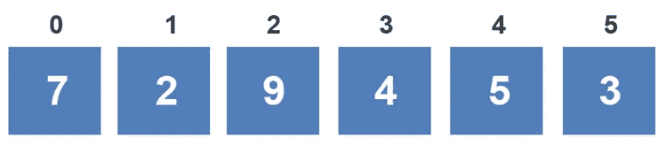
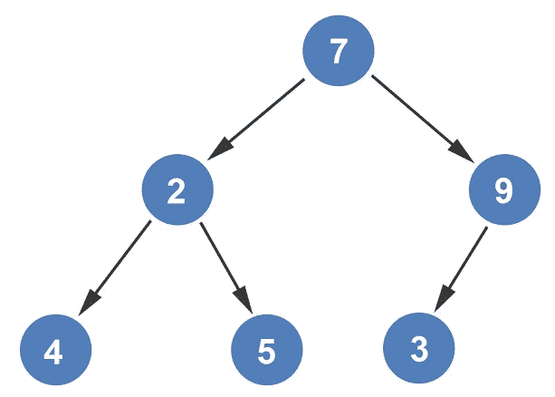
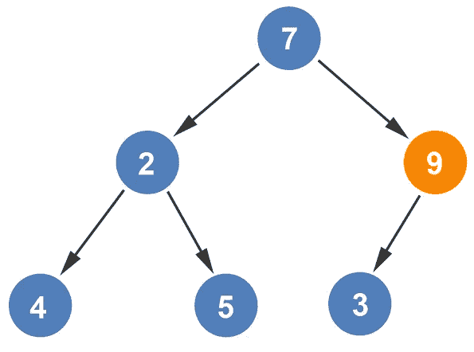
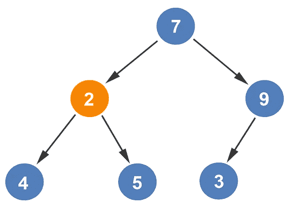
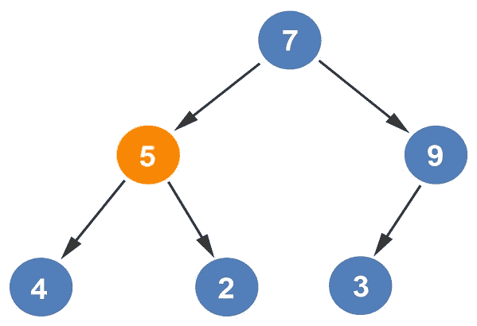
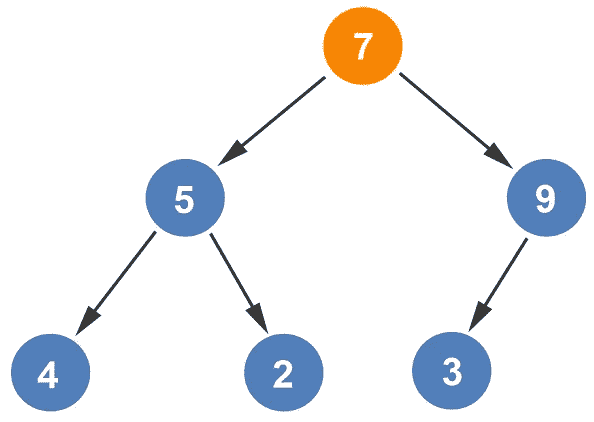
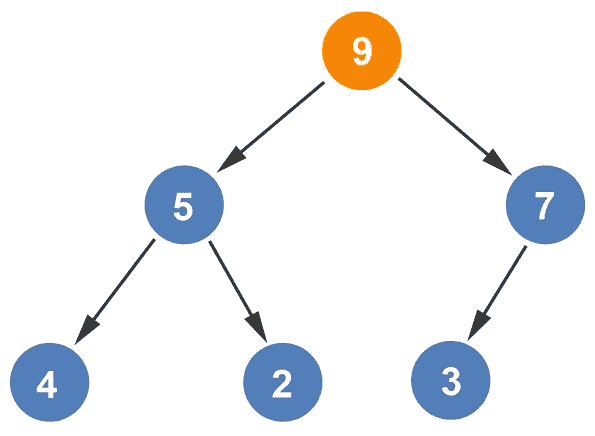
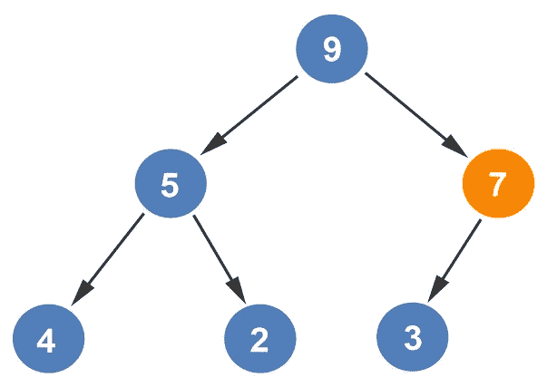
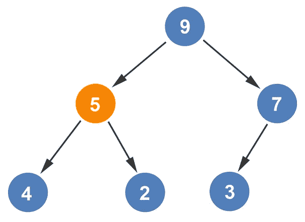
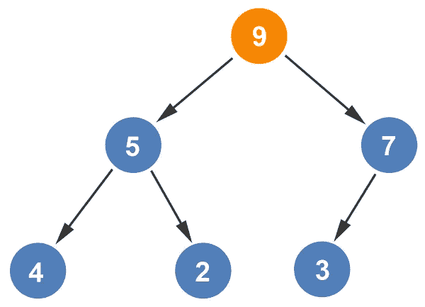

# 从树中构造最大堆

> 原文：<https://levelup.gitconnected.com/constructing-max-heap-from-a-tree-9871bd3b8a87>

最大堆的根节点包含最大值。每个孩子都比父母小。我们将从之前几篇[文章](/creating-a-heap-from-an-array-75830508b034)中的相同数组开始。

我们将首先构造堆。

接下来，我们将开始构建最大堆。就像我们在构建[最小堆](/constructing-min-heap-from-a-tree-ebe20eceb867)时一样，我们将从第三个节点开始:

*楼层(6/2) =楼层(3) = 3*

因为 9 只有一个子节点，所以 9 将与 3 进行比较。如果父节点小于子节点，节点将被交换。因为 9 大于 3，所以节点不交换。我们移动到第二个节点。

第二个节点有两个子节点。两者中较大的是 5，所以 5 与 2 相比较。因为 5 大于 2，所以两个值互换。

比较节点递减，我们从第一个节点开始比较。

第一个节点有两个子节点。孩子们被比较。因为 9 大于 5，所以 9 与 7 相比较。数字 9 大于 7，因此两个节点被交换。

我们将再次遍历它，以确保达到 Max-Heap。我们将从第三个节点开始。因为父节点 7 比它的子节点大，所以节点保持不变。

比较节点递减，第二个节点与其子节点进行比较。因为父节点比它的两个子节点都大，所以节点保持在当前位置。

比较节点递减，第一个节点与其子节点进行比较。因为父节点比它的两个子节点都大，所以节点保持在当前位置。

由于树没有变化，我们可以得出结论，最大堆树已经创建。

*如果你喜欢你所读的，我的书，***算法的说明性介绍，涵盖了这种数据结构和更多内容。**

**

*迪诺·卡伊奇目前是 [LSBio(生命周期生物科学公司)](https://www.lsbio.com/)、[绝对抗体](https://absoluteantibody.com/)、 [Kerafast](https://www.kerafast.com/) 、[珠穆朗玛生物](https://everestbiotech.com/)、[北欧 MUbio](https://www.nordicmubio.com/) 和 [Exalpha](https://www.exalpha.com/) 的 IT 主管。他还担任我的自动系统的首席执行官。他有十多年的软件工程经验。他拥有计算机科学学士学位，辅修生物学。他的背景包括创建企业级电子商务应用程序、执行基于研究的软件开发，以及通过写作促进知识的传播。*

*你可以在 [LinkedIn](https://www.linkedin.com/in/dinocajic/) 上联系他，在 [Instagram](https://instagram.com/think.dino) 上关注他，或者[订阅他的媒体出版物](https://dinocajic.medium.com/subscribe)。*

*[*阅读迪诺·卡吉克(以及媒体上成千上万其他作家)的每一个故事。你的会员费直接支持迪诺·卡吉克和你阅读的其他作家。你也可以在媒体上看到所有的故事。*](https://dinocajic.medium.com/membership)*