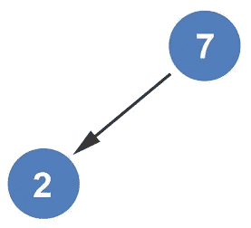
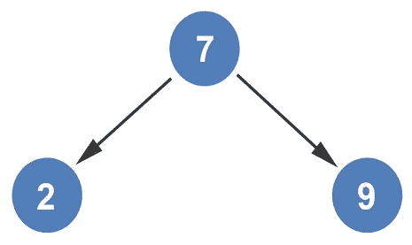
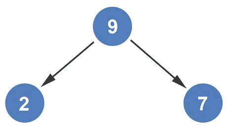
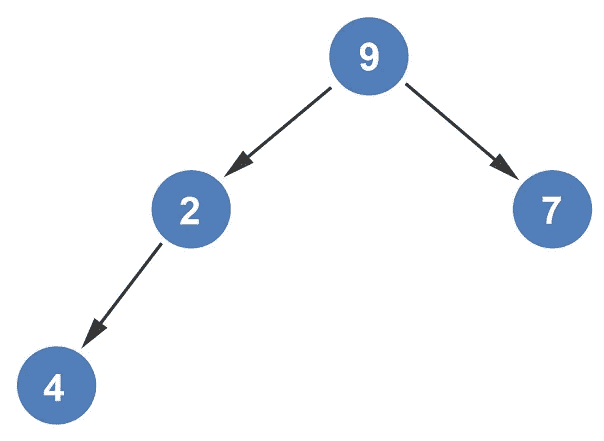
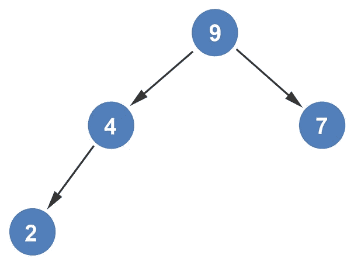
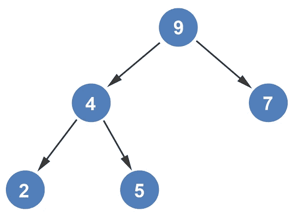
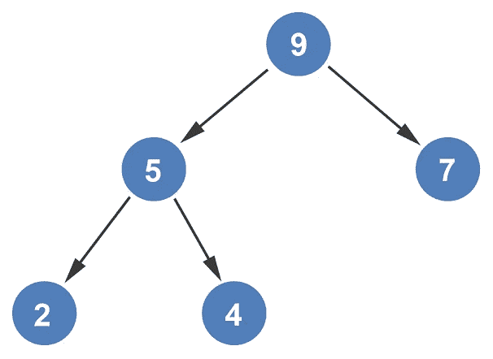
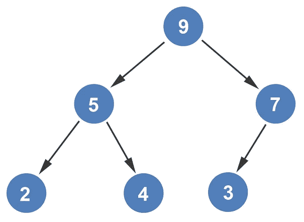

# 从数组构造最大堆

> 原文：<https://levelup.gitconnected.com/constructing-max-heap-from-an-array-2fc01427eeb8>

让我们使用我们用来[构造最小堆](/constructing-min-heap-from-an-array-1119347486c5)的同一个数组来从一个数组创建最大堆。

我们从添加第一个节点 7 开始。

我们从上到下、从左到右移动，然后添加第二个节点 2。

因为 7 大于 2，所以节点保持在当前位置。接下来，将 9 添加到堆中。

因为 9 大于 7，所以两个节点被交换。

接下来，添加 4 作为 2 的子级。

因为 4 大于 2，所以两个节点被交换。

我们观察到 4 向上移动，所以 4 也与 9 相比较。考虑到 4 比 9 小，它们被保留在原处。下一个要添加的值是 5。

因为 5 大于 4，所以两个值互换。

因为 5 向上移动，所以 5 与 9 比较。鉴于 5 小于 9，我们将保持这两个值不变。最后加 3。

考虑到 3 小于 7，这两个值保持不变。这就完成了从数组构建 Max-Heap 的过程。

*如果你喜欢你所读的，我的书，***算法的说明性介绍，涵盖了这种数据结构和更多。**

**

*迪诺·卡希奇目前是 [LSBio(寿命生物科学公司)](https://www.lsbio.com/)、[绝对抗体](https://absoluteantibody.com/)、 [Kerafast](https://www.kerafast.com/) 、[珠穆朗玛生物科技](https://everestbiotech.com/)、[北欧 MUbio](https://www.nordicmubio.com/) 和[艾阿尔法](https://www.exalpha.com/)的 IT 主管。他还担任我的自动系统的首席执行官。他有十多年的软件工程经验。他拥有计算机科学学士学位，辅修生物学。他的背景包括创建企业级电子商务应用程序、执行基于研究的软件开发，以及通过写作促进知识的传播。*

*你可以在 [LinkedIn](https://www.linkedin.com/in/dinocajic/) 上联系他，在 [Instagram](https://instagram.com/think.dino) 上关注他，或者[订阅他的媒体出版物](https://dinocajic.medium.com/subscribe)。*

*阅读迪诺·卡吉克(以及媒体上成千上万的其他作家)的每一个故事。你的会员费直接支持迪诺·卡吉克和你阅读的其他作家。你也可以在媒体上看到所有的故事。*