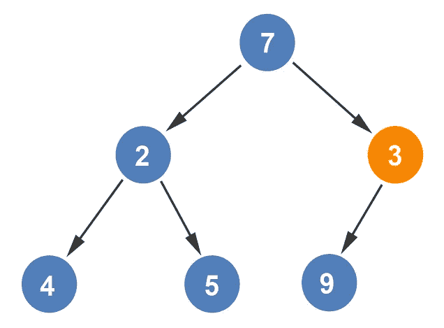
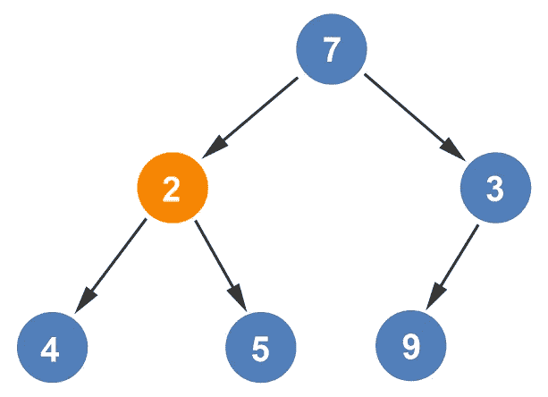
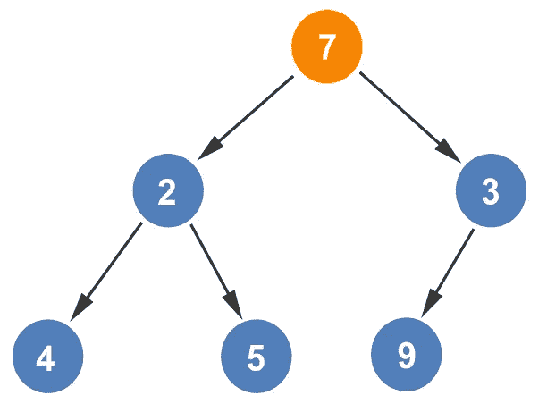
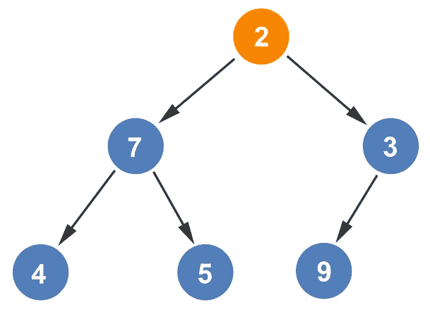
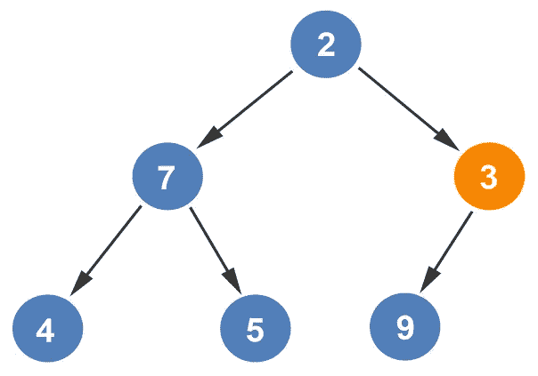
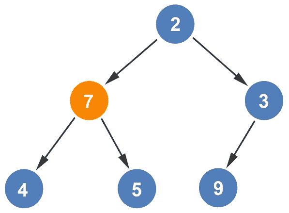
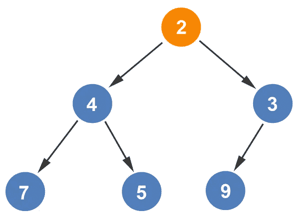

# 从树中构造最小堆

> 原文：<https://levelup.gitconnected.com/constructing-min-heap-from-a-tree-ebe20eceb867>

我们将研究两种类型的堆:最大堆和最小堆。最小堆的根节点(最顶层节点)包含最小值。每个孩子都比父母大。一旦在前面的例子中构建了堆，就可以从中构造一个最小堆。为了构建一个最小堆，我们将从*层(n/2)* 节点开始。地板的原因是由于奇数节点。如果节点数为 *7* ，则起始位置为*楼层(7/2) =楼层(3.5) = 3* 。

对于我们的例子，有 6 个节点:*楼层(6/2) =楼层(3) = 3*

起始位置将在第三个节点。我们将检查是否有子节点的值小于 *9* 。既然有，那两个节点就对调。

我们完成了第 3 个*节点*的操作，并转移到之前的节点，节点 *2* 。在节点 *2* 处，有两个子节点。在两个子节点之间进行比较，并选择最小的节点，在这种情况下是节点 *4* 。接下来，将 *2* 与 *4* 进行比较。由于 *2* 已经小于 *4* ，节点留在原位。

我们完成了第二个节点*和第二个节点*，我们转到了之前的节点，节点 *1* 。在节点 *1* 处，有两个子节点。在两个子节点之间进行比较，并选择最小的节点，在这种情况下，选择值为 *2* 的节点。

接下来，将 *7* 与 *2* 进行比较。由于 *2* 小于 *7* ，节点被交换。

现在我们已经到达了根节点，我们必须再次遍历堆，看看我们是否完成了最小堆的生成。所以，我们将再次重复这个过程。我们从第三个节点开始。

由于 *3* 已经小于 *9* ，我们可以移动到*第二*节点。对这两个孩子进行了比较。由于 *4* 较小，因此 *7* 与 *4* 相比。

由于 *4* 小于 *7* ，两个节点互换。比较节点从第二节点移动到第一节点。

对这两个孩子进行了比较。由于 *3* 较小，因此 *2* 与 *3* 相比。第一个节点已经变小了，所以这些节点保持在它们当前的位置。

需要进行最后一次迭代来验证是否创建了最小堆。我们从第三个节点开始。因为第三个节点没有比它自身更小的子节点，所以我们移到第二个节点。同样，第二个节点没有比它更小的子节点。我们最后回到第一个节点，验证第一个节点也没有比它更小的子节点。最小堆树已经创建。

如果你喜欢你所读的，我的书，**【算法的说明性介绍】涵盖了这种数据结构和更多内容。**

**

*Dino Cajic 目前是 [LSBio(寿命生物科学公司)](https://www.lsbio.com/)、[绝对抗体](https://absoluteantibody.com/)、 [Kerafast](https://www.kerafast.com/) 、 [Everest BioTech](https://everestbiotech.com/) 、 [Nordic MUbio](https://www.nordicmubio.com/) 和 [Exalpha](https://www.exalpha.com/) 的 IT 负责人。他还是我的自动系统公司的首席执行官。他有十多年的软件工程经验。他拥有计算机科学学士学位，辅修生物学。他的背景包括创建企业级电子商务应用程序、执行基于研究的软件开发，以及通过写作促进知识的传播。*

*你可以在 [LinkedIn](https://www.linkedin.com/in/dinocajic/) 上联系他，在 [Instagram](https://instagram.com/think.dino) 上关注他，或者[订阅他的媒体出版物](https://dinocajic.medium.com/subscribe)。*

*阅读 Dino Cajic(以及 Medium 上成千上万的其他作家)的每一个故事。你的会员费直接支持迪诺·卡吉克和你阅读的其他作家。你也可以在媒体上看到所有的故事。*