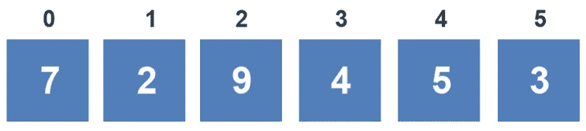
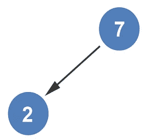
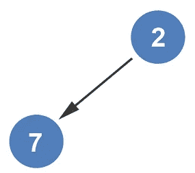
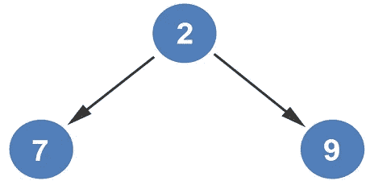
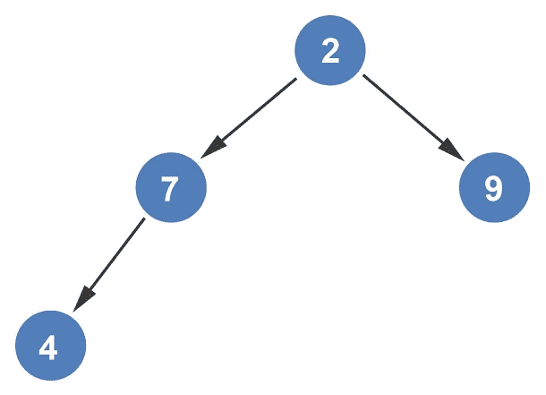
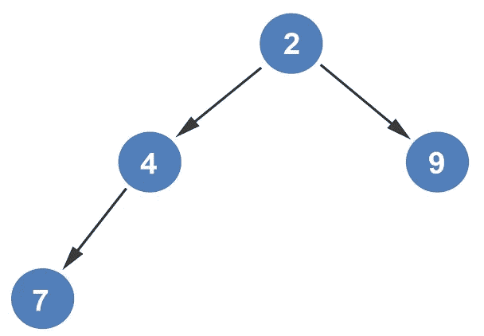
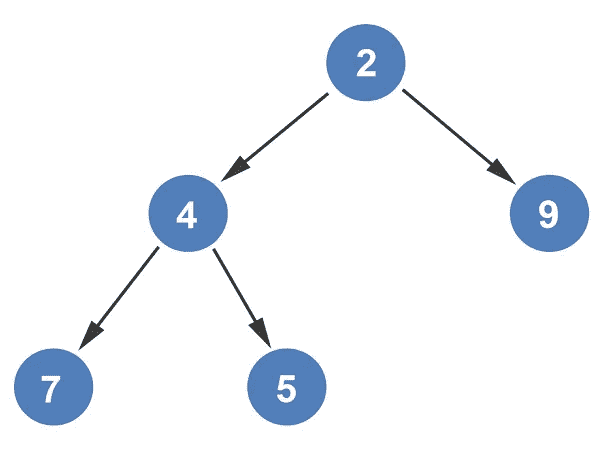
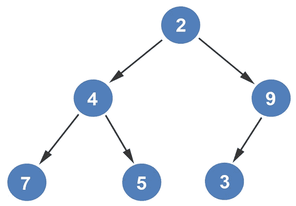
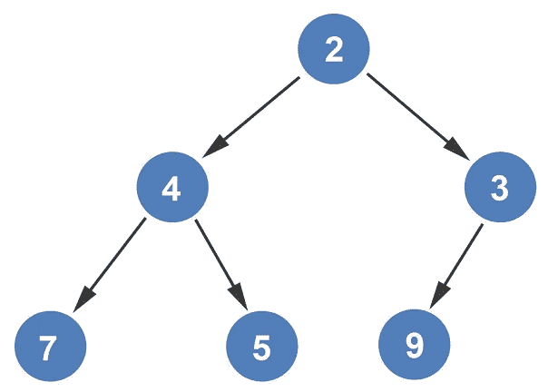

# 从数组构造最小堆

> 原文：<https://levelup.gitconnected.com/constructing-min-heap-from-an-array-1119347486c5>

我们从一个已经构建好的树来看[最小堆树的构建。最小堆也可以直接从数组中构造。如果我们看看我们在](https://medium.com/@dinocajic/constructing-min-heap-from-a-tree-ebe20eceb867) [*文章中使用的从数组*](https://medium.com/@dinocajic/creating-a-heap-from-an-array-75830508b034) 创建堆的数组，我们会看到从数组构造最小堆是多么容易。

我们从添加第一个节点 *7* 开始。

堆是从左到右构建的。添加的下一个元素是 *2* 。

因为我们正在构建一个最小堆，所以所有的子节点都必须小于父节点。编号 *2* 小于 *7* ，因此两个节点互换。

接下来，添加元素 *9* 。由于 *9* 大于 *2* ，所以不需要对换。

接下来，添加元素 4。

由于 *4* 小于 *7* ，两个节点互换。

然后用元件 *2* 检查元件 *4* 以确保其不变小。因为它不是，元素保持在它们当前的位置。接下来，添加元素 *5* 。由于元素 *4* 已经比元素 *5* 小，节点保持在当前位置。

最后，添加元素 *3* 。

因为元素 *3* 小于元素 9，所以两个节点被交换。

元素 3 也与元素 2 进行比较。因为元素 3 比元素 2 大，所以两个节点保持在当前位置。没有额外的数组元素。这就完成了最小堆树的构建。

如果你喜欢你所读的，我的书， [*算法的说明性介绍*](https://www.amazon.com/Illustrative-Introduction-Algorithms-Dino-Cajic-ebook-dp-B07WG48NV7/dp/B07WG48NV7/ref=mt_kindle?_encoding=UTF8&me=&qid=1586643862) *，涵盖了这种数据结构和更多。*

迪诺·卡伊奇目前是 [LSBio(生命周期生物科学公司)](https://www.lsbio.com/)、[绝对抗体](https://absoluteantibody.com/)、 [Kerafast](https://www.kerafast.com/) 、[珠穆朗玛生物](https://everestbiotech.com/)、[北欧 MUbio](https://www.nordicmubio.com/) 和 [Exalpha](https://www.exalpha.com/) 的 IT 主管。他还担任我的自动系统的首席执行官。他有十多年的软件工程经验。他拥有计算机科学学士学位，辅修生物学。他的背景包括创建企业级电子商务应用程序、执行基于研究的软件开发，以及通过写作促进知识的传播。

你可以在 [LinkedIn](https://www.linkedin.com/in/dinocajic/) 上联系他，在 [Instagram](https://instagram.com/think.dino) 上关注他，或者[订阅他的媒体出版物](https://dinocajic.medium.com/subscribe)。

[*阅读迪诺·卡吉克(以及媒体上成千上万其他作家)的每一个故事。你的会员费直接支持迪诺·卡吉克和你阅读的其他作家。你也可以在媒体上看到所有的故事。*](https://dinocajic.medium.com/membership)