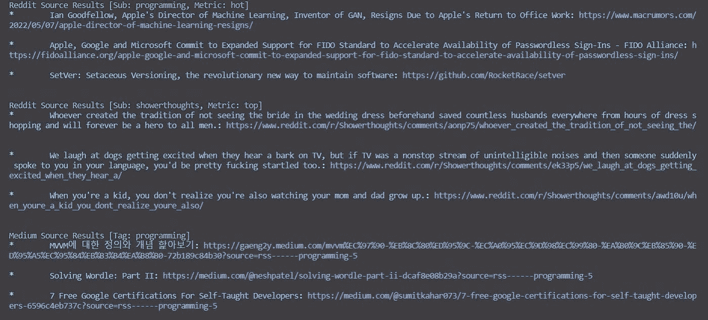

# 从命令行的任何地方使用内容

> 原文：<https://levelup.gitconnected.com/consume-content-from-anywhere-in-the-command-line-99b93ff33e7b>

## 使用 Python 的开源内容聚合器


琳达·塞格费尔特在 [Unsplash](https://unsplash.com?utm_source=medium&utm_medium=referral) 上的照片

# 介绍

内容聚合器是一个简单的应用程序，它从 web 上收集内容，以便为用户提供统一的内容消费方式。一个内容聚合器也可以帮你节省大量时间，例如，浪费在无休止的滚动新闻提要上，以及从 reddit 提要上的随机帖子中分心。

内容聚合帮助我们优化内容消费——我们只需要一个网站，而不是滚动浏览 5 个不同的网站，也不是没完没了地滚动试图过滤我们关心的内容，我们可以立即看到与我们感兴趣的主题相关的内容。

在本文中，您将学习如何使用 python 从头开始创建自己的定制内容聚合器。

# 短暂绕道

在写这篇文章的时候，我有一个内容聚合器的最小代码示例，我计划与你分享，但是在写的时候我有一个扩展它的想法，最终我甚至把它作为我的第一个开源包发布到 PyPi。

理想情况下，在这篇文章结束时，你将能够并且想要为 [Fuse](https://github.com/Eliran-Turgeman/Fuse) 贡献自己的一份力量。

# 先决条件

*   Python 3.7+的本地开发环境
*   熟悉 Python。

# 步骤 1 —安装依赖项

在这一步中，您将安装稍后将会用到的模块。为此，您将创建一个包含整个项目需求的文件。

您要安装的软件包有:

*   feed parser——一个 RSS 解析模块
*   praw — Python Reddit API 包装模块
*   colorama 启用彩色终端文本
*   键入—添加对类型提示的支持

创建一个名为`requirements.txt`的新文件。该文件中的每一行都包括软件包的名称和需要安装的版本。将以下需求复制到您的`requirements.txt`文件中

```
feedparser==6.0.8
praw==6.4.0
colorama==0.4.4
typing==3.6.2
```

要安装在`requirements.txt`文件中列出的所有包，运行以下命令

```
pip3 install -r requirements.txt
```

在这一步中，您安装了本教程所需的所有软件包。接下来，你将对项目的结构有一个基本的了解。

# 步骤 2 —高级设计

为了方便地支持各种资源，我们将创建一个名为`Source`的抽象基类。我们希望添加的每个源都将继承它并扩展它的功能。在这篇文章中，我将介绍`RedditSource`和`MediumSource`，它们都是`Source`的子类。

最后，我们将有一个`SourceManager`，它将给出一个资源列表，并触发每个资源获取机制。

在这一步中，您对项目的结构有了基本的了解。接下来，您将实现基础抽象类`Source`

# 步骤 3 —实现基类

在这一步中，您将实现基础抽象类`Source`。

打开一个名为`models.py`的新文件，并编写以下代码

```
[label models.py]
from abc import ABC, abstractmethodclass Source(ABC):

    @abstractmethod
    def connect(self):
        pass @abstractmethod
    def fetch(self):
        pass
```

上面的类有两个功能——一个是在需要时连接到源(例如通过 API key ),另一个是从源获取内容。该类中的实现将保持为空，每个特定的源都必须实现上述功能。

在这一步中，您实现了基础抽象类`Source`。接下来，您将实现`SourceManager`类。

# 步骤 4 —实现管理器类

在这一步中，您将实现`SourceManager`类。

打开文件`models.py`并编写以下代码

```
[label models.py]
...
from typing import List...class SourceManager:
    def __init__(self, sources: List[Source] = None) -> None:
        if not sources:
            self.sources = []
        else:
            self.sources = sources def __call__(self) -> None:
        for source in self.sources:
            source.fetch()
            print(source) def add(self, source: Source) -> None:
        self.sources.append(source)
```

正如在高级设计步骤中所讨论的，`SourceManager`将获得一个源列表，在调用它时，`SourceManager`将触发每个源`fetch`函数并打印结果。

还有一个功能可以添加当前未使用的信号源，但以后可能会有用。

在这一步中，您实现了`SourceManager`类，基本上完成了这个应用程序的包装。接下来，您将学习如何从 reddit 获取内容并实现`RedditSource`类。

# 步骤 5 —实现 Reddit 源代码

在这一步中，您将实现`RedditSource`类。

首先，为了使用`praw`库和查询 Reddit 的 API，您需要获得一个 API 密匙。Reddit 的 github 上有一个简短的指南，告诉你如何做到这一点——确保你有一个客户 id 和一个客户秘密。

一旦有了客户机 id 和密码，就将它们作为环境变量`REDDIT_CLIENT_ID`和`REDDIT_CLIENT_SECRET`添加进来。

现在，创建一个名为`reddit_source.py`的新文件并打开它。让我们首先关注由`Source`类定义的最小必要实现。

```
[label reddit_source.py]from models import Source, Result
from typing import List
import praw
from praw.reddit import Reddit
import os
from colorama import Fore, StyleCLIENT_ID = os.environ.get('REDDIT_CLIENT_ID')
CLIENT_SECRET = os.environ.get('REDDIT_CLIENT_SECRET')class RedditSource(Source): def __init__(self, subreddit: str, limit: int = 10, metric: str = 'hot') -> None:
        self.results: List[Result] = []
        self.valid_metrics = ['hot', 'top']
        self.reddit_con = self.connect()
        self.subreddit = subreddit
        self.limit = limit
        self.metric = metric def connect(self) -> Reddit:
        self.reddit_con = praw.Reddit(client_id=CLIENT_ID,
                     client_secret=CLIENT_SECRET,
                     grant_type_access='client_credentials',
                     user_agent='script/1.0')
        return self.reddit_con def fetch(self) -> List[Result]: 
        if not self.subreddit or self.limit < 0 or self.metric.lower() not in self.valid_metrics:
            return

        if self.metric == 'hot':
            raw_results = self.reddit_con.subreddit(self.subreddit).hot(limit=self.limit)
        else:
            raw_results = self.reddit_con.subreddit(self.subreddit).top(limit=self.limit) self.results = self.reformat_results(raw_results) # will be defined soon return self.results
```

让我们简单地看一下实现，从`init`方法开始，您将得到一个您想要查询的子编辑，您想要查询的关于哪个是热门或热门的指标，以及您想要查看的结果的限制。

在`init`函数中，我们通过 praw 库创建了一个到 Reddit API 的连接。为了创建连接，您应该传递您在本步骤开始时生成的客户端 id 和密码。

接下来，查看`fetch`方法，根据您获得的度量，您使用连接对象从`praw`检索匹配结果。

最后，我们重新格式化来自 API 的结果，以便不同来源的结果有一个统一的表示。

为了创建一个统一的表示，打开文件`models.py`并添加下面的`Result`类

```
[label models.py]...
from colorama import Fore, Style...
class Result:
    def __init__(self, title: str, url: str) -> None:
        self.title = title
        self.url = url def __repr__(self) -> str:
        return f"* \t {Fore.CYAN}{self.title}{Style.RESET_ALL}: {Fore.MAGENTA}{self.url} {Style.RESET_ALL} \n"
```

上面的`Result`类简单地获取我们查询的文章的标题和 url，并使用`colorama`模块将其打印到终端。

创建完`Result`类后，回到`reddit_source.py`文件，完成`RedditSource`类的实现。

```
[label reddit_source.py]...
class RedditSource(Source):
...
    def reformat_results(self, raw_results) -> List[Result]:
        reformatted_results = []
        for result in raw_results:
            reformatted_results.append(
                Result(
                    title=vars(result)['title'],
                    url=vars(result)['url']
                )
            )
        return reformatted_results
 def __repr__(self) -> str:
        output = f"{Fore.GREEN}Reddit Source Results [Sub: {self.subreddit}, Metric: {self.metric}]{Style.RESET_ALL} \n"
        for result in self.results:
            output += f"{result} \n"
        return output
```

`reformat_results`函数负责获取 API 给出的原始结果，并将其转换为您之前创建的统一表示类。

最后，通过实现`__repr__`方法，您可以打印所有获取的结果，并且完成了`RedditSource`的实现。

在这一步中，您实现了`RedditSource`类，并为所有不同的源创建了一个统一的表示。接下来，您将体验一下通过执行程序已经实现了什么。

# 步骤 6 —执行部分实施

在这一步中，您将执行到目前为止已经实现的内容。

为此，创建一个名为`main.py`的文件并使用下面的代码。

```
[label main.py]from reddit_source import RedditSource
from models import SourceManagerif __name__ == '__main__':
    reddit_programming = RedditSource(subreddit='programming', limit=3, metric='hot')
    reddit_showerthoughts = RedditSource(subreddit='showerthoughts', limit=3, metric='top')

    source_manager = SourceManager([reddit_programming, reddit_showerthoughts])
    source_manager()
```

上面的代码简单地创建了两个 reddit 源，第一个用于编程 subreddit，第二个用于淋浴想法 subreddit。在创建这些源之后，我们将它们作为一个列表传递给`SourceManager`并调用它来执行程序。

使用以下命令执行您的程序

```
python main.py
```


在这一步中，您执行了您在最后 5 步中实现的内容。接下来，您将添加一个额外的源，它将是`Medium`。

# 步骤 7 —实施媒体源

在这一步中，您将实现`MediumSource`类。

正如我们之前所做的，让我们首先关注由`Source`类定义的最小必要实现。

创建一个名为`medium_source.py`的新文件，并使用下面的代码。

```
[label medium_source.py]from typing import List
from models import Source, Result
import feedparser
from colorama import Fore, Styleclass MediumSource(Source):

    def __init__(self, tag, limit=10) -> None:
        self.results: List[Result] = []
        self.tag = tag
        self.limit = limit def connect(self):
        pass def fetch(self) -> List[Result]:
        if not self.tag or self.limit < 0:
            return raw_results = feedparser.parse(f"https://medium.com/feed/tag/{self.tag}").entries[:self.limit] self.results = self.reformat_results(raw_results)
        return self.results
```

你可能已经注意到了，`MediumSource`与`RedditSource`略有不同。在这里，我们不需要通过 API 连接，所以`connect`的实现将保持为空。

为了查询这个源，我们将使用`feedparser`模块，该模块将根据来自媒体提要的标记检索结果。

为了完成实现，我们缺少了`reformat_results`和`__repr__`函数，它们看起来与`RedditSource`匹配函数非常相似。

```
[label medium_source.py]...
class MediumSource(Source):
...
    def reformat_results(self, raw_results) -> List[Result]:
        results = []
        for result in raw_results:
            results.append(
                Result(
                    title=result.title,
                    url=result.link
                )
            ) return results def __repr__(self) -> str:
        output = f"{Fore.GREEN}Medium Source Results [Tag: {self.tag}]{Style.RESET_ALL} \n"
        for result in self.results:
            output += f"{result} \n"
        return output
```

与在`RedditSource`类中一样，`reformat_results`函数负责将我们查询的原始结果转换成您在前面步骤中创建的统一表示类。

在这一步中，您实现了`MediumSource`类，这样就完成了内容聚合器的实现(至少在我将要介绍的范围内)。

接下来，您将执行整个程序。

# 步骤 8 —执行程序

与步骤 6 类似，打开`main.py`。从步骤 6 开始，您应该有下面的实现。

```
[label main.py]from reddit_source import RedditSource
from models import SourceManagerif __name__ == '__main__':
    reddit_programming = RedditSource(subreddit='programming', limit=3, metric='hot')
    reddit_showerthoughts = RedditSource(subreddit='showerthoughts', limit=3, metric='top')

    source_manager = SourceManager([reddit_programming, reddit_showerthoughts])
    source_manager()
```

现在，您可以加入另一种类型的信号源，即`MediumSource`。

注:所有新行或被更改的行都在`#new`中标记。

```
[label main.py]from reddit_source import RedditSource
from medium_source import MediumSource # new 
from models import SourceManagerif __name__ == '__main__':
    reddit_programming = RedditSource(subreddit='programming', limit=3, metric='hot')
    reddit_showerthoughts = RedditSource(subreddit='showerthoughts', limit=3, metric='top')
    medium_programming = MediumSource(tag='programming', limit=3) # new

    source_manager = SourceManager([reddit_programming, reddit_showerthoughts, medium_programming]) # new
    source_manager()
```

现在，用以下命令执行您的程序

```
python main.py
```



在这一步中，您执行了内容聚合器，并准备自己添加更多的源。

# 下一步是什么

正如我前面提到的，我将这个内容聚合器项目变成了一个名为`Fuse`的开源工具。

如果你对添加更多资源感到兴奋，我邀请你挑战自我，为 [Fuse](https://github.com/Eliran-Turgeman/Fuse) 做贡献

如果你愿意做出贡献，并且面临一些问题，不要犹豫，伸出援手。

*原载于我的个人博客——*[](https://eliran-turgeman.github.io/posts/content-aggregator/)

****考虑中等会员？你可以支持我的工作，而这样做没有任何额外的费用。****

*[](https://eliran9692.medium.com/membership) [## 通过我的推荐链接加入 Medium-Eliran turge man

### 阅读 Eliran Turgeman(以及媒体上成千上万的其他作家)的每一个故事。您的会员费直接支持…

eliran9692.medium.com](https://eliran9692.medium.com/membership)* 

# *分级编码*

*感谢您成为我们社区的一员！在你离开之前:*

*   *👏为故事鼓掌，跟着作者走👉*
*   *📰查看[升级编码出版物](https://levelup.gitconnected.com/?utm_source=pub&utm_medium=post)中的更多内容*
*   *🔔关注我们:[Twitter](https://twitter.com/gitconnected)|[LinkedIn](https://www.linkedin.com/company/gitconnected)|[时事通讯](https://newsletter.levelup.dev)*

*🚀👉 [**将像你这样的开发人员安置在顶级初创公司和科技公司**](https://jobs.levelup.dev/talent/welcome?referral=true)*