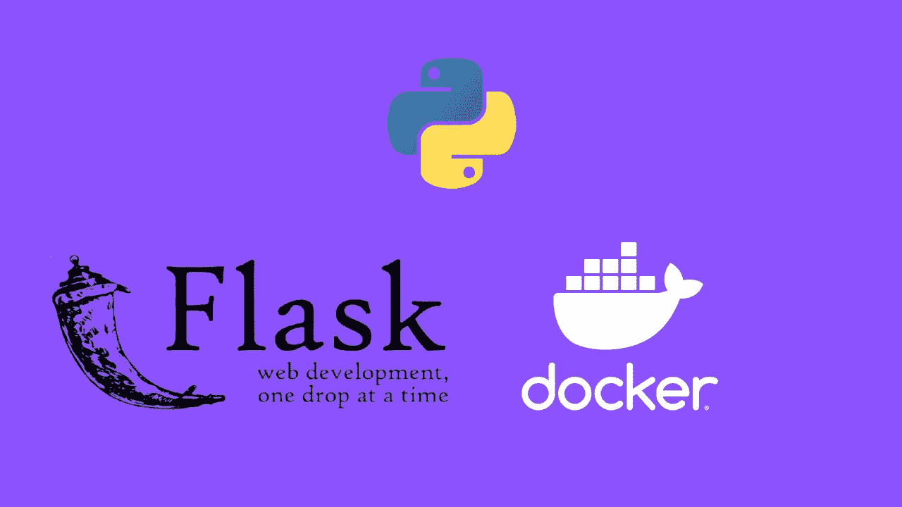
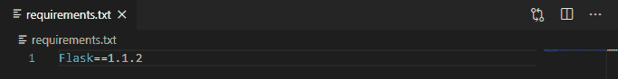
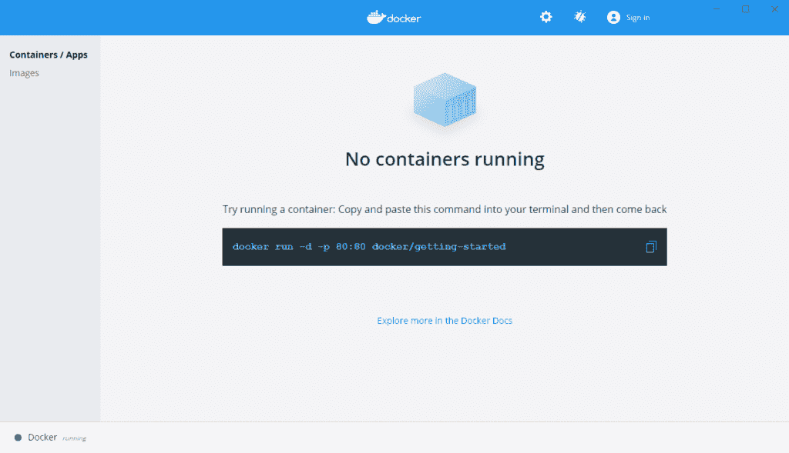
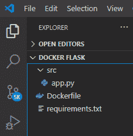

# 使用 Docker-Deployment 将 Flask 应用程序容器化

> 原文：<https://levelup.gitconnected.com/containerize-a-flask-application-using-docker-deployment-59382e5cae4e>

## 在本教程中，我们将讨论如何使用 Docker 封装 Flask 应用程序。



作者图片

**目录**

*   介绍
*   创建一个简单的烧瓶应用程序
*   创建具有依赖关系的文件
*   安装 Docker
*   创建 Docker 文件
*   建立码头工人形象
*   运行 Docker 容器
*   结论

# 介绍

码头和集装箱化是 MLOps 和部署的最大趋势之一。应用程序容器化有显著的优势。

Docker 的最大优势之一是能够在一个称为容器的隔离环境中运行应用程序。

Docker 容器很容易通过 Docker Hub 或 Git Hub 存储库共享，这简化了通信并有助于项目的协作。

# 创建一个简单的烧瓶应用程序

首先，我们将创建一个非常简单的 Flask 应用程序，只有一个页面，上面写着“Hello World！”。

要继续本节，我们需要安装 Flask 库。

如果您没有安装它，请打开“命令提示符”(在 Windows 上)并使用以下代码安装它:

```
pip install Flask
```

安装完成后，让我们为我们的项目创建一个单独的文件夹，并将其命名为“Docker Flask”(您可以选择任何名称)。在这个文件夹中创建一个子文件夹，并将其命名为“src”(我们将把它作为源代码的专用隔离目录)。

我的大部分工作都是在 [VS Code](https://code.visualstudio.com/) 中完成的，这是微软的一个免费 IDE。我鼓励你下载并在这个项目中使用它，因为在文件夹架构中导航会容易得多(而且它通常适用于所有项目)。

现在我们已经创建了我们的文件夹，让我们制作第一个 Python 文件(在“src”文件夹中)并将其命名为 **app.py** 。该文件将包括以下烧瓶代码:

重要提示:如果您想在本地测试运行应用程序，您应该有 **app.run()** 但是当我们希望将应用程序容器化时，我们将其切换到 app.run(host='0.0.0.0 '，port=80 ),因为本地端口 127.0.0.1 不能在 Docker 容器中捕获，并且 Flask 默认情况下也使用端口 5000，所以我们将其切换到端口 80。

如你所见，这是一个非常简单的单页应用程序(不要忘记保存代码(Ctrl + S))。

到目前为止，您的文件体系结构应该如下所示:

多克烧瓶
└─── src
└─── app.py

太好了，我们已经准备好了烧瓶应用程序。现在让我们深入 Docker！

# 创建具有依赖关系的文件

回想一下，为了在本地运行应用程序，我们在本地计算机上安装了 Flask。

现在我们的目标是让这个 Flask 应用程序独立运行，并允许 Docker 从源代码组装一个容器。

简单地说，我们需要让 Docker 知道我们正在使用 Flask 库，并且它需要成为环境的一部分。

下一步，我们将在 Docker Flask 文件夹(主文件夹)中创建一个空白的 requirements.txt 文件。然后向其中添加依赖项。

对于简单的 Flask 应用程序，我们唯一的需求是 Flask 库。我们只需要找到包的版本，然后将它添加到文件中。

要查找已安装的 Flask 版本，只需在命令提示符下运行以下代码:

```
Flask --version
```

您应该得到:

```
Python 3.7.4
Flask 1.1.2
Werkzeug 1.0.1
```

我安装的版本是 1.1.2，所以我们继续将 **Flask==1.1.2** 添加到 requirements.txt 文件中。

如果您使用 VS 代码并打开 requirements.txt 文件，您应该有这样的代码:



此时，您的文件体系结构应该如下所示:

Docker flask
├───要求. txt
└─── src
└─── app.py

好了，现在我们准备开始容器化我们的 Flask 应用程序了！

# 安装 Docker

为了完成剩下的部分，我们需要[安装 Docker Desktop](https://www.docker.com/get-started) ，以便能够在本地管理集装箱化的环境。

遵循一个简单的安装指南(可能需要您重新启动计算机)，安装程序应该可以使用了。

继续在你的电脑上打开 Docker 桌面。

您应该看到以下内容:



# 创建 Dockerfile 文件

Docker 通过从[docker 文件](https://docs.docker.com/engine/reference/builder/)中读取指令来自动构建图像。Docker 文件基本上是一个文本文件，它包含所有由 Docker 执行以创建 Docker 映像的指令(命令)。

听起来有很多令人困惑的信息？别担心，让我简单地解释一下。

基本上，当我们希望 Docker 将我们的 Flask 应用程序容器化时，我们需要告诉它需要做的一切，从我们使用什么软件，到代码的位置，等等。

为了有效地做到这一点，我们创建了一组指令(类似于组装计算机或其他东西时的指令)，并告诉 Docker 引用该文件并执行所需的操作。

Dockerfile 没有扩展名，只称为“Dockerfile”。这也是我鼓励您使用 VS 代码的原因之一，因为它支持所有这些新技术，并且可以通过名字识别 Dockerfile。

因此，我们首先要做的是创建一个空文件(在 Docker Flask 文件夹中)，并将其命名为“Dockerfile”。如果您使用的是 VS 代码，此时您的文件结构应该如下所示:



你会注意到 VS 代码识别了这个文件，并自动在旁边创建了一个“鲸鱼”图标(你可能需要在 VS 代码中安装 Docker 附加组件)。

现在让我们来配置 Docker 文件！

这是一个比其他信息多一点的部分，我会尽量详细解释，但如果你还有问题，网上有很多很棒的文章解释如何创建 Dockerfiles。

上面 docker 文件中的每一行都有注释，希望这个过程有意义。Docker 文件现在配置了一组过程，这些过程将在我们构建 Docker 映像时执行。

# 建立码头工人形象

下一步，我们要做的实际上是从我们刚刚创建的 Docker 文件构建 Docker 映像。

Docker 映像是带有创建 Docker 容器的指令的模板，Docker 容器是映像的可运行实例。

Docker 的其余功能应该从终端运行。如果您使用的是 VS 代码，那么您的终端接口就可以在文件所在的目录中找到。

如果您决定使用命令提示符运行它，首先您应该使用 **/cd** 命令导航到“Docker Flask”文件夹，然后才执行下面的代码。

为了构建 Docker 映像，我们将使用 [docker build](https://docs.docker.com/engine/reference/commandline/build/) 命令:

```
docker build -t flask-image .
```

这里， **flask-image** 是我为我们将要构建的 Docker 图像取的名字(为什么我们使用 **-t** ，因为我们正在设置一个项目标签)。

Docker 守护进程将逐个执行 Docker 文件中的指令。有多个步骤，Docker 将向您展示每个步骤的进度。

这一步完成后，Docker 映像就创建好了。我们可以通过运行 [docker images](https://docs.docker.com/engine/reference/commandline/images/) 命令来查看可用的 Docker 图像列表:

```
docker images
```

我们看到:

```
REPOSITORY    TAG       IMAGE ID       CREATED        SIZE
flask-image   latest    a7b8af8c82ec   2 minutes ago  927MB
```

此时，我们使用 Docker 完成了封装 Flask 应用程序的大部分工作。现在让我们运行容器，看看我们的 Flask 应用程序！

# 运行 Docker 容器

创建 Docker 文件并从中构建 Docker 映像后，我们现在可以使用 Flask 应用程序运行 Docker 容器。

为了启动 Docker 容器，我们使用 [docker run](https://docs.docker.com/engine/reference/commandline/run/) 命令:

```
docker run -d -p 80:80 flask-image
```

几个要点:

*   我们使用 **-d** (-detatch)在后台运行容器
*   我们使用 **-p** (-publish)向主机发布容器的端口
*   我们将 **80:80** 作为容器端口 80 映射到本地机器端口 80

此时，容器应该已经启动并运行了。您可以使用 [docker ps](https://docs.docker.com/engine/reference/commandline/ps/) 命令获得容器及其状态的列表:

```
docker ps
```

您应该得到:

```
CONTAINER ID    IMAGE         COMMAND             CREATED
b6709c1ba42b    flask-image   "python ./app.py"   12 minutes ago
STATUS          PORTS                NAMES
Up 12 minutes   0.0.0.0:80->80/tcp   nifty_jang
```

所以容器正在运行，你可以在你的本地机器上通过访问 [http://127.0.0.1/](http://127.0.0.1/) 或 [http://localhost:80/](http://localhost:80/) 来访问它，你应该会看到你的“Hello World！”Flask app。

# 结论

在本教程中，我们讨论了如何使用 Docker 封装 Flask 应用程序。

对于希望了解 Docker 的更多信息并部署自己的应用程序的人来说，这里展示的例子是一个很好的起点。

我也鼓励你看看我在 [Python 编程](https://pyshark.com/category/python-programming/)上的其他帖子。

如果你有任何问题或者对编辑有任何建议，请在下面留下你的评论。

*原载于 2020 年 12 月 22 日 https://pyshark.com**[*。*](https://pyshark.com/containerize-a-flask-application-using-docker/)*