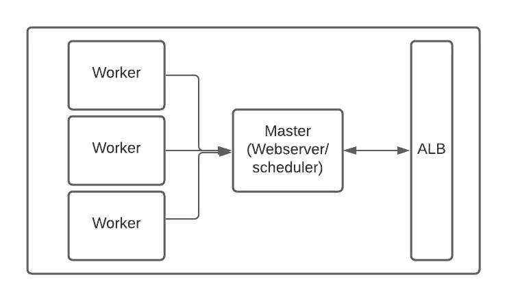

# 集装箱化气流

> 原文：<https://levelup.gitconnected.com/containerized-airflow-4148c3044603>

# AWS ECS 上气流的部署

**先决条件** →关于气流和 DAG 的基本信息
→关于容器和容器部署(ECS、k8s 等)的基本概念
→ Docker

**air flow**air flow 是一款开源工具，用于调度和监控工作流。Airflow 具有 web 服务器、调度器和工作节点作为组件，web 服务器是交互和监控工作流的 UI，调度器调度工作流，工作器执行调度的任务。在气流中，工作流被定义为 DAG(有向无环图)

**动机** 

为了解决这些问题，我们将使用 docker 映像来发布气流 DAGS、插件和配置，作为 docker 映像的一部分

**要求**

*   一个主节点，其上运行有 airflow web 服务器和调度程序，并且可以从公共互联网访问 airflow web 服务器
*   可访问主节点的多个工作节点(与主节点运行在同一网络中)
*   (CI/CD)将 Dag 复制到所有工作节点和主节点的＄air flow _ HOME/DAGs/并将插件复制到＄air flow _ HOME/plugin 目录
*   保持气流变量的机制

**步骤**

*   打包 Dag、插件和配置
*   展开气流
*   Dag、插件和配置的 CI/CD



# **第一步(包装)**

使用 Dag 和插件创建 docker 映像
docker 文件

```
ARG BASE_IMAGE
ARG TAG
FROM $BASE_IMAGE:$TAG 
COPY ./run-master.sh /opt/ 
COPY ./run-worker.sh /opt/
COPY ./dags/ /opt/airflow/dags
COPY ./plugin/ /opt/airflow/plugin/
COPY ./config/ /opt/airflow/config/
```

run-master.sh 和 run-worker.sh 是运行主调度程序和工作程序的脚本

`**run-master.sh**`

```
airflow initdb
airflow variables --import /opt/airflow/config/*
nohup airflow scheduler >> /opt/airflow/logs/scheduler.logs &
nohup airflow flower >> /opt/airflow/logs/flower.logs &
airflow webserver -p 8080
```

该脚本从/opt/airflow/config/目录导入所有 JSON 配置(键值对),并将它们保存到 airflow 变量中，并运行 scheduler、flower 和 webserver

`**run-worker.sh**`

```
airflow initdb
airflow worker
```

这将在工作节点上启动气流工作器

“apache/airflow:latest”可以用作 airflow 的基础图像

```
$ docker build --build-arg BASE_IMAGE=apache/airflow --build-arg TAG=latest -t airflow:1.0.0 .
```

此命令可用于构建 docker 映像，将标签作为版本，该版本将是包版本(本例中为 1.0.0)

# 步骤 2(部署)

我们将在本文中使用 AWS ECS 进行部署

要在 AWS ECS 上部署 docker 映像，需要一个 docker 注册表和一个 Mysql 实例，其中包含一个用于 airflow 的数据库

从 AWS 控制台创建一个 ECR 注册表，然后使用

```
$ aws ecr get-login-password --region <region> | docker login --username AWS --password-stdin <account_id>.ecr.<region>.amazonaws.com$ docker tag airflow:1.0.0 <ECR_registry_name>:1.0.0 
$ docker push <ECR_registry_name>:1.0.0
```

这将把映像推送到 AWS ECS，供 AWS ECS 稍后使用

第二步是为部署创建任务定义
我们将创建两个任务定义，一个用于主任务，一个用于工作任务

任务定义主规范

```
Network mode: awsvpc
Memory: 4GB
CPU: 2vpcu
Container spec
- Image: <image path from ECR>
- Entry point : ["bash","-c"]
- Command: ["/bin/bash -c '/opt/run-master.sh'"]
- PORT: 8080
ENV variable
- AIRFLOW__CORE__SQL_ALCHEMY_CONN: mysql://<user>:<password>@mysql_uri:3306/<database>
- AIRFLOW__CORE__LOAD_EXAMPLES: False
- AIRFLOW__CORE__EXECUTOR: CeleryExecutor
```

任务定义工作规范

```
Network mode: awsvpc
Memory: 4GB
CPU: 2vpcu
Container spec
- Image: <image path from ECR>
- Entry point : ["bash","-c"]
- Command: ["/bin/bash -c '/opt/run-worker.sh'"]
- PORT: 8080
ENV variable
- AIRFLOW__CORE__SQL_ALCHEMY_CONN: mysql://<user>:<password>@mysql_uri:3306/<database>
- AIRFLOW__CORE__LOAD_EXAMPLES: False
- AIRFLOW__CELERY__FLOWER_HOST: airflow.airflow-master
- AIRFLOW__CORE__EXECUTOR: CeleryExecutor
```

定义任务后，部署将需要 ECS 群集

在集群上，我们将添加两个服务，一个用于主服务器，另一个用于辅助服务器

对于主服务，将需要应用程序负载平衡，以使 web 服务器在专用子网外可用，并通过主机“airflow.airflow-master”进行服务发现，这已在容器规格的 ENV 变量中提及，以便工作人员能够与主服务器通信

**常见问题:
→** 容器不在私有子网中(如果容器在公共子网中，AWS 不允许容器内部的互联网访问)
→主容器和 ALB 之间的通信
→ALB 的健康检查失败，气流给出 302 on "/"路由，该路由在 ALB 中失败，气流的健康检查路径应为"/health "

# 结论

*   现在，部署版本可用于更容易的回滚
*   集装箱化包装确保跨环境的一致性
*   扩展将像增加工人服务的容量一样容易
*   船长和所有工人都可以使用集装箱日志，以防任何工人停止作业，ECS 将启动一个新的集装箱；可以在此基础上启用 Cloudwatch 监控和警报

# 参考

*   阿帕奇气流[https://airflow.apache.org/docs/apache-airflow/2.0.1/](https://airflow.apache.org/docs/apache-airflow/2.0.1/)
*   AWS ECS[https://docs . AWS . Amazon . com/AmazonECS/latest/developer guide/welcome . html](https://docs.aws.amazon.com/AmazonECS/latest/developerguide/Welcome.html)
*   https://docs.docker.com/get-started/码头工人