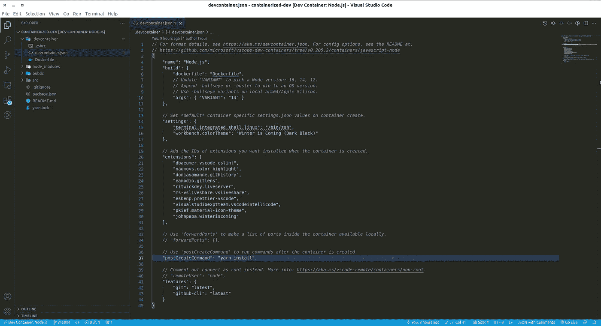

# 使用 VSCode 和 Docker 的容器化开发环境

> 原文：<https://levelup.gitconnected.com/containerized-development-environment-with-vscode-and-docker-36f35475467f>

澄清“嘿，它在我的机器上工作！”通过这些简单的步骤


在 [Unsplash](https://unsplash.com?utm_source=medium&utm_medium=referral) 上由 [Cameron Venti](https://unsplash.com/@ventiviews?utm_source=medium&utm_medium=referral) 拍摄的照片

如果你一直在一个团队中工作，我想你会很熟悉听到这样一句话“我不知道本地和服务器之间有什么区别，但是在我的本地机器上它工作！”或者类似的东西。

事实是，我以前遇到过几次这种问题，正如你所猜测的，这是我的本地机器和服务器有不同环境的问题。例如，在您的本地机器上，您使用 Python 3.9，但是生产服务器使用 Python 3.6。此外，两者都有不同的依赖集。所以，难怪它在本地工作，但不能在生产服务器上工作。

面对这种反复出现的问题，我们有什么解决方案吗？嗯，您可以模仿您的本地环境，使其与您的生产服务器非常相似，比如使用相同的 Python 版本和虚拟环境。或者使用 nvm 管理一组不同的节点版本。但是有一个是我最喜欢的，那就是使用容器化的开发环境。

# 简介和先决条件

想象一下，你正在同时处理多个项目。第一个使用节点 v12，另一个使用 v14，依此类推。根据这些不同的设置来调整我们的本地机器是一件令人头疼的事情。因此，请介绍一下容器化的开发环境。

使用这种方法，如果您想继续您的项目并在以后切换到另一个项目，则无需进行调整。您只需要启动您的容器化开发环境并在其中工作。很简单，对吧？

让我们从拥有我们需要的工具开始。

首先，我们需要在本地机器上安装 VSCode。很有可能你现在已经有了。如果你还没有，你可以先在这里【https://code.visualstudio.com/Download 下载，然后按照安装步骤进行。

之后，我们需要一个 Docker 引擎来容器化开发环境。你可以根据你的操作系统安装它，进入[https://docs.docker.com/engine/install/](https://docs.docker.com/engine/install/)。安装步骤相当简单，与 VSCode 非常相似。你可以在官方文件中寻找细节。

在设置先决条件的最后一步，我们需要在 VSCode 中安装远程开发扩展。在分机部分搜索“远程”。


作者形象

单击远程开发，然后安装它。在这里，我已经安装了扩展包，因此我得到了 SSH、WSL 和容器。但是如果您只想使用容器，您可以单独安装远程容器。

成功安装后，你会在屏幕的左下角看到一个这样的图标。


作者形象

现在，我们准备设置我们的第一个开发环境。在接下来的部分，我们将学习如何为 Python、JavaScript 和 Go 项目设置开发环境。

# 计算机编程语言

让我们从 Python 开始，在这种情况下，我们将使用 Django 作为我们的例子。唯一的要求是安装 Python 3.9。对于本节，我们将使用 VSCode 自动生成的配置。在后面的部分中，我们将看到一种更灵活的不同方法。

首先，单击左下角的图标(您将看到一个悬停文本“*打开一个远程窗口*”)。


作者形象

也可以按 F1 搜索 remote，然后选择“*Remote-Containers:Add Development Container Configuration Files*”。


作者形象

如果你点击左下角，你会看到这些选项。与上述步骤类似，您应该点击*添加开发容器配置文件*


作者形象

之后，你会看到这些选项。既然我们想从事 Django 项目，那么你必须选择 Python 3。


作者形象

选择 Python 版本(在本例中是 3.9)，然后在需要选择 Nodejs 版本时选择 none(因为我们实际上并不需要它)。之后，您将有复选框选项。目前，您可能只需要 GitHub CLI，但这真的取决于您。


作者形象

此时，您已经有了一个名为`.devcontainer`的文件夹，其中包含了`Dockerfile`和`devcontainer.json`。

下面是`Dockerfile`的内容。

看 Python 版本！请记住，我们选择了 Python 3.9，但在这里我们得到了 3.10。没事的，别慌。在`devcontainer.json`内部，你看到的版本仍然是 3.9，换句话说，Docker 构建时变量(ARG)将被`devcontainer.json`内部定义的值所替代。

现在再次单击左下角图标，但现在选择“*在容器*中重新打开”。


作者形象

在进入开发容器之前，需要构建映像。构建过程完成后，您可以打开终端，很可能您会看到终端的不同外观。以确保你确实是在一个孤立的环境中工作。你可以输入`python version`，你会看到 Python 3.9(或者 3.9.9)已经安装好了。


作者形象

现在我们准备开发 Django 项目。如果您以前不知道 Django，可以使用以下命令初始化 Django 项目。

```
pip install django                     # installing django
django-admin startproject example .    # initialize django project
python manage.py runserver             # run the server
```

启动 Django 服务器后。你会在右下角看到一个弹出的模态，就像这样。


作者形象

现在，选择“*在浏览器*中打开”。之后，在你的浏览器上，你会有一个新的标签页，显示第一次开发项目时的问候。


作者形象

至此，您可以开始开发您的项目了。

## Python 的更多内容

以前，我们从零开始这个项目。如果您已经有了项目，但是还没有开发配置文件，该怎么办？

如果现在您有包含`requirements.txt`文件的 Django 项目。要设置一个开发容器，您需要遵循与之前相同的步骤，然后在您获得`devcontainer.json`文件之后，您需要做一些调整。

```
{
  ...
  "postCreateCommand": "pip install --user -r requirements.txt",
  ...
}
```

在`devcontainer.json`里面加上这一行。有了这个选项，每次您重新构建开发容器的映像时，您都不必再次运行 pip install。稍后我们将对`devcontainer.json`有更详细的了解。

# 节点(反应)

在上一节中，我们马上使用自动生成的配置。这有点不灵活，尤其是如果你想要不同类型的终端和 VSCode 扩展。这一次，我们将扩展和调整这个配置，以满足我们个人(或团队)的偏好。

最初的步骤与 Python 部分非常相似。您需要打开远程窗口并添加新的开发环境配置文件。但是不要选择 Python，应该选择你喜欢的版本的 NodeJS。之后，像以前一样，你将拥有包含`devcontainer.json`和`Dockerfile`的`.devcontainer`文件夹。

例如，您可以将生成的 Dockerfile 文件更改为。

在这里，我们安装了`powerline fonts`、`zsh-syntax-highlighting`、`zsh-autosuggestions`。安装完所有插件后，我们将`.zshrc`复制到根文件夹。注意，`.zshrc`是一个 zsh shell 的配置文件，下面是该文件的内容:

之后，需要调整`devcontainer.json`档。

在这个文件中，我为 VSCode 选择了几个扩展。当然，你可以去扩展工具栏选择你自己的。如果右键单击其中一个扩展，您会看到一个选项“*添加到 devcontainer.json* ”。这样，您选择的扩展名将被添加到您的`devcontainer.json`文件的扩展名选项中。

在您更改了所有这些文件之后，您应该重新构建这个开发容器的映像。稍后，您将在您的终端和 VSCode 主题上看到不同的外观。



作者形象

我上面提供的是许多例子中的一个。你可以根据自己的喜好调整它，比如使用不同的 zsh 主题，zsh 插件，使用 bash(默认)而不是 zsh，有不同的 VSCode 主题等等。这是一个在自己身上做实验的游乐场。

之后，您可以通过运行以下命令来初始化 React 项目(在当前文件夹中):

```
npx create-react-app .
```

通过这样做，您可能需要先将`.devcontainer`文件夹移动到某个地方。因为 create-react-app 不允许您在当前文件夹中初始化项目。成功初始化后，您可以移回`.devcontainer`文件夹。

## 关于 devcontainer.json 的更多信息

让我们仔细看看这个文件。您会看到您有几个可配置的选项。我就说其中的几个。

*   对于`settings`，这是通常在你的 VSCode 的`settings.json`文件中看到的内容。这是您的用户设置。您可以设置主题、默认终端、编辑器等等。
*   扩展是帮助我们的工作变得更加容易的附加工具。通过将扩展添加到这个可配置选项中，您可以为您的开发容器添加您喜欢的扩展。
*   选项`build`是指定如何配置容器。比如使用哪些上下文、Dockerfile 和参数变量。
*   我们之前看过`postCreateCommand`。您可以提供一个命令或命令列表，在容器启动后运行。
*   最后，`name`是容器的显示名称，`features`是要添加到主容器中的[开发容器特性](https://code.visualstudio.com/docs/remote/containers#_dev-container-features-preview)和选项的对象。

对于一般的用例，我们只需要这些选项。但是您可以查看文档以获得更多选项。

# 去

有时，您的应用程序需要连接数据库。你可以连接到你团队的开发数据库。但是在一起工作一段时间后，肯定会有很多垃圾数据堆积起来。所以，拥有一个个人数据库和工作环境会更好，对吗？

借助容器化的开发环境，我们可以实现和以前一样的东西。但是这一次，我们将使用 docker-compose 来管理多个容器，一个用于我们的应用程序，另一个用于数据库。

首先，像以前一样创建一个开发环境配置，但是这次是为了一个 Go 项目。

如果您已经成功地创建了这个配置，那么现在您已经在您的项目目录中有了`.devcontainer`。少了一件事，我们没有`docker-compose.yaml`。所以，我们做一个吧。

把这个写在你的`docker-compose.yaml`文件里。

对于`devcontainer.json`:

如果您尝试运行`docker ps -a`来列出所有正在运行的容器，您将看到两个容器正在运行。一个是应用程序容器，另一个是数据库。

在上面的例子中，我们将端口 3000 作为数据库的端口。因此，我们可以使用本地主机的主机名和端口 3000 进行本地交互。请注意，您可以在 docker-compose 文件中配置数据库名称、用户名和密码。

但是，如果我们的应用程序需要连接数据库，我们需要将其设置为端口 5432，而不是 3000。因为这是使用容器网络连接的。

# 结论

在本文中，我们已经看到了如何使用开发容器作为解决方案来解决本地服务器和生产服务器之间环境不同的问题。

综上所述，首先，我们需要安装 VSCode，Docker 引擎，远程开发容器扩展。然后添加一个新的开发容器配置文件，并在容器内重新打开工作区。

我们还可以根据自己的需求和喜好来调整我们孤立的工作空间。例如使用不同的默认 shell、选择一个合适的主题、选择特定于项目的扩展，以及许多其他事情。

现在，你可以把你的源代码发布给其他人使用，最酷的是，他们会看到你在屏幕上看到的东西。没有头痛的不同环境！

以下是本文的代码材料:

*   python:[https://github . com/agusrichard/django-workbook/tree/master/containarized-dev](https://github.com/agusrichard/django-workbook/tree/master/containarized-dev)
*   JavaScript:[https://github . com/agusrichard/react-workbook/tree/master/contained-dev](https://github.com/agusrichard/react-workbook/tree/master/containerized-dev)
*   [https://github . com/agusrichard/go-workbook/tree/master/contained-dev](https://github.com/agusrichard/go-workbook/tree/master/containerized-dev)

感谢您的阅读和快乐编码！

# 资源

*   [https://code.visualstudio.com/docs/remote/containers](https://code.visualstudio.com/docs/remote/containers)