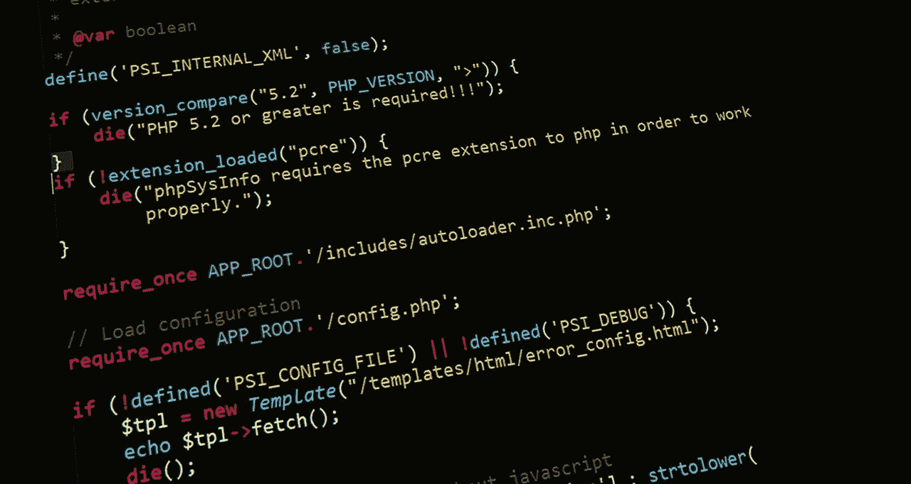
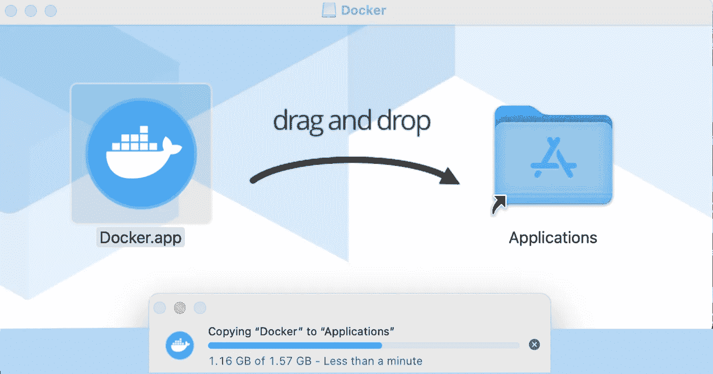
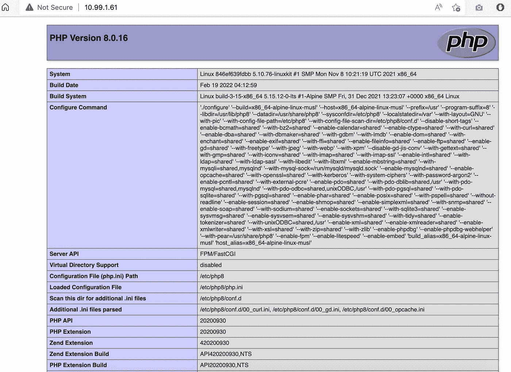

# 在 Alpine Linux 上容器化 nginx + PHP FPM

> 原文：<https://levelup.gitconnected.com/containerizing-nginx-php-fpm-on-alpine-linux-953430ea6dbc>

## 我是如何学会不再担心，并爱上 PHP 容器的



如果你曾经需要使用 PHP-FPM (PHP FastCGI 进程管理器)运行 nginx (engine x) web 服务器来进行开发或其他工作，你应该知道配置和设置是一件痛苦的事情。

你必须启动一个虚拟机或者找到一个本地服务器(也可以是你的本地开发设备)。然后你必须安装和配置 nginx。然后你必须安装和配置 PHP-FPM。那你就得抱最好的希望了。

这通常是为你工作的每一个项目而做的，因为，如果没有别的原因，PHP 和 nginx 中有太多不同的设置必须为那个项目专门设置。

说了这么多，如果你还在读这篇文章，我想我不需要说服你它的好处，对吗？

# 定义

让我们为这些技术的新用户提供一些定义吧！

## nginx

发音为“*引擎 x* ”。对于本文上下文中的所有意图和目的，nginx 是一个 web 服务器。在[](http://nginx.org)*处定义为:*

> *HTTP 和反向代理服务器、邮件代理服务器和通用 TCP/UDP 代理服务器。*

## *服务器端编程语言（Professional Hypertext Preprocessor 的缩写）*

*读作“ *P H P* ”(我知道， ***非常*** ***巧妙*** )。这是用来构建动态网站的语言和引擎，它配备了你能想到的所有功能。对于本文，我们将关注最新版本(在撰写本文时)8.1。但是，这个设置至少可以在 7.x 版本上运行(我没有在之前的版本上测试过)。PHP 在[](https://www.php.net)*被定义为:**

> **一种流行的通用脚本语言，特别适合 web 开发。**
> 
> **快速、灵活和实用的 PHP 为从你的博客到世界上最受欢迎的网站的一切提供了动力。**

## **PHP FPM**

**这是 PHP 的 FastCGI 进程管理器，令人惊讶的是它被称为 PHP FPM。这允许 nginx 通过套接字或公开的 TCP/IP 端口访问 PHP 引擎。它非常快，通常为您的应用程序提供最快的响应时间(与在 nginx 或 Apache 中将 PHP 作为一个模块运行相比)。很简单，在 https://php-fpm.org[它被定义为:](https://php-fpm.org)**

> **一个简单而健壮的 FastCGI 进程管理器**

## **码头工人**

**我们用来创建、构建和运行容器的内容。你可以在 Docker、Kubernetes 以及其他云提供商容器服务(比如 Azure 的 App 服务)中运行容器。然而，对于本文的范围，我们将简单地在 Docker 本地运行我们的容器。在[](https://www.docker.com)*处定义为:***

> ***Docker 消除了重复、平凡的配置任务，并在整个开发生命周期中用于快速、简单和可移植的应用程序开发——桌面和云。Docker 全面的端到端平台包括 ui、CLI、API 和安全性，它们在整个应用交付生命周期中协同工作。***

# ***先决条件***

## ***码头工人***

***我们其实并不需要 ***本地安装*** PHP 或者 nginx 来容器化它(这就是容器的妙处！).然而，我们确实需要 Docker，这样我们就可以马上测试我们的容器，在 macOS 或 Windows 上最简单的方法就是安装 Docker Desktop。如果你在 Linux 上，安装将(当然)通过 Docker 的 CLI 安装。***

> *****注*** *Docker 桌面包括 Docker App、开发者工具、Kubernetes 以及与生产 Docker 引擎的版本同步。Docker Desktop 允许您利用经过认证的图像和模板以及您选择的语言和工具。开发工作流利用 Docker Hub 将您的开发环境扩展到一个安全的存储库，以实现快速自动构建、持续集成和安全协作。***

**你可以得到。dmg 或者。用于 Mac 和 Windows 的 Docker 桌面的 exe 安装程序**

*****在 Windows 上***
在 Windows 上，安装就像运行。exe(你知道的，ol '双击？).**

*****在 Mac 上***
在 macOS 上，安装就像运行。dmg，然后常见的拖放到应用程序。**

****

> *****注意*** *在 macOS 上，您可能需要从您的****launch pad****中启动****Docker****才能使用 Docker 命令。***

*****在 Linux 上***
所以——在 Linux 上，安装并不那么容易，但也很接近了！我们将在 Ubuntu 上执行这个安装，但是在其他 Linux 平台上的安装也是类似的。**

****第 1 步—设置存储库****

**1.确保没有现有安装。
`**sudo apt-get remove docker docker-engine docker.io containerd runc**`**

**2.刷新 APT 存储库。
`**sudo apt-get update**`**

**3.安装支持应用程序。**

```
****sudo apt-get install apt-transport-https ca-certificates curl gnupg    lsb-release****
```

**4.添加码头工人的 GPG 键**

```
****curl -fsSL** [**https://download.docker.com/linux/ubuntu/gpg**](https://download.docker.com/linux/ubuntu/gpg) **| sudo gpg --dearmor -o /usr/share/keyrings/docker-archive-keyring.gpg****
```

**5.建立稳定的 Docker 存储库**

```
****echo \
  "deb [arch=amd64 signed-by=/usr/share/keyrings/docker-archive-keyring.gpg]** [**https://download.docker.com/linux/ubuntu**](https://download.docker.com/linux/ubuntu) **\
  $(lsb_release -cs) stable" | sudo tee /etc/apt/sources.list.d/docker.list > /dev/null****
```

****步骤 2 —安装 Docker 引擎****

1.  **更新 APT 存储库。
    `**sudo apt-get update**`**
2.  **安装 ***码头*** 和 ***集装箱*** *。*这将安装**最新*稳定 ***版本*** *。*
    `**sudo apt-get install docker-ce docker-ce-cli containerd.io**`***

**3.通过下载并运行示例容器，验证 ***Docker*** 引擎是否正常工作。
`**sudo docker run hello-world**`**

**这应该会在您的 shell 中生成一条如下所示的消息:**

```
****Unable to find image 'hello-world:latest' locallylatest: Pulling from library/hello-worldb8dfde127a29: Pull completeDigest: sha256:9f6ad537c5132bcce57f7a0a20e317228d382c3cd61edae14650eec68b2b345cStatus: Downloaded newer image for hello-world:latestHello from Docker!This message shows that your installation appears to be working correctly.****
```

> *****Linux 上的 Docker 引擎*** *其他 Linux 发行版的安装说明可以在这里找到:【https://docs.docker.com/engine/install/】[](https://docs.docker.com/engine/install/)***

***全部完成！您已经成功安装并配置了 Docker！***

# ***该项目***

***现在我们已经准备好 Docker，是时候设置我们的项目了。它将由三个主要部分组成:***

*   ***服务器配置包括 nginx、PHP 和 PHP FPM***
*   ***满足于服务***
*   ***码头/集装箱配置***

> *****注意**
> 这是一个非常基本的设置，您几乎肯定希望至少在 nginx 和 php 中为生产部署更改配置。***

## ***结构***

***我们需要将 nginx 和 php 配置复制到容器中，以覆盖安装时的默认设置。***

> *****注意**
> 你可以通过克隆或者只是看一下我在这里提供的示例项目[**https://github.com/johnathanesanders/docker-nginx-fpm**](https://github.com/johnathanesanders/docker-nginx-fpm)***

***我喜欢在项目根目录下创建一个名为`**server**`的目录，然后从那里模仿 linux 文件系统。因此，我们将创建一个包含`**nginx**`和`**php**`子目录的`**etc**`目录。在`**nginx**`中，我们将创建一个`**conf.d**`子目录，在`**php**`中，我们将创建一个`**php-fpm.d**`子目录。所有这些将在项目根中产生如下所示的结构:***

```
*****server
   --- etc
       --- nginx
           --- conf.d
       --- php
           --- php-fpm.d*****
```

***我们还需要在项目根目录下有一个`**src**`目录。这将用于存储我们的网站内容。创建此目录后，项目目录的根目录应该如下所示:***

```
*****<project root>
   --- server
       --- etc
           --- nginx
           --- conf.d
        --- php
            --- php-fpm.d
   --- src*****
```

## *****网站内容*****

***让我们先完成简单的部分，我们的网站内容。我们将只创建两个文件一个`**index.php**`和一个`**404.html**`来提供一个例子，说明在这个设置中一个`**.php**`文件和一个静态`**.html**`文件如何一起播放。同样，在现实环境中，这里会有更多的内容(比如定制`**5xx.html**`页面)。***

******index.php***
这是一个简单的`**phpinfo()**`调用来显示配置信息。这不是一个很好的索引文件，但是它向我们展示了本文所需要的东西！***

```
*****<?php phpinfo(); ?>*****
```

******404.html*** 一个绝对丑陋的 404(未找到)页面。它只是展示了一个普通的 html 文件如何在我们的配置中很好地运行。***

```
*****<html>
    <head>
        <title>NOT FOUND</title>
    </head>
    <body>
        <h1>404 NOT FOUND!</h1>
        <h3>Oh noes...</h3>
    </body>
</html>*****
```

## ***服务器配置***

***为了让 nginx 和 php-fpm 在我们的容器中正常运行，我们必须对我们的配置文件进行一些更改。这些都位于创建后容器中的`**/etc**`目录下，在我们之前在`**server**`下创建的`**etc**`的两个目录下，项目根目录下:`**nginx**`和`**php**`。***

> *****注意**
> nginx 的配置选项数不胜数，几乎都不在本文讨论范围之内。要开始学习更多关于 nginx 的配置，请查看 [**管理指南| NGINX**](https://docs.nginx.com/nginx/admin-guide/)***

******nginx/nginx . conf*** 这是基本的 nginx 服务器配置文件。它是由`**conf.d**`****`**nginx**`**目录下提供的站点具体配置文件补充的。*********

```
***********error_log /var/log/nginx/error.log notice;
events {
    worker_connections 1024;
}
http {
    default_type application/octet-stream;
    gzip on;
    include /etc/nginx/mime.types;
    include /etc/nginx/conf.d/*.conf;
    keepalive_timeout 65;
    log_format main '$remote_addr - $remote_user [$time_local "$request" ' '$status $body_bytes_sent "$http_referer" ' '"$http_user_agent" "$http_x_forwarded_for"';** **access_log /var/log/nginx/access.log  main;
    sendfile on;
}
pid /var/run/nginx.pid;
user nginx;
worker_processes auto;***********
```

************nginx/conf . d/default . conf***
您可以在这里定义多个站点配置(如果您在同一台服务器上托管多个站点)。这超出了本文的范围(并且可能与容器化的实例相反)。因此，我们将使用`**default.conf**`配置一个默认的站点配置。*********

```
*********server {
    index index.php index.html index.htm;
    listen 80;
    listen [::]:80;
    location / {
        try_files $uri $uri/ =404;
    }
    location ~ \.php$ {
        fastcgi_pass unix:/var/run/php/php8-fpm.sock;
        include fastcgi.conf;
    }
    root /usr/share/nginx/html;
    server_name localhost;
}*********
```

**********PHP/PHP-fpm . conf*** 正如您可能从名称中得到的一样，这个文件管理 php-fpm 的配置。不幸的是，除了初始文件中提供的注释之外，没有很多关于这个文件的文档。我们将只验证和/或设置一行代码来处理在哪里可以找到额外的 php-fpm 配置。我们要寻找的条目通常位于文件`**include=/etc/php8/php-fpm.d/*.conf**`的底部。请记住，如果您没有将 PHP8.x 安装到您的容器中，而是使用了一个旧版本的 PHP，那么您需要确保路径相应地反映了这一点。整个文件应该如下所示:*******

```
*********;;;;;;;;;;;;;;;;;;;;;
; FPM Configuration ;
;;;;;;;;;;;;;;;;;;;;;****; All relative paths in this configuration file are relative to PHP's install
; prefix (/usr). This prefix can be dynamically changed by using the
; '-p' argument from the command line.****;;;;;;;;;;;;;;;;;;
; Global Options ;
;;;;;;;;;;;;;;;;;;****[global]
; Pid file
; Note: the default prefix is /var
; Default Value: none
;pid = run/php-fpm8.pid****; Error log file
; If it's set to "syslog", log is sent to syslogd instead of being written
; into a local file.
; Note: the default prefix is /var
; Default Value: log/php8/error.log
;error_log = log/php8/error.log****; syslog_facility is used to specify what type of program is logging the
; message. This lets syslogd specify that messages from different facilities
; will be handled differently.
; See syslog(3) for possible values (ex daemon equiv LOG_DAEMON)
; Default Value: daemon
;syslog.facility = daemon****; syslog_ident is prepended to every message. If you have multiple FPM
; instances running on the same server, you can change the default value
; which must suit common needs.
; Default Value: php-fpm8
;syslog.ident = php-fpm8****; Log level
; Possible Values: alert, error, warning, notice, debug
; Default Value: notice
;log_level = notice****; Log limit on number of characters in the single line (log entry). If the
; line is over the limit, it is wrapped on multiple lines. The limit is for
; all logged characters including message prefix and suffix if present. However
; the new line character does not count into it as it is present only when
; logging to a file descriptor. It means the new line character is not present
; when logging to syslog.
; Default Value: 1024
;log_limit = 4096****; Log buffering specifies if the log line is buffered which means that the
; line is written in a single write operation. If the value is false, then the
; data is written directly into the file descriptor. It is an experimental
; option that can potentionaly improve logging performance and memory usage
; for some heavy logging scenarios. This option is ignored if logging to syslog
; as it has to be always buffered.
; Default value: yes
;log_buffering = no****; If this number of child processes exit with SIGSEGV or SIGBUS within the time
; interval set by emergency_restart_interval then FPM will restart. A value
; of '0' means 'Off'.
; Default Value: 0
;emergency_restart_threshold = 0****; Interval of time used by emergency_restart_interval to determine when
; a graceful restart will be initiated.  This can be useful to work around
; accidental corruptions in an accelerator's shared memory.
; Available Units: s(econds), m(inutes), h(ours), or d(ays)
; Default Unit: seconds
; Default Value: 0
;emergency_restart_interval = 0****; Time limit for child processes to wait for a reaction on signals from master.
; Available units: s(econds), m(inutes), h(ours), or d(ays)
; Default Unit: seconds
; Default Value: 0
;process_control_timeout = 0****; The maximum number of processes FPM will fork. This has been designed to control
; the global number of processes when using dynamic PM within a lot of pools.
; Use it with caution.
; Note: A value of 0 indicates no limit
; Default Value: 0
; process.max = 128****; Specify the nice(2) priority to apply to the master process (only if set)
; The value can vary from -19 (highest priority) to 20 (lowest priority)
; Note: - It will only work if the FPM master process is launched as root
;       - The pool process will inherit the master process priority
;         unless specified otherwise
; Default Value: no set
; process.priority = -19****; Send FPM to background. Set to 'no' to keep FPM in foreground for debugging.
; Default Value: yes
;daemonize = yes****; Set open file descriptor rlimit for the master process.
; Default Value: system defined value
;rlimit_files = 1024****; Set max core size rlimit for the master process.
; Possible Values: 'unlimited' or an integer greater or equal to 0
; Default Value: system defined value
;rlimit_core = 0****; Specify the event mechanism FPM will use. The following is available:
; - select     (any POSIX os)
; - poll       (any POSIX os)
; - epoll      (linux >= 2.5.44)
; - kqueue     (FreeBSD >= 4.1, OpenBSD >= 2.9, NetBSD >= 2.0)
; - /dev/poll  (Solaris >= 7)
; - port       (Solaris >= 10)
; Default Value: not set (auto detection)
;events.mechanism = epoll** **; When FPM is built with systemd integration, specify the interval,
; in seconds, between health report notification to systemd.
; Set to 0 to disable.
; Available Units: s(econds), m(inutes), h(ours)
; Default Unit: seconds
; Default value: 10
;systemd_interval = 10** **;;;;;;;;;;;;;;;;;;;;
; Pool Definitions ;
;;;;;;;;;;;;;;;;;;;;
; Multiple pools of child processes may be started with different listening
; ports and different management options.  The name of the pool will be
; used in logs and stats. There is no limitation on the number of pools which
; FPM can handle. Your system will tell you anyway :)
; Include one or more files. If glob(3) exists, it is used to include a bunch of
; files from a glob(3) pattern. This directive can be used everywhere in the
; file.
; Relative path can also be used. They will be prefixed by:
;  - the global prefix if it's been set (-p argument)
;  - /usr otherwise
include=/etc/php8/php-fpm.d/*.conf*********
```

**********php/php.info***
核心 php 配置文件。就本文的目的而言，我们并没有真正接触到这个文件，但是我们知道，如果您不熟悉 PHP 设置，您可能想看看许多配置选项。你可以在[***https://www.php.net/configuration.file***](https://www.php.net/configuration.file)找到全面的文档。*******

*******您可以在[***https://github.com/johnathanesanders/docker-nginx-fpm***](https://github.com/johnathanesanders/docker-nginx-fpm)*的回购样本中找到一个起始`**php.info**`文件。********

**********PHP/php-fpm . d/www . conf***
这个文件管理 PHP-fpm 的行为方式(或错误行为，取决于您的配置)。出于本文的目的，我们只需要修改一个条目，那就是套接字的位置。在第 36 行附近，您应该会发现一个`**listen=**`条目，它需要将套接字更新到我们之前使用的条目:*******

*******`**listen = /var/run/php/php8-fpm.sock**`*******

*******你可以在[***https://github.com/johnathanesanders/docker-nginx-fpm***](https://github.com/johnathanesanders/docker-nginx-fpm)*的回购样本中找到该文件的其余部分。********

# *******Dockerfile 文件*******

*******好了，现在我们已经解决了所有的问题，让我们创建 docker 配置文件。我们将基于 Alpine Linux 的一切，因为它是如此的轻量级和令人敬畏。*******

*******在这个 docker 文件中，我们将以一个`**FROM alpine:latest**`开始，表示最新的 Alpine base 图像是我们的起点。接下来，我们需要更新 APK (Alpine 的包管理器)，然后安装 bash(告诉过你它是轻量级的！)，nginx，PHP，PHP-FPM，以及它的一些辅助库。*******

*******接下来，我们需要将上面配置的内容从`**server/etc/nginx**`中`**COPY**`到容器的`**/etc/nginx**`目录中。从`**server/etc/php**`到容器的`**/etc/php8**`目录的配置。最后，我们站点的内容从`**src**`到`**/usr/share/nginx/html**`(在上面的 nginx 配置中定义了)。*******

*******下一步是创建`**/var/run/php**`目录，它将保存我们的带有`**mkdir**`的套接字文件。*******

*******根据您想要运行 nginx 的端口，您会想要`**EXPOSE**`它们。在下面的示例中，我们同时公开了 80 和 443——但是在生产中，公开 443 (HTTPS)以外的任何内容会很奇怪。*******

*******我们将告诉容器在`**SIGTERM**`停止。*******

*******最后，我们将在`**CMD**`条目中运行一系列命令来启动一切。*******

*   *******`**/bin/bash -c**`简单地告诉这行代码通过 bash shell 执行，因为 bash 不是 Alpine 的原生代码(因此我们必须添加`**RUN apk add bash**`)。*******
*   *******`**php-fpm8**`启动 FPM PHP*******
*   *******`**chmod 777 /var/run/php/php8-fpm.sock**`使套接字可以被 nginx 和 PHP 使用。*******
*   *******`**chmod 755 /usr/share/nginx/html/***`确保对我们的公共 HTML 目录的内容设置了读取和执行权限。*******
*   *******最后，`**nginx -g 'daemon off;'**`指示 nginx 独立启动(比如没有 systemd)。*******

```
*********FROM alpine:latest****RUN apk update && apk upgrade
RUN apk add bash
RUN apk add nginx
RUN apk add php8 php8-fpm php8-opcache
RUN apk add php8-gd php8-zlib php8-curl****COPY server/etc/nginx /etc/nginx
COPY server/etc/php /etc/php8
COPY src /usr/share/nginx/html****RUN mkdir /var/run/php****EXPOSE 80
EXPOSE 443****STOPSIGNAL SIGTERM****CMD ["/bin/bash", "-c", "php-fpm8 && chmod 777 /var/run/php/php8-fpm.sock && chmod 755 /usr/share/nginx/html/* && nginx -g 'daemon off;'"]*********
```

# *******可选助手脚本*******

*******虽然这不是必需的，但我发现有一个脚本可以停止一个正在运行的容器，删除它，然后根据项目的更新重新构建和重启它，这非常有帮助。否则，每当我想测试一个变化时，我就不得不手工运行所有这些。这假设您使用的是 bash——但是老实说，什么执行这些行并不重要，因为它只是调用 docker 来执行它的命令。因此，您可以轻松地创建 Powershell (.ps1)脚本、Windows 批处理文件(。bat)等。来运行这些命令。*******

*******我使用名称`**php-nginx-run**`来表示容器，使用名称`**php-nginx**`来表示图像，但是您可以随意称呼它们！*******

*******下面是我的`**build.sh**`的内容:*******

```
*********#!/bin/bash
#"docker container stop php-nginx-run -t 1" only use if we want to wait for it to shutdown using -t as seconds to wait****docker container rm -f php-nginx-run
docker build -t php-nginx . --no-cache
docker run --name php-nginx-run -d -p 80:80 -p 443:443 php-nginx*********
```

> *********注**
> `**-p 80:80**`和`**-p 443:443**`指示 docker 将这些端口向外界开放。如果您在 docker 文件中使用不同的端口，请确保在这里相应地指定它们。*******

# *******包扎*******

*******就是这样！从这里开始，运行我们刚刚创建的脚本来构建和运行这个新的 PHP 容器。*******

*******如果一切顺利，当您导航到您的本地机器(比如通过本地主机或您的网络 IP 地址)时，您应该会看到一个与此类似的页面:*******

**************

*******一个在 Nginx 和 Alpine Docker 容器上运行的 PHP-FPM！*******

## *********恭喜你！从这里开始，玩得开心！*********