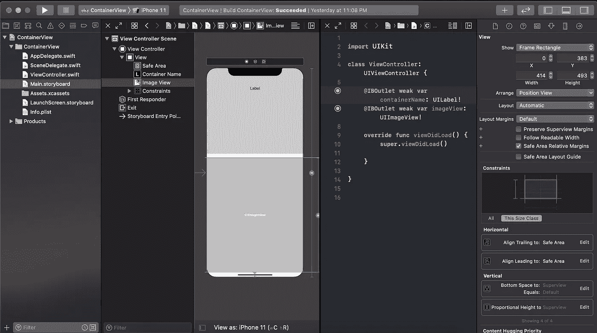
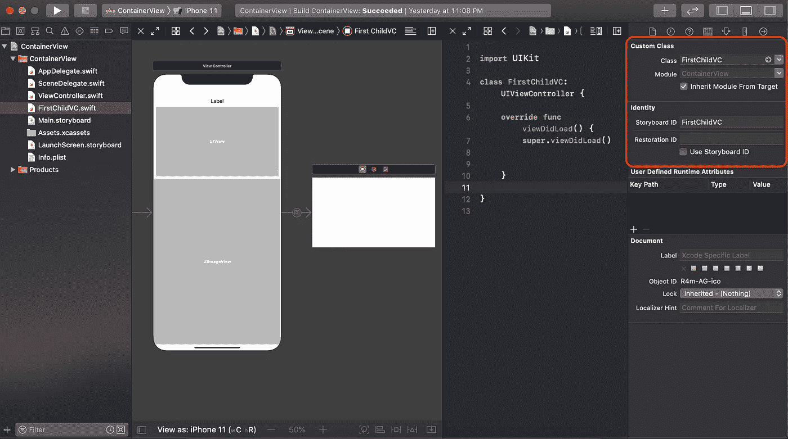
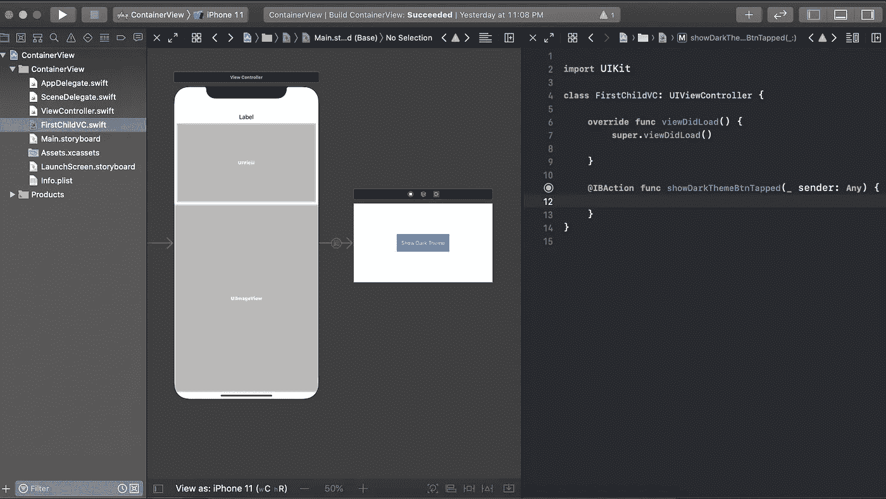
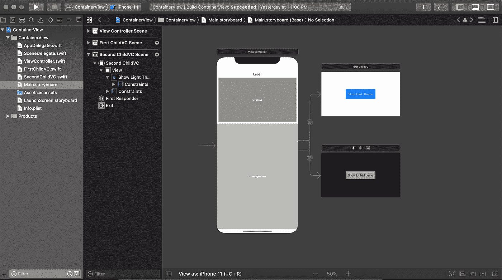
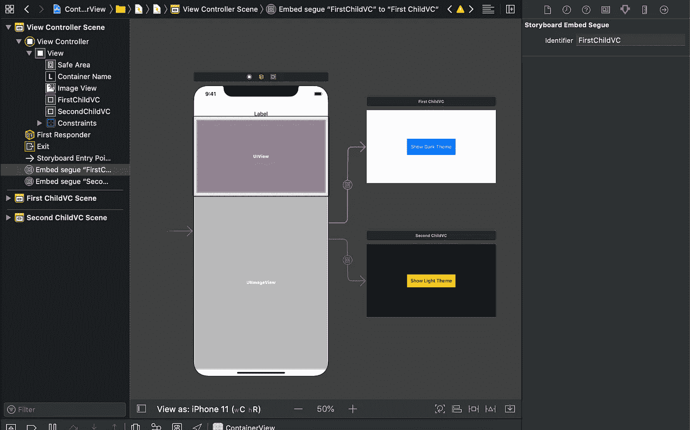
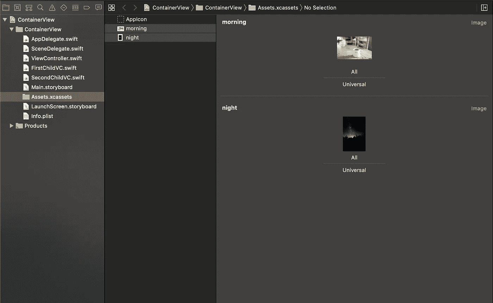
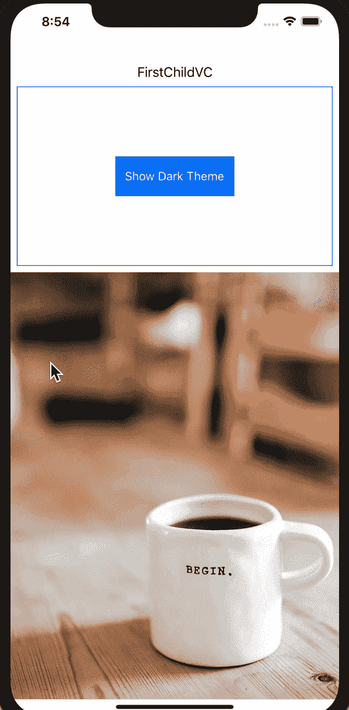

# swift 中的 ContainerView

> 原文：<https://levelup.gitconnected.com/containerview-in-swift-83da488f4b57>


乔安娜·科辛斯卡通过 [Unsplash](https://unsplash.com/) 拍摄的照片

# 概观

在 iOS 开发中，有时我们需要在一个视图控制器的单一位置显示不同的视图元素。这可以通过根据不同的条件将不同的子视图控制器(又名 ContainerView)管理到父视图控制器中来实现。在本教程中，我们将学习:

1.  如何在视图控制器中配置容器视图？
2.  如何根据不同的条件通过管理来显示不同的容器视图？
3.  如何使用闭包在父视图控制器和子视图控制器之间传递信息。

> *本教程使用* ***Swift 5，Xcode 11.2，iOS 13 &故事板界面编写。***

# 从创建项目开始

在 Xcode 中创建单视图应用程序。在视图控制器的顶部取一个标签，在底部取一个图像视图。为它们设置约束和出口。



我们将从对象库中取出两个不同的容器视图，并将它们设置为这个“视图控制器”的子视图控制器。

将容器视图从对象库中拖放到视图控制器中，并将其放在标签和图像视图之间。为容器视图设置约束。创建一个名为“FirstChildVC”的 swift 文件。从 storyboard 中选择容器视图，将该容器视图的类和标识符设置为“FirstChildVC”。在添加第一个子视图控制器之后，我添加了项目概述图片。



现在将一个按钮拖放到您的“FirstChildVC”中。设置名称、约束并采取相应的行动。这个想法是，当我们按下这个按钮时，它将与“视图控制器”通信，并基于此我们将在我们的“视图控制器”中做一些改变。



现在拖放另一个容器视图，并将类似的约束设置为“FirstChildVC”。它将放置到“FirstChildVC”。取一个 swift 文件为“SecondChildVC”。设置 class，该容器标识符被视为“SecondChildVC”。放一个按钮进去，找一个动作出口，然后设计那个按钮。



容器视图作为一个序列与我们的“视图控制器”相连。所以我们必须为每个片段设置一个标识符。将标识符设置为每个容器视图的类名。下图显示了如何为“FirstChildVC”设置标识符。不要忘记也为“SecondChildVC”设置它。



我们的项目设置快完成了，但还有一件事要做。添加了两张与黑暗和光明主题相关的图片，虽然我的图片并不完全适合作为主题图片，但让它保持原样。我把它们命名为“早晨”和“夜晚”。



# 与容器视图连接

首先，我们将在视图控制器中为容器视图做一些初始设置。最初，我们将显示“FirstChildVC”容器视图，并对“视图控制器”隐藏“SecondChildVC”容器视图。这就是为什么在“视图控制器”的顶部，我们将标签设置为“FirstChildVC ”,因为它现在就在屏幕上。我们还将“早晨”图像设置为图像视图图像。用以下代码替换您的“viewDidLoad”函数:

```
**override** **func** viewDidLoad() {**super**.viewDidLoad() firstChildVC.layer.borderColor = UIColor.systemBlue.cgColor firstChildVC.layer.borderWidth = 1 secondChildVC.layer.borderColor = UIColor.systemYellow.cgColor secondChildVC.layer.borderWidth = 1 /* Initially FirstChildVC is showing and SecondChildVC is hidden*/ firstChildVC.isHidden = **false** secondChildVC.isHidden = **true** /*Initially Container Name set to FirstChildVC*/ containerName.text = "FirstChildVC" /*Initially imageView image set to morning image*/ imageView.image = UIImage(named: "morning")}
```

我们的容器视图已经放置在故事板中并准备就绪，但是我们还必须从“View Controller.swift”类连接它们。首先，从 storyboard 中找到容器视图的标识符，并将它们放入“ViewController.swift”文件中的不同变量中。

```
static let toFirstChild = "FirstChildVC"static let toSecondChild = "SecondChildVC"
```

为了与我们的容器视图交流，我们必须与它们建立联系。我们将使用“***override*******func****prepare(for segue:UIStoryboardSegue，sender:****Any****？*)"功能。这个函数获取容器视图控制器的标识符，并为它们建立连接。将这段代码写到视图控制器类中。*

```
***override** **func** prepare(for segue: UIStoryboardSegue, sender: **Any**?) {**if** segue.identifier == ViewController.toFirstChild {**if** **let** firstChildCV = segue.destination **as**? FirstChildVC { //Access your child VC elements }}**if** segue.identifier == ViewController.toSecondChild{**if** **let** secondChildCV = segue.destination **as**? SecondChildVC { //Access your child VC elements } }}*
```

*在“segue”里面。destination "块可以与子容器通信，查看、发送和接收数据。凉爽的😎 😎 😎*

# *回调函数*

*现在我们想通知视图控制器，并在容器视图按钮被按下时做一些事情。为此，我们需要一个回调函数。回调函数基本上是一个闭包，用于根据发生的任何事件与不同的视图控制器通信并传递数据。*

*在“FirstChildVC”类中声明这个回调函数。*

```
***var** showDarkThemeBtnTap : (()-> Void)?*
```

*并将这一行代码写入您的“showDarkThemeBtnTapped”按钮操作函数中*

```
*showDarkThemeBtnTap?()*
```

*对“SecondChildVC”也做一些事情，声明一个回调函数*

```
***var** showLightThemeBtnTap : (()-> Void)?*
```

*与上一个类似，在“showLightThemeBtnTapped”按钮动作上写这个*

```
*showLightThemeBtnTap?()*
```

*现在从父视图控制器，我们必须设置一个观察者来观察回调函数。当回调函数从子视图控制器向父视图控制器发送事件时，粗体标记的代码块会通知我们。*

```
*if segue.identifier == ViewController.toFirstChild {if let firstChildCV = segue.destination **as?** FirstChildVC { firstChildCV.showDarkThemeBtnTap = { //Access your child VC elements **firstChildCV.showDarkThemeBtnTap = {
              //Do action on child class button tap** **}** } }*
```

*在这个块中"*first child cv . showdarkthemebntap = { } "*你可以根据按钮点击动作做任何事情。基本上，这里我们将显示和隐藏我们的视图控制器，为图像设置图像，并显示现在屏幕上的视图控制器的名称。在这个块中写下这些代码行。*

```
*firstChildCV.showDarkThemeBtnTap = { //show hide view controllersself.firstChildVC.isHidden = trueself.secondChildVC.isHidden = false //set image for imageviewself.imageView.image = UIImage(named: "night") /*Set Container Name*/self.containerName.text = "SecondChildVC}*
```

*类似地，我们将为第二个子视图控制器设置一个观察器，并编写这样的代码来在容器视图之间切换。*

```
*secondChildCV.showLightThemeBtnTap = { //show hide view controllersself.firstChildVC.isHidden = falseself.secondChildVC.isHidden = true //set image for imageviewself.imageView.image = UIImage(named: "morning") /*Set Container Name*/self.containerName.text = "FirstChildVC"}*
```

*是时候检验我们目前所做的事情了。构建并运行您的项目，并检查您的程序输出*

**

*下面是“视图控制器”类的完整代码片段。*

```
***import** UIKit**class** ViewController: UIViewController {**@IBOutlet** **weak** **var** containerName: UILabel!**@IBOutlet** **weak** **var** imageView: UIImageView!**@IBOutlet** **weak** **var** firstChildVC: UIView!**@IBOutlet** **weak** **var** secondChildVC: UIView!**static** **let** toFirstChild = "FirstChildVC"**static** **let** toSecondChild = "SecondChildVC"**override** **func** viewDidLoad() {**super**.viewDidLoad() firstChildVC.layer.borderColor = UIColor.systemBlue.cgColor firstChildVC.layer.borderWidth = 1 secondChildVC.layer.borderColor = UIColor.systemYellow.cgColor secondChildVC.layer.borderWidth = 1 /* Initially FirstChildVC is showing and SecondChildVC is hidden*/ firstChildVC.isHidden = **false** secondChildVC.isHidden = **true** /*Initially Container Name set to FirstChildVC*/ containerName.text = "FirstChildVC" /*Initially imageView image set to morning image*/ imageView.image = UIImage(named: "morning")}**override** **func** prepare(for segue: UIStoryboardSegue, sender: **Any**?) { **if** segue.identifier == ViewController.toFirstChild { **if** **let** firstChildCV = segue.destination **as**? FirstChildVC { firstChildCV.showDarkThemeBtnTap = { //Access your child VC elements //show hide view controllers **self**.firstChildVC.isHidden = **true** **self**.secondChildVC.isHidden = **false** //set image for imageview **self**.imageView.image = UIImage(named: "night") /*Set Container Name*/ **self**.containerName.text = "SecondChildVC" } }} **if** segue.identifier == ViewController.toSecondChild{ **if** **let** secondChildCV = segue.destination **as**? SecondChildVC { //Access your child VC elements secondChildCV.showLightThemeBtnTap = { //show hide view controllers **self**.firstChildVC.isHidden = **false** **self**.secondChildVC.isHidden = **true** //set image for imageview **self**.imageView.image = UIImage(named: "morning") /*Set Container Name*/ **self**.containerName.text = "FirstChildVC" } } } }}*
```

*我们的“第一个孩子”班级*

```
***import** UIKit**class** FirstChildVC: UIViewController {**var** showDarkThemeBtnTap : (()-> Void)?**override** **func** viewDidLoad() {**super**.viewDidLoad()}**@IBAction** **func** showDarkThemeBtnTapped(**_** sender: **Any**) {showDarkThemeBtnTap?()}}*
```

*“SecondChildVC”类的代码被截取*

```
***import** UIKit**class** SecondChildVC: UIViewController {**var** showLightThemeBtnTap : (()-> Void)?**override** **func** viewDidLoad() {**super**.viewDidLoad()}**@IBAction** **func** showLightThemeBtnTapped(**_** sender: **Any**) {showLightThemeBtnTap?()}}*
```

*恭喜🎉 🎉 🎉，现在您知道了如何在视图控制器上设置容器视图，如何访问容器视图元素并与之通信。*

***如果你觉得这篇文章有用，请分享并鼓掌**👏👏👏
在[媒体](https://medium.com/@arifulislam14)上查看我的其他文章，在 [LinkedIn](https://www.linkedin.com/in/arifparvez14/) 上联系我。*

*感谢您阅读&快乐编码🙂*