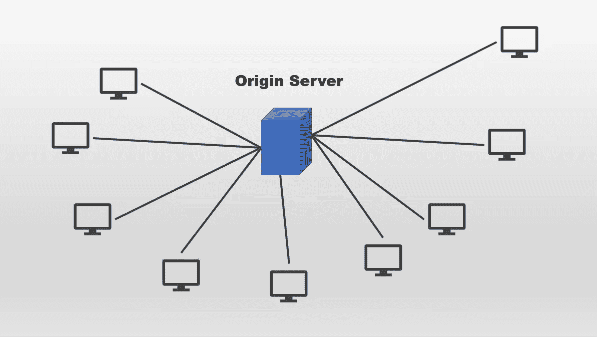
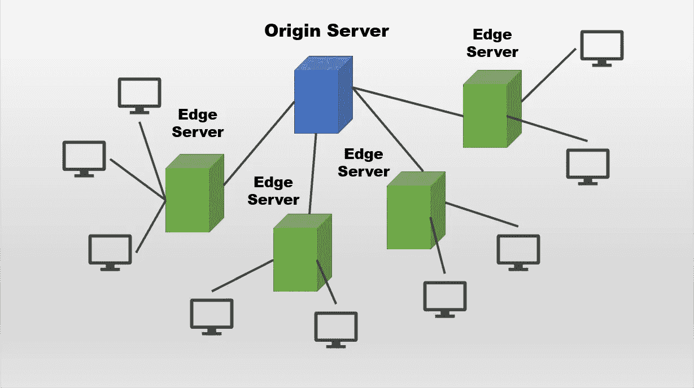

# 内容交付网络:你需要知道什么

> 原文：<https://levelup.gitconnected.com/content-delivery-network-what-you-need-to-know-c404c7330991>

了解 CDN 的工作原理

照片由[法比奥·布拉克特](https://unsplash.com/@bracht?utm_source=unsplash&utm_medium=referral&utm_content=creditCopyText)在 [Unsplash](https://unsplash.com/s/photos/connection?utm_source=unsplash&utm_medium=referral&utm_content=creditCopyText) 上拍摄

今天，我们将讨论内容交付网络(cdn)。CDN 是边缘服务器的分布式网络，有助于向全球用户交付 web 内容。

传统上，大多数公司依赖于单个原始服务器，并对其进行水平扩展以支持其用户群。

作者图片

对于远离原始服务器的用户来说，这种结构会导致额外的分组丢失、延迟和抖动。如果需要多次往返才能生成完整的 web 内容，这可能会成为一个大问题。此外，装载时间的增加往往会赶走客户，导致转化率降低。

# 内容交付网络

[CDN](https://docs.microsoft.com/en-us/azure/cdn/cdn-overview) 架构的概念是让内容更贴近用户，不管他们在哪里。

CDN 背后的基本概念是多个物理节点分布在世界各地，为最近的用户提供高带宽的缓存内容。这些节点被称为存在点  ( [POP](https://en.wikipedia.org/wiki/Point_of_presence) )。至于动态内容，大多数 CDN 提供商利用某种形式的网络和路由优化来自动将流量重新路由到最近的 POP。

此外，CDN 提供商还利用某些形式的图像/视频优化或压缩来提供海量的媒体相关内容。这就是为什么你上传到 YouTube 的视频最初默认为 360p 的质量。处理内容并将其分发到所有边缘服务器需要时间。然后，基于用户位置和带宽，它被缓存作为对用户的服务。较高质量的视频通常需要几个小时才能以相同的分辨率提供给用户。

使用 CDN 的主要目的是:

*   减少加载时间和延迟
*   防止服务器过载并确保更好的可靠性
*   提高安全性并减少任何 DDoS 攻击

下图概述了 cdn 的工作原理。

作者图片

## 减少加载时间和延迟

CDN 架构不是直接为用户服务，而是将内容分发到位于不同位置的多个边缘服务器。然后，根据用户的位置向他们提供内容。这大大减少了加载时间和延迟，因为内容来自最近的服务器。

## 防止服务器过载

边缘服务器能够在将相同的内容提供给用户之前对其进行缓存。当用户请求特定的 web 内容时，在从源服务器请求之前，每个边缘服务器检查他们在边缘中是否有该文件。

该文件通常作为缓存保留在边缘服务器中，直到底层生存时间( [TTL](https://en.wikipedia.org/wiki/Time_to_live) )到期。通常的有效期是七天左右。

边缘服务器一次又一次地重复使用同一个缓存，为请求同一个文件的多个用户提供服务。这大大降低了源服务器的负载，提供了更好的用户体验。

## 更好的安全性

由于用户访问最近的边缘服务器，而不是原始服务器，每个独立的边缘服务器充当一个层，可以减轻 [DDoS](https://en.wikipedia.org/wiki/Denial-of-service_attack) 攻击。这可以保护源服务器不被恶意用户关闭或访问。

## CDN 中断

然而，CDN 提供商也容易出现中断和停机。例如，2021 年 6 月 8 日发生了大规模停电，导致许多主要网络和在线服务中断。受影响最大的公司是:

*   葫芦
*   美国有线新闻网；卷积神经网络
*   《纽约时报》
*   《卫报》
*   推趣
*   Reddit
*   Spotify
*   Vimeo
*   拼趣
*   HBO Max

一项[调查](https://edition.cnn.com/2021/06/09/tech/fastly-internet-outage/index.html)显示问题出在 CDN 提供商 Fastly 身上。他们在 2021 年 5 月 12 日应用了一个软件更新，其中包含一个可能由客户在配置服务时触发的错误。结果，他们的大部分网络在那一天返回错误，导致整个网络服务的巨大中断。幸运的是，一个小时后问题被修复，所有依赖的服务都恢复了。

# 部署策略

## 数据版本化

拥有适当的数据版本控制是必不可少的。它确保当出现导致应用程序功能出现重大问题的编码问题时，您可以轻松地回滚到以前的工作状态。您可能需要对旧版本和新版本使用不同的 CDN 实例，以防止出现问题，例如单个 CDN 实例从其缓存中提供旧内容。

## 捆绑和缩小

您可以通过捆绑和缩小来减少内容的文件大小，从而减少加载时间。这通常用于 CSS 和 JavaScript 等文件，在不改变底层功能的情况下删除不必要的字符。

## 文件压缩

除此之外，另一个选择是在发送给 CDN 提供商或客户之前压缩文件。由于减小了文件大小，这大大提高了性能。确保不要过度使用它，一些 CDN 提供商不鼓励在 MP3、MP4、ZIP 或 JPG 等压缩格式文件上使用这种技术。

一些 CDN 提供商通过缓存仅支持静态内容，而大型 CDN 提供商，如 Azure，可以处理静态内容(S3 存储)和动态内容(S1 威瑞森，阿卡迈 S2)。话虽如此，截至目前还不支持与 Azure Data Lake 的集成。

> 存储和数据湖是两个不同的概念。存储是指云上存储结构化有用数据的文件系统服务。您可以将数据上传并保存到云中，而不是存储在本地。然后，您可以轻松地在您的终端应用程序上提供它。
> 
> 数据湖是一个集中的存储库，可以存储任何规模的所有形式的数据。数据可以是结构化的，也可以是非结构化的。你可以把它想象成原始数据的垃圾场。然后，您可以根据需要访问和处理数据。它主要用于大数据、实时分析和存储机器学习训练数据

# 结论

让我们回顾一下你今天所学的内容。

本文首先简要介绍了 CDNs 以及通过传统方法提供内容时面临的问题。然后，它转移到 CDN 背后的基本概念及其提供的优势。

最后，它讨论了 CDN 提供商如何避免中断，以及不同提供商在提供静态和动态内容时的差异。

感谢阅读。祝你有美好的一天！

# 参考

1.  [维基百科——内容交付网络](https://en.wikipedia.org/wiki/Content_delivery_network)
2.  [科学指导——内容交付网络](https://www.sciencedirect.com/topics/computer-science/content-delivery-network)
3.  [美国有线电视新闻网——快速网络中断](https://edition.cnn.com/2021/06/09/tech/fastly-internet-outage/index.html)

# 分级编码

感谢您成为我们社区的一员！在你离开之前:

*   👏为故事鼓掌，跟着作者走👉
*   📰查看[升级编码出版物](https://levelup.gitconnected.com/?utm_source=pub&utm_medium=post)中的更多内容
*   🔔关注我们:[Twitter](https://twitter.com/gitconnected)|[LinkedIn](https://www.linkedin.com/company/gitconnected)|[时事通讯](https://newsletter.levelup.dev)

🚀👉 [**加入升级人才集体，找到一份神奇的工作**](https://jobs.levelup.dev/talent/welcome?referral=true)