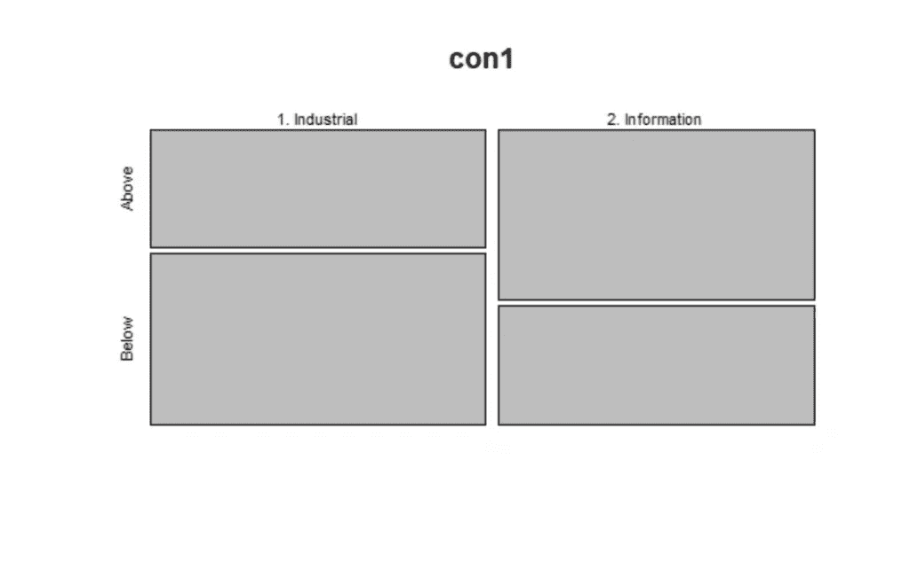
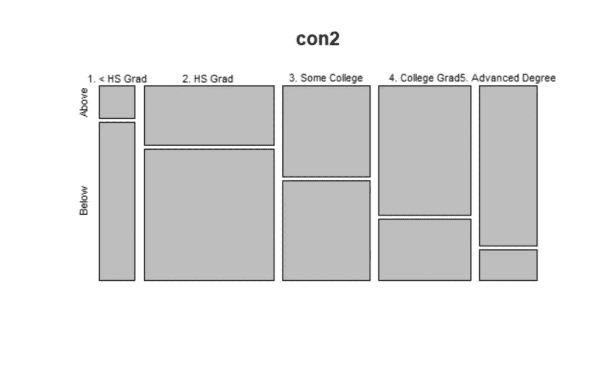
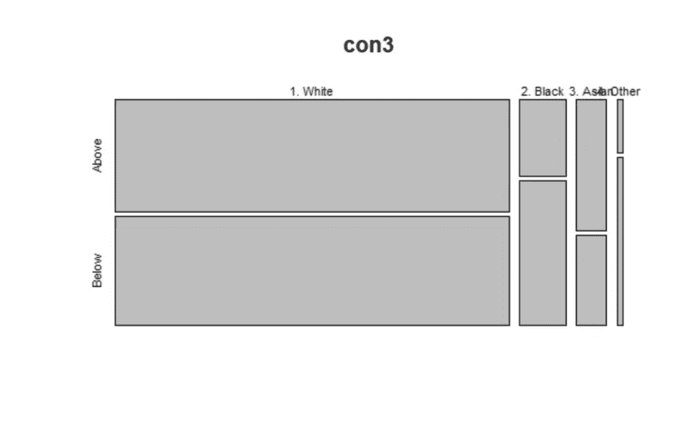

# R 中的列联表

> 原文：<https://levelup.gitconnected.com/contingency-tables-in-r-1385b9d689dd>


来源: [Pixabay](https://pixabay.com/da/photos/m%C3%B8nster-geometriske-abstrakt-flise-3190908/)

## [编程](https://towardsai.net/p/category/programming)， [R](https://towardsai.net/p/category/programming/r)

## 关于 R 中列联表的综合教程，展示了如何分析分类数据之间的关系

[](https://jorgepit-14189.medium.com/membership) [## 用我的推荐链接加入媒体-乔治皮皮斯

### 阅读乔治·皮皮斯(以及媒体上成千上万的其他作家)的每一个故事。您的会员费直接支持…

jorgepit-14189.medium.com](https://jorgepit-14189.medium.com/membership) 

表示和分析分类数据的一种常用方法是通过列联表。在本教程中，我们将提供一些例子来说明如何在 r 中分析双向(`r x c`)和三向(`r x c x k`)列联表。

# 资料组

在本教程中，我们将使用来自`ISLR`包的`Wage`数据集。我们将创建工资的另一个列，当工资高于或低于媒体时，它是分类的，分别取两个值为`Above`和`Below`。数据集的格式如下:

包含以下 11 个变量的 3000 个观察值的数据框架。

*   **年**:记录工资信息的年份
*   **年龄**:工人的年龄
*   **婚姻 1** :表示婚姻状况的因子，有`1\. Never Married` `2\. Married` `3\. Widowed` `4\. Divorced`和`5\. Separated`级
*   **种族**:等级`1\. White` `2\. Black` `3\. Asian`和`4\. Other`表示种族的因子
*   **学历**:一个有`1\. < HS Grad``2\. HS Grad``3\. Some College``4\. College Grad``5\. Advanced Degree`表示学历的因素
*   **地区**:国家的地区(仅限大西洋中部)
*   **jobclass** :一个带有级别`1\. Industrial`和`2\. Information`的因子，表示工作的类型
*   **健康**:水平`1\. <=Good`和`2\. >=Very Good`表示工人健康水平的因素
*   **health_ins** :一个有级别`1\. Yes`和`2\. No`的因子，表示工人是否有健康保险
*   **日志工资**:工人工资日志
*   **工资**:工人原始工资

# 双向表

双向表包含两个分类变量，X 包含 r 个分类，Y 包含 c 个分类。因此，有`r times c`个可能的组合。有时，X 和 Y 都是响应变量，在这种情况下，讨论它们的联合分布是有意义的。在其他情况下，Y 将是响应变量，X 将是解释变量。在这种情况下，谈论 X 和 Y 的联合分布是没有意义的，而是重点讨论给定 X 的 Y 的条件分布。

让我们开始分析数据。一开始就可以看出`wage` _cat 和`Jobclass`的关系。

```
library(ISLR)
library(tidyverse)
library(Rfast)
library(MASS)# create the wage_cat variable which takes two values
# such as Above if the wage is above median and Below if
# the wage is below median
Wage$wage_cat<-as.factor(ifelse(Wage$wage>median(Wage$wage),"Above","Below"))# Examine the Wage vs Job Class
# you could use also the command xtabs(~jobclass+wage_cat, data=Wage)con1<-table(Wage$jobclass,Wage$wage_cat)con1
```

输出:

```
 Above Below 
  1\. Industrial    629   915 
  2\. Information   854   602
```

# 镶嵌图

用图形表示列联表的最合适的方法是镶嵌图:

```
mosaicplot(con1)
```



从上面的马赛克图中，我们可以很容易地看到，在工业部门，低于中位数的人的比例比在信息行业工作的人多。

# 列联表的比例

我们可以得到列联表的比例，整体比例和行列比例。让我们来看看我们该怎么做:

```
# overall
prop.table(con1)# by row
prop.table(con1, margin = 1)# by column
prop.table(con1, margin = 2)
```

输出:

```
> # overall 
> prop.table(con1) 

                     Above     Below 
  1\. Industrial  0.2096667 0.3050000 
  2\. Information 0.2846667 0.2006667 
>  
> # by row 
> prop.table(con1, margin = 1) 

                     Above     Below 
  1\. Industrial  0.4073834 0.5926166 
  2\. Information 0.5865385 0.4134615 
>  
> # by column 
> prop.table(con1, margin = 2) 

                     Above     Below 
  1\. Industrial  0.4241403 0.6031641 
  2\. Information 0.5758597 0.3968359
```

# 行和列总计

我们可以将列联表的行和列合计相加，如下所示:

```
addmargins(con1)
```

输出:

```
 Above Below  Sum 
  1\. Industrial    629   915 1544 
  2\. Information   854   602 1456 
  Sum             1483  1517 3000
```

# 统计测试

为了检验这两个变量之间的关系是否独立，我们可以应用下面的统计检验。

**卡方检验**

我们已经在之前的帖子中解释过[卡方检验](https://predictivehacks.com/how-to-run-chi-square-test-in-python/)。让我们在 R 中运行它:

```
chisq.test(con1)
```

输出:

```
Pearson's Chi-squared test with Yates' continuity correctiondata:  con1
X-squared = 95.504, df = 1, p-value < 2.2e-16
```

正如我们所见，p 值小于 5%,因此我们可以拒绝零假设，即工作阶级独立于工资中位数。

**费希尔精确检验**

当样本量较低时，我们可以应用费雪精确检验来代替卡方检验。

```
fisher.test(con1)
```

输出:

```
Fisher's Exact Test for Count Data 

data:  con1 
p-value < 2.2e-16 
alternative hypothesis: true odds ratio is not equal to 1 
95 percent confidence interval: 
 0.4177850 0.5620273 
sample estimates: 
odds ratio  
 0.4847009
```

我们再次看到，我们拒绝了零假设。

**对数似然比**

我们可以应用的另一个测试是使用质量包的对数似然比:

```
loglm( ~ 1 + 2, data = con1)
```

输出:

```
Call: 
loglm(formula = ~1 + 2, data = con1) 

Statistics: 
                      X^2 df P(> X^2) 
Likelihood Ratio 96.73432  1        0 
Pearson          96.21909  1        0
```

我们再次拒绝了零假设。

请注意，如果我们通过比较**工资中位数**对**种族**和**工资中位数**对**教育程度**进行相同的分析，我们会发现在两种情况下都存在统计上的显著差异。

```
con2<-table(Wage$education,Wage$wage_cat)con2
mosaicplot(con2)
chisq.test(con2)con3<-table(Wage$race,Wage$wage_cat)con3
mosaicplot(con3)
chisq.test(con3)
```

输出



# 三向桌

假设现在我们想要创建三维的列联表，例如**工资中位数**、**种族**和**工作等级**

```
con4<-xtabs(~jobclass+wage_cat+race, data=Wage) ftable(con4)
```

输出:

```
 race 1\. White 2\. Black 3\. Asian 4\. Other 
jobclass       wage_cat                                          
1\. Industrial  Above              558       32       36        3 
               Below              767       79       50       19 
2\. Information Above              701       70       77        6 
               Below              454      112       27        9
```

假设我们想要改变行和列的份额。

```
con4%>%ftable(row.vars=c("race", "jobclass"))
```

输出:

```
 wage_cat Above Below 
race     jobclass                            
1\. White 1\. Industrial             558   767 
         2\. Information            701   454 
2\. Black 1\. Industrial              32    79 
         2\. Information             70   112 
3\. Asian 1\. Industrial              36    50 
         2\. Information             77    27 
4\. Other 1\. Industrial               3    19 
         2\. Information              6     9
```

假设现在我们想逐行获取概率:

```
con4%>%ftable(row.vars=c("race", "jobclass"))%>%prop.table(margin = 1)%>%round(2)
```

输出:

```
 wage_cat Above Below 
race     jobclass                            
1\. White 1\. Industrial            0.42  0.58 
         2\. Information           0.61  0.39 
2\. Black 1\. Industrial            0.29  0.71 
         2\. Information           0.38  0.62 
3\. Asian 1\. Industrial            0.42  0.58 
         2\. Information           0.74  0.26 
4\. Other 1\. Industrial            0.14  0.86 
         2\. Information           0.40  0.60
```

# 科克伦-曼特尔-海恩斯泽尔(CMH)方法

我们正在处理一个 2x2x4 的表，其中**比赛**有 4 个级别。我们想测试 2x2x4 表中 K 个条件优势比的条件独立性和同质关联性。使用 CMH 方法，我们可以将 4 个部分表中的样本优势比合并成一个部分关联的综合测量。在我们的例子中，我们有工资类别(上，下)，工作阶层(工业，信息)和种族(白人，黑人，亚洲人，其他)。我们希望在控制**种族**的同时，调查**工资 _ 类别**和**工作类别**之间的关联。

假设 **wage_cat** 和 **jobclass** 是有条件独立的，给定**种族**，这意味着 wage_cat 和 jobckass 的[比值比](https://en.wikipedia.org/wiki/Odds_ratio)对于所有种族都是 1，而至少有一个比值比不是 1。

\(H_0: θ=1\)代表人种是白人、黑人、亚裔和其他。

使用`Rfast`包，我们可以得到每场比赛的赔率:

```
#get the 4 odds ratiofor (i in 1:4) {

  print(odds.ratio(con4[,,i])$res[1])
}
```

输出:

```
odds ratio  
  0.471169  
odds ratio  
 0.6481013  
odds ratio  
 0.2524675  
odds ratio  
 0.2368421
```

正如我们所见，优势比不接近 1，所以我们预计拒绝零假设。让我们运行 CHM 测试:

```
#CMH Test mantelhaen.test(con4)
```

输出:

```
Mantel-Haenszel chi-squared test with continuity correction 

data:  con4 
Mantel-Haenszel X-squared = 104.45, df = 1, p-value < 2.2e-16 
alternative hypothesis: true common odds ratio is not equal to 1 
95 percent confidence interval: 
 0.4003835 0.5381067 
sample estimates: 
common odds ratio  
        0.4641649
```

正如所料，我们拒绝了零假设，因为 p 值小于 5%。

# 结论

列联表是表示和分析分类变量之间关系的最佳方式。Cochran-Mantel-Haenszel 是 2x2xk 表的合适测试，并且在我们处理具有[辛普森悖论](https://predictivehacks.com/simpsons-paradox-example/)的情况时是一个好方法。

*原载于*[*https://predictivehacks.com*](https://predictivehacks.com/contingency-tables-in-r/)*。*