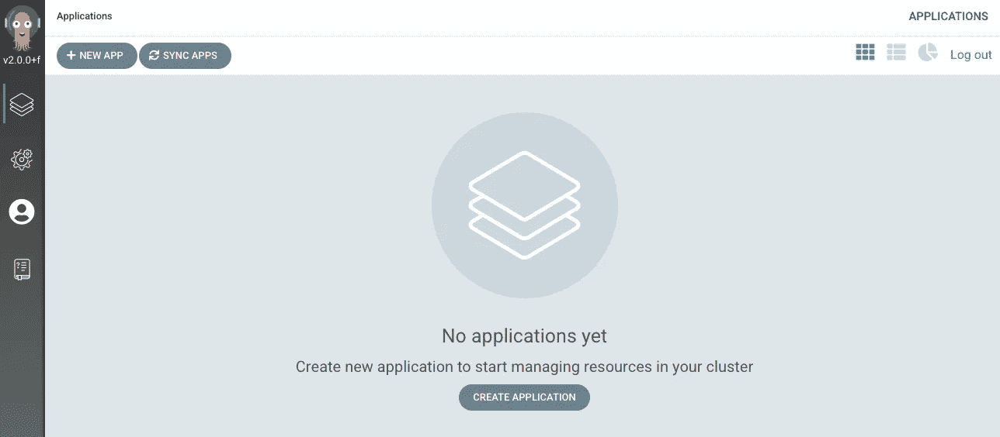
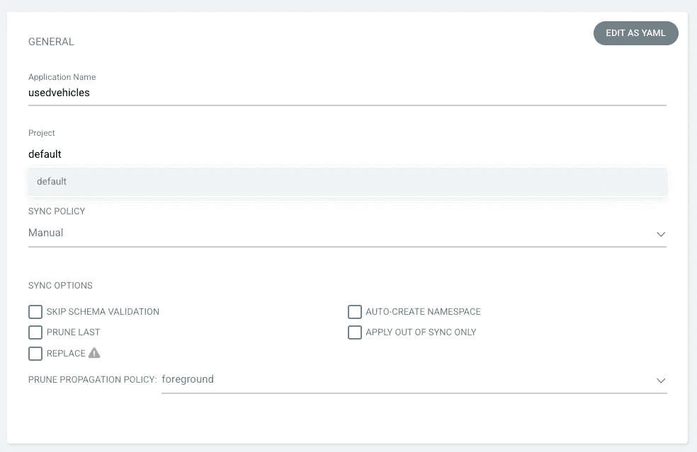
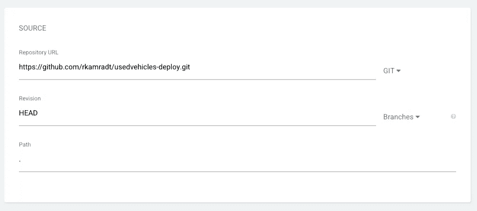
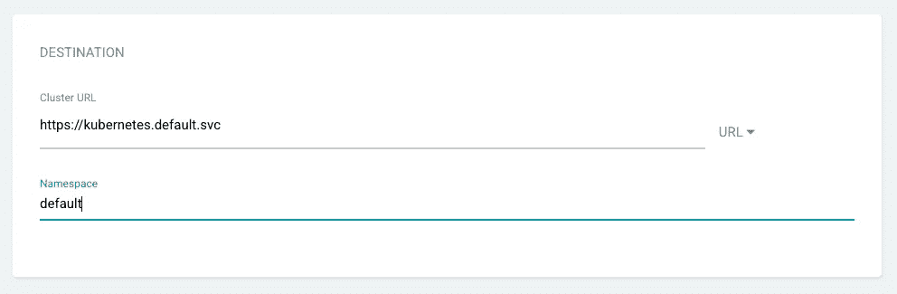
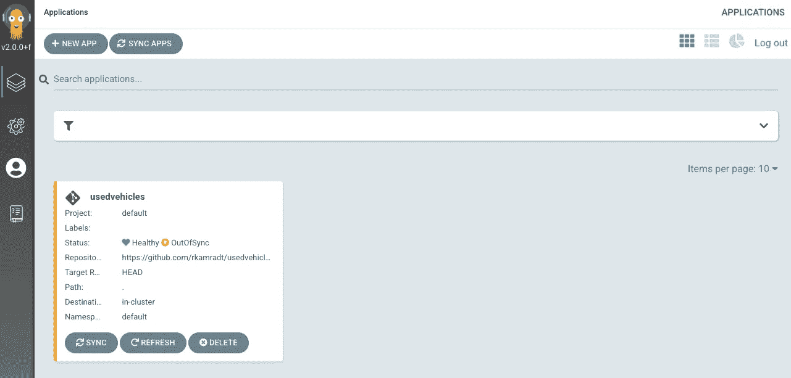
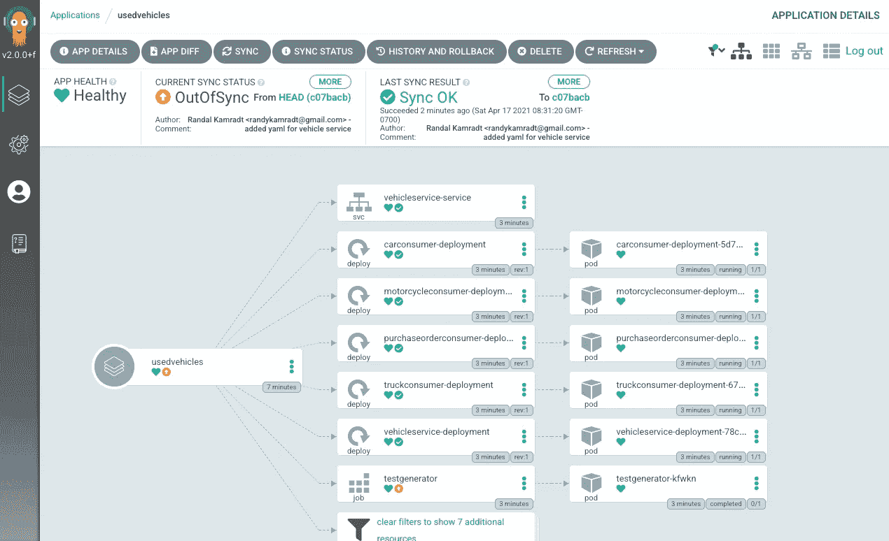

# 用 Argo 连续交货

> 原文：<https://levelup.gitconnected.com/continuous-delivery-with-argo-bb086dd335f8>

## 使用编排器


图片来自 [Pixabay](https://pixabay.com/?utm_source=link-attribution&utm_medium=referral&utm_campaign=image&utm_content=5157153)

在我之前的文章[在 Kubernetes](/running-java-microservices-in-kubernetes-57a7a05e85ac) 中运行 Java 微服务中，我为我创建的一些示例微服务创建了一组部署文件。今天我将使用 [ArgoCD](https://argo-cd.readthedocs.io/en/stable/) 自动部署它们。Argo 将获取一个充满部署文件的目录，不仅可以部署它们，还可以让您了解它们。

为了安装 Argo，我使用了他们的[指令](https://argoproj.github.io/argo-cd/getting_started/)，做了一些小的修改。我的命令是:

```
kubectl create namespace argocd
kubectl apply -n argocd -f \
[https://raw.githubusercontent.com/argoproj/argo-cd/stable/manifests/install.yaml](https://raw.githubusercontent.com/argoproj/argo-cd/stable/manifests/install.yaml)
brew install argocd
kubectl port-forward svc/argocd-server -n argocd 8080:443
```

这将在端口 8080 显示 UI，因此您可以浏览到 [http://localhost:8080](http://localhost:8080) 以确保它已经启动。打开一个新的终端窗口以保持服务器端口转发。首先，您需要默认密码，可以使用以下命令找到它:

```
kubectl -n argocd get secret argocd-initial-admin-secret \
       -o jsonpath="{.data.password}" | base64 -d
```

现在，您可以使用`admin`和上述命令输出的密码登录。您应该会看到一个没有应用程序的屏幕:



要在新实例中使用命令行，您可以登录:

```
argocd login --insecure localhost:8080
```

它会要求您输入用户名和密码，您可以使用上面的用户名和密码。现在，您可以连接到集群。我的集群名是`docker-desktop`,所以我使用了这个命令:

```
argocd cluster add --insecure docker-desktop
```

在继续部署我们的应用程序之前，我们需要建立一些基础设施，即 Couchbase 和 RabbitMQ。你可以在我的[上一篇文章](/running-java-microservices-in-kubernetes-57a7a05e85ac)中找到说明，标题是“在 Kubernetes 中安装 Couchbase”和“将 RabbitMQ 部署到 Kubernetes”。一旦运行并配置了这些项目，您就可以继续创建在 [usedvehicle-deploy](https://github.com/rkamradt/usedvehicles-deploy) 存储库中定义的所有容器。

因为映像已经构建好了，所以您不需要做任何事情来开始部署。Argo 可以直接从 GitHub 中的描述符文件部署，所以让我们试一试。点击“新建应用”按钮开始使用。

在第一个面板中，应用程序名称必须是有效的 DNS 名称，因此不能有空格、特殊字符或大写字母。对于项目，我只是用了`default`。



在下一个屏幕上，您将填写关于存储库的详细信息。在我的例子中，由于我在一个单独的存储库中将我的应用程序的所有配置保存为一堆 YAML 文件，所以我使用了那个存储库 URL(使用`https`协议，所以我不必担心 SSH 密钥)。目前的版本是`HEAD`，路径是必需的，尽管所有东西都在库的根目录下，所以我必须添加一个点(在下图中很难看到)。



向下滚动到目标面板，我添加了要部署到的集群 URL 和名称空间:



现在，单击“创建”按钮，然后单击“同步”按钮，它应该会开始部署您的服务:



点击`usedvehicles`项目，您应该会看到详细视图:



它仍然显示“不同步”，我不知道为什么。Drilling in 说`testgenerator`应用程序不同步，也许是因为它是一个已经结束运行的作业。单击窗格或部署将会显示日志和更多内容。

请注意，Argo 不构建应用程序，它只部署预构建的应用程序。它的主要目的是部署对配置和描述符的更改。假设您使用的是映像的 SHA 哈希而不是标记，您可以使用新的 SHA 哈希更新描述符文件，推送到存储库，它将在下一次同步时重新部署新映像。它是整个 CI/CD 管道的一部分，即最后一部分，CD。

也许在以后的文章中，我会进一步探索如何在更大的管道中使用它，但是我相信如果您是一个精明的 DevOps 管理员，您会看到如何使用这个工具来简化您的生活。

本文中使用的 GitHub 存储库:

[](https://github.com/rkamradt/usedvehicles-deploy/tree/v0.2) [## rkamradt/used vehicles-部署

### 二手车服务的部署脚本。为 rkamradt/used vehicles-部署开发做出贡献，方法是创建…

github.com](https://github.com/rkamradt/usedvehicles-deploy/tree/v0.2) 

参考的其他文章:

[](/running-java-microservices-in-kubernetes-57a7a05e85ac) [## 在 Kubernetes 中运行 Java 微服务

### 微服务与 RabbitMQ 和 Couchbase 捆绑在一起

levelup.gitconnected.com](/running-java-microservices-in-kubernetes-57a7a05e85ac)