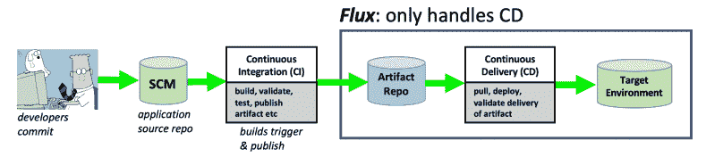
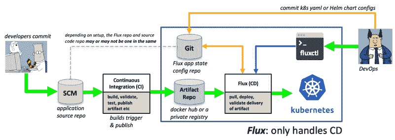
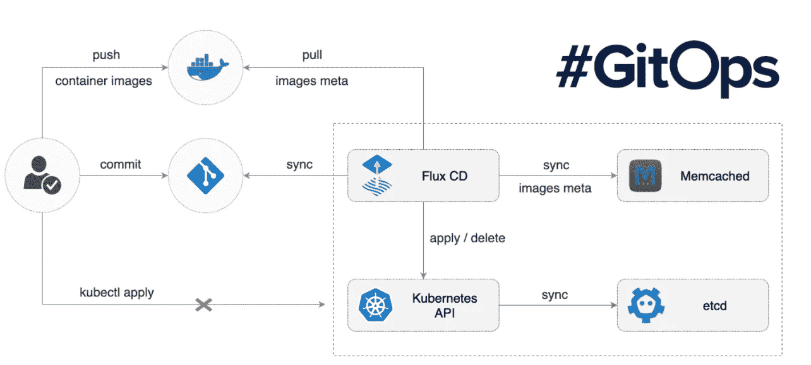
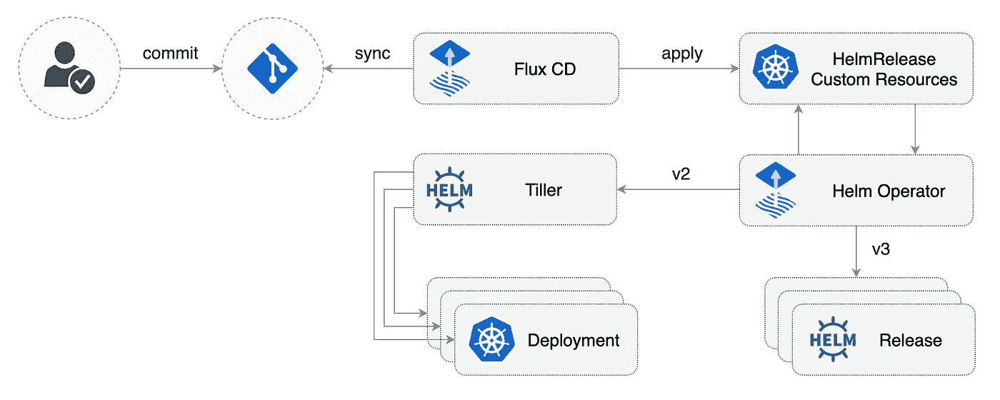
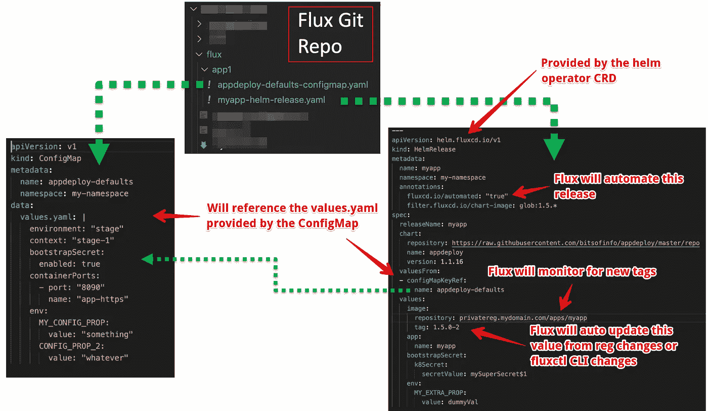

# 通量连续输送

> 原文：<https://levelup.gitconnected.com/continuous-delivery-with-flux-c9b9f7523cd6>

首字母缩写词“CI/CD”及其相应的短语( [*持续集成&持续[交付|部署】*](https://www.atlassian.com/continuous-delivery/principles/continuous-integration-vs-delivery-vs-deployment) )有时会混淆在一起，然而**对每一个都有明确的定义**和界限，尽管有许多 CI/CD 产品使您能够使用相同的工具使用单个框架来实现 CI/CD 等式的两个方面。

连续交付的意图非常简单:获取一个构建的、测试的、验证的工件，并将其“交付或部署”到一个或多个目标执行环境中。CI/CD 系统中的“工件”到底是什么完全取决于每个应用程序和目标执行环境。它可能是要部署到一组虚拟机的 NPM 包、JAR 文件或 ZIP 文件；或者它可以是一个 Docker 映像，需要部署到一个容器运行时或容器编排器，如 Kubernetes。

对于 Kubernetes 部署目标，CI/CD 等式的 ***交付方*** 的工具之一是 [Flux](https://fluxcd.io/) a [CNCF 沙盒项目](https://www.cncf.io/) t

# Flux: GitOps centric k8s 交付

首先，仅供参考；这篇文章纯粹是基于我个人使用 [Flux](https://github.com/fluxcd/flux) 的经验，主要是针对我个人的 CD 使用案例。这篇文章并没有详尽地涵盖每一个 Flux 特性或功能。

当你看到无数不同的 CI/CD 平台、框架和基于云的服务时， [Flux](https://github.com/fluxcd/flux) 脱颖而出有几个原因。首先，它 ***只处理 CI/CD 中“斜杠”的连续交付*** 方(Flux 不用于构建工件)，其次，它专门针对 Kubernetes 执行环境，第三，它以 GitOps 为中心。

首先，你问的“GitOps”是什么？每当你开发定制软件时，CI/CD 管道确实是软件..)一般你要把你系统的“状态”或者“期望状态”存储在某个地方；这可能是一个 RDBMS，NoSQL 数据库系统等等……使用 GitOps，你可以用 Git 描述你的系统的预期状态，并利用 Git 为历史等提供的所有内置结构和功能，而不是自己编写所有的内容。Git 成为您的系统在一段时间内所采取的所有操作的历史和血统的最终来源。通过利用 Git 作为所有行为的来源，您可以(理论上)总是将您的状态“重置”回任何先前的时间点；当然，这取决于所述状态的消费者的能力。

所以说到底，GitOps 基本上是一种开发运维的方式，对 Git 库的更改会触发您环境中的所有下游操作，这正是 Flux 在其中运行的范例。值得注意的是，这个驱动 CD 系统的 Git 存储库*可能是也可能不是 CI 系统用来构建工件的存储库，CD 系统随后将这些工件交付给目标执行环境；*也就是说，您可以将 CD 系统状态配置存储在与您的应用程序源代码完全不同的存储库中。**

# Flux 高层架构

使用 Flux，您可以[将 Flux 守护进程](https://docs.fluxcd.io/en/latest/tutorials/get-started-helm/)安装到目标 Kubernetes 集群上，您希望该集群成为您的 CD 系统的目标(即应用程序工件被部署到的地方)。每个 Flux 守护进程都与一个 Git 存储库有一对一的关系，守护进程从这个存储库中获取配置，告诉 Flux 应该将什么“状态”应用于 Flux 守护进程所在的 k8s 集群。(即 Git repo 包含标准 k8s YAML 清单和/或 *HelmRelease* 图表声明)。Flux 基本上对这个 Git 存储库中的变化做出反应，并通过应用更新的 k8s YAML 清单(或通过 [Flux helm-operator](https://github.com/fluxcd/helm-operator) 调用集群本身内的 Helm 来调用 *HelmReleases* )在 Kubernetes 中做出必要的改变。(仅供参考，Flux [也可以通过 Kustomize 等工具选择性地生成原始 k8s YAML 清单](https://docs.fluxcd.io/en/1.19.0/references/fluxyaml-config-files/))

Flux 还有一个额外的好处，那就是它可以通过它的“自动化”特性对每个 Docker *映像:标签*进行监控，这些映像和标签在 Git 存储库的 k8s YAML 或 *HelmReleases* 中被引用。这样做的效果是，当新的 Docker 映像版本被推送到映像注册表时，Flux 可以检测到这一点，并使用检测到的新映像标签自动更新先前应用的 k8s YAML，将更改应用到集群(并随后使用新的映像引用双向更新 Flux 关联的 Git 储存库)。第三…您可以通过一个名为的 CLI 工具在 Flux 守护进程上手动强制进行更改，一旦应用了您请求的更改，它将再次反映到 Git 存储库中，以确保声明的状态是最新的。例如，您可以通过 [***fluxctl***](https://docs.fluxcd.io/en/1.19.0/references/fluxctl/) 手动更新名为“workload”的运行中的 Flux，将 pod 更新到集群上的新映像，并依次更新 Flux git 存储库中的 YAML/赫尔姆版本配置……完成所有良好的 git 沿袭、历史和跟踪。 *fluxctl* CLI 具有[众多其他功能](https://docs.fluxcd.io/en/1.19.0/references/fluxctl/)，如锁定/解锁、回滚、切换工作负载自动化等。

哇，那是一堆…这里有一个总结，你可以用 Flux 控制什么得到*【持续交付】*你的 Kubernetes 集群。

*   **手动更改并提交 Flux Git repo 中更新的 k8s 清单或 Helm 配置？** *Flux 可以自动应用到集群。*
*   **新*图片:标签*被 CI 系统推送到一个注册表中，用于一个 Flux 工作负载？** *Flux 可以自动应用到集群并更新 Flux Git repo。*
*   **通过 fluxctl CLI 手动调整工作量？** *Flux 可以自动应用到集群并更新 Flux Git repo。*
*   **通过 kubectl 或其他非通量工具/api 对正在运行的 k8s 工作负载进行更改？*没有！*** *通量不会检测到这种变化。*

总的来说……我想:正是这种功能让 Flux 给人留下了深刻的印象。

*Vanilla Flux 行为:监视其 k8s YAML 清单的 Git 存储库和可选的 docker 注册表，以发现要应用于目标 k8s 集群的更改。*

# 通量和舵

开箱即用，Flux 只能处理基本标准的 Kubernetes“种类”的 YAML 货单(静态的或[生成的](https://docs.fluxcd.io/en/1.19.0/references/fluxyaml-config-files/)，想*吊舱*，*部署*等。).但是如果你的应用是通过 Helm 管理的呢？正如前面提到的，这就是[通量舵操作员项目](https://github.com/fluxcd/helm-operator)的目的。在 k8s 集群上安装 helm-operator(与 Flux 守护进程安装在同一个集群上)。运营商增加了对新赫尔姆 CRD API(*“helm . fluxcd . io/v1”*)的支持，该 API 支持“ *HelmRelease* 类型的新 k8s API“种类”。有了 HelmRelease 清单，你可以声明你想要安装/升级哪个图表，它的值等等，就像管理 Helm release 的类似工具一样，比如 [helmfile](https://github.com/roboll/helmfile) 。简而言之，你在 YAML 宣布舵释放。

*helm-operator 增强的 Flux 行为:监控其“helmRelease”清单的 Git 存储库和可选的 docker 注册表，以发现要应用于目标 k8s 集群的更改，这些更改通过在集群本身内执行的 Helm 进行安装/更新。*

那么这些 Flux Git 仓库和它的内容实际上是什么样子的呢？对于我的用例，我使用 helm-operator 自动安装应用程序，使用 [appdeploy Helm chart](https://github.com/bitsofinfo/appdeploy) ，使用*Helm release*“Kind】和在原始 k8s YAML 清单中声明的各种配置图。这里有一个非常简单的例子:

*Flux 守护进程监控的 Git 存储库及其内容的示例视图。Flux 将自动检测这些文件的更改，并自动将它们应用到 k8s 集群。这些文件也可以在 Git 中通过 fluxctl 或 image registry automation(如果启用的话)进行双向更新。*

# 通量警告

以下是我在使用 Flux 时注意到的事情。它们不一定是交易破坏者，但可能会也可能不会影响您的使用情形，需要注意的是:

## Flux Git 存储库与 Flux 守护进程的一对一关系

如果您只管理一个应用程序或几个简单的应用程序，这可能不是太大的问题，但是如果您有许多应用程序，都有不同的发布周期等，您可能不希望将所有 k8s yaml/helm 发布配置混合在一个共享的 Git 存储库中。一种解决方案是运行多个 Flux 守护进程，每个守护进程都绑定到自己的 Git 存储库，这并不理想，但可以工作。有一个[开放的问题，这与通量](https://github.com/fluxcd/flux/issues/1164)以及一个[定制的 CRD 解决办法，它在这里](https://github.com/justinbarrick/flux-operator)。

## 您的 k8s YAML 或头盔版本也利用其他设置的当前图像标签

如果您的 *HelmReleases* 或 k8s YAML 清单利用了***fluxcd.io/automated:“真”*** 注释通量将方便地自动处理将这些更改应用到您的集群，并在 Git 中双向反向更新您的 YAML，如果 *fluxctl* 命令发出或检测到新的图像版本等。但是，如果您的 *HelmReleases* 或 raw k8s YAML 清单中有其他值也引用了图像标签/版本，则当通过 *fluxctl* 或自动注册表图像标签检测发生版本更改时，这些值不会自动更新。默认情况下，在您的 YAML 清单或 *HelmRelease* 声明中唯一会获得最新图像标签/版本值的是众所周知的位置中的[引用。绕过这个](https://docs.fluxcd.io/en/1.19.0/references/helm-operator-integration/#automated-image-detection)[的一个方法可能是通过清单生成支持特性](https://docs.fluxcd.io/en/1.19.0/references/fluxyaml-config-files/)，使用 [Kustomize](https://kustomize.io/) 和/或自定义命令(注意，您只能使用默认 Flux docker 映像中可用的命令集)。[更多信息请点击通量松弛通道。](https://cloud-native.slack.com/archives/CLAJ40HV3/p1590098823244700)

# 摘要

总的来说，我真的很喜欢 Flux，并且肯定会推荐在绿地项目中使用它。如果您现有的部署工作流使用其他定制程度不同的工具，迁移到 Flux 可能会更具挑战性，但这将因具体情况而异。Flux 无疑是一个你需要适应的固执己见的 CD 系统，它相当开放，但也有一些你需要知道的限制。总的来说，在使用它时，它感觉非常有凝聚力，并且与图像注册表和 fluxctl 选项的自动化紧密联系在一起。请记住，对于 Flux，如果您喜欢 fluxctl 提供的更多手动控制，自动化是完全可选的。

我希望这有所帮助，我强烈建议检查一下。

*原载于 2020 年 5 月 22 日 http://bitsofinfo.wordpress.com***。**