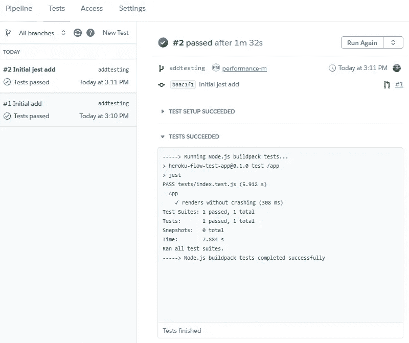
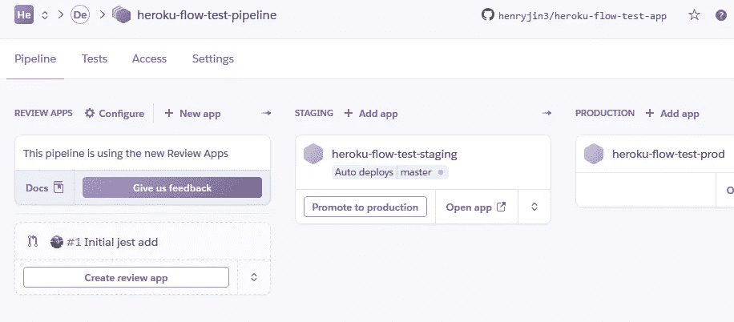

# 持续部署应该不难

> 原文：<https://levelup.gitconnected.com/continuous-deployment-shouldnt-be-hard-6f31c2ce2bc0>

# 介绍

在过去的十年中，持续集成(CI)和持续交付(CD)已经成为软件开发生命周期的主要部分。CI 自动化了合并代码和检查基本回归和代码质量问题的过程，减轻了开发团队的一些代码审查负担。CD 和自动化部署消除了每次需要部署新功能或修补程序时的开销。

想象一下，如果没有更多的夜晚和周末花费在打包构建和跨服务器手动部署上！一个功能性的 CI/CD 设置使得拥有一个真正敏捷的工作流变得非常容易，因为您可以根据需要频繁地进行部署。

然而，特别是 CD 可能很难设置，通常需要学习一整套新的技能，包括 Dockerfiles、YAML 以及每个应用程序和环境的特性。特别是对于较小的团队，这些复杂性使得自动化部署的想法只是一个梦想。

连续部署不需要这么难设置。

作为一名全栈开发人员和顾问，他经常帮助开发团队增加他们在每个 sprint 中交付的价值，当 [Heroku Flow](https://www.heroku.com/flow) 进入我的视野时，我知道是时候仔细看看了。这可能是我一直在寻找的简单、直接的解决方案吗？

# 什么是 Heroku 流？

Heroku Flow 是几个不同 Heroku 产品的保护伞，这些产品共同提供一套完整的 CI/CD 工具。关于词，有[和](https://devcenter.heroku.com/articles/heroku-ci)。对于 CD，有 [Heroku Pipelines](https://devcenter.heroku.com/articles/pipelines) ，它允许您指定一组环境来提升构建，还有 [Heroku Review Apps](https://devcenter.heroku.com/articles/github-integration-review-apps) ，它为您提供每个 pull 请求的按需构建。GitHub Integration 将所有这些整合在一起，它允许简单地通过推送到您的默认分支来自动触发流程。

让我们建立一个示例应用程序，看看它需要什么。请注意，Heroku Review Apps 目前仅适用于 GitHub 集成。

# 如何设置 Heroku 流程

首先，您需要一个应用程序来进行试验。如果您只是尝试一下，请随意使用我的示例应用程序。这是一个基本的 Next.js 应用程序，添加了一个简单的单元测试。

如果您正在添加自己的 Next.js 应用程序，请注意，您需要向`start`命令添加一个`PORT` arg，如下所示:

从那里，[注册了一个 Heroku 账户](https://signup.heroku.com/)，让我们开始吧！

# Heroku 管道

在 Heroku 仪表板中，创建一个新的管道:

给它起任何你喜欢的名字。

您可以在创建时将它连接到 GitHub，也可以在创建管道后这样做:

管道就创建好了！让我们继续前进。

# Heroku 评论应用程序

让我们打开查看应用程序:

你会看到很多选项。作为默认配置，我建议如下:

哇，那也很简单！只差几步了。

# 添加环境和配置项

随着管道的创建，现在我们需要添加一些应用程序。我将添加试运行和生产环境:

这样做两次，每个环境一次。您应该会看到类似下面的截图:

我还建议在您的第一个环境中设置自动部署。对我来说，它是舞台:

最后，让我们也打开 CI。再点击一下，我们就完成了。

就是这样！什么，你不相信我？不相信这一切真的会那么容易？好吧，让我们测试一下看看，好吗？

# 测试 Heroku 流

准备好尝试一切了吗？[在您的回购中创建一个拉动式请求](https://docs.github.com/en/github/collaborating-with-issues-and-pull-requests/creating-a-pull-request)。对我来说，我决定围绕添加单元测试创建一个 PR。一旦你在 GitHub 中创建了你的公关，你应该会看到这样的内容:

单击“详细信息”会将您带到 Heroku 的网站，在那里您可以看到配置项的状态。

在配置项的同时(或之后，取决于您的设置)，还将部署审阅应用程序。注意:如果您选择了在 CI 之后部署 review 应用程序的选项，但是您没有测试，它将不会部署。所以确保你至少有一个测试！

点击“查看部署”，您将进入您的审核应用程序。如果您正在使用我的示例应用程序，您将看到以下内容:

看起来不错。让我们继续[合并 PR](https://docs.github.com/en/github/collaborating-with-issues-and-pull-requests/merging-a-pull-request) 。然后，您可以检查为哪个环境设置了自动部署。在我的例子中，是暂存环境:

看到那个黄圈了吗？一旦变成绿色，您就可以开始了:

点击“打开应用”，确保一切正常。准备投入生产了吗？只需点击“推广到生产”。

做好准备，一旦你点击“推广”,它将立即出现。

就是这样！从公关阶段到生产阶段，我们一直在修改代码。让我们缩小范围，在其他一些竞争产品的背景下思考这个问题。

# 让我们谈谈 DevOps

我的 DevOps 之旅是从 [Azure DevOps](https://azure.microsoft.com/en-us/services/devops/) 开始的——虽然那时候叫微软应用生命周期管理。现在的 Azure Pipelines 曾经是[微软发布管理](https://docs.microsoft.com/en-us/azure/devops/pipelines/archive/release/overview-rm2015?view=azure-devops)，它是工具(与内部 TFS、团队构建和微软测试管理器一起)形成了我们 CI/CD 工作的中心。当时，我是一家小公司的一员，该公司缺乏标准化的流程和程序，因此我和其他几个人组建了一个内部 DevOps 团队，在我们公司的所有项目中推广 CI/CD。也就是说，每个项目都有不同的设置；一些有 CI，一些有 CD，一些有仅用于开发/测试的 CD，等等。总的来说，我们只是试图在有总比没有好的假设下做一些事情。

从那时起，我获得了 Azure DevOps 和 [GitHub Actions](https://github.com/features/actions) 的经验。这两个解决方案都是对旧的 Microsoft 工具的重大改进，并且比以往任何时候都更容易为您的团队设置基本的 CI/CD。然而，Azure DevOps 仍然是遗留版本管理和新的基于 YAML 的工作流设置的一种奇怪的混合，GitHub Actions 只是足够新，有时没有预建的动作来做你需要的事情。这两个问题使得您需要花费更多的时间和资源来设置和维护 CI/CD 设置，从而增加了管理费用。

我最近也有机会使用 [Netlify](https://www.netlify.com/) 作为[我的个人网站](https://henryjin.dev/)，只需点击几下，我的 CI/CD 就可以启动并运行，查看应用程序等等。这让我真的想找到一些类似的商业用途，可以处理 JAMStack 应用程序之外的更复杂的用例。

我很高兴地发现，Heroku 正在提供一个类似的，没有麻烦的 CI/CD 体验，但具有 Heroku 平台其余部分的额外灵活性。很难强调这有多简单。我确信以后会有复杂性，因为几乎在任何 DevOps 任务中都有，但我通常发现 DevOps 在开始时的易用性甚至在更复杂的情况下也能继续带来好处。

至于评论应用，GitHub Actions 根本没有内置。Azure DevOps 正在[到达那里](https://devblogs.microsoft.com/devops/review-apps-in-azure-pipelines/)，但是这需要你同时建立和维护 [Azure Kubernetes 服务](https://azure.microsoft.com/en-us/services/kubernetes-service/)以及相关的清理工作。相比之下，Heroku Review Apps 会为你处理这一切。Review Apps 真的是一个很棒的特性，它允许开发团队在合并到 master 之前很容易地从用户和测试人员那里获得反馈，我强烈推荐它。

# 审查和结论

总的来说， [Heroku Flow](https://www.heroku.com/flow) 的特性集、与 GitHub 的直观集成以及设置的简易性给我留下了深刻的印象。我肯定会为我自己和我的客户更多地考虑这一点，因为对于较小的开发团队来说，设置的方便性是无价的，即使对于较大的团队来说，开销的任何减少都意味着更多的时间专注于实际的开发任务。