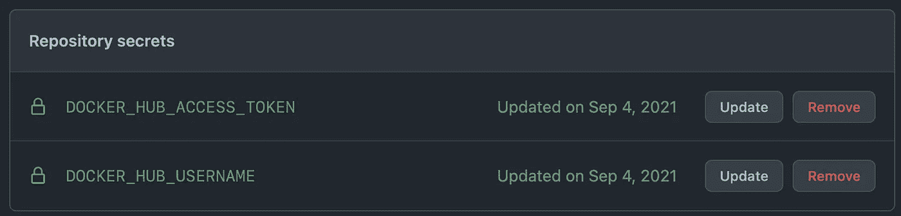
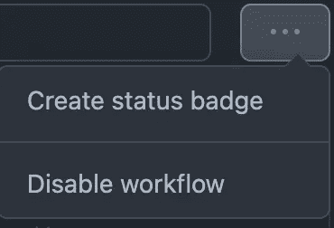

# 通过 Bazel + Github 操作持续部署

> 原文：<https://levelup.gitconnected.com/continuous-deploys-with-bazel-github-actions-c508676678e8>


来源: [**Pixabay**](https://www.pexels.com/@pixabay)

## 直接来自您的回购协议的 CI/CD

运输代码可能是一场噩梦。

随着每一次代码推送，您都需要构建、测试并最终将您的工件上传到可以使用它们的地方。

随着 Docker 的兴起，我们有了掩饰构建和部署环境中微小差异的奢侈——但我们仍然需要在正确的时间拉、构建和推送正确的工件，在您合并新代码时做出响应，并提供运行器来执行所有这些工作。

像[**circle ci**](https://circleci.com/product/#hosting-options)[**TeamCity**](https://www.jetbrains.com/teamcity/)和[**Jenkins**](https://www.jenkins.io/)**这样的服务通过帮助我们解决这些问题而蓬勃发展，但是现在你可以直接从 Github 本身管理这个问题。**

**为了向您展示如何操作，让我们来解决一个(相对)简单的问题:**

> **我们必须创建一个 MediaWiki 扩展(称为语义 MediaWiki)的工作 Docker 安装，并将其部署到其他人可以下载并开始使用它的地方。**

**我在 [**这个回购**](https://github.com/NaimKabir/semantic-mediawiki) 中这么做了，你可以用它作为你正在处理的问题/代码库的入门工具包:**

> **[**Github 仓库:部署语义 MediaWiki**](https://github.com/NaimKabir/semantic-mediawiki)**

**以下是一些额外的约束条件，以加强我们系统的安全性和效率:**

*   **每当我们更改关键路径代码时，我们都应该进行另一次部署**
*   **我们应该在部署之前测试所有的更改**
*   **我们应该*只*测试+构建已经改变的东西，以节省时间和资源**

# **巴泽尔**

**Bazel 是一个构建和测试框架，它明确地绘制出你的依赖关系。使用它的语言，您可以列出一组构建“目标”——您正在构建的可以相互依赖的工件——以及实际构建它们的“规则”。**

**从 [**JavaScript**](https://github.com/bazelbuild/rules_nodejs) 到 [**Python**](https://github.com/bazelbuild/rules_go) 都有构建规则——但这里我们将重点关注用于构建、操作和部署 Docker 容器的规则: [**rules_docker**](https://github.com/bazelbuild/rules_docker) 。**

**使用这些预构建的规则(我们将其安装到我们的 Bazel [**工作区**](https://github.com/NaimKabir/semantic-mediawiki/blob/2661cb71bea6357c790f8144dc911dd8684c94f0/WORKSPACE) )，我们可以配置 [**BUILD.bazel**](https://github.com/NaimKabir/semantic-mediawiki/blob/2661cb71bea6357c790f8144dc911dd8684c94f0/container/BUILD.bazel) 文件来做类似于 [**从 Docker Hub(或从 AWS ECS，或任何地方)拉一个容器**](https://github.com/NaimKabir/semantic-mediawiki/blob/2661cb71bea6357c790f8144dc911dd8684c94f0/WORKSPACE#L29-L38) 的事情:**

```
container_pull(
    name = "mediawiki-linux-amd64",
    registry = "index.docker.io",
    repository = "library/mediawiki",
    digest = "sha256:996dd16efe204eaa7bfa1d104f549976d3becb7a3e96501fc9fdd6089f776e21" # mediawiki:1.35.3, linux/amd64
)
```

**我们可以用 的各种操作 [**对其进行修改:**](https://github.com/NaimKabir/semantic-mediawiki/blob/2661cb71bea6357c790f8144dc911dd8684c94f0/container/BUILD.bazel#L8-L25)**

```
container_run_and_commit(
    name = "installs",
    image = "[@mediawiki](http://twitter.com/mediawiki)-linux-amd64//image",
    commands = [ 
      //commands here...
    ],
)
```

**而且我们可以 [**把它推到一个注册表**](https://github.com/NaimKabir/semantic-mediawiki/blob/2661cb71bea6357c790f8144dc911dd8684c94f0/container/BUILD.bazel#L71-L79) 。**

```
container_push(
    name = "release", # the name of this target
    image = ":release-container", # a docker target built beforehand
    registry = "index.docker.io", # the dockerhub registry
    repository = "{{INSERT YOUR DOCKER HUB REPO HERE}}",
    tag = "3.2.3",
    skip_unchanged_digest = True, # don't push if its the same
    format = "Docker",
)
```

**尽管在我们这样做之前，我们还可以 [**运行测试**](https://github.com/NaimKabir/semantic-mediawiki/blob/2661cb71bea6357c790f8144dc911dd8684c94f0/container/BUILD.bazel#L60-L67) ！**

```
container_test(
    name = "test",
    configs = [
      // *.yaml files that describe tests
    ],
    image = ":test-container",
)
```

**这些测试在 yaml 中定义，并在容器中运行简单的 shell 命令来检查预期的输出。谷歌的 [**容器结构测试**](https://github.com/GoogleContainerTools/container-structure-test) 项目在这里提供了最详细的内容，但他们的一个简单例子是:**

```
commandTests:
  - name: "gunicorn flask"
    setup: [["virtualenv", "/env"], ["pip", "install", "gunicorn", "flask"]]
    command: "which"
    args: ["gunicorn"]
    expectedOutput: ["/env/bin/gunicorn"]
```

**这一切都很巧妙——但是 Bazel 的天才之处不在于你可以编排所有这些构建和测试步骤。**

**Bazel 的天才之处在于它只会构建和测试自上次以来已经改变的东西*！您对文件所做的任何更改都会被检测到，并且只会传播到依赖它们的目标。***

**在 [**范例库**](https://github.com/NaimKabir/semantic-mediawiki) 中，在 [**安装 Bazel**](https://docs.bazel.build/versions/main/install.html) 之后，您可以运行以下代码，这将花费*很长的时间来构建一切并执行测试。***

```
# Run 1: Executed in  179.11 secs
>> bazel test //...
```

**但是当你再做一次的时候，它会立刻发生。太美了。**

```
# Run 2: Executed in  716.89 millis
>> bazel test //...
```

**所以:我们可以构建我们的工件，并从我们的本地机器部署它们。**

**但更酷的是，如果每次我们推送代码时，这种情况都会自动发生。**

**这让我们进入了真正的持续部署领域。**

**进入: [**Github 动作**](https://docs.github.com/en/actions/quickstart) 。**

# **Github 操作**

**Github 基本上允许你在推送和合并代码时运行任意的作业(在其他 [**事件**](https://docs.github.com/en/actions/using-workflows/events-that-trigger-workflows) 中)，所有这些都是通过设置一点 yaml 配置来实现的。**

**在这里，我将向您展示这与我们的 Bazel 构建系统配合得有多好。您在 repo 中设置了一个`.github/workflows`目录，Github 将读取这种粗略形式的 yaml 文件:**

```
name: {{ name of workflow }}
on: 
  {{ event to trigger workflow}}
jobs:
  example-job:
    runs-on: ubuntu-latest
    steps:
      - name: {{ step name }}
        runs:
          // commands
```

**在我们的示例存储库中，我们有一个 [**deploy.yaml**](https://github.com/NaimKabir/semantic-mediawiki/blob/7ce37c65b248e4e18c1a0eeb23288710dc287559/.github/workflows/deploy.yaml) 工作流，它是这样开始的:**

```
name: deploy 
on: 
  push:
    branches:
     - main
jobs:
  test-and-deploy:
    runs-on: ubuntu-latest
```

**这将创建一个“部署”工作流，在分支`main`上有`push`事件时触发。**

**它只有一个任务`test-and-deploy`，运行在最新版本的 Ubuntu 操作系统上。**

**太好了，让我们来看看这项工作的一些细节。**

**我们从这一系列步骤开始:**

```
steps:
      - name: Checkout
        uses: actions/checkout@v2
```

**这一步就像它听起来的那样:它对我们的存储库的代码做了一个`git checkout`,因此它在工作范围内。**

**你可能想知道`actions/checkout@v2`指的是什么，它是如何工作的——这是一个好问题。这是一个 [**动作**](https://docs.github.com/en/actions/learn-github-actions/understanding-github-actions#actions) ！动作有点像软件交付工作流的应用程序，您可以将其插入到您的构建中并简化开发。有一整个 [**市场**](https://github.com/marketplace?type=actions) 都是他们。**

**我们使用下面的另一个动作:**

```
- name: Bazel cache
        id: bazel-cache
        uses: actions/cache@v2
        env:
          version: 4.2.1
        with:
          path: | 
            ~/.cache/bazel
          key: ${{ runner.os }}-{{ env.version }}-bazel-cache
```

**[**actions/cache @ v2**](https://github.com/actions/cache)是一个出色的动作，它可以在每次运行之间保持状态，即使表面上每次推送代码和执行工作流时都提供了一个新的运行器。**

**在这里，我们使用它来保存 Bazel 缓存——这就是 Bazel 如何知道之前已经构建了什么，以及为什么它可以给你*惊人的*快速构建/测试。它会缓存在之前的执行中已经做过的事情，并跳过它！**

**然后我们有:**

```
- name: Login to Docker Hub
        uses: docker/login-action@v1
        with:
          username: ${{ secrets.DOCKER_HUB_USERNAME }}
          password: ${{ secrets.DOCKER_HUB_ACCESS_TOKEN }}
```

**你的前瞻性思维可能会想，以上帝的名义，我们如何让 Github 访问我们的 Docker 注册表，而不将秘密提交给回购——这将是一个巨大的安全禁忌。**

**嗯，Github 让你从 [**加密的秘密中读取**](https://docs.github.com/en/actions/security-guides/encrypted-secrets) 你可以在回购本身上设置，如果你进入回购设置。在左侧面板中，您可以导航到 Secrets > Actions，它允许您像这样设置键和值:**

****

**整洁！太方便了！**

**在[**deploy . YAML**](https://github.com/NaimKabir/semantic-mediawiki/blob/7ce37c65b248e4e18c1a0eeb23288710dc287559/.github/workflows/deploy.yaml)**中的其余步骤是简单的 Bazel 安装，然后运行 Bazel 测试——最后推送到我们的注册中心:****

```
**- name: Deploying current release        
  run: bazel run //container:release**
```

****repo 的“操作”选项卡中的每个工作流甚至都有一个创建状态徽章的小选项:****

********

****您可以在自述文件中呈现如下内容:****

********

****谈谈出色的端到端开发人员体验。****

****干得好，Github。****

# ****摘要****

****这是对一些非常丰富和富有表现力的构建和执行系统的一次旋风式的访问——但是如果您使用 [**示例库**](https://github.com/NaimKabir/semantic-mediawiki) 并阅读文档，您很快就会成为一名专家。****

****现在，您已经有了运行一个健壮的持续部署管道所需的基本框架，以便在提交代码时立即交付更新。****

****借助 Bazel 和 Github 的力量，即使是一个单独的开发人员也拥有硅谷最好的商店的 CI/CD 印章。****

****免费的。****

****祝运输顺利！****

******🚢🚢🚢******

## ******资源:******

1.  ****[**巴泽尔概述**](https://docs.bazel.build/versions/5.0.0/bazel-overview.html)****
2.  ****[**Bazel 安装**](https://docs.bazel.build/versions/main/install.html)****
3.  ****[**范例知识库:**](https://github.com/NaimKabir/semantic-mediawiki) 构建和部署语义 MediaWiki****
4.  ****[**rules _ docker:**](https://github.com/bazelbuild/rules_docker)通过 Bazel 操纵 Docker 集装箱****
5.  ****[**容器结构测试:**](https://github.com/GoogleContainerTools/container-structure-test) 如何在 Docker 工件上做断言****
6.  ****[**Github 动作快速启动**](https://docs.github.com/en/actions/quickstart)****
7.  ****[**了解 Github 动作**](https://docs.github.com/en/actions/learn-github-actions)****
8.  ****[**动作市场**](https://github.com/marketplace?type=actions)****
9.  ****[**缓存动作**](https://github.com/actions/cache) :如何在 Github 工作流运行之间缓存状态。超级有用。****