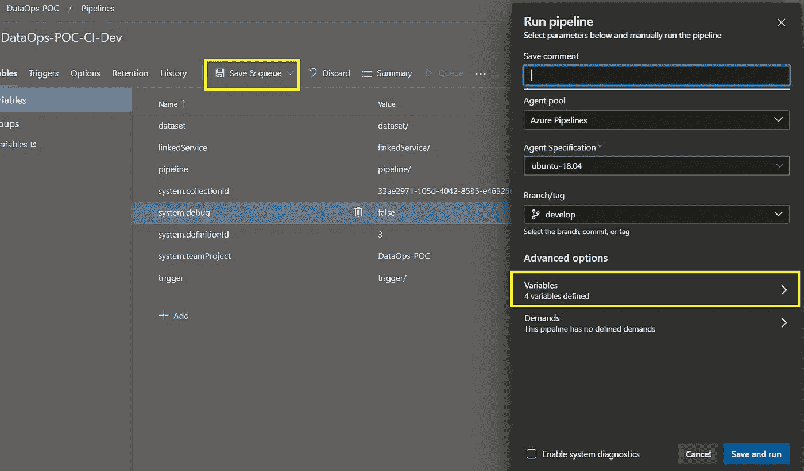

# Azure 数据工厂中的持续集成和交付

> 原文：<https://levelup.gitconnected.com/continuous-integration-and-delivery-in-azure-data-factory-ea6a8a2d779d>

在 Azure Data Factory 中，持续集成和交付(CI/CD)意味着将数据工厂管道、数据集、链接服务和触发器从一个环境(开发、测试、生产)移动到另一个环境。您可以使用数据工厂 UX 与 Azure 资源管理器模板集成来进行 CI/CD。

在数据工厂 UX 中，您可以从 **ARM 模板**下拉菜单中生成一个资源管理器模板。当您选择 **Export ARM Template** 时，门户会为数据工厂生成资源管理器模板和一个包含所有连接字符串和其他参数的配置文件。然后，为每个环境(开发、测试、生产)创建一个配置文件。对于所有环境，主资源管理器模板文件保持不变。1
请阅读 [**CI/CD 生命周期**](https://docs.microsoft.com/en-us/azure/data-factory/continuous-integration-deployment#cicd-lifecycle) 了解 CI/CD 流程的更多信息。


0.1 Azure 数据工厂 DevOps 工作流

# 1.先决条件

*   Azure 数据工厂资源(开发、测试和生产环境)。
*   带有存储库和所需分支(开发、测试和主)的 Azure DevOps 项目。
*   Azure 数据工厂中的[源代码控制](https://docs.microsoft.com/en-us/azure/data-factory/source-control)。
*   Azure Blob 容器。

一旦 git 集成设置完成，Azure 数据工厂将由配置的 Azure Repos 支持，我们可以开始构建数据工厂管道。
所有更改将保存到配置的 Azure Repos 分支，如下所示。
**注意:**在集成 git 和 ADF 时，记得在 Live 模式下发布你所有的修改，否则所有未发布的修改都会丢失。


1.1 Azure Repos 包含数据集、链接服务、管道和触发器的配置文件

一旦我们为 Azure Data factory 设置了 Azure Repos，并通过单击 ADF UX 中的 Publish All 按钮发布了我们的更改，就会创建一个新的分支 **adf_publish** ，其中包含 ARM 模板和参数 JSON 文件，这些文件将在本文稍后用于更新/创建 ADF 资源。


1.2 包含链接的 ARM 模板和 ARM 模板的 adf_publish 分支

链接臂模板是从主模板链接到的独立模板文件的集合。点击了解更多关于链接模板[的信息。](https://docs.microsoft.com/en-us/azure/azure-resource-manager/templates/linked-templates)

# 何时使用链接模板

当数据工厂资源中有太多难以管理的管道、数据集、链接服务和触发器时，我们可以使用链接模板。


1.3 从 UX 防卫部队出口/进口军火模板

检查我们是否必须在发布管道中使用链接模板的最佳方式是转到 ADF UX 并点击导出 ARM 模板。如果无法导出模板，说明 *ARM 模板超过了 256 个参数*的限制，这意味着有太多的资源，我们将不得不在发布管道中使用链接模板，而不是普通的 ARM 模板。


1.4 ARM 模板导出错误消息

# 2.设置 Azure 发布管道

因为我们将只使用 ARM 模板进行部署，并且我们不需要任何文件操作，所以我们将不使用任何构建管道。

*   在 [Azure DevOps](https://dev.azure.com/) 中，打开用您的数据工厂配置的项目。
*   在页面左侧，选择**管道**，然后选择**释放**。
*   选择**新管道**，或者，如果您有现有管道，选择**新**，然后**新发布管道→** 选择**空作业**模板。


2.1 点击+新建→新发布管道


2.2 选择空作业并编辑发布管道的名称


2.3 添加工件→ Azure Repos Git →选择项目→ adf_publish 分支→点击添加

*   现在，点击 ***1 作业，0 任务，*** 并添加**天蓝色文件复制**任务。
*   选择源路径作为 adf_publish 分支中的 LinkedTemplates 文件夹。
*   选择 Azure 订阅作为现有服务连接名称。
*   选择目标类型，因为 **Azure Blob →** 提供了已创建的 Blob 容器名称。

> *为了正确部署链接模板，它们需要存储在 Azure 资源管理器可以访问的位置。所以，* ***中的* ***绝对路径*** *在这种情况下不能使用。Azure Storage 是一个合适的位置；因此，我们将展示如何使用 Azure 存储来存放 ARM 模板文件。在这里找到更多信息* [*。*](https://docs.microsoft.com/en-us/archive/blogs/najib/deploying-linked-arm-templates-with-vsts)**


2.4 发布管道 Azure 文件复制任务

*   添加 **Azure Powershell** 任务以在部署新更改之前停止所有触发器。

```
$triggersADF = Get-AzDataFactoryV2Trigger -DataFactoryName $(DataFactoryName) -ResourceGroupName $(ResourceGroupName)$triggersADF | ForEach-Object { Stop-AzDataFactoryV2Trigger -ResourceGroupName $(ResourceGroupName) -DataFactoryName $(DataFactoryName) -Name $_.name -Force }
```


2.5 Azure Powershell 任务

*   添加 **Azure 资源组部署任务**并选择操作为创建或更新资源组。
*   选择包含 ADF 资源的资源组。记得提供足够的访问权限，以便服务连接可以更新 Azure 数据工厂资源。
*   选择资源组的位置。
*   选择 ARM 模板和参数文件。
*   通过向*覆盖模板参数*字段中的参数提供自定义值来覆盖模板参数。
*   根据您的要求，选择部署模式为**增量或完全**。

> *在增量模式下，资源管理器* ***保持资源组中存在的*** *资源不变，但不在模板中指定。模板* ***中的资源被添加*** *到资源组中。而在完成模式下，资源管理器* ***删除存在于资源组中但没有在模板中指定的*** *资源。* *为了保存生产管道运行历史记录，更喜欢增量部署模式，而不是完全部署模式。*


2.6 Azure 资源组部署任务


2.7 Azure 资源组部署任务

*   再次添加 **Azure Powershell** 任务来启动我们在前面步骤中停止的所有触发器。

```
$triggersADF = Get-AzDataFactoryV2Trigger -DataFactoryName $(DataFactoryName) -ResourceGroupName $(ResourceGroupName)$triggersADF | ForEach-Object { Start-AzDataFactoryV2Trigger -ResourceGroupName $(ResourceGroupName) -DataFactoryName $(DataFactoryName) -Name $_.name -Force }
```


2.8 Azure Powershell 任务

*   转到 variables 选项卡，添加我们在发布管道中使用的所有变量，如 SAS 令牌、RG 名称、ADF 名称等。


2.9 在变量选项卡中添加运行时变量

*   点击保存，然后创建一个新的版本。部署成功需要一些时间，这取决于 Azure 数据工厂中管道、数据集等的数量。

> ***注:*** *如果在开发环境中重命名了任何一个管道/数据集/触发器/链接服务，它将被添加为一个新的管道/数据集/触发器/链接服务。旧的不会在测试或生产环境中被删除。*

# 3.如果由于某些因素不能使用 ARM 模板部署怎么办！？

假设您有一个 ADF 资源，它有多个管道，这些管道属于不同的市场或地区，即**地区 A** 、**地区 B、**和**地区 c、**不同的开发团队在不同的地区工作，所有的地区都是相互联系的。但是不同市场的生产部署日期有时会有所不同。假设区域 A 和区域 B 的开发人员已经在他们的 ADF 管道中做了一些更改，并且他们已经将这些更改推送到****测试**环境中，以便在部署之前运行一些测试。现在，区域 A 的测试已经完成，因为只有很小的变化，但是区域 B 有很多变化，这需要更多的时间。各地区的部署日期也不同，而且应用程序团队开发的体系结构现在无法更改。在这种情况下，我们不能使用 ARM 模板部署一次部署所有资源。因此，我们将使用选择性部署方法，在这种方法中，我们将只部署在特定时间需要的特定 JSON 文件。**

****

**3.0 Azure 数据工厂 DevOps 工作流**

# **Azure 数据工厂中的选择性部署**

*   **这里我们将使用存储在**协作分支**(在本例中是主节点)中的配置文件，如下所示。现在我们不需要 **adf_publish** 分支，因为我们将不使用 ARM 模板。**

****

**3.1 Azure DevOps Git 回购**

# **在 Azure DevOps 中创建构建管道**

*   **通过转到项目→构建→新建构建管道来创建构建管道**

****

**3.2 转到+新建→新建构建管道→使用经典编辑器**

****

**3.3 选择源→存储库名称→源分支**

****

**3.4 在可视化编辑器中选择空作业**

*   **使用托管代理 Ubuntu 18.04**
*   **添加 Bash 脚本任务。**
*   **添加以下脚本。**

**T 该脚本过滤出在最近一次提交中发生更改的文件的绝对路径，即 Head 0(上次提交)和 Head 1(上次提交的父文件)之间的更改，然后将所有路径放入一个文本文件中，用新的一行隔开。它将从文本文件中读取绝对路径，并将其复制到托管代理计算机的临时目录中。**

****

**3.5 添加 bash 任务并编写 Bash 脚本**

****

**3.6 添加复制文件任务，将文件从源目录复制到工件暂存目录**

****

**3.7 添加发布构建工件任务以发布可部署组件**

****定制部署 JSON 文件** 在构建时从用户处获取绝对路径来选择用户提供的文件。所有的步骤都和上面一样。唯一的区别将是下面提到的脚本。该脚本将从用户处获取一个以逗号分隔的绝对路径作为构建时变量，并将这些文件复制到托管代理计算机的临时目录中。**

*   **转到构建管道中的变量选项卡，添加**数据集、链接服务、管道和触发器**变量，并选择在队列时间时可设置的**复选框。****

****

**3.8 添加变量并选中队列时间可设置复选框**

****

**3.9 将构建管道排队→单击变量**

****

**3.10 选择变量进行编辑。在此构建之后，它将恢复为默认值。它是一个运行时变量**

****

**3.11 提供逗号分隔的绝对路径，然后单击更新**

**T 他的部署用不了 ARM 模板部署那么多时间。资源的部署应该按照**链接服务→数据集→管道→触发**的顺序进行，否则无法找到依赖的资源。
假设我们有一个依赖于数据集的管道和一个尚未创建的链接服务。如果我们在数据集和链接服务之前部署此管道，那么它将尝试查找依赖资源，并将失败。**

# **在 Azure DevOps 中创建发布管道**

*   **转到项目→发布→新发布管道**

****

**3.12 点击+新建→新发布管道**

****

**3.13 选择空作业并编辑发布管道的名称**

****

**3.14 添加工件→构建管道→默认版本为最新版本→给出任何源别名(将在后面的步骤中使用)**

*   **我们将使用 Azure Powershell 任务来部署该包。使用以下脚本作为内联脚本。**

****

**3.15 添加 Azure Powershell 任务→添加内联脚本**

****

**3.16 转到变量选项卡，添加脚本中使用的变量**

# **4.添加分支策略**

**制定[分支政策](https://docs.microsoft.com/en-us/azure/devops/repos/git/branch-policies?view=azure-devops)以保护您的回购中的关键分支，团队依赖这些分支始终保持良好状态，例如您的*主*分支。需要拉请求来对这些分支进行任何更改。开发人员将变更直接推送到受保护的分支将会被拒绝。**

****

**4.1 转到 Azure 回购→分行→分行政策**

****

**4.2 选择要求最少数量的审阅者以限制受限分支中的直接提交**

****

**4.3 添加自动审阅者在创建从任何分支到该分支的拉请求时自动添加他们**

# **5.部署前批准**

**当从定义批准的发布管道创建发布时，部署会在每个需要批准的地方停止，直到指定的批准者批准或拒绝发布(或将批准重新分配给另一个用户)。您可以为发布管道中的每个阶段启用手动部署批准。**

****

**5.1 启用连续部署触发器**

****

**5.2 添加预部署批准**

****如果您需要任何帮助或有任何建议，请通过** [**LinkedIn**](https://www.linkedin.com/in/aniketprashar) 联系我**