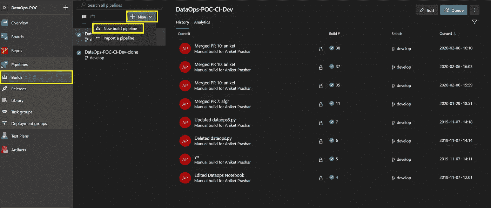
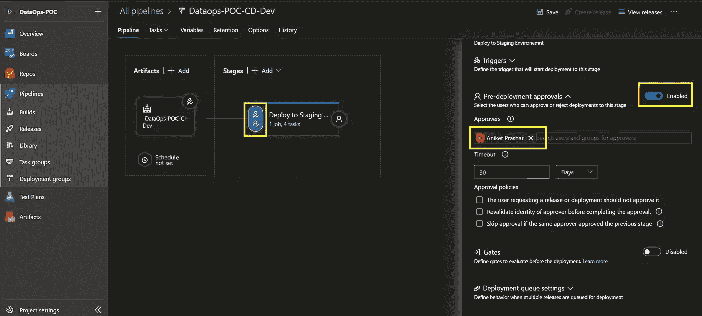
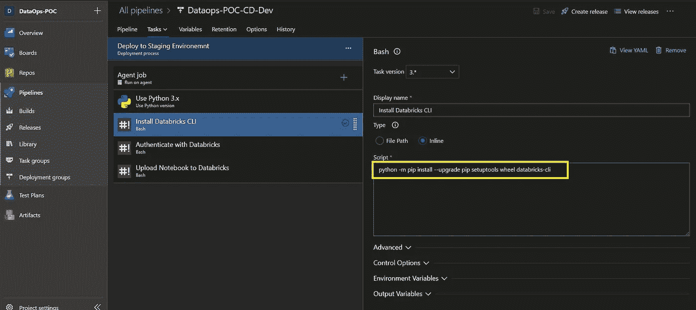
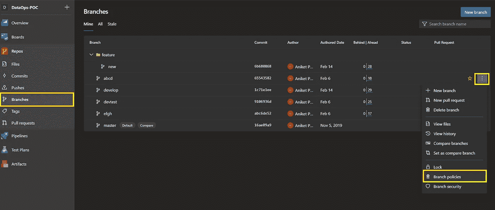

# Azure Databricks 中的持续集成和交付

> 原文：<https://levelup.gitconnected.com/continuous-integration-and-delivery-in-azure-databricks-1ba56da3db45>

因此，您已经在 Databricks 工作区创建了笔记本，与您的同事进行了协作，现在您已经准备好实施您的工作了。以下是完整 CI/CD 工作流要执行的步骤。

1.  在开发分支中开发并提交您的代码。
2.  将代码从开发分支推送到→测试分支→主分支。
3.  在不同的环境中部署笔记本电脑；在 Azure DevOps 中使用 CI/CD 管道进行开发→测试→生产。


0.1 Azure Databricks DevOps 工作流

根据需求，这里可以有不同种类的工作流程。在上面的工作流程中，我们直接在开发数据块工作区上工作，并将每个笔记本链接到 git 中用户特定的分支。一旦用户对变更感到满意，他们就可以从开发→测试分支创建一个拉请求。

**最佳实践**

1.  在开发数据块中的**用户**工作区进行开发，并将每个笔记本链接到一个单独的特性分支。这样，多个开发人员可以在一个笔记本上工作，并且可以在创建从特性分支到开发分支的拉请求时解决合并冲突。如果只有一个开发人员在笔记本上工作，那么我们可以直接在 development Databricks 工作区上工作，如上面的工作流程图所示。
2.  在开发、测试和主分支中设置**分支策略**,以限制任何直接提交，并为拉请求批准添加自动审查者。
3.  启用发布管道中的**预部署批准**，以限制在测试和生产工作区中未经批准的直接部署。
4.  使用 Azure KeyVault 存储 Azure Databricks 帐户的个人访问令牌。
5.  在 Azure DevOps 管道中使用 **Linux 托管代理**。用户可以在 Databricks workspace 中拥有两个名为 xyz 和 Xyz 的笔记本，但 Windows 将它们视为单个文件(不区分大小写),并且无法区分它们，这可能会在使用 Windows 代理处理管道中的笔记本时造成问题。
6.  参数化在不同环境中具有不同值的 notebook 变量，例如 config 值，以便在合并不同分支时值不会被覆盖。

# 1.开发并提交您的代码

设计 CI/CD 管道的第一步是决定代码提交和分支策略，以管理新代码和更新代码的开发和集成，而不会对当前生产中的代码产生负面影响。这里，我们将使用 [GitFlow](https://www.atlassian.com/git/tutorials/comparing-workflows/gitflow-workflow) 分支模型。
假设已经创建了 Azure DevOps 项目，并且我们在 Databricks 工作区中有一个笔记本的工作副本，让我们按照下面的步骤操作。

1.  Azure Databricks 与 Azure DevOps Repos 的集成- [Azure Databricks 配置](https://docs.microsoft.com/en-us/azure/databricks/notebooks/azure-devops-services-version-control)
2.  将 Azure Repos git 与 Databricks workspace 链接。
    **注:**在修改历史时，笔记本不能编辑。


1.1 转到 Azure Repos 并复制存储库链接


1.2 转到 Databricks 笔记本，点击修订历史→ Git:未链接


1.3 粘贴 Azure Repos 链接，在 git repo 中选择工作分支并填充绝对路径

> ***注意:*** *第一次做这个的时候你不会看到所有的分支。所以，只需粘贴链接并点击* ***保存*** *按钮即可。不要向 git 提交任何提示。再次打开****Git:Synced****现在你将能够看到 Azure Repos 中的所有分支。
> 使用****dev.azure.com/<organization _ name>****参观项目。您通过访问****<organization _ name>. visual studio . com****获得的克隆链接将无法与 Azure Databricks git syncup 一起使用。所以遵循这个 URL 模式****https://dev.azure.com/<组织 _ 名称> / <项目 _ 名称> /_git/ <仓库 _ 名称>***


1.4 点击修订历史侧面板中的 Save All 并填写描述以提交给 git

# 2.使用 CI/CD 管道将版本控制的笔记本部署到数据块上

既然提交的变更已经被推送到 git 存储库中，这意味着构建管道将被触发。通过一点点进一步的配置，我们实际上可以更新构建管道，将这个笔记本打包到一个可部署的包中，并使用它来触发部署管道。
根据不同的使用案例，在构建流程中可以有不同的笔记本电脑打包方式。

**案例 1:** **完成笔记本部署** 将源分支中所有的笔记本打包。

**案例 2:仅部署最近提交中已更改的笔记本** 仅打包那些在源分支的最近提交中新添加或更改的笔记本。这将减少部署时间，不会覆盖未更改的笔记本电脑。

**案例 3:笔记本的自定义部署** 仅打包用户指定的笔记本，其绝对路径在构建时由逗号分隔的路径提供。

# 在 Azure DevOps 中创建构建管道

*   转到项目→生成→新生成管道



2.1 转到+新建→新建构建管道→使用经典编辑器


2.2 选择源→存储库名称→源分支


2.3 在可视化编辑器中选择空作业

**案例 1:笔记本电脑的完全部署**

*   添加发布构建项目任务。
*   提供笔记本的完整路径和工件名称(包含笔记本的可部署包)。
*   源分支中的所有笔记本都将作为工件发布。


2.4 使用托管代理 Ubuntu 18.04

**案例 2:在最近一次提交中仅部署已更改的笔记本**

*   添加 Bash 脚本任务。
*   添加以下脚本。

T 他的脚本过滤出在最近一次提交中发生改变的文件的绝对路径，即在头 0(最后一次提交)和头 1(最后一次提交的父文件)之间的改变，然后将所有路径放入一个文本文件中，用新的一行隔开。它将从文本文件中读取绝对路径，并将其复制到托管代理计算机的临时目录中。


2.5 添加 bash 任务并编写 Bash 脚本


2.6 添加复制文件任务，将文件从源目录复制到工件暂存目录


2.7 添加发布构建工件任务以发布可部署组件

**案例 3:笔记本电脑的定制部署**

*   所有步骤将与情况 2 相同。唯一的区别将是下面提到的脚本。该脚本将从用户处获取一个以逗号分隔的绝对路径作为构建时变量，并将这些文件复制到托管代理计算机的临时目录中。

*   转到构建管道中的变量选项卡，添加***absolute path****变量，并选择 ***可在队列时间设置*** 复选框。*

**

*2.8 添加 absolutePath 变量，并选中“排队时可设置”复选框*

**

*2.9 将构建管道排队→单击变量*

**

*2.10 选择 absolutePath 变量进行编辑。在此构建之后，它将恢复为默认值。它是一个运行时变量*

**

*2.11 提供逗号分隔的绝对路径，然后单击更新*

# *在 Azure DevOps 中创建发布管道*

*   *转到项目→发布→新发布管道*

**

*2.12 点击+新建→新发布管道*

**

*2.13 选择空作业并编辑发布管道的名称*

**

*2.14 添加工件→构建管道→默认版本为最新版本→给出任何源别名(将在后面的步骤中使用)*

**

*2.15 启用连续部署触发器*

**

*2.16 添加预部署批准*

> *我们将使用[**Databricks CLI**](https://docs.databricks.com/dev-tools/cli/index.html)将 data bricks 笔记本从托管代理机器(Ubuntu 18.04)导入我们的 Azure Databricks 资源。Databricks CLI 要求在代理计算机上安装 python。因此，我们将首先安装 python，然后安装 Databricks CLI。*

**

*2.17 添加使用 Python 版本任务→选中添加到路径复选框*

**

*2.18 添加 bash 任务并编写 Bash 脚本来安装 Databricks CLI*

**

*2.19 添加 Bash 任务并编写脚本来使用个人访问令牌配置数据块(将在后面的步骤中创建 PAT)*

**

*2.20 添加 Bash 任务并编写 import_dir CLI 命令来导入数据块笔记本*

**

*2.21 转到变量选项卡，添加 PAT 和 Databricks 区域 URL。使用锁定按钮来锁定密码*

# *上述 Bash 任务中使用的脚本*

*   *安装 Databricks CLI*

```
*python -m pip install --upgrade pip setuptools wheel databricks-cli*
```

*   *使用个人访问令牌配置 Databricks CLI*

```
*databricks configure — token <<EOF
$(databricks-url)
$(ADB-Token)
EOF*
```

*   *将笔记本从托管代理计算机导入到 Databricks 工作区*

```
*databricks workspace import_dir — overwrite _Build_Pipeline_Alias/artifactName /FolderNameInDatabricksWorkspace*
```

*这里， **_Build_Pipeline_Alias** 是在发布管道工件中作为源别名给出的名称(参见 2.14)；artifactName 是发布构建工件任务中提供的名称(参见 2.7)，而**foldernameindatabrickworkspace**是 DatabricksWorkspace 中我们要部署笔记本的文件夹。*

*   *如果同名笔记本已经存在，它将覆盖所有笔记本。*
*   *如果不存在，它会添加笔记本。*
*   *如果在 Git 中重命名笔记本，那么它只会添加一个新的笔记本，而不会删除旧的。*
*   *它会创建文件夹，如果它不存在。*

# *3.添加分支策略*

*制定[分支政策](https://docs.microsoft.com/en-us/azure/devops/repos/git/branch-policies?view=azure-devops)以保护你的回购中的关键分支，团队依赖这些分支保持良好状态，比如你的*主*分支。需要拉请求来对这些分支进行任何更改。开发人员将变更直接推送到受保护的分支将会被拒绝。*

**

*3.1 转到 Azure 回购→分行→分行政策*

**

*3.2 选择要求最少数量的审阅者以限制受限分支中的直接提交*

**

*3.3 添加自动审阅者在创建从任何分支到该分支的拉请求时自动添加他们*

# *4.生成个人访问令牌*

*将托管代理计算机与 data brick 工作区连接需要 data brick 个人访问令牌。*

*   *转到 Azure Databricks 工作区→用户设置*

**

*4.1 转到 Azure Databricks 工作区中的用户设置*

**

*4.2 单击生成新令牌。令牌是用户特定的*

**

*4.3 为令牌提供一个有意义的名称和生命周期。如果未指定令牌寿命，令牌将无限期存在*

*   *点击 Generate，将生成的字符串复制到安全的地方(最好是 Azure KeyVault)。一旦生成，就无法再次检索。微软不存储这些令牌。*

# *5.如果我们已经有了一个正在运行的 Databricks 项目，并希望使用 Azure DevOps 为其设置 CI/CD，该怎么办？*

**

*   *我们有多个 Databricks 环境，即开发、UAT 和 prod，开发人员可以在其中直接提交他们的更改。*
*   *从 UAT 和生产工作区中删除开发人员的访问权限，以便不允许提交。*
*   *使用 Databricks CLI 导出 data brick 笔记本*
*   *使用 git 命令将导出的笔记本提交到 Azure Repos。*
*   *从总分行创建 UAT 分行，并从 UAT 分行发展分行。如果不同的环境没有同步，那么我们必须在继续下一步之前手动同步它们。*
*   *使用本文中提到的步骤将笔记本链接到开发分支。*
*   *使用之前创建的 CI/CD 管道在 UAT 和生产环境中部署笔记本电脑。*

***如果您需要任何帮助或有任何建议，请通过** [**LinkedIn**](https://www.linkedin.com/in/aniketprashar) 联系我*