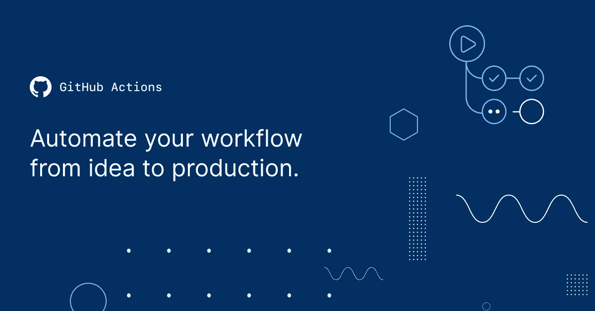

# 持续集成不是可选的

> 原文：<https://levelup.gitconnected.com/continuous-integration-is-not-optional-cb803733f59d>

## 不要在无聊的事情上浪费时间

来源:[章鱼部署博客](https://octopus.com/blog/can-github-actions-replace-your-ci-server)

任何项目都有令人厌烦的维护任务，这些任务往往会比任何人希望的花费更多的时间。需要在 Unity 中重新构建你的游戏吗？根据游戏的大小，这项任务可能需要一段时间来构建和部署到适当的位置。想要推出网站的新版本并进行测试以确保一切正常吗？将文件部署到适当的位置可能需要一分钟的时间，并且手动测试通常是重复的并且容易出错。因此，有一些持续集成(CI)工具旨在自动化项目生命周期的一部分。我想我会浏览一下我最喜欢的:

# 团队城市

团队城市发展链。来源:[团队城市](https://www.jetbrains.com/teamcity/)

[TeamCity CI/CD](https://www.jetbrains.com/teamcity/) 让您能够相对轻松地自动化不同复杂程度和规模的管道。这主要是因为构建链允许您构建一个可视化管道，显示代码在构建过程中是如何组合在一起的。即使代码分布在多个存储库中，您也可以在运行构建时将它们链接在一起。然而，Team City 最大的区别不是他们的 UI。

Kotlin CI 配置示例来源: [TeamCity](https://www.jetbrains.com/teamcity/)

他们最大的吸引力是你可以用 Kotlin 来设置你的 CI，而不是无聊的 Yaml。老实说，这是有道理的，因为 JetBrains(团队城市的负责人)开发了这种编程语言。我在日常工作中使用 TeamCity，我发现它是构建我的游戏的有用工具。

# **谷歌云构建**

来源:[阿尔瓦罗·维布兰茨](https://medium.com/@alvaroviebrantz?source=post_page-----d5e1cda504bf--------------------------------)

作为 good cloud suite 的一部分， [Cloud Build](https://cloud.google.com/docs/ci-cd) 是一个相对简单的持续集成和持续交付解决方案。将 CI 管道集成到您的项目中是一个使用 Google Cloud 和配置您的项目的简单过程。最基本的是，你需要创建一个 cloudbuild.yaml 文件(甚至是一个 JSON 文件)，它位于你的项目的根目录中，定义了构建你的应用/游戏/网站所需的步骤。下面是同一个 yaml 命令的一个例子，只是做得稍有不同，所以非常混乱。

来源:[戴夫·斯坦克](https://dev.to/ceoshikhar/enhance-your-code-reading-experience-on-github-with-this-chrome-extension-24ei)

总体云构建是一个优秀的持续集成工具，它允许您简化构建、发布和测试过程。我实际上使用 Google Cloud Build 作为我的 CI 流程的一部分来部署[我的网站](https://www.josephamaurer.com/)。我设置了一个触发器，这样当我推送到我的 Github 库时，就会触发一个获取更新代码并将其与我的网站的 live 分支合并的动作。它还负责生产工件，比如用于测试的 Docker 容器。最棒的是它是免费的！我强烈推荐查看 Alvaro 的博客文章,了解他如何使用 CI 来集成物联网设备。

# **Github 动作**

来源: [GitHub](https://github.com/features/actions)

老实说， [GitHub Actions](https://docs.github.com/en/actions) 的工作方式与我在这里提到的前两款产品非常相似。这里最大的区别是，如果你直接与 GitHub repository 集成，而你的代码可能已经被签入了。动作是事件驱动的，这意味着您可以触发 CI/CD on、pull request、deployment、page build、release 以及围绕您的代码库发生的许多其他注释事件。不利的一面是，您被签入到您的*中的 Yaml 文件所困扰。您的存储库的 github/workflows* 目录。

来源: [AWS](https://aws.amazon.com/blogs/containers/create-a-ci-cd-pipeline-for-amazon-ecs-with-github-actions-and-aws-codebuild-tests/)

这些工具有大量的可能性，它们的设计非常灵活。您可以配置这些系统，使其与您的情况以及您需要交付产品的方式相结合。

[在 Twitter 上关注我](https://twitter.com/maurerpwer)了解如何在项目中使用持续集成来节省时间！