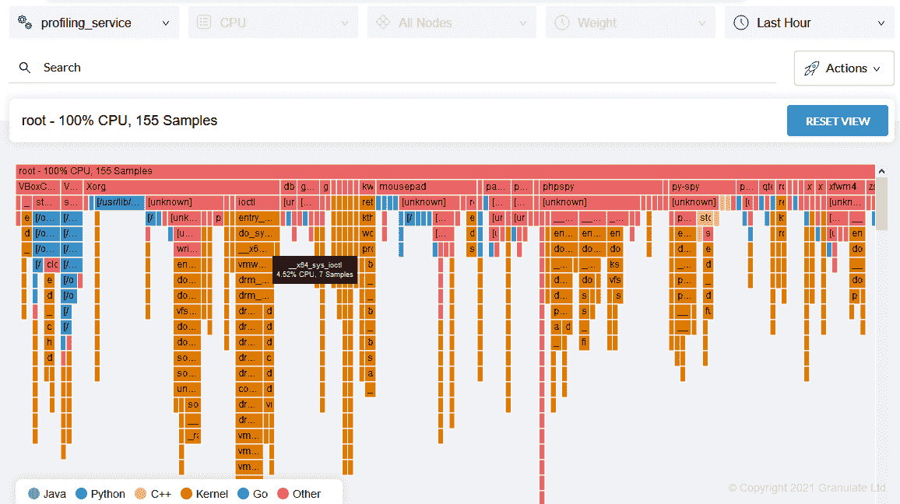

# Python 应用程序的连续概要分析

> 原文：<https://levelup.gitconnected.com/continuous-profiling-for-python-applications-211a173e1e34>

*照片由*[*áRPád Czapp*](https://unsplash.com/@czapp_arpad?utm_source=unsplash&utm_medium=referral&utm_content=creditCopyText)*上* [*Unsplash*](https://unsplash.com/s/photos/programming?utm_source=unsplash&utm_medium=referral&utm_content=creditCopyText)

# 什么是剖析？

在计算机编程中，“分析”的意思是“找到并优化那些可以减少响应时间、缓存时间、中断和计算机程序中单个指令使用的资源。”

简而言之，我们可以实现分析来改善程序的执行时间，并减少 CPU 资源的使用。大多数应用程序现在都托管在云上。如果你小心地利用这些资源，你就可以减少在这些资源上的花费。这也会让你的代码**更加高效**。

[*图像来源*](https://www.opsian.com/blog/what-is-continuous-profiling/)

要在任何编程语言中实现分析，我们需要一个能够收集不同类型的信息以加快执行速度，并且能够找出诸如时基、函数调用执行和程序缓存等障碍的分析器。概要分析可以识别执行时间过长的语句或代码，以便开发人员可以对它们进行优化，从而合理利用资源。

然而，profilers 只能在绝对必要的时候使用，因为它们也会使代码变得缓慢和难以阅读。这就是我们用 [gProfiler](https://granulate.io/gprofiler/) 把事情提升一个档次的地方。

我们的工具 gProfiler 使我们能够轻松地进行概要分析。gProfiler 提供了**无缝的产品剖析**而不需要任何代码更改——它只是即插即用。

有两种分析:确定性分析和统计性分析。

# 确定性剖析

[确定性分析](http://ftp.grnet.gr/mirror/python/doc/2.0/lib/Deterministic_Profiling.html)在代码的不同位置或开发人员希望执行的地方运行“跟踪”函数，例如在函数调用、函数返回或异常发生的地方。它计算程序在执行中花费了太多时间或使用了太多资源的地方。

我们可以实现它来获得关于处理时间的信息，但是计算占用了太多的时间和 CPU 资源。如果我们想减少 profiling 中的资源使用，可以使用 gProfiler，它**在后台**工作，不会占用太多资源。

# 统计剖析

[统计分析](https://www.embedded.com/statistical-profiling-an-analysis/)基于 CPU 状态。它计算哪些程序代码需要太多时间来执行。这项工作由 CPU 执行，它计算执行状态的样本。通过检查各种状态，开发者可以采取行动。

由于需要定期的数据，我们可以在这里使用 gProfiler，它在后台运行，并以定期的时间间隔连续显示样本。在本文的后面，我们将介绍如何使用 gProfiler。

然而，很难获得这些结果，因为必须定期取样。因此，它偶尔会产生不太可靠的数据。

# Python 中的剖析

Python 提供了一些优秀的模块来分析程序的统计数据。它们帮助我们确定软件在哪里花费了太多的时间，以及我们可以做些什么来减少时间。优化程序也能带来软件的改进。因此，[连续分析](https://granulate.io/introduction-to-continuous-profiling/)是提高程序性能和确保适当资源分配的关键步骤。

Python 中的模块“ **cProfile** ”和“ **profile** ”可以用来执行概要分析。让我们逐一讨论。

我创建了一个小的 Python 片段，将两个数字相加。我们将首先在不进行概要分析的情况下运行这段代码，然后应用概要分析来查看结果是否有任何变化。

**正常运行**:用 Python 执行这段代码。

**用“cProfile”运行:**我们必须传递几个参数来用 cProfile 运行，比如–m 代表 module，我们将要使用的包是 cProfile。

我们可以看到两个输出的区别，我们可以看到应用“cProfile”时的执行时间。让我们看看输出中的各种参数。

1.  **ncalls** :是“调用次数”(“n”代表“次数”)。
2.  **totime:** “总时间”是指执行主操作而不是子功能所花费的实际时间(“to”代表“总”)。
3.  **累计时间:**术语“累计时间”是指执行主功能和子功能所花费的总时间(“累计”代表“累计”)。
4.  **precall:** 采用两个参数“totime”和“cumtime”，测量商并显示结果。

以下是 cProfile 中可用的选项。我们将根据我们的需要对表演进行分类。

**注**:我们也可以导入“cProfile”并用于更复杂的分析。

在 Python 中，我们有两种类型的分析。

# 目标剖析

我们没有提供完整的代码，而是选择了我们想要分析的代码片段。与前面的代码一样，分析器对整个程序进行操作并显示结果。为此，我们将导入“cProfile”函数。为了向您展示它是如何工作的，我使用了之前使用的代码。

如您所见，我定义了“cPro”变量，然后只为“num2”变量调用。由于我的代码片段很短，所以这个程序的输出略有不同。如果你取一个大片段，你很容易就能看出区别。

它的主要好处是允许用户决定自己的规格。

# 线条轮廓

在编程中，我们有时会在不同的地方使用相同的代码，并分析这些代码片段。为此，我们使用行分析，我们逐行分析程序，并搜索每一行代码的时间度量，使程序员能够集中精力进行优化。

输出:

此功能使用了一个依赖项，可以通过 pip 软件包管理器下载或安装。代码的质量与目标相同，除了这里，我们是逐行进行分析。

有很多方法可以轻松地在生产中进行性能分析。其中一种方法是使用工具来为您执行概要分析。正如我们前面提到的，gProfiler 就是这样一个工具。

# 如何使用 gProfiler

在 python 中进行概要分析时，需要下载一些 python 模块，比如 cProfile 或 memory_profile。我们需要安装不同的包来查看代码的各种统计数据。由于它们需要包含在程序中，这就造成了很多麻烦，并使代码变得复杂。大多数时候，开发人员需要一个包或模块来监控产品中的代码。我们可以通过使用 gProfiler 来解决这个问题。这是一个在后台运行的工具。您可以将它安装在生产服务器上，并使用它来监控代码性能。它是即插即用的；不需要更改代码。

让我们把这个安装在 Ubuntu 上，看看效果如何。

要在 Ubuntu 上安装它，请遵循以下步骤。

1.  继续创建一个账户[https://profiler.granulate.io/](https://profiler.granulate.io/)
2.  单击命令行。它会询问一些事情，比如服务名。您可以在多个实例上安装相同的工具，并且只能在一个仪表板上监控它们的统计信息。提供服务名，然后开始安装。

3.要在服务器上安装 gProfiler，请使用 wget 命令。您可以在仪表板上找到该命令。复制并在您的终端中执行。

4.下载后，您需要安装并执行它来启动监控。

5.更改权限，以便我们可以执行它。

6.启动服务。

现在，它将开始监控您执行的 Python 程序，所有的统计数据都可以在 gProfiler 仪表板中获得。

不需要更改代码。它将在后台运行，使用非常少的内存，并显示您的代码在生产服务器上运行的所有统计数据。与 python 包不同，不需要用 cprofile 重新运行代码，这需要消耗很多资源。

# 结论

这些是帮助剖析 Python 程序的主要原则。如前所述，分析代码很重要，因为它提高了代码性能并减少了 CPU 消耗，从而节省了成本，因为您使用的资源越多，支付的费用就越多。

# 分级编码

感谢您成为我们社区的一员！[订阅我们的 YouTube 频道](https://www.youtube.com/channel/UC3v9kBR_ab4UHXXdknz8Fbg?sub_confirmation=1)或者加入 [**Skilled.dev 编码面试课程**](https://skilled.dev/) 。

 [## 编写面试问题+获得开发工作

### 掌握编码面试的过程

技术开发](https://skilled.dev)