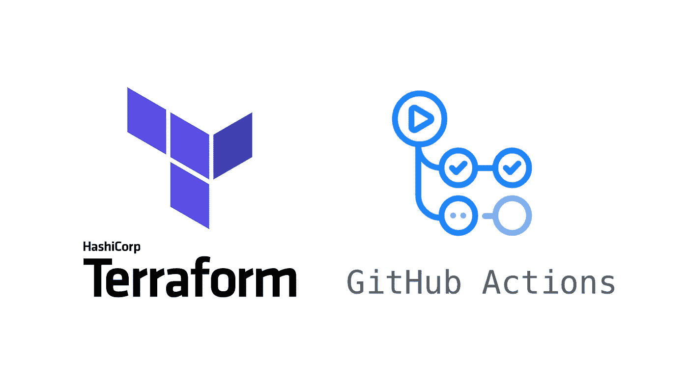
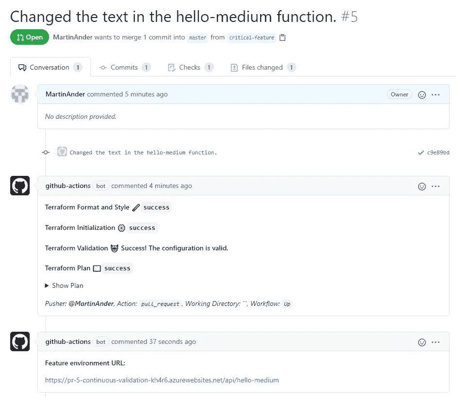

# Terraform 和 GitHub 动作如何用于连续验证

> 原文：<https://levelup.gitconnected.com/continuous-validation-using-terraform-and-github-actions-3c012cd198d5>

## 持续验证？

就像我们有持续集成和交付一样，我认为持续验证是介于这两个步骤之间的一个合适的名字，坦率地说，“持续 QA”听起来不那么吸引人。

## 什么是 Terraform？

要事第一，对吗？

[Terraform 是一个强大的“基础设施即代码”工具](https://www.terraform.io/intro/index.html)——他们这样称呼它。总之，这意味着您可以使用 Terraform 的 HCL 语法声明性地定义您的云资源，并使用 Terraform 更新/区分您的云资源，最重要的是:以可重复的方式这样做。

## 这对我有什么好处？

简而言之，这意味着您可以在一个完全隔离和镜像的特性环境中测试和验证新特性，该环境遵循您的特性分支，而不必担心特性标志之类的事情以及会增加代码和工作流的复杂性。

理想情况下，这将允许您拥有如下工作流:

1.  创建特征分支
2.  在所述分支上开发一些新功能，并推动您的更改
3.  创建拉式请求
4.  让你的同事对你的代码进行代码评审*——以及基础设施变更*
5.  让 QA 以他们自己的速度在隔离环境中验证您的实施
6.  合并并关闭拉取请求
7.  您的更改现已投入生产，特征环境已不存在

## 这与传统的做事方式有何不同？

我一次又一次地看到“开发”分支被使用，并且这个分支存在的根本原因是将代码放入 QA 环境，甚至更多——所以只有一个这样的环境。这可能会在开发/发布过程中导致无数的问题。

我观察到的最大问题是，当驻留在开发分支中的特性被认为已经准备好生产时，还没有准备好生产的特性被推送到开发分支；从而在新功能被认为准备就绪之前阻止生产就绪功能上线。

根据团队和项目的规模，这可能会导致发布之间不期望的差距。每 2 个月部署一次*不是很敏捷*吧？

## 我的看法

当您创建一个 pull 请求时，我的实现就开始了，就像您通常会让您的更改出现在生产中一样。

使用 GitHub Actions，我已经使用 pull 请求触发器创建了一个流，所以当一个 pull 请求打开时，我的管道就会运行，这就是神奇的地方。

一旦你打开了 pull 请求，管道就会运行一些 Terraform 魔法来查看`terraform plan`,并在 pull 请求上留下一个注释。当一切顺利时，一个新的环境将使用`terraform apply`在 Azure 上启动。

在这个简化的例子中，这意味着在 Azure 上部署了一个新的 Azure 函数，然后我用它来部署我的 hello-world 函数。然而，使用 Terraform 可以实现更多功能。我建议[认真看看文档](https://www.terraform.io/docs/index.html)。

# 好吧，我知道了，给我钱！

代码可以在 https://github.com/MartinAnder/ContinuousValidation 的[找到，下图的拉动请求也可以在那里找到。](https://github.com/MartinAnder/ContinuousValidation)

【https://github.com/MartinAnder/ContinuousValidation/pull/5 

我不会过多地探究实际的实现，因为这不是本文的主题。示例拉请求本身和项目以及代码本身都很简单。

# 概括起来

我展示了如何使用 terraform 按需构建环境来验证您的实现，以及如何让它们遵循您的拉式请求生命周期。

发布的项目是一个由 Azure 函数组成的非常简化的例子，因为它是更便宜和更容易的选择。它可能是 Azure 上的一个应用服务，或者任何其他可以想象的东西——甚至是在另一个云中。

在所有的实用性中，它不一定是地形；也可以是 Pulumi，或者您可以使用 Kubernetes 和 Helm，在您的 staging-cluster 中旋转图表。持续集成工具可以是除 GitHub 之外的任何工具，只要它支持拉请求触发器。

在将其投入生产之前，需要考虑的事情包括数据库等等。如何提供这些，测试数据从哪里来？也许为所有的特征环境共享一个数据库？只是要小心模式变化之类的东西。

如果你正在运行一个微服务架构，你会从你的特性环境中选择哪个版本的服务呢？