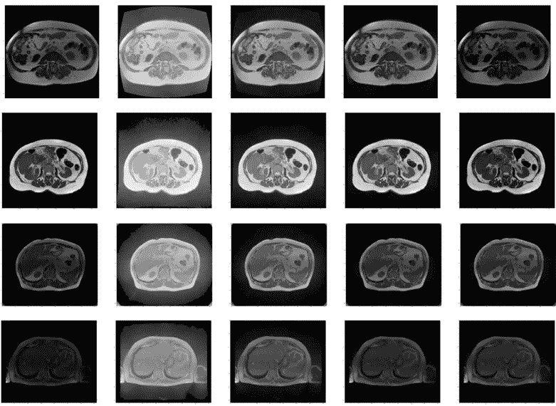
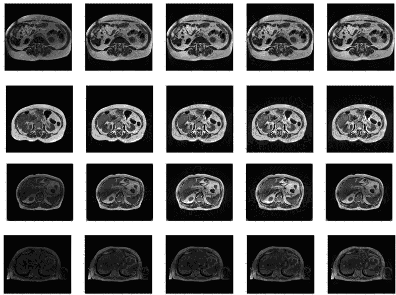

# 医学图像的对比度增强技术

> 原文：<https://levelup.gitconnected.com/contrast-enhancement-techniques-for-medical-images-93c805fce01c>

# **简介**

对比度增强是一种放大图像中相邻结构之间视觉差异的技术。它在医学成像中特别有用，因为它可以揭示图像中显示的器官或肿瘤的更多信息，并锐化它们之间的边缘。在这次 [Kaggle 竞赛](https://www.kaggle.com/competitions/uw-madison-gi-tract-image-segmentation)中，我们尝试了几种在图像预处理过程中实现对比度增强的方法。

# **数据集**

竞争数据集由来自 85 名患者的 1 至 6 天范围内的 MRI 扫描组成。总共对 85 名患者进行了 274 天的扫描，每天包含 144 片图像。少数日子，5%左右，只有 80 片。数据集包括总共大约 38，000 个图像切片。对于该数据集的对比度增强，我们检查了以下三种不同的方法。

# **直方图归一化**

为了执行直方图归一化，图像中全部范围的像素值被分成一系列的箱。然后，使用最小-最大归一化来归一化每个箱中的像素值，最小-最大归一化缩放这些值，使得它们跨越可能值的全部范围(例如，对于 8 位图像，从 0 到 255)。这导致分布更加均匀的直方图，更多的像素值落在范围的中间，而不是聚集在低端或高端。

直方图归一化在各种应用中是有用的，包括医学成像，在医学成像中，直方图归一化可以帮助提高图像中特征的可见性，并且使得更容易识别异常或感兴趣的结构。

原始图像，后面是直方图归一化后的图像，仓分别为 8、16、32、64。

# **伽马校正**

伽马校正是一种用于调整显示器和电视等电子设备上显示的图像的亮度和对比度的技术。这在医学成像中尤其重要，在医学成像中，图像的准确显示对于诊断和治疗至关重要。伽玛校正用于确保图像在设备上正确显示，并且看起来与创建者想要的一样。

要对医学图像进行伽马校正，第一步是确定将用于查看图像的显示设备的伽马值。这通常可以通过查找器件规格或测量器件对已知输入信号的响应来实现。

一旦确定了显示设备的伽马值，就可以调整医学图像的强度值以匹配设备的特性。这通常通过对图像的编码强度值应用反向伽马校正或伽马解码来完成。

在这次比赛的公开数据集中，有来自至少两个设备的图像，我们没有关于这些设备的伽玛的任何信息。我们尝试了不同的伽马值来调整图像的对比度。

原始图像之后是伽马值分别为 0.25、0.50、0.75、1.25 的伽马值对比后的图像。

# **CLAHE**

在上述两种方法中，您可以看到输出图像有很多噪声放大，尤其是在较亮的图像中。为了解决这个问题，我们使用了**对比度受限的自适应直方图均衡化(CLAHE)。**要将 CLAHE 应用于医学图像，第一步是将图像划分为一个方格。然后将直方图均衡化分别应用于每个图块，使用限幅来限制可以应用的局部对比度增强的量。然后使用双线性内插法来组合瓦片以移除人工边界。

CLAHE 的一个优点是，它对图块而不是整个图像进行操作，这有助于减少噪声放大，防止图像过饱和。这在医学图像中尤其有用，因为噪声和过饱和会模糊重要的细节，难以准确解读图像。

原始图像后面跟着剪辑限制= 2、4、6、8 的剪辑后的图像。

# **结论**

所有这三种方法都是使用 LeViT-UNet 模型提交给竞赛的。直方图归一化和伽马校正都产生了 0.82 的私人排行榜分数，而 CLAHE 在私人排行榜上产生了 0.84 的分数。这表明 CLAHE 对于具有不同原始对比度水平的大范围图像的对比度增强是有效的。

# 分级编码

感谢您成为我们社区的一员！在你离开之前:

*   👏为故事鼓掌，跟着作者走👉
*   📰查看[升级编码出版物](https://levelup.gitconnected.com/?utm_source=pub&utm_medium=post)中的更多内容
*   🔔关注我们:[Twitter](https://twitter.com/gitconnected)|[LinkedIn](https://www.linkedin.com/company/gitconnected)|[时事通讯](https://newsletter.levelup.dev)

🚀👉 [**加入升级人才集体，找到一份神奇的工作**](https://jobs.levelup.dev/talent/welcome?referral=true)