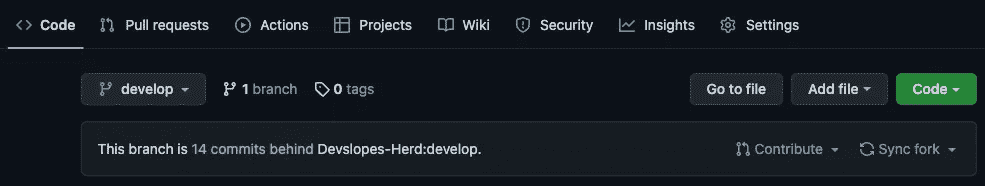
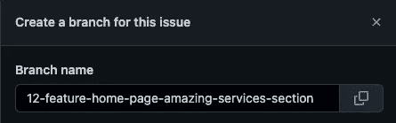
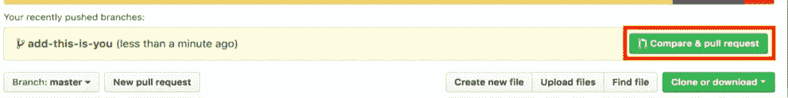
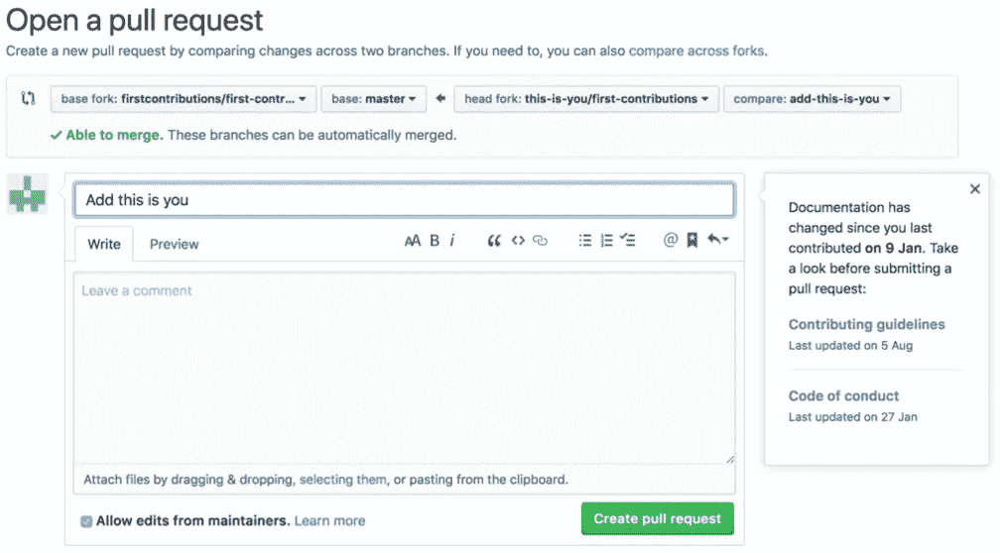
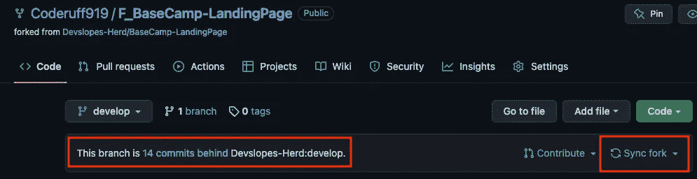
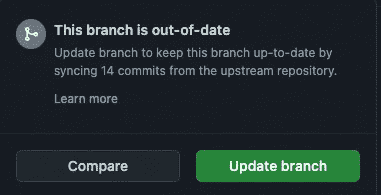

# 为 GitHub 开源做出贡献

> 原文：<https://levelup.gitconnected.com/contributing-to-github-open-source-cb72e7c1082d>

照片由 [Fotis Fotopoulos](https://unsplash.com/@ffstop?utm_source=medium&utm_medium=referral) 在 [Unsplash](https://unsplash.com?utm_source=medium&utm_medium=referral) 上拍摄

如果你已经使用 Github 有一段时间了，你会发现有很多开源库，你可以为之做出贡献并成为其中的一员。

参与开源可以有益于你的个人成长、职业机会、社区建设，更多地练习使用你的 git 技能，学习在真实的工作中作为一个团队工作的感觉！

那么，如何开始呢？

这很简单，第一步是登录你的 GitHub 账户，从那里你可以搜索你感兴趣的主题。一旦你找到你感兴趣的开源库，寻找你想要解决的问题。

以下是具体步骤:

1.  **叉库**

点击右上角的 fork 按钮，这将在你的 GitHub 帐户中创建一个库的副本。

**2。克隆存储库**

打开分叉的存储库，点击代码按钮并复制 URL

转到您的终端，并将其克隆到您的本地机器。

示例:

***git 克隆***[***https://github.com/Coderuff919/F_BaseCamp-LandingPage.git***](https://github.com/Coderuff919/F_BaseCamp-LandingPage.git)

**3。创建分支**

将目录更改为您刚刚克隆的存储库文件夹，并从您选择处理的打开的问题创建一个分支。

使用已经在原始存储库上创建的相同名称来命名分支会更容易。打开问题描述页面后，点击右侧边栏的“创建分支”即可找到分支名称。

复制分支名称。

回到您的终端，键入:

***git 分公司-B12-功能-首页-惊艳-服务-版块***

***git 状态*** —一定要检查自己是否在正确的分支上。

**4。进行必要的更改**

通过进行所有必要的更改并使用 git commit 命令提交这些更改来解决这个问题

***git 添加。***

***git commit -m "您的提交消息在此"***

**5。将更改推送到 GitHub**

现在您可以使用下面的命令将您的更改推送到 GitHub 了

***git push-u origin 12-功能-首页-惊艳-服务-版块***

(将*1****2-功能-首页-惊艳-服务-版块*** 换成您的分店名称)

**6。提交您的更改以供审核**

当你进入 GitHub 时，你会看到下面的窗口，点击比较&拉请求按钮。

下一步是提交您的拉动请求，您可以根据需要留下评论，然后单击“创建拉动请求”按钮

恭喜你刚刚完成了你对开源的第一份贡献。

下一步是等待存储库所有者审查您的 pull 请求，如果获得批准，它将被合并到主存储库中。

一旦合并，你会在你的 GitHub 账户上看到下面这条消息，说你的分支比原始库晚了几个提交。

你可以点击“同步分支”按钮更新分支，会弹出一个窗口，点击“更新分支”按钮。

瞧啊。

最后要做的事情是回到你的终端，做一个 git pull 来同步你所有的本地文件，以匹配你在 GitHub 上更新的分叉库。

***吉特拉***

编码快乐！