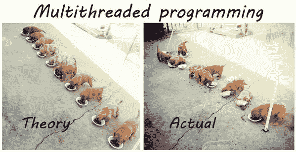
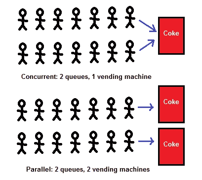

# 用 Go 程序控制机器

> 原文：<https://levelup.gitconnected.com/control-machines-with-go-routines-fa90c6462bf2>

获取 Go 中并发性的背景知识和应用技巧！


从[权池](https://deepdreamgenerator.com/u/quanchi)开始，这不是很酷吗？！

Go 因其干净利落的并发性而声名鹊起。Go 不使用进程或线程，而是使用自己的类型 *go 例程*来提高程序的执行效率。这减轻了开发人员的大量工作，并允许在使用 Go 时更安全地处理并发编程。

本文将详细介绍以下内容:

*   并发性与并行性的背景
*   围棋中的例子
*   你接下来需要学习的

我们开始吧！

# 并发性的简要背景

到回想一下，并发性包括将数据或信息分解成单独的块，以便一次全部处理。例如，假设您正在浏览 1000 个网站，并希望从它们的身体中获得某种信息进行处理。你可以一次只做一个网站，或者你可以设置 10 个围棋程序，让他们每个人负责 100 个网站。这有可能将你的程序提高一个数量级，至少在理论上是这样。



我觉得知道这和*并行*不同是很有用的。这个过程与并发性的不同之处在于有*个独立的进程*执行*个独立的任务*。另一方面，并发性涉及相同的进程，但是多个线程处理来自父源的独立数据块。



实际上，**并行**是获取额外计算能力的历史方法。关于这个主题已经有几十年的研究了，矩阵乘法就是一个例子。它需要至少两个 CPU 才能真正发挥作用，而且众所周知很难调试。

**并发**略有不同。这是一种相对较新的技术，主要目标是隐藏延迟。这就是为什么它对网络爬虫甚至是你的键盘有用的原因，因为它对每一次击键都有一个线程，从而隐藏了用户输入和贵由使用之间的延迟。并发可以在单个 CPU 上执行，并且具有不确定的输出，这使得调试非常困难。

> 放在一句话里，并行就是 ***一次做*** 多件事的方法，而并发就是 ***一次处理*** 多件事。

# 戈兰语示例

我们不会深入本质细节，比如 Go 并发性到底是如何利用计算机的 CPU 的。Go 运行时和主机操作系统会处理好这一点，我们想知道如何从开发人员的角度提高工作效率。

让我们首先看一个示例*异步*程序，这意味着我们一次执行一步代码。

你能发现这个缺陷吗？当我们第一次调用`printWithDelay()`时，我们陷入了一个无限 for 循环，给出了以下输出:

```
1 May
2 May
3 May
4 May
5 May
^Csignal: interrupt
```

**介绍 go 套路！**

为了解决这个问题，我们可以简单地在对我们的`printWithDelay`函数的前两次调用中包含`go`关键字。这将告诉 Go 我们想要在后台运行这个程序*，然后*立即*继续主程序线程中的下一行代码。*

用`run main.go`运行这个程序将会给出输出:

```
1 be with you.
1 May
1 the Force
2 May
2 the Force
2 be with you.
^Csignal: interrupt
```

你注意到什么了吗？第一轮我们没有按照预期的顺序打印出字符串。这是因为 go 例程是*不确定的*，这意味着当我们并发运行它们时，我们无法预测事件的顺序。

**围棋程序非常高效——如果你的程序需要，你可以运行数百甚至数千个围棋程序。然而，在一个问题上添加无数的例程最终会导致回报递减，因为你已经最大限度地利用了你的 CPU 所执行的工作。**

> 更重要的是，你是否注意到我们不必担心杀死任何线程或处理垃圾收集，而在像 C/C++这样的语言中，这是令人痛苦的。这就是 Go 作为一门通用编程语言真正脱颖而出的地方！

但是要小心！如果第 11 行对`printWithDelay()`的第三次调用也是一个 go 例程，程序会编译但不会实际执行。这是由于 go 程序在程序的*后台*运行。所以，如果你用函数`printWithDelay()`启动了三个 go 例程，除此之外什么都没有，那么主程序实际上会在 go 例程有机会启动之前就退出了。

**用** `**WaitGroup**` **:** 处理我们的围棋套路

使用`sync`包，我们可以在后台编排 go 例程的使用，而不必自己动手做一些程序阻塞。相反，我们利用了`sync.WaitGroup`对象，它将初始化一个计数器来跟踪我们的 go 例程。

在这个例子中，我们在第 13–16 行利用一个匿名函数(字面上只是一个没有名字的函数)来执行`printWithDelay()`,并警告`WaitGroup`我们已经完成了第 15 行的一个例程。如果您感到好奇，第 16 行的括号是您将输入传递给匿名函数的地方。

因此，使用`WaitGroup`可以让我们更好地控制我们的并发性，并且在后台 go 例程结束执行时仍然可以访问我们的主程序线程。

信不信由你，这是利用 go 例程并发的一个很好的基础。如果你想了解更多，我的下一篇文章将关注如何在通道的帮助下让我们的围棋程序变得有用。这些对象对于 Go 来说是唯一的，允许您轻松地传输信息，并为并发编程提供共享资源。

我希望你喜欢这篇文章，如果你想知道更多，我鼓励你在下面留下评论！感谢阅读。