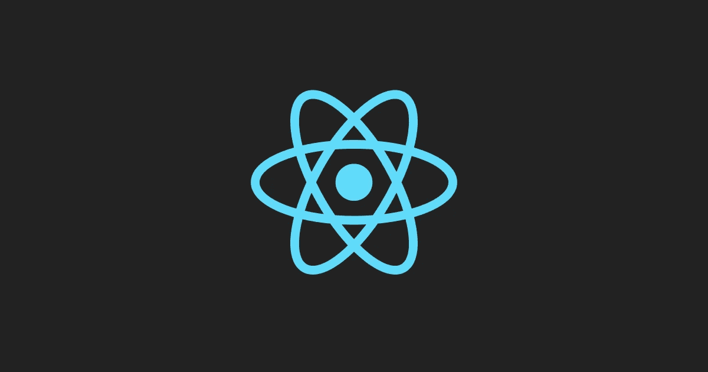

# 使用 React 备忘录控制渲染

> 原文：<https://levelup.gitconnected.com/control-rendering-with-react-memo-39ef36486588>

在 React 16.8 引入 React 钩子之前，我们在类和函数组件之间切换。所有的类组件包含状态，而函数组件包含所有的 JSX，并管理 UI 的呈现。

类组件的一个主要好处是它包含了生命周期挂钩，可以用来控制组件，如 ComponentDidMount、ComponentDidUnmount、componentDidCatch。类 Components 还包含 shouldComponentUpdate 生命周期挂钩，当您想要控制组件的呈现时，这非常有用。

React 背后的虚拟 DOM 比较节点树中的状态，当一个 JSX 元素被更新时，每个子元素也被更新。虚拟 DOM 速度很快，性能也很好，所以我们通常不需要为了性能而优化代码。

您很可能会有一些组件不必要地重新呈现，但是性能下降可能不会影响您的代码或用户体验，因此您完全不必担心。不然 React 也不会很流行:-)。

最终，您会发现自己实现了一个包含许多子组件的组件，您需要这些特性或功能来控制重新呈现。

*shouldcomponentdupdate()*用于控制组件何时应该更新。在下面的例子中，我们检查是否不等于“绿色”，并返回结果，这将决定我们是否可以更新组件。如果颜色是绿色，我们将返回 false，这将导致 *render()* 没有被调用，因此不会更新组件。

我们将在父组件中实现 Collection.js 组件，并添加一些简单的按钮来演示行为。

现在，这种使用 *shouldComponentUpdate* 的方式仅用于演示目的，而不是您应该如何处理条件渲染。

随着 React 16.8 引入钩子，你将会看到多个曾经是类组件的组件被写成一个带有 *useState* 钩子的函数组件。

*useEffect* 用于控制常见的生命周期挂钩，如 componentDidMount、componentWillUnmount 和 componentDidUpdate，但它不包含*shouldcomponentdupdate*挂钩功能，如类组件。

**React.memo 来救援！**

React.memo 是 memoization 的缩写，是一个高阶组件，只有在属性发生变化时才会更新。在维基百科上，记忆被描述为

*中的* [*计算*](https://en.wikipedia.org/wiki/Computing) *、* ***记忆化*** *或* ***记忆化*** *是一种* [*优化*](https://en.wikipedia.org/wiki/Optimization_(computer_science)) *技术主要用于加速* [*计算机程序*](https://en.wikipedia.org/wiki/Computer_programs) *通过存储昂贵的*结果

现在代码看起来像这样

通过使用 React memo 进行组合，Collection 现在已成为 CollectionMemo。现在 CollectionMemo 只会在道具变化的时候更新。

**我如何根据特定的传递属性来控制组件的更新？**

很高兴你问了:-)

使用 React.memo，您可以传递一个回调作为第二个参数，在这里您将接收前一个属性和下一个属性，并可以根据这些信息确定组件是否应该更新。您可以在这里添加逻辑来确定这一点。

在 areEqual 函数中，如果道具相等，我们返回 true，说明道具是相同的，不应该更新。否则我们更新组件来反映道具。如果通过设置 useState 来更新组件，那么不管 React.memo 条件如何，组件都会更新。

希望对你有帮助！